# JavaScript Architecture Visualization

## Overview

This document shows the architecture of the MANTAX Face Recognition app's JavaScript modules and how they interact with user workflows.

---

## Old Architecture (Monolithic app.js)

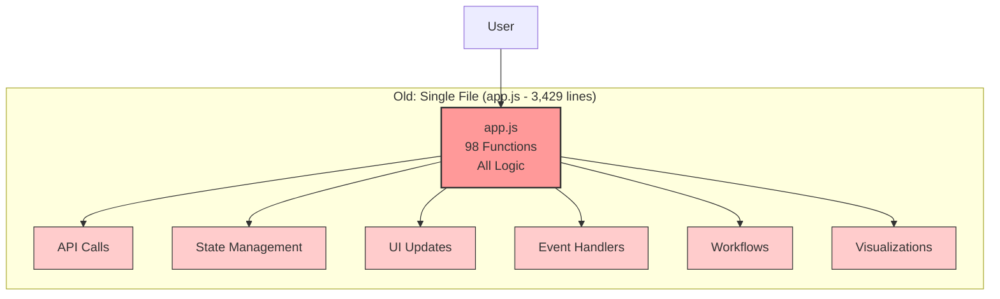

### Problems with Old Architecture:
- Single file with 3,429 lines
- 98 functions mixed together
- No separation of concerns
- Hard to maintain and test
- All state scattered throughout

---

## New Architecture (Modular)

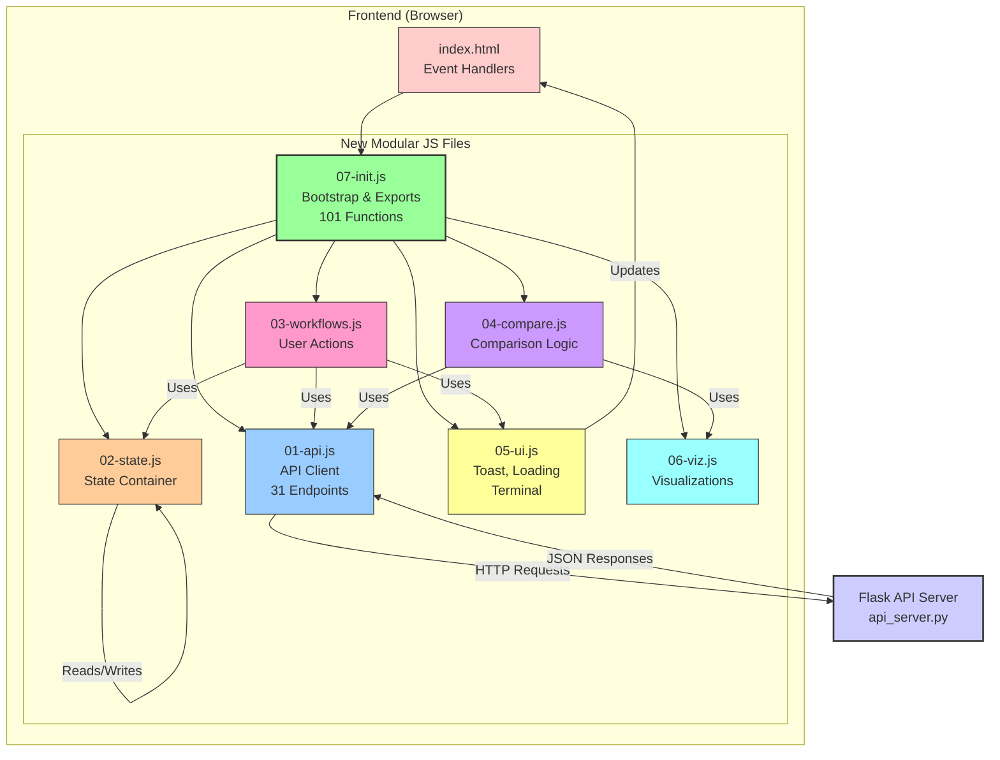

---

## Module Dependencies

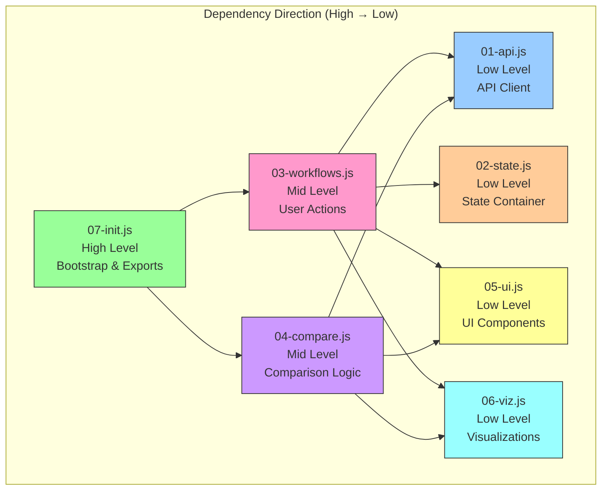

---

## Workflow to Module Mapping

### Workflow 1: Upload → Match

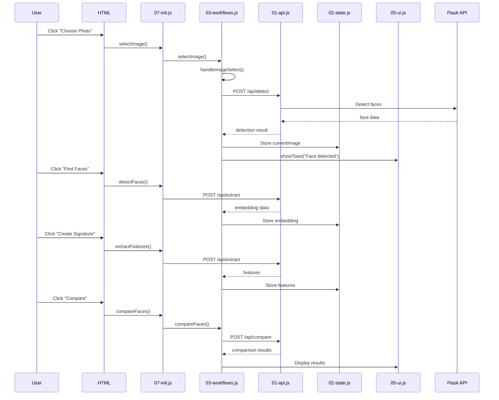

### Workflow 2: Webcam → Match

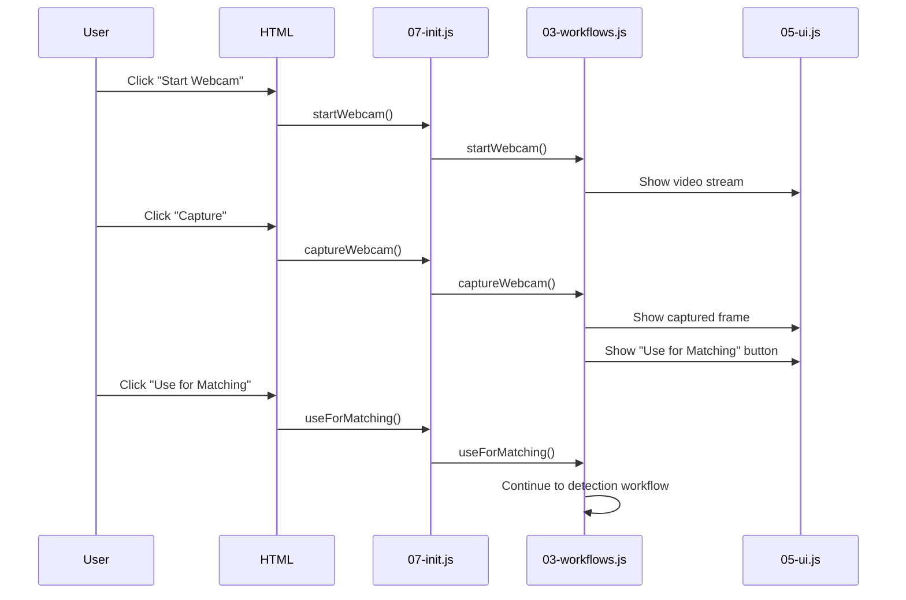

### Workflow 3: Library Management

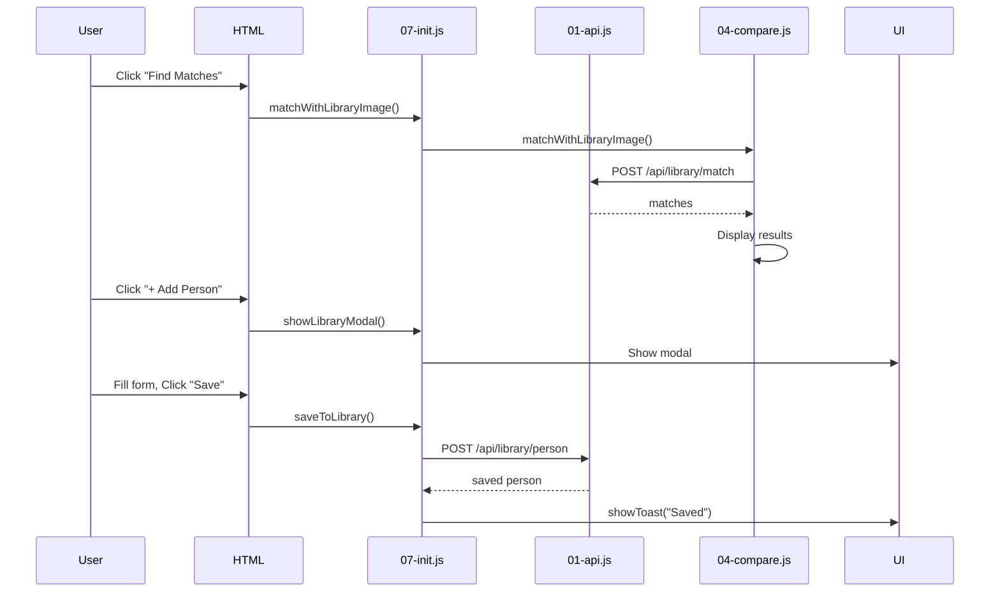

---

## Visualization Workflow

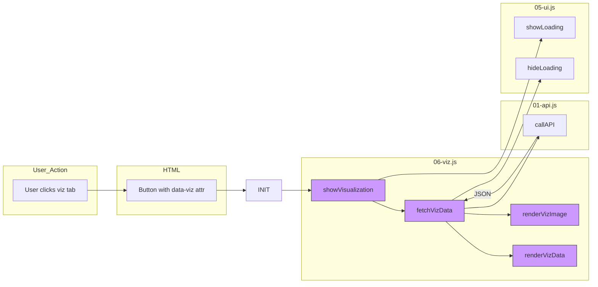

---

## State Management (02-state.js)

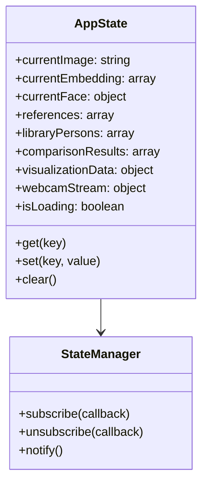

---

## File Comparison

| Aspect | Old (app.js) | New (Modular) |
|--------|-------------|----------------|
| **Total Lines** | 3,429 | ~2,000 (7 files) |
| **Functions per file** | 98 | 10-15 average |
| **Separation** | None | By responsibility |
| **Testability** | Hard | Easy |
| **Maintainability** | Difficult | Good |
| **Reusability** | Low | High |

---

## Module Responsibility Summary

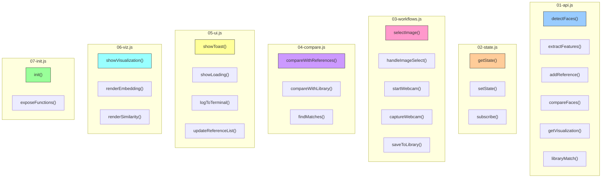

---

## User Flow → Module Routing

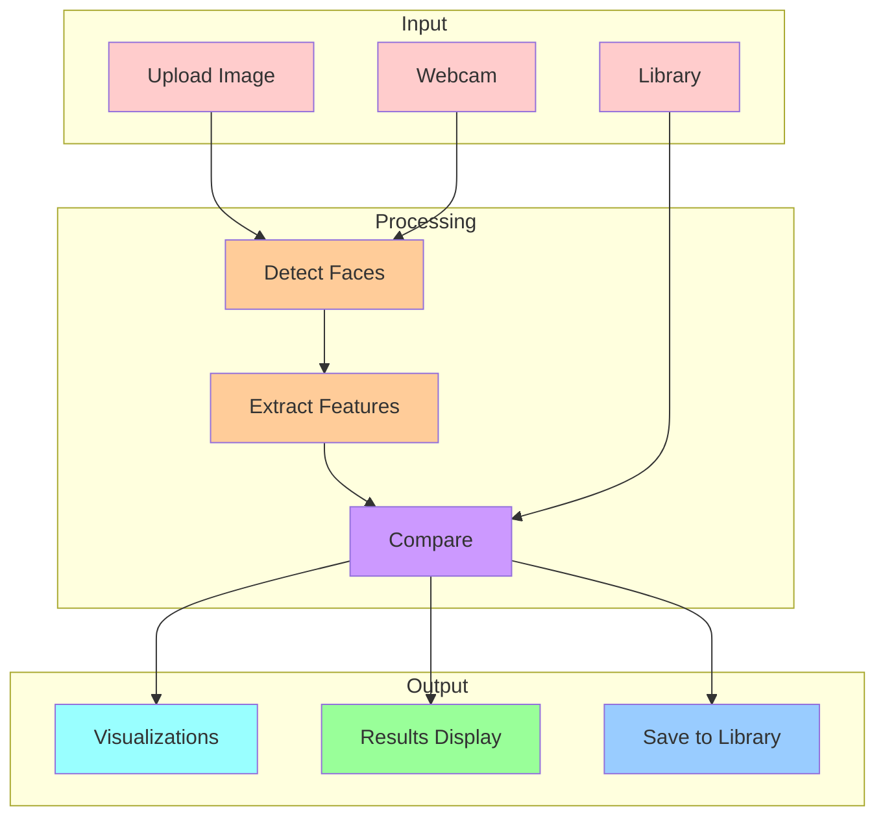

---

## Integration with HTML

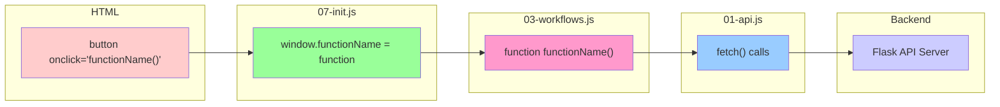

---

## Summary

The new modular architecture provides:

1. **Single Responsibility**: Each file handles one concern
2. **Dependency Direction**: High-level → Mid-level → Low-level
3. **Testability**: Each module can be tested independently
4. **Maintainability**: Easier to find and fix bugs
5. **Reusability**: Functions can be reused across workflows
6. **Scalability**: New features can be added without touching existing code

The 7 modular files replace the single 3,429-line app.js while maintaining all 98 functions and adding better organization.
