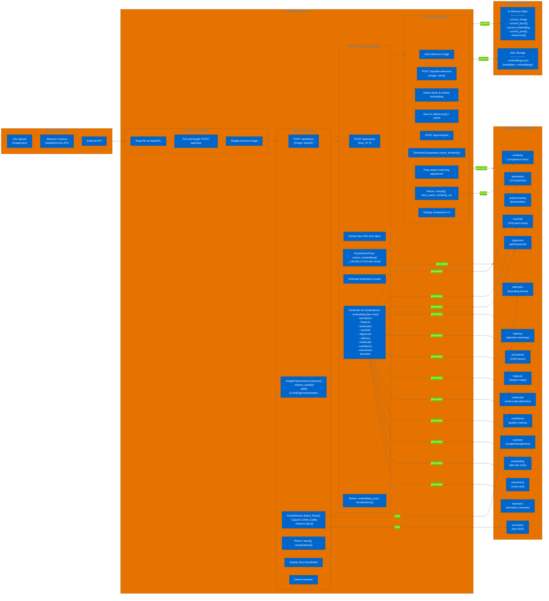
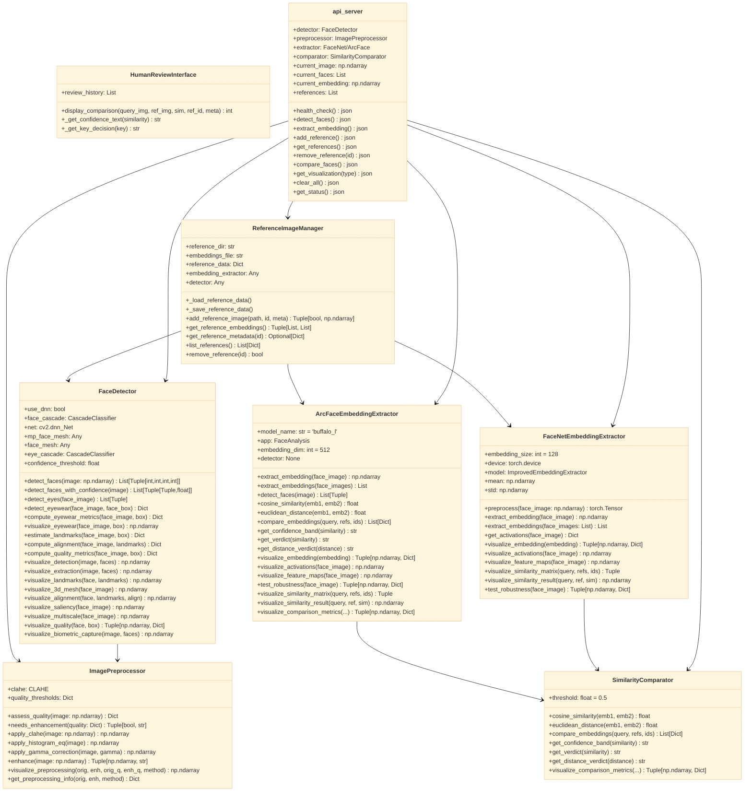
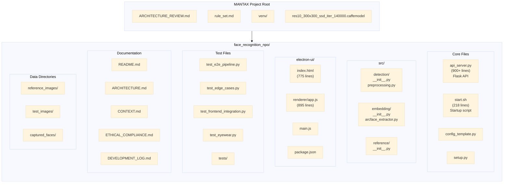

# MANTAX Face Recognition System - Complete Architecture

## Project Overview

This document contains comprehensive Mermaid diagrams of the MANTAX NGO Facial Image Analysis System.

---

## 1. High-Level System Architecture

```mermaid
%%{init: {'theme': 'base', 'themeVariables': { 'primaryColor': '#0066cc', 'primaryTextColor': '#fff', 'primaryBorderColor': '#000', 'lineColor': '#666', 'secondaryColor': '#f5f5f5', 'tertiaryColor': '#fff'}}}%%
flowchart TB
    subgraph USER["USER INTERFACE LAYER"]
        direction TB
        HTML["index.html<br/>(775 lines)<br/>- Step workflow<br/>- Visualization tabs<br/>- Webcam capture<br/>- Terminal logger<br/>- Toast notifications"]
        JS["app.js<br/>(895 lines)<br/>- handleImageSelect()<br/>- detectFaces()<br/>- extractFeatures()<br/>- compareFaces()<br/>- showVisualization()<br/>- Webcam functions"]
        CSS["Styles (embedded)<br/>- CSS Variables<br/>- Terminal footer<br/>- Loading overlay<br/>- Toast system<br/>- Responsive layout"]
    end

    subgraph ELECTRON["ELECTRON DESKTOP APP"]
        direction TB
        MAIN["main.js<br/>(Electron main)<br/>- Window management<br/>- IPC handlers<br/>- App lifecycle"]
        PRELOAD["preload.js<br/>(Context bridge)"]
        PKG["package.json<br/>- electron v28<br/>- electron-builder"]
    end

    subgraph API_SERVER["FLASK API SERVER (api_server.py)"]
        direction TB
        ROUTES["Routes (14 endpoints)<br/>----------------<br/>GET  /api/health<br/>GET  /api/embedding-info<br/>POST /api/detect<br/>POST /api/extract<br/>POST /api/add-reference<br/>GET  /api/references<br/>DELETE /api/references/:id<br/>POST /api/compare<br/>GET  /api/visualizations/:type<br/>GET  /api/visualizations/:type/reference/:id<br/>GET  /api/quality<br/>GET  /api/eyewear<br/>GET  /api/visualizations/eyewear<br/>POST /api/clear<br/>GET  /api/status"]
        
        GLOBAL_STATE["Global State Variables<br/>----------------<br/>- current_image<br/>- current_original_image<br/>- current_enhanced_image<br/>- current_faces[]<br/>- current_embedding<br/>- current_face_image<br/>- current_preprocessing_info{}<br/>- current_pose{}<br/>- references[]"]
        
        HELPERS["Helper Functions<br/>----------------<br/>- load_references()<br/>- save_references()<br/>- np_to_python()<br/>- image_to_base64()<br/>- base64_to_image()<br/>- categorize_pose()<br/>- get_viz_result()<br/>- visualize_tests()"]
    end

    subgraph DETECTION["DETECTION MODULE (src/detection/)"]
        direction TB
        
        FACE_DETECTOR["FaceDetector Class<br/>(src/detection/__init__.py)<br/>----------------<br/>METHODS:<br/>- detect_faces(image)<br/>- detect_faces_with_confidence()<br/>- detect_eyes(face_image)<br/>- detect_eyewear(face_image, box)<br/>- compute_eyewear_metrics()<br/>- estimate_landmarks(face, box)<br/>- compute_alignment(face, landmarks)<br/>- compute_quality_metrics(face, box)<br/>- visualize_detection()<br/>- visualize_extraction()<br/>- visualize_landmarks()<br/>- visualize_3d_mesh()<br/>- visualize_alignment()<br/>- visualize_saliency()<br/>- visualize_multiscale()<br/>- visualize_quality()<br/>- visualize_biometric_capture()<br/>- visualize_eyewear()"]
        
        PREPROCESSOR["ImagePreprocessor Class<br/>(src/detection/preprocessing.py)<br/>----------------<br/>METHODS:<br/>- assess_quality(image)<br/>- needs_enhancement(quality)<br/>- apply_clahe(image)<br/>- apply_histogram_eq(image)<br/>- apply_gamma_correction(image, gamma)<br/>- enhance(image)<br/>- visualize_preprocessing(orig, enh, ...)<br/>- get_preprocessing_info(...)<br/><br/>VARIABLES:<br/>- clahe: CLAHE object<br/>- quality_thresholds{}"]
    end

    subgraph EMBEDDING["EMBEDDING MODULE (src/embedding/)"]
        direction TB
        
        FACENET["FaceNetEmbeddingExtractor<br/>(src/embedding/__init__.py)<br/>----------------<br/>- ImprovedEmbeddingExtractor (PyTorch)<br/>- embedding_dim: 128<br/>- backbone: resnet18<br/><br/>METHODS:<br/>- preprocess(face_image)<br/>- extract_embedding(face_image)<br/>- extract_embeddings(faces[])<br/>- get_activations(face_image)<br/>- visualize_embedding(emb)<br/>- visualize_activations(face)<br/>- visualize_feature_maps(face)<br/>- visualize_similarity_matrix()<br/>- visualize_similarity_result()<br/>- test_robustness(face)"]
        
        ARCFACE["ArcFaceEmbeddingExtractor<br/>(src/embedding/arcface_extractor.py)<br/>----------------<br/>- model_name: buffalo_l<br/>- embedding_dim: 512<br/>- Uses InsightFace FaceAnalysis<br/><br/>METHODS:<br/>- extract_embedding(face_image)<br/>- extract_embeddings(faces[])<br/>- detect_faces(image)<br/>- cosine_similarity(emb1, emb2)<br/>- euclidean_distance(emb1, emb2)<br/>- compare_embeddings(query, refs)<br/>- get_confidence_band(sim)<br/>- get_verdict(sim)<br/>- get_distance_verdict(dist)<br/>- visualize_embedding(emb)<br/>- visualize_activations(face)<br/>- visualize_feature_maps(face)<br/>- test_robustness(face)<br/>- visualize_similarity_matrix()<br/>- visualize_similarity_result()<br/>- visualize_comparison_metrics()"]
        
        COMPARATOR["SimilarityComparator<br/>(src/embedding/__init__.py)<br/>----------------<br/>VARIABLES:<br/>- threshold: 0.5<br/><br/>METHODS:<br/>- cosine_similarity(emb1, emb2)<br/>- euclidean_distance(emb1, emb2)<br/>- compare_embeddings(query, refs, ids)<br/>- get_confidence_band(sim)<br/>- get_verdict(sim)<br/>- get_distance_verdict(dist)<br/>- visualize_comparison_metrics()"]
    end

    subgraph REFERENCE["REFERENCE MODULE (src/reference/)"]
        direction TB
        
        REF_MANAGER["ReferenceImageManager<br/>(src/reference/__init__.py)<br/>----------------<br/>VARIABLES:<br/>- reference_dir<br/>- embeddings_file<br/>- reference_data{}<br/>- embedding_extractor<br/>- detector<br/><br/>METHODS:<br/>- _load_reference_data()<br/>- _save_reference_data()<br/>- add_reference_image(path, id, meta)<br/>- get_reference_embeddings()<br/>- get_reference_metadata(id)<br/>- list_references()<br/>- remove_reference(id)"]
        
        HUMAN_REVIEW["HumanReviewInterface<br/>(src/reference/__init__.py)<br/>----------------<br/>VARIABLES:<br/>- review_history[]<br/><br/>METHODS:<br/>- display_comparison(query, ref, sim, id)<br/>- _get_confidence_text(sim)<br/>- _get_key_decision(key)"]
    end

    subgraph PERSISTENCE["PERSISTENCE LAYER"]
        direction TB
        JSON["reference_images/<br/>embeddings.json<br/>----------------<br/>- metadata[]<br/>  - id, name, path<br/>  - metadata, added_at<br/>- embeddings[]<br/>  - id, embedding[]"]
        MODEL["Deep Learning Models<br/>----------------<br/>- res10_300x300_ssd_iter_140000.caffemodel<br/>  (Face detection - OpenCV DNN)<br/>- deploy.prototxt.txt<br/>  (Caffe prototxt)<br/>- ArcFace ONNX model<br/>  (via insightface)"]
    end

    subgraph TESTS["TEST SUITE"]
        direction TB
        E2E["test_e2e_pipeline.py<br/>(End-to-End tests)<br/>----------------<br/>- Detection test<br/>- Embedding test<br/>- Reference manager test<br/>- Same image similarity<br/>- Different images similarity<br/>- Reference comparison"]
        EDGE["test_edge_cases.py<br/>(Edge case tests)<br/>----------------<br/>- Empty/black images<br/>- Very small images<br/>- None/invalid inputs<br/>- Boundary similarity<br/>- Empty reference list<br/>- Many references"]
        FRONTEND["test_frontend_integration.py<br/>(Frontend integration)"]
        EYEWEAR["test_eyewear.py<br/>(Eyewear detection)"]
        UNIT["tests/ (Unit tests)<br/>----------------<br/>- test_detection.py<br/>- test_embedding.py<br/>- test_comparison.py<br/>- test_reference.py<br/>- test_review.py"]
    end

    subgraph CONFIG["CONFIGURATION & UTILS"]
        direction TB
        START["start.sh<br/>(218 lines)<br/>----------------<br/>- Kill existing servers<br/>- Clear Python cache<br/>- Start Flask API<br/>- Wait for health check<br/>- Launch Electron/Browser"]
        CONFIG_TMPL["config_template.py<br/>(Configuration template)"]
        VENV["Virtual Environment<br/>----------------<br/>- venv/bin/activate<br/>- venv313 (Python 3.13)"]
    end

    subgraph DOCS["DOCUMENTATION"]
        direction TB
        README["README.md<br/>(403 lines)<br/>- Quick start<br/>- Architecture<br/>- Features<br/>- API endpoints<br/>- 14 visualization types<br/>- Testing"]
        ARCH["ARCHITECTURE.md<br/>(System design)"]
        CONTEXT["CONTEXT.md<br/>(Code review context)<br/>- Critical edit rules<br/>- Common mistakes<br/>- Lessons learned"]
        ETHICAL["ETHICAL_COMPLIANCE.md<br/>(Ethical guidelines)"]
        DEV_LOG["DEVELOPMENT_LOG.md<br/>(Development history)"]
    end

    %% Relationships
    USER -->|"HTTP requests"| API_SERVER
    JS -->|"fetch() calls"| API_SERVER
    
    ELECTRON -->|"serves"| USER
    ELECTRON -->|"connects to"| API_SERVER
    
    API_SERVER -->|"instantiates"| DETECTION
    API_SERVER -->|"instantiates"| EMBEDDING
    API_SERVER -->|"uses"| REFERENCE
    
    API_SERVER -->|"POST /api/detect"| DETECTION
    API_SERVER -->|"POST /api/extract"| EMBEDDING
    API_SERVER -->|"POST /api/add-reference"| REFERENCE
    API_SERVER -->|"POST /api/compare"| COMPARATOR
    
    API_SERVER -->|"reads/writes"| JSON
    API_SERVER -->|"loads"| MODEL
    
    DETECTION -->|"face boxes"| EMBEDDING
    EMBEDDING -->|"embeddings"| COMPARATOR
    
    PREPROCESSOR -->|"enhanced image"| DETECTION
```



---

## 2. Data Flow Workflow



---

## 3. Class Diagram



---

## 4. API Sequence Diagram

```mermaid
%%{init: {'theme': 'base'}}%%
sequenceDiagram
    participant U as User (Browser/Electron)
    participant API as Flask API Server
    participant D as FaceDetector
    participant P as ImagePreprocessor
    participant E as EmbeddingExtractor<br/>(FaceNet/ArcFace)
    participant C as SimilarityComparator
    participant R as ReferenceManager
    participant F as File System

    Note over U,API: STEP 1: Upload Image
    U->>API: POST /api/detect {image: base64}
    API->>P: enhance(image)
    P-->>API: enhanced_image, method
    API->>D: detect_faces(enhanced_image)
    D-->>API: faces[] (bbox)
    API->>D: detect_eyewear(image, faces[0])
    D-->>API: eyewear{}
    API->>D: visualize_detection(image, faces)
    API->>D: visualize_extraction(image, faces)
    API->>D: visualize_biometric_capture(image, faces)
    API-->>U: {success, count, faces[], visualizations{}}

    Note over U,API: STEP 2: Extract Features
    U->>API: POST /api/extract {face_id: 0}
    API->>E: extract_embedding(face_roi)
    E-->>API: embedding[] (128-dim or 512-dim)
    API->>D: estimate_landmarks(face, bbox)
    API->>D: compute_alignment(face, landmarks)
    D-->>API: pose{yaw, pitch, roll, category}
    API->>E: visualize_embedding(embedding)
    API->>E: visualize_activations(face)
    API->>E: visualize_feature_maps(face)
    API->>E: test_robustness(face)
    API->>D: visualize_landmarks(face, landmarks)
    API->>D: visualize_3d_mesh(face)
    API->>D: visualize_alignment(face, landmarks, align)
    API->>D: visualize_saliency(face)
    API->>D: visualize_multiscale(face)
    API->>D: visualize_quality(face, bbox)
    API-->>U: {success, embedding_size, pose, visualizations{}}

    Note over U,API: STEP 3: Add Reference
    U->>API: POST /api/add-reference {image, name}
    API->>D: detect_faces(image)
    D-->>API: ref_faces[]
    API->>E: extract_embedding(ref_face)
    E-->>API: ref_embedding[]
    API->>D: estimate_landmarks(ref_face, bbox)
    API->>D: compute_alignment(ref_face, landmarks)
    R->>F: save to embeddings.json
    API-->>U: {success, reference, count}

    Note over U,API: STEP 4: Compare
    U->>API: POST /api/compare {}
    loop For each reference
        API->>C: cosine_similarity(query_emb, ref_emb)
        C-->>API: similarity
        API->>C: euclidean_distance(query_emb, ref_emb)
        C-->>API: distance
        API->>C: Adjust for pose similarity
    end
    API->>C: visualize_comparison_metrics(...)
    C-->>API: similarity_viz
    API-->>U: {success, results[], best_match, similarity_viz}

    Note over U,API: Visualization Request
    U->>API: GET /api/visualizations/{type}
    alt type == detection
        API->>D: visualize_detection(current_image, faces)
    alt type == embedding
        API->>E: visualize_embedding(current_embedding)
    alt type == landmarks
        API->>D: visualize_landmarks(face, landmarks)
    alt type == activations
        API->>E: visualize_activations(face)
    end
    API-->>U: {success, visualization: base64}

    Note over U,API: Clear Session
    U->>API: POST /api/clear {}
    API->>API: Reset all global state variables
    API-->>U: {success, message}
```

---

## 5. Project File Structure



---

## Summary

This document contains **5 main diagrams**:

1. **High-Level System Architecture** - Shows all layers from UI to persistence
2. **Data Flow Workflow** - Shows the 4-step user workflow with all 16 visualization types
3. **Class Diagram** - Shows all Python classes and their relationships
4. **API Sequence Diagram** - Shows the request/response flow for each endpoint
5. **Project File Structure** - Shows the complete directory layout

All components work together as follows:
- User interacts through **Electron/Browser** UI
- JavaScript sends **HTTP requests** to Flask API
- Flask API orchestrates **detection → extraction → comparison**
- Results are **visualized** and optionally **persisted** to JSON

---

## Test Visualization Data Flow (Feb 13, 2026)

The 9 test tabs display both an image and structured data. Here's how it works:

### API Handler Pattern
```python
# Each test viz handler returns: (image, data_dict)
elif viz_type == 'test-health':
    data = {"status": "OK", "api": "running", "port": 3000}
    return visualize_test_detail("Health Check", data), data

elif viz_type == 'test-detection':
    data = {
        "faces_detected": len(current_faces) if current_faces else 0,
        "preprocessing": current_preprocessing_info.get('method', 'none'),
        "enhanced": current_preprocessing_info.get('was_enhanced', False)
    }
    return visualize_test_detail("Detection + Preprocessing", data), data
```

### Frontend Display
- Image rendered from base64
- Data displayed as HTML table via `formatDataAsTable()`
- CSS styling from `.viz-data-table` class

### Test Tabs
| Tab | Data Fields |
|-----|-------------|
| test-health | status, api, port |
| test-detection | faces_detected, preprocessing, enhanced |
| test-extraction | embedding_size, pose |
| test-reference | references, latest_pose |
| test-multi | total_references, can_match |
| test-pose | query_pose, matching_enabled, adjusts_similarity |
| test-eyewear | eyewear detection results |
| test-viz | total_types, detection, preprocessing, pose, tests |
| test-clear | session_management, can_clear |

---

## Eyewear Detection (Feb 13, 2026)

The eyewear detection system identifies sunglasses/glasses that may interfere with face recognition.

### Detection Algorithm

1. **Primary Method**: Brightness/Edge Analysis
   - Extract eye regions (30% and 70% of face width)
   - Calculate brightness ratio: `eye_brightness / face_brightness`
   - Calculate edge density using Canny edge detection
   - Stricter thresholds: brightness < 0.2 = sunglasses, < 0.35 = possible

2. **Secondary Method**: Eye Cascade (Confirmation Only)
   - Use OpenCV eye cascade as confirmation, NOT primary detection
   - Only flag if BOTH brightness AND eye count agree
   - Avoid false positives from unreliable eye cascade

### API Endpoints

| Endpoint | Method | Description |
|----------|--------|-------------|
| `/api/eyewear` | GET | Get eyewear detection results |
| `/api/visualizations/eyewear` | GET | Get eyewear visualization |

### Response Format
```json
{
  "success": true,
  "eyewear": {
    "has_eyewear": false,
    "type": "none",
    "confidence": 0.1,
    "occlusion_level": 0.0,
    "warnings": [],
    "eye_count": 2
  }
}
```

### Testing

**Frontend Test**: `test_eyewear_frontend.js`
```bash
node test_eyewear_frontend.js
```

**Backend Test**: Uses synthetic images with darkened eye regions

