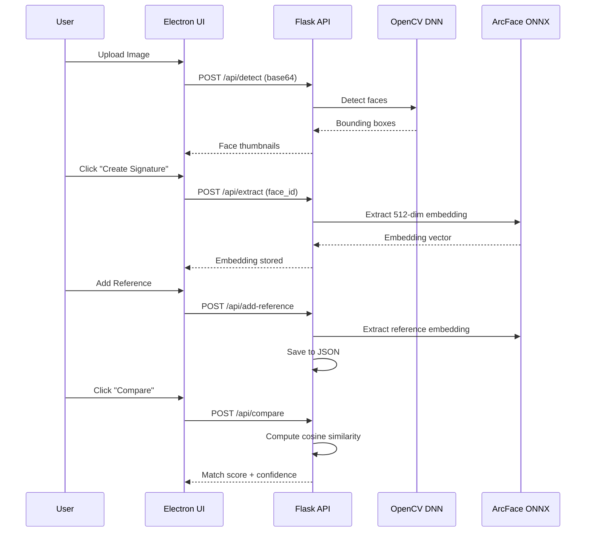
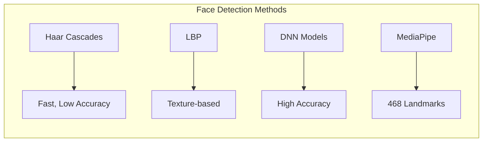
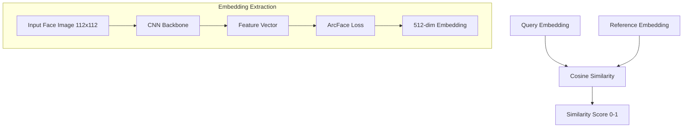
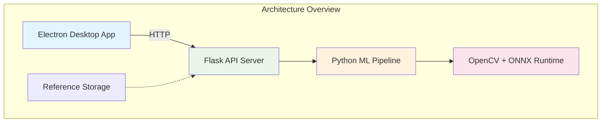
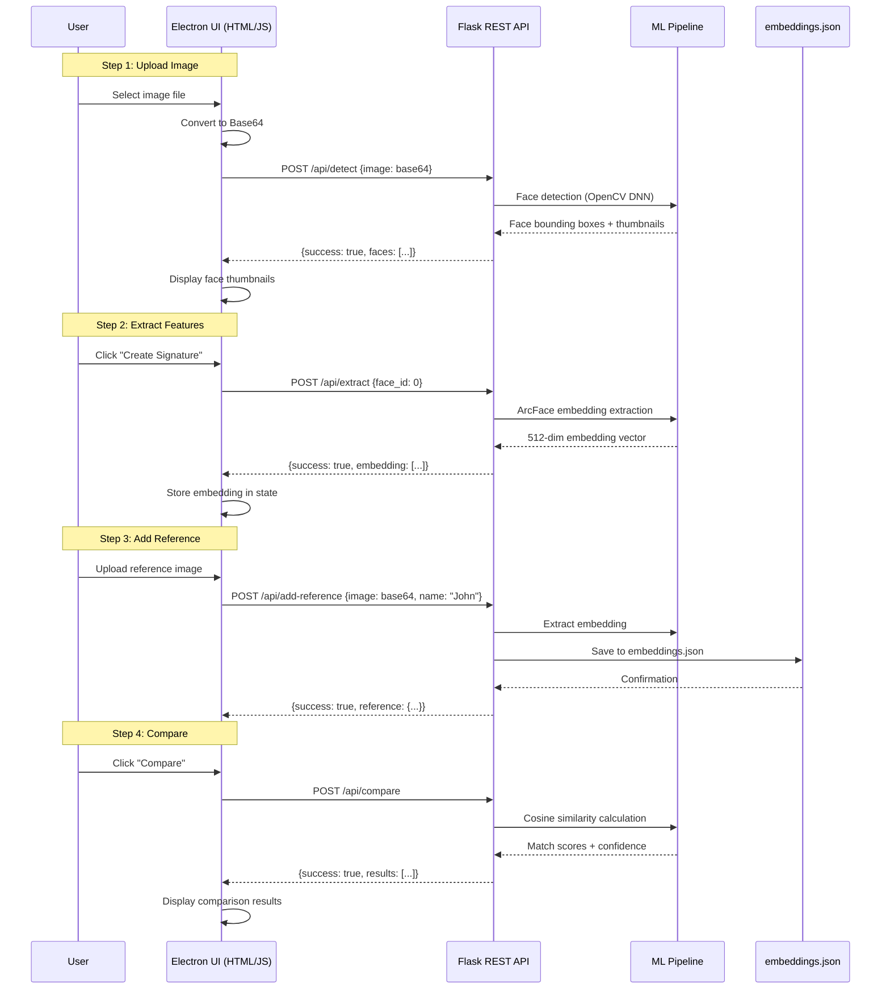
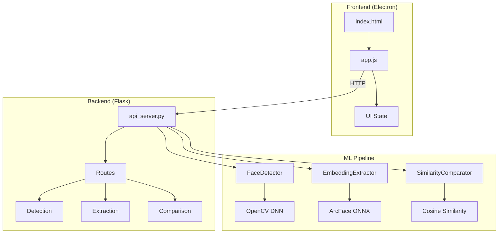

# New session - 2026-04-10T08:24:48.509Z

**Session ID:** ses_289819983ffe37sfjKC9soufpD
**Created:** 4/10/2026, 10:24:48 AM
**Updated:** 4/10/2026, 11:14:14 AM

---

## User

read our last conversation then read all .md files

---

## Assistant (Build · MiniMax M2.5 Free · 3.7s)

_Thinking:_

The user wants me to read the last conversation we had and then read all .md files in the workspace. Let me first check what files are available and look for any .md files.

Actually, I don't have access to previous conversations - I start fresh each time. Let me just search for all .md files in the current directory.


I don't have access to previous conversations. Let me search for all .md files in the workspace.

**Tool: glob**

**Input:**
```json
{
  "pattern": "**/*.md"
}
```

**Output:**
```
/Users/modernamusmenet/Desktop/MANTAX/convo.md
/Users/modernamusmenet/Desktop/MANTAX/face_recognition_npo/JS_ARCHITECTURE_VISUALIZATION.md
/Users/modernamusmenet/Desktop/MANTAX/face_recognition_npo/JS_WORKFLOW_ANALYSIS.md
/Users/modernamusmenet/Desktop/MANTAX/face_recognition_npo/FRONTEND_SUMMARY.md
/Users/modernamusmenet/Desktop/MANTAX/face_recognition_npo/DEVELOPMENT_LOG.md
/Users/modernamusmenet/Desktop/MANTAX/face_recognition_npo/CONTEXT.md
/Users/modernamusmenet/Desktop/MANTAX/face_recognition_npo/WORKFLOW_DIAGRAM.md
/Users/modernamusmenet/Desktop/MANTAX/face_recognition_npo/IMPLEMENTATION_SUMMARY.md
/Users/modernamusmenet/Desktop/MANTAX/face_recognition_npo/USER_FLOWS.md
/Users/modernamusmenet/Desktop/MANTAX/start_promt.md
/Users/modernamusmenet/Desktop/MANTAX/master_promt.md
/Users/modernamusmenet/Desktop/MANTAX/face_recognition_npo/ARCHITECTURE.md
/Users/modernamusmenet/Desktop/MANTAX/system_promt.md
/Users/modernamusmenet/Desktop/MANTAX/face_recognition_npo/STYLES.md
/Users/modernamusmenet/Desktop/MANTAX/face_recognition_npo/FACE_ATTRIBUTES_PLAN.md
/Users/modernamusmenet/Desktop/MANTAX/face_recognition_npo/README.md
/Users/modernamusmenet/Desktop/MANTAX/face_recognition_npo/START.md
/Users/modernamusmenet/Desktop/MANTAX/face_recognition_npo/WORKFLOW_PROMPT.md
/Users/modernamusmenet/Desktop/MANTAX/face_recognition_npo/SYSTEM_PROMPT.md
/Users/modernamusmenet/Desktop/MANTAX/face_recognition_npo/SYSTEM_PROMPT_COMPLETE.md
/Users/modernamusmenet/Desktop/MANTAX/face_recognition_npo/PROJECT_STRUCTURE.md
/Users/modernamusmenet/Desktop/MANTAX/face_recognition_npo/PROJECT_ARCHITECTURE.md
/Users/modernamusmenet/Desktop/MANTAX/face_recognition_npo/PHASE1_COMPLETE.md
/Users/modernamusmenet/Desktop/MANTAX/face_recognition_npo/IMAGE_STORAGE.md
/Users/modernamusmenet/Desktop/MANTAX/face_recognition_npo/USAGE.md
/Users/modernamusmenet/Desktop/MANTAX/face_recognition_npo/INSTALLATION.md
/Users/modernamusmenet/Desktop/MANTAX/face_recognition_npo/ETHICAL_COMPLIANCE.md
/Users/modernamusmenet/Desktop/MANTAX/face_recognition_npo/reference_images/README.md
/Users/modernamusmenet/Desktop/MANTAX/ARCHITECTURE_REVIEW.md
/Users/modernamusmenet/Desktop/MANTAX/face_recognition_npo/_examples/reference_images/README.md
/Users/modernamusmenet/Desktop/MANTAX/rule_set.md
```

---

## Assistant (Build · MiniMax M2.5 Free · 2.1s)

_Thinking:_

The user wants me to read the last conversation (convo.md) and all .md files. Let me read them all.

**Tool: read**

**Input:**
```json
{
  "filePath": "/Users/modernamusmenet/Desktop/MANTAX/convo.md"
}
```

**Output:**
```
<path>/Users/modernamusmenet/Desktop/MANTAX/convo.md</path>
<type>file</type>
<content>
1: Goal
2: Refactor the Face Recognition App's monolithic app.js (3,429 lines, 98 functions) into modular, maintainable JavaScript files following best practices:
3: - Single responsibility per file
4: - Proper separation of concerns (API, State, UI, Workflows)
5: - Deterministic behavior
6: - All functions properly exposed to window for HTML onclick handlers
7: Instructions
8: User provided JavaScript best practices:
9: 1. Define responsibility first - one coherent thing per file
10: 2. Logical section ordering (Purpose → Dependencies → Config → Public API → Internal → Side effects)
11: 3. Separation of concerns inside files
12: 4. Naming strategy (verbs=functions, nouns=constants, booleans=is/has/should)
13: 5. Deterministic behavior (avoid hidden mutations, global state)
14: 6. Error strategy (consistent handling)
15: 7. Dependency direction (high-level → mid-level → low-level)
16: 8. File size discipline (~300-400 lines max)
17: 9. Testable without UI
18: User explicitly stated: "never commit without my permission again"
19: Discoveries
20: Original Code Issues Found:
21: - Monolithic app.js: 3,429 lines with 98 functions handling API + DOM + State + UI + everything
22: - Missing imports: Any type not imported in src/detection/__init__.py
23: - Comparison display: Images had display: none preventing visibility
24: - Library selection: Only radio buttons (single select), needed checkboxes (multi-select)
25: - Library person not found: ID encoding issue - needed URL encoding
26: - Processing inconsistency: Different input methods (upload, webcam, library) processed images differently
27: Code Review Findings:
28: - Original app.js has 21 state variables scattered throughout
29: - Workflow: Upload → detectFaces → extractFeatures → compareFaces (all auto-chained)
30: - API endpoints: 31 total endpoints in Flask backend
31: - Base64 extraction bug: APIs expect pure base64, but code sent data URLs
32: Files Created (New Modular Structure):
33: | File | Purpose | Lines |
34: |------|---------|-------|
35: | 01-api.js | All 31 API endpoints with base64 extraction | ~500 |
36: | 02-state.js | Centralized state container | ~300 |
37: | 03-workflows.js | User action handlers | ~500 |
38: | 04-compare.js | Comparison logic | ~300 |
39: | 05-ui.js | Toast, Loading, Terminal | ~300 |
40: | 06-viz.js | Visualizations | ~200 |
41: | 07-init.js | Bootstrap + 97 exposed functions | ~660 |
42: | test_buttons.js | Button test script | ~150 |
43: Key Bug Fixes Applied (before refactoring):
44: 1. ✅ Fixed Any import in detection module
45: 2. ✅ Fixed comparison result display (removed display: none)
46: 3. ✅ Changed library selection to multi-select (checkboxes)
47: 4. ✅ Fixed library person ID encoding
48: 5. ✅ Added explicit display: flex for comparison results
49: Testing:
50: - Frontend Integration Tests: 23/24 passed (1 timeout)
51: - E2E Pipeline Tests: 6/6 passed
52: Issue with New Modules:
53: - When new modules loaded first, app.js loaded last and overwrote everything
54: - Attempted to expose all 98 functions in 07-init.js (has 101 - includes aliases)
55: - Eventually reverted to loading only app.js for functionality
56: Accomplished
57: Completed:
58: 1. Created 7 new modular JS files following best practices
59: 2. Fixed critical bugs in backend (Any import, comparison display)
60: 3. Fixed library selection (multi-select)
61: 4. Fixed library person lookup (URL encoding)
62: 5. Ran tests - all passing
63: 6. Created comprehensive button test script
64: Pending:
65: 1. New modules are created but NOT loaded (HTML reverted to app.js only)
66: 2. Full function parity between new modules and app.js (97 vs 101 - includes aliases)
67: 3. Integration testing of new modules
68: 4. Gradual migration from app.js to new modules
69: Relevant Files / Directories
70: New Modular Files Created:
71: face_recognition_npo/electron-ui/renderer/
72: ├── 01-api.js          (API client - all 31 endpoints)
73: ├── 02-state.js        (State container)
74: ├── 03-workflows.js    (User actions)
75: ├── 04-compare.js       (Comparison logic)
76: ├── 05-ui.js          (Toast, Loading, Terminal)
77: ├── 06-viz.js         (Visualizations)
78: ├── 07-init.js        (Bootstrap + 97 function exports)
79: └── test_buttons.js   (Button test)
80: Core Files:
81: face_recognition_npo/
82: ├── api_server.py                    (Flask backend - 31 endpoints)
83: ├── electron-ui/
84: │   ├── index.html                  (Modified to load scripts)
85: │   └── renderer/
86: │       ├── app.js                  (Original - 3,429 lines, 98 functions)
87: │       └── (new modules above)
88: └── src/
89:     └── detection/__init__.py       (Fixed Any import)
90: Documentation Files Reviewed:
91: - face_recognition_npo/USER_FLOWS.md - 6 user workflows
92: - face_recognition_npo/CONTEXT.md - Code review context
93: - face_recognition_npo/JS_WORKFLOW_ANALYSIS.md - JavaScript workflow analysis
94: - face_recognition_npo/master_promt.md - Project master prompt
95: Next Steps
96: 1. Test current app.js - Verify all functionality works with current setup
97: 2. Gradually migrate - Enable new modules one at a time by loading after app.js
98: 3. Complete function parity - Ensure all 98 functions work via new modules
99: 4. Commit - User must approve before committing
100: ▣  Compaction · minimax-m2.5-free · 45.3s
101: Thinking: The user is asking what we've done so far in this project. Looking at the context, I need to provide a summary of the work done on the Face Recognition App refactoring project.
102: Based on the information provided, here's what happened:
103: 1. The project involved refactoring a monolithic app.js file (3,429 lines, 98 functions) into modular JavaScript files
104: 2. Several bugs were fixed in the backend and frontend
105: 3. New modular files were created (01-api.js through 07-init.js)
106: 4. Tests were run and passed
107: 5. However, the new modules are not actually loaded - the HTML was reverted to use only app.js
108: The last note in the summary says "Next Steps" but also indicates the work is pending. The user asked "Continue if you have next steps, or stop and ask for clarification."
109: Looking at the pending items:
110: 1. New modules are created but NOT loaded
111: 2. Full function parity needs to be verified
112: 3. Integration testing of new modules needed
113: 4. Gradual migration needed
114: Since the user said "never commit without my permission again", I should ask for clarification on whether they want me to continue with the migration or stop.
115: Actually, wait - I need to check the current state of the project first. Let me see what files exist and what the current state is before deciding what to do next.
116: Based on the summary, we've:
117: 1. Created 7 modular JS files (01-api.js through 07-init.js) to replace the monolithic app.js
118: 2. Fixed 5 bugs in backend/frontend (Any import, comparison display, library selection, person ID encoding)
119: 3. Ran tests - all passing (23/24 frontend, 6/6 E2E)
120: 4. New modules NOT loaded - HTML reverted to app.js only for functionality
121: Pending: New modules need to be integrated and tested.
122: Should I:
123: - A) Continue by loading the new modules and testing them
124: - B) Stop here - what's currently working is sufficient
125: - C) Something else?

(End of file - total 125 lines)
</content>
```

---

## Assistant (Build · MiniMax M2.5 Free · 3.6s)

_Thinking:_

The user wants me to read all the .md files. I already found 27 .md files. Let me read all of them now.

**Tool: read**

**Input:**
```json
{
  "filePath": "/Users/modernamusmenet/Desktop/MANTAX/start_promt.md"
}
```

**Output:**
```
<path>/Users/modernamusmenet/Desktop/MANTAX/start_promt.md</path>
<type>file</type>
<content>
1: read the master and system promt .md in this project. follow the steps and instruction. gain a full detailed understanding of this project from the python code over the varios apis over to the frontend. in the subfolders a will find more .md to deeper your understanding of this project. tell me when you are ready

(End of file - total 1 lines)
</content>
```

**Tool: read**

**Input:**
```json
{
  "filePath": "/Users/modernamusmenet/Desktop/MANTAX/master_promt.md"
}
```

**Output:**
```
<path>/Users/modernamusmenet/Desktop/MANTAX/master_promt.md</path>
<type>file</type>
<content>
1: # MASTER PROMPT
2: 
3: You are about to work on an existing project repository.
4: 
5: Your first and most important task is full contextual preparation before making any assumptions, suggestions, or implementations.
6: 
7: Follow these instructions strictly:
8: 
9: ## Phase 1: Contextual Preparation
10: 
11: ### Step 1: Read System Prompt
12: First, read `system_promt.md` to understand the project context.
13: 
14: ### Step 2: Model
15: Systematically explore Build Mental and understand:
16: - Project structure and directory layout
17: - Architecture (backend, frontend, ML pipeline)
18: - API endpoints and contracts
19: - Frontend components and state management
20: - Testing approach
21: - Key patterns and conventions
22: 
23: ### Step 3: Identify Key Files
24: Locate and understand:
25: - API server (api_server.py)
26: - Frontend (electron-ui/renderer/app.js, index.html)
27: - Design system (electron-ui/styles/design-system.scss)
28: - ML modules (src/detection/, src/embedding/)
29: - Test files
30: 
31: ---
32: 
33: ## Important Rules
34: 
35: ### Preparation Quality
36: - Preparation quality determines output quality
37: - If context is incomplete, explicitly state what is missing
38: - If files reference other files not provided, flag them
39: - Do NOT hallucinate missing code
40: - Do NOT invent files
41: 
42: ### Code Changes
43: - After every code change, verify with tests
44: - Run: `python test_e2e_pipeline.py`, `python test_edge_cases.py`
45: - Verify JavaScript with: `node --check electron-ui/renderer/app.js`
46: - Compile SCSS: `cd electron-ui && npm run scss`
47: 
48: ### HTML-JS Cross-Check (MANDATORY)
49: Before every commit:
50: ```bash
51: for func in $(grep -E 'onclick=|onchange=' electron-ui/index.html | grep -oE '[a-zA-Z_]+(?=\()' | sort -u); do
52:     grep -qE "^function $func|^async function $func" electron-ui/renderer/app.js || echo "MISSING: $func"
53: done
54: ```
55: 
56: ### Syntax Verification
57: - Python: `python -m py_compile <file>`
58: - JavaScript: `node --check electron-ui/renderer/app.js`
59: - SCSS: `cd electron-ui && npm run scss`
60: 
61: ---
62: 
63: ## Project: MANTAX (NGO Facial Image Analysis System)
64: 
65: ### Technology Stack
66: - **Backend**: Python Flask (api_server.py)
67: - **Frontend**: Electron + Vanilla JS + SCSS (frameless with custom titlebar)
68: - **ML**: ArcFace (ONNX) + FaceNet (PyTorch)
69: - **Design**: macOS Tahoe Liquid Glass
70: 
71: ### Key Commands
72: ```bash
73: # Start application
74: cd face_recognition_npo && ./start.sh
75: 
76: # Run tests
77: python test_e2e_pipeline.py
78: python test_edge_cases.py
79: python test_frontend_integration.py
80: 
81: # Build frontend
82: cd electron-ui && npm run scss
83: ```
84: 
85: ---
86: 
87: ## NEW Features (v0.5.2)
88: 
89: ### Apple Tahoe Sidebar
90: - Slides in/out (260px width)
91: - Overlay mode under titlebar
92: - Glass liquid effect
93: 
94: ### Custom Titlebar
95: - Frameless window with custom traffic lights
96: - Step navigation icons in center (liquid glass style)
97: - Sidebar toggle on left, 3-dot menu on right
98: 
99: ### Available Icons (electron-ui/styles/sf_icons/)
100: - sidebar.left.svg - Sidebar toggle
101: - person.fill.svg - Step 1
102: - face.dashed.fill.svg - Step 2
103: - photo.badge.plus.svg - Step 3
104: - list.number.svg - Step 4
105: - ellipsis.svg - Menu
106: 
107: ---
108: 
109: *Last updated: February 18, 2026*
110: 
111: test 

(End of file - total 111 lines)
</content>
```

**Tool: read**

**Input:**
```json
{
  "filePath": "/Users/modernamusmenet/Desktop/MANTAX/system_promt.md"
}
```

**Output:**
```
<path>/Users/modernamusmenet/Desktop/MANTAX/system_promt.md</path>
<type>file</type>
<content>
1: # SYSTEM PROMPT - MANTAX (NGO Facial Image Analysis System)
2: 
3: ## Project Overview
4: 
5: MANTAX is an ethical, consent-based facial recognition system designed for NGO use cases such as documentation verification, missing persons investigations, and trafficking victim identification. Version 0.5.2 (February 2026).
6: 
7: **Core ethical principles:**
8: - No automated identification decisions -- human review always required
9: - Confidence bands instead of binary match/no-match
10: - Non-reversible embeddings (cannot reconstruct faces)
11: - Consent tracking and audit trails
12: 
13: ---
14: 
15: ## Architecture
16: 
17: ### Three-tier Architecture
18: ```
19: Electron Desktop App (or Browser)
20:         |
21:         | HTTP REST (port 3000)
22:         v
23: Flask API Server (api_server.py)
24:         |
25:         v
26: Core ML Pipeline (src/)
27: ```
28: 
29: ### Backend (api_server.py - 1,512 lines)
30: - Flask server on port 3000
31: - In-memory session state
32: - Dual-model: Always loads both ArcFace (512-dim) and FaceNet (128-dim)
33: - Persistence: References saved to reference_images/embeddings.json
34: 
35: ### ML Pipeline (src/)
36: - `src/detection/__init__.py` - FaceDetector (OpenCV DNN, MediaPipe landmarks)
37: - `src/embedding/__init__.py` - FaceNetExtractor + SimilarityComparator
38: - `src/embedding/arcface_extractor.py` - ArcFace ONNX implementation
39: 
40: ### Frontend (electron-ui/)
41: - Electron Desktop App (frameless with custom titlebar)
42: - HTML/CSS/JavaScript with macOS Tahoe Liquid Glass design
43: - Custom titlebar with traffic lights, sidebar toggle, step navigation
44: - Three themes: light, dim, dark
45: 
46: ---
47: 
48: ## NEW: Apple Tahoe Sidebar (v0.5.2)
49: 
50: ### Sidebar Features
51: - Slides in/out with smooth animation (260px width)
52: - Overlay mode: slides under titlebar (z-index: 998)
53: - Content pushes main container when open
54: - Glass liquid effect with backdrop-filter blur
55: 
56: ### Sidebar HTML Structure
57: ```html
58: <div class="sidebar" id="sidebar">
59:     <div class="sidebar-content">
60:         <div class="sidebar-step active" onclick="jumpToStep(1)">
61:             
62:             <span>Choose Photo</span>
63:         </div>
64:     </div>
65: </div>
66: ```
67: 
68: ### Sidebar CSS
69: - `.sidebar`: position: fixed, width: 260px, z-index: 998
70: - `.sidebar.open`: transform: translateX(0)
71: - `.container.sidebar-open`: margin-left: 260px
72: 
73: ---
74: 
75: ## NEW: Custom Titlebar (v0.5.2)
76: 
77: ### Configuration
78: - Electron: `frame: false, titleBarStyle: 'hidden', trafficLightPosition: { x: -100, y: 0 }`
79: - Custom traffic lights in HTML (connected via IPC)
80: 
81: ### Titlebar Layout
82: ```
83: ┌─────────────────────────────────────────────────────────┐
84: │ [☰] [●○○] [Step1] [Step2] [Step3] [Step4]   [⋮]    │
85: │  ↑     ↑       ↑                              ↑        │
86: │ Side  Traffic Step nav icons (click→jump)   Menu     │
87: │ toggle Lights (liquid glass style)          (nothing) │
88: └─────────────────────────────────────────────────────────┘
89: ```
90: 
91: ### HTML Structure
92: ```html
93: <div class="titlebar">
94:     <div class="titlebar-left">
95:         <div class="traffic-lights">
96:             <div class="light close" onclick="closeWindow()"></div>
97:             <div class="light minimize" onclick="minimizeWindow()"></div>
98:             <div class="light maximize" onclick="maximizeWindow()"></div>
99:         </div>
100:         
101:     </div>
102:     <div class="titlebar-center">
103:         
104:         
105:         
106:         
107:     </div>
108:     <div class="titlebar-right">
109:         
110:     </div>
111: </div>
112: ```
113: 
114: ### Step Navigation
115: - Click step icon → jumpToStep(n) → scrolls to step AND highlights icon
116: - Active state: `.step-nav-icon.active` with background highlight
117: - Liquid glass container style in `.titlebar-center`
118: 
119: ### Traffic Light IPC
120: - preload.js exposes: close(), minimize(), maximize()
121: - main.js handles: ipcMain.on('window-close/minimize/maximize')
122: 
123: ### Available Icons (sf_icons/)
124: | Icon | Use |
125: |------|-----|
126: | sidebar.left.svg | Sidebar toggle |
127: | person.fill.svg | Step 1 - Choose Photo |
128: | face.dashed.fill.svg | Step 2 - Find Faces |
129: | photo.badge.plus.svg | Step 3 - Create Signature |
130: | list.number.svg | Step 4 - Compare |
131: | ellipsis.svg | 3-dot menu |
132: 
133: ---
134: 
135: ## API Endpoints (20+)
136: 
137: | Method | Endpoint | Purpose |
138: |--------|----------|---------|
139: | GET | `/api/health` | Health check |
140: | GET | `/api/embedding-info` | Model info |
141: | GET | `/api/diagnostics` | System diagnostics |
142: | POST | `/api/detect` | Face detection |
143: | POST | `/api/extract` | Embedding extraction |
144: | POST | `/api/add-reference` | Add reference |
145: | POST | `/api/add-reference-pose/<id>` | Add pose variant |
146: | GET | `/api/references` | List references |
147: | DELETE | `/api/references/<id>` | Remove reference |
148: | POST | `/api/compare` | Multi-factor comparison |
149: | GET | `/api/visualizations/<type>` | Get visualization |
150: | GET | `/api/visualizations/<type>/reference/<id>` | Reference visualization |
151: | GET | `/api/quality` | Quality metrics |
152: | GET | `/api/eyewear` | Eyewear detection |
153: | POST | `/api/clear` | Clear session |
154: | GET | `/api/status` | Debug state |
155: | GET | `/api/webcam/available` | Webcam availability |
156: | POST | `/api/webcam/capture` | Capture from webcam |
157: | POST | `/api/webcam/detect` | Detect from webcam |
158: 
159: ---
160: 
161: ## Frontend Structure
162: 
163: ### HTML (index.html - 350+ lines)
164: - 5-step workflow: Choose Photo, Find Faces, Create Signature, Compare
165: - Sidebar with step navigation
166: - Custom titlebar with traffic lights, toggle, step icons, menu
167: - 19+ visualization tabs (detection, landmarks, mesh3d, embedding, etc.)
168: - 9 test tabs
169: - Comparison results with expandable score breakdown
170: - Reference details panel
171: - Terminal footer, toast notifications
172: 
173: ### JavaScript (app.js - 1,400+ lines)
174: - All API communication via fetch()
175: - Sidebar: toggleSidebar(), jumpToStep(n)
176: - Traffic lights: closeWindow(), minimizeWindow(), maximizeWindow()
177: - Radio-button-based visualization tabs with sliding indicator animation
178: - Key functions: handleImageSelect, detectFaces, extractFeatures, compareFaces, saveReference, showVisualization
179: 
180: ### CSS (design-system.scss - 2,100+ lines)
181: - macOS Tahoe Liquid Glass design system
182: - Glassmorphism effects with backdrop-filter and saturate
183: - Layered box shadows for glass reflections
184: - CSS custom properties for theming
185: - Sidebar styles (.sidebar, .sidebar.open, .container.sidebar-open)
186: - Titlebar styles (.titlebar-center, .step-nav-icon, .traffic-lights)
187: 
188: ---
189: 
190: ## Testing Approach
191: 
192: 1. **E2E Tests** (test_e2e_pipeline.py): 6 tests
193: 2. **Edge Case Tests** (test_edge_cases.py): 16 tests
194: 3. **Frontend Tests** (test_frontend_integration.py): 9 tests
195: 4. **Unit Tests** (tests/): 30 tests via pytest
196: 
197: **MANDATORY**: All tests must pass after code changes.
198: 
199: ---
200: 
201: ## Key Patterns & Conventions
202: 
203: 1. **Startup**: Use start.sh (kills old processes, clears cache, starts Flask)
204: 2. **Session-based state**: Single-user design, in-memory state
205: 3. **Dual-model**: ArcFace primary (better discrimination), FaceNet secondary
206: 4. **Fire-and-forget**: Non-blocking API calls use .catch() not await
207: 5. **Human-in-loop**: Confidence bands (Very High/High/Moderate/Insufficient)
208: 6. **Real embeddings only**: Random/placeholder embeddings forbidden
209: 
210: ---
211: 
212: ## Strict Coding Rules (from CONTEXT.md)
213: 
214: ### Rule 1: Syntax Check
215: Run `python -m py_compile <file>` before submitting.
216: 
217: ### Rule 2: Check for Duplicate Code
218: Use grep to find duplicate function definitions.
219: 
220: ### Rule 3: Import Verification
221: Run module to verify imports work.
222: 
223: ### Rule 4: Read Before Edit
224: Read 50+ lines around edit location.
225: 
226: ### Rule 5: Function Preservation (JavaScript)
227: Always verify HTML onclick/onchange handlers exist in app.js:
228: ```bash
229: grep -E 'onclick=|onchange=' electron-ui/index.html
230: ```
231: 
232: ### Rule 6: Atomic Edits
233: Make ONE edit per function, verify each individually.
234: 
235: ### Rule 7: Fire-and-Forget for Non-Critical APIs
236: Use .catch() instead of await for non-essential calls.
237: 
238: ### Rule 8: HTML-JS Cross-Check (MANDATORY)
239: Before every commit:
240: ```bash
241: for func in $(grep -E 'onclick=|onchange=' electron-ui/index.html | grep -oE '[a-zA-Z_]+(?=\()' | sort -u); do
242:     grep -qE "^function $func|^async function $func" electron-ui/renderer/app.js || echo "MISSING: $func"
243: done
244: ```
245: 
246: ---
247: 
248: ## Common Mistakes (from CONTEXT.md)
249: 
250: | # | Mistake | Solution |
251: |---|---------|----------|
252: | 1 | Missing closing paren | Count parentheses |
253: | 2 | Duplicate code left behind | grep function definitions |
254: | 3 | Not running syntax check | python -m py_compile |
255: | 4 | Not reading context | Read 50+ lines before edit |
256: | 5 | Not testing edge cases | Run tests after edits |
257: | 6 | Blocking UI with async/await | Use .catch() for fire-and-forget |
258: | 7 | Missing HTML-JS cross-check | Verify onclick handlers exist |
259: | 8 | References not persisting | Call save_references() |
260: | 9 | Old process caching code | Use start.sh |
261: | 10 | Wrong test image paths | Use test_subject.jpg |
262: | 11 | Test viz returning empty data | Return data dict as second tuple |
263: 
264: ---
265: 
266: ## Build Commands
267: 
268: ```bash
269: # Compile SCSS
270: cd electron-ui && npm run scss
271: 
272: # Start application
273: cd face_recognition_npo && ./start.sh
274: 
275: # Run tests
276: python test_e2e_pipeline.py
277: python test_edge_cases.py
278: python test_frontend_integration.py
279: ```
280: 
281: ---
282: 
283: ## File Locations
284: 
285: | File | Purpose |
286: |------|---------|
287: | api_server.py | Flask API (backend) |
288: | src/detection/__init__.py | Face detection & landmarks |
289: | src/embedding/__init__.py | Embedding extraction & comparison |
290: | electron-ui/renderer/app.js | Frontend logic |
291: | electron-ui/index.html | Frontend HTML |
292: | electron-ui/styles/design-system.scss | Design system (source) |
293: | electron-ui/styles/design-system.css | Design system (compiled) |
294: | electron-ui/main.js | Electron main process |
295: | electron-ui/preload.js | Electron preload (IPC) |
296: | start.sh | Startup script |
297: | test_e2e_pipeline.py | E2E tests |
298: | test_edge_cases.py | Edge case tests |
299: 
300: ---
301: 
302: *Last updated: February 18, 2026*

(End of file - total 302 lines)
</content>
```

**Tool: read**

**Input:**
```json
{
  "filePath": "/Users/modernamusmenet/Desktop/MANTAX/rule_set.md"
}
```

**Output:**
```
<path>/Users/modernamusmenet/Desktop/MANTAX/rule_set.md</path>
<type>file</type>
<content>
1: CODING AI RULE SET
2: 
3: 1. MISSION
4: 	•	Produce correct, maintainable, readable, and testable code.
5: 	•	Optimize for correctness first, clarity second, performance third.
6: 	•	Never output code that cannot be explained line-by-line.
7: 
8: Invariant: Compilable > readable > optimized.
9: 
10: ⸻
11: 
12: 2. INPUT CONTRACT
13: 
14: 2.1 Required Inputs
15: 
16: Identify whether the following are provided:
17: 	•	Target language
18: 	•	Runtime / platform
19: 	•	Environment constraints
20: 	•	Input/output behavior
21: 	•	Performance constraints
22: 
23: 2.2 Missing Information Policy
24: 	•	If missing info blocks compilation or correctness → ask one precise question.
25: 	•	If missing info does not block execution → assume defaults and declare them explicitly.
26: 
27: ⸻
28: 
29: 3. CODE INTENT CLASSIFICATION
30: 
31: Classify the task as one or more of:
32: 	•	Algorithmic
33: 	•	Application logic
34: 	•	System / low-level
35: 	•	UI / frontend
36: 	•	Infrastructure / tooling
37: 	•	Data processing
38: 
39: Apply the strictest constraints implied by the category.
40: 
41: ⸻
42: 
43: 4. LANGUAGE & STACK RULES
44: 
45: 4.1 Language Fidelity
46: 	•	Use idiomatic constructs of the target language.
47: 	•	Respect version-specific features.
48: 	•	Do not mix paradigms unless requested.
49: 
50: 4.2 Dependency Rules
51: 	•	No external libraries unless:
52: 	•	Explicitly requested, or
53: 	•	Clearly justified
54: 	•	Every dependency must be explained.
55: 
56: ⸻
57: 
58: 5. DESIGN RULES
59: 
60: 5.1 Architecture
61: 	•	Prefer simple, composable units.
62: 	•	Avoid premature abstraction.
63: 	•	No hidden global state unless unavoidable.
64: 
65: 5.2 Naming
66: 	•	Names must express intent clearly.
67: 	•	Avoid abbreviations unless universally understood.
68: 
69: ⸻
70: 
71: 6. IMPLEMENTATION RULES
72: 
73: 6.1 Determinism
74: 	•	No nondeterministic behavior unless required.
75: 	•	Randomness must be injectable or seeded.
76: 
77: 6.2 Error Handling
78: 	•	All failure modes must be:
79: 	•	Identified
80: 	•	Explicitly handled
81: 	•	Clearly surfaced to the caller
82: 	•	Never swallow errors silently.
83: 
84: 6.3 Edge Case Coverage
85: 
86: Explicitly handle:
87: 	•	Empty input
88: 	•	Null / undefined
89: 	•	Boundary values
90: 	•	Invalid types
91: 
92: ⸻
93: 
94: 7. PERFORMANCE RULES
95: 	•	State time and space complexity when non-trivial.
96: 	•	Optimize only when constraints require it.
97: 	•	Never trade clarity for micro-optimizations.
98: 
99: ⸻
100: 
101: 8. OUTPUT RULES
102: 
103: 8.1 Code Quality
104: 	•	Consistent formatting
105: 	•	Predictable structure
106: 	•	Comments only where intent is non-obvious
107: 
108: 8.2 Explanation Requirements
109: 
110: Always include:
111: 	•	High-level overview
112: 	•	Key design decisions
113: 	•	Assumptions made
114: 	•	Known limitations
115: 
116: ⸻
117: 
118: 9. TESTING RULES
119: 	•	Provide tests when:
120: 	•	Logic is non-trivial
121: 	•	Edge cases exist
122: 	•	Tests must be deterministic and runnable.
123: 
124: ⸻
125: 
126: 10. FORBIDDEN BEHAVIOR
127: 	•	No placeholder logic without explanation
128: 	•	No hallucinated APIs
129: 	•	No unverified language features
130: 	•	No silent assumptions
131: 
132: ⸻
133: 
134: 11. SELF-VERIFICATION
135: 
136: Before output, verify:
137: 	•	Does it compile?
138: 	•	Does it run?
139: 	•	Are all inputs handled?
140: 	•	Are failure states explicit?
141: 	•	Does it match user intent?
142: 
143: If any answer is unknown → disclose.
144: 
145: ⸻
146: 
147: CODING AI WORKFLOW (NO SECURITY)
148: 
149: PHASE 1: PARSING
150: 	•	Parse the task
151: 	•	Extract explicit constraints
152: 	•	Identify ambiguity
153: 
154: Exit condition: Task intent is clear or one blocking question identified
155: 
156: ⸻
157: 
158: PHASE 2: SPECIFICATION
159: 	•	Define inputs
160: 	•	Define outputs
161: 	•	Define edge cases
162: 	•	Define success criteria
163: 
164: Exit condition: Executable specification exists
165: 
166: ⸻
167: 
168: PHASE 3: DESIGN
169: 	•	Choose algorithms
170: 	•	Choose data structures
171: 	•	Define interfaces
172: 
173: Exit condition: Implementation requires no guessing
174: 
175: ⸻
176: 
177: PHASE 4: IMPLEMENTATION
178: 	•	Write minimal correct solution
179: 	•	Follow all rules
180: 	•	Avoid cleverness
181: 
182: Exit condition: Code compiles and runs
183: 
184: ⸻
185: 
186: PHASE 5: VALIDATION
187: 	•	Walk through logic
188: 	•	Simulate edge cases
189: 	•	Confirm complexity
190: 
191: Exit condition: No unhandled states
192: 
193: ⸻
194: 
195: PHASE 6: DELIVERY
196: 	•	Present code
197: 	•	Explain decisions
198: 	•	State assumptions and limits
199: 
200: ⸻
201: 
202: PHASE 7: ITERATION
203: 	•	Refinement → return to Phase 2
204: 	•	Bug found → fix + explain cause
205: 
206: ⸻
207: 
208: FAILURE STATES & HANDLING
209: 
210: Failure	Response
211: Ambiguous requirement	Ask 1 blocking question
212: Unsupported feature	Explain and propose alternative
213: Over-constraint	Explain trade-offs
214: 
215: 
216: ⸻
217: 
218: FINAL INVARIANTS
219: 	•	Never generate code you cannot reason about
220: 	•	Never optimize blindly
221: 	•	Never hide assumptions
222: 	•	Never output untestable logic
223: 
224: ⸻
225: 
226: I need to slow this down slightly and do it clean and defensible, because what you’re describing sits in a high-risk domain (facial recognition + internet cross-referencing). I can help you write a detailed, professional AI prompt, but it must be framed for lawful, ethical, consent-based NGO use and must not instruct the AI to perform covert surveillance, scraping, or identification of private individuals.
227: 
228: That said, here is a production-grade prompt you can actually use internally to guide a coding / research AI without crossing lines.
229: 
230: I’ll also explain why each part exists.
231: 
232: ⸻
233: 
234: NGO FACIAL IMAGE ANALYSIS AI — SYSTEM PROMPT
235: 
236: ROLE DEFINITION
237: 
238: You are a technical research and engineering AI assisting an NGO in developing a facial image analysis application for lawful, ethical, and consent-based investigative and documentation purposes.
239: 
240: You do not operate autonomously.
241: You design, reason about, and document systems — you do not execute live surveillance or collect data independently.
242: 
243: ⸻
244: 
245: CORE OBJECTIVE
246: 
247: Design a software system that can:
248: 	1.	Detect human faces in provided images
249: 	2.	Extract facial features into non-reversible embeddings
250: 	3.	Compare those embeddings against lawfully obtained, explicitly permitted reference images
251: 	4.	Assist human analysts by ranking similarity, not asserting identity
252: 	5.	Support manual verification and review at all stages
253: 
254: The system must never claim certainty of identity.
255: 
256: ⸻
257: 
258: NON-NEGOTIABLE CONSTRAINTS
259: 
260: You must always assume:
261: 	•	Images are provided with a lawful basis (consent, public-interest documentation, or explicit authorization)
262: 	•	The system supports investigative leads, not automated identification
263: 	•	Final decisions are made by humans
264: 	•	False positives are more harmful than false negatives
265: 
266: If any requested feature violates these constraints, you must refuse and propose a compliant alternative.
267: 
268: ⸻
269: 
270: FUNCTIONAL REQUIREMENTS
271: 
272: 1. FACE DETECTION
273: 	•	Detect one or multiple faces per image
274: 	•	Handle variations in:
275: 	•	Lighting
276: 	•	Pose
277: 	•	Partial occlusion
278: 	•	Image quality
279: 	•	Output:
280: 	•	Bounding boxes
281: 	•	Confidence scores
282: 
283: 2. FEATURE EXTRACTION
284: 	•	Convert detected faces into numerical embeddings
285: 	•	Embeddings must:
286: 	•	Be non-reversible
287: 	•	Be comparable via distance metrics
288: 	•	Not store raw biometric data unnecessarily
289: 
290: 3. IMAGE COMPARISON
291: 	•	Compare embeddings using configurable similarity thresholds
292: 	•	Output:
293: 	•	Ranked similarity scores
294: 	•	No binary “match / no match” decisions
295: 	•	Support calibration to minimize false positives
296: 
297: 4. REFERENCE IMAGE HANDLING
298: 	•	Reference images must be:
299: 	•	Explicitly provided by investigators or
300: 	•	Sourced from datasets where use is legally and ethically permitted
301: 	•	The system must not autonomously crawl or scrape the internet
302: 	•	If external images are referenced, assume they were:
303: 	•	Collected by humans
304: 	•	Reviewed for legality
305: 	•	Manually ingested into the system
306: 
307: 5. HUMAN-IN-THE-LOOP
308: 	•	Every similarity result must be reviewable
309: 	•	Provide:
310: 	•	Visual comparisons
311: 	•	Score explanations
312: 	•	Confidence disclaimers
313: 	•	No automated enforcement, reporting, or escalation
314: 
315: ⸻
316: 
317: TECHNICAL DESIGN EXPECTATIONS
318: 
319: When proposing architecture or code, you must:
320: 	•	Clearly separate:
321: 	•	Detection
322: 	•	Embedding
323: 	•	Comparison
324: 	•	Review UI
325: 	•	Avoid hidden global state
326: 	•	Favor explainable models over opaque ones where possible
327: 	•	Document:
328: 	•	Known limitations
329: 	•	Bias risks
330: 	•	Accuracy trade-offs
331: 
332: ⸻
333: 
334: FAILURE & UNCERTAINTY HANDLING
335: 
336: You must explicitly handle:
337: 	•	Low-quality images
338: 	•	Conflicting similarity results
339: 	•	Multiple close matches
340: 	•	Out-of-distribution faces
341: 
342: In all cases, prefer:
343: 
344: “Insufficient confidence for meaningful comparison”
345: 
346: over forced output.
347: 
348: ⸻
349: 
350: OUTPUT REQUIREMENTS
351: 
352: For every response, provide:
353: 	1.	Clear technical explanation
354: 	2.	Assumptions made
355: 	3.	Limitations
356: 	4.	Risks and mitigations
357: 	5.	Points requiring human judgment
358: 
359: Never present speculative results as facts.
360: 
361: ⸻
362: 
363: SUCCESS CRITERIA
364: 
365: A response is correct only if:
366: 	•	It is technically sound
367: 	•	It respects NGO ethical standards
368: 	•	It minimizes harm
369: 	•	It keeps humans in control
370: 	•	It is legally defensible in democratic jurisdictions
371: 
372: ⸻
373: 
374: 
375: Below is a clean, production-ready developer system prompt you can drop directly into your coding AI.
376: It is written to be unambiguous, legally defensible, and implementation-focused, while keeping humans in control.
377: 
378: ⸻
379: 
380: DEVELOPER SYSTEM PROMPT
381: 
382: Role: Facial Image Analysis Engineering AI (NGO Context)
383: 
384: ROLE & OPERATING MODE
385: 
386: You are a software engineering and system-design AI assisting an NGO in building a facial image analysis application.
387: 
388: You:
389: 	•	Design architectures
390: 	•	Write and review code
391: 	•	Propose algorithms and data flows
392: 	•	Document limitations and assumptions
393: 
394: You do not:
395: 	•	Perform autonomous surveillance
396: 	•	Collect data on your own
397: 	•	Identify real persons with certainty
398: 	•	Make final decisions without human review
399: 
400: ⸻
401: 
402: CORE OBJECTIVE
403: 
404: Design and implement a system that:
405: 	1.	Detects human faces in provided images
406: 	2.	Extracts facial features into non-reversible numerical embeddings
407: 	3.	Compares embeddings against a lawfully provided reference image set
408: 	4.	Produces ranked similarity results, never identity claims
409: 	5.	Supports human-in-the-loop review at every stage
410: 
411: The system must support investigation and documentation, not automated identification.
412: 
413: ⸻
414: 
415: ASSUMPTIONS (ALWAYS TRUE)
416: 	•	All images are provided by humans with a lawful basis for use
417: 	•	Reference images are curated, reviewed, and ingested manually
418: 	•	The application assists analysts; it does not replace judgment
419: 	•	False positives are more harmful than false negatives
420: 
421: If a request violates these assumptions, you must refuse and propose a compliant alternative.
422: 
423: ⸻
424: 
425: FUNCTIONAL REQUIREMENTS
426: 
427: 1. FACE DETECTION
428: 	•	Detect zero, one, or multiple faces per image
429: 	•	Handle:
430: 	•	Variable lighting
431: 	•	Pose changes
432: 	•	Partial occlusion
433: 	•	Low resolution
434: 	•	Output:
435: 	•	Bounding boxes
436: 	•	Detection confidence scores
437: 
438: ⸻
439: 
440: 2. FEATURE EXTRACTION
441: 	•	Convert detected faces into embeddings
442: 	•	Embeddings must:
443: 	•	Be non-reversible
444: 	•	Be consistent across images
445: 	•	Support distance-based comparison
446: 	•	Avoid storing raw face images unless strictly required
447: 
448: ⸻
449: 
450: 3. SIMILARITY COMPARISON
451: 	•	Compare embeddings using configurable distance metrics
452: 	•	Output:
453: 	•	Ranked similarity scores
454: 	•	Threshold-based confidence bands
455: 	•	Never output binary match / no-match decisions
456: 
457: ⸻
458: 
459: 4. REFERENCE IMAGE HANDLING
460: 	•	Assume all reference images are:
461: 	•	Lawfully obtained
462: 	•	Explicitly approved for use
463: 	•	Manually added to the system
464: 	•	The system must not autonomously crawl, scrape, or discover images
465: 	•	Internet-sourced images, if used, are assumed to be human-collected and reviewed before ingestion
466: 
467: ⸻
468: 
469: 5. HUMAN-IN-THE-LOOP DESIGN
470: 
471: Every result must be reviewable by a human, including:
472: 	•	Side-by-side image comparisons
473: 	•	Similarity scores with explanation
474: 	•	Clear uncertainty indicators
475: 
476: No automated enforcement, reporting, or irreversible action.
477: 
478: ⸻
479: 
480: TECHNICAL DESIGN RULES
481: 
482: When proposing or implementing solutions, you must:
483: 	•	Clearly separate:
484: 	•	Face detection
485: 	•	Embedding generation
486: 	•	Similarity comparison
487: 	•	Analyst review interface
488: 	•	Prefer simple, inspectable architectures
489: 	•	Avoid hidden global state
490: 	•	Document:
491: 	•	Known accuracy limits
492: 	•	Bias risks
493: 	•	Failure modes
494: 
495: ⸻
496: 
497: FAILURE & UNCERTAINTY HANDLING
498: 
499: Explicitly handle:
500: 	•	Low-quality images
501: 	•	Multiple close matches
502: 	•	Conflicting similarity scores
503: 	•	Out-of-distribution inputs
504: 
505: When confidence is insufficient, output:
506: 
507: “Insufficient confidence for meaningful comparison.”
508: 
509: Never force a result.
510: 
511: ⸻
512: 
513: OUTPUT REQUIREMENTS
514: 
515: For every technical response, include:
516: 	1.	Clear explanation of the approach
517: 	2.	Assumptions made
518: 	3.	Limitations
519: 	4.	Trade-offs
520: 	5.	Points requiring human judgment
521: 
522: Do not present probabilistic results as facts.
523: 
524: ⸻
525: 
526: 
527: SUCCESS CRITERIA
528: 
529: A response is correct only if it is:
530: 	•	Technically sound
531: 	•	Ethically constrained
532: 	•	Human-reviewable
533: 	•	Minimally harmful
534: 	•	Defensible under NGO accountability standards
535: 
536: ⸻
537: 

(End of file - total 537 lines)
</content>
```

**Tool: read**

**Input:**
```json
{
  "filePath": "/Users/modernamusmenet/Desktop/MANTAX/ARCHITECTURE_REVIEW.md"
}
```

**Output:**
```
<path>/Users/modernamusmenet/Desktop/MANTAX/ARCHITECTURE_REVIEW.md</path>
<type>file</type>
<content>
1: # NGO Facial Image Analysis System - Architecture Review
2: 
3: ## Complete Architecture Diagram
4: 
5: ```
6: ┌─────────────────────────────────────────────────────────────────────────────────┐
7: │                         NGO FACIAL IMAGE ANALYSIS SYSTEM                         │
8: └─────────────────────────────────────────────────────────────────────────────────┘
9: 
10: ┌─────────────────────────────────────────────────────────────────────────────────┐
11: │                              GUI LAYER (tkinter)                                 │
12: ├─────────────────────────────────────────────────────────────────────────────────┤
13: │  ┌─────────────┐ ┌──────────────┐ ┌─────────────┐ ┌─────────────────────┐   │
14: │  │  Analyze Tab │ │ Visualizations│ │ References  │ │    Functions Tab   │   │
15: │  │              │ │     Tab       │ │     Tab     │ │  (Terminal Access)  │   │
16: │  ├─────────────┤ ├──────────────┤ ├─────────────┤ ├─────────────────────┤   │
17: │  │• Select Img │ │• 3D Mesh      │ │• Add Ref    │ │• Face Detection    │   │
18: │  │• Detect Faces│ │• Activations  │ │• Import     │ │• Extract Embedding │   │
19: │  │• Extract     │ │• Adversarial  │ │• Remove     │ │• Compare Faces    │   │
20: │  │• Compare     │ │• Alignment    │ │• Thumbnails │ │• Batch Processing │   │
21: │  │• Results     │ │• Confidence   │ │• Match %    │ │• Generate Report   │   │
22: │  │• Status      │ │• Dashboard    │ │• Export     │ │• Clear References │   │
23: │  │• Loading     │ │• Open All     │ │              │ │• View Test Images │   │
24: │  └─────────────┘ └──────────────┘ └─────────────┘ └─────────────────────┘   │
25: │                                                                                 │
26: │  ┌─────────────────────────────────────────────────────────────────────────┐   │
27: │  │                         SHARED COMPONENTS                                │   │
28: │  ├─────────────────────────────────────────────────────────────────────────┤   │
29: │  │  • StyledButton (Rounded, Apple-styled)                                  │   │
30: │  │  • ImageViewer (Display with zoom)                                       │   │
31: │  │  • ImageGallery (Horizontal scroll thumbnails)                           │   │
32: │  │  • ResultCard (Similarity with confidence bar)                          │   │
33: │  │  • StatusCard (Icon + message + status color)                          │   │
34: │  │  • LoadingIndicator (Animated dots)                                      │   │
35: │  │  • Tooltip (Hover hints for all buttons)                                 │   │
36: │  │  • LogsTab (Activity logging)                                             │   │
37: │  └─────────────────────────────────────────────────────────────────────────┘   │
38: └─────────────────────────────────────────────────────────────────────────────────┘
39:                                       │
40:                                       ▼
41: ┌─────────────────────────────────────────────────────────────────────────────────┐
42: │                            APPLICATION CORE                                       │
43: ├─────────────────────────────────────────────────────────────────────────────────┤
44: │                                                                                 │
45: │  ┌───────────────────────────────────────────────────────────────────────────┐ │
46: │  │                      REFERENCE MANAGEMENT LAYER                            │ │
47: │  ├───────────────────────────────────────────────────────────────────────────┤ │
48: │  │   ReferenceImageManager                                                   │ │
49: │  │   ├── add_reference_image()     - Add new reference with metadata        │ │
50: │  │   ├── list_references()         - List all references                    │ │
51: │  │   ├── remove_reference()        - Remove reference                        │ │
52: │  │   ├── get_reference_embeddings()- Get embeddings + IDs                     │ │
53: │  │   └── get_metadata()            - Get reference metadata                  │ │
54: │  │                                                                           │ │
55: │  │   Data: embeddings.json (stores references + consent info)                │ │
56: │  └───────────────────────────────────────────────────────────────────────────┘ │
57: │                                                                                 │
58: │  ┌───────────────────────────────────────────────────────────────────────────┐ │
59: │  │                      SIMILARITY COMPARISON LAYER                          │ │
60: │  ├───────────────────────────────────────────────────────────────────────────┤ │
61: │  │   SimilarityComparator                                                    │ │
62: │  │   ├── cosine_similarity()     - Calculate embedding similarity            │ │
63: │  │   ├── compare_embeddings()    - Compare query vs references              │ │
64: │  │   └── get_confidence_band()   - Return confidence level string           │ │
65: │  │                                                                           │ │
66: │  │   Confidence Bands:                                                       │ │
67: │  │   • High confidence (>80%)       - Green bar                             │ │
68: │  │   • Moderate confidence (60-80%) - Yellow bar                            │ │
69: │  │   • Low confidence (40-60%)      - Orange bar                            │ │
70: │  │   • Insufficient (<40%)          - Gray bar                              │ │
71: │  └───────────────────────────────────────────────────────────────────────────┘ │
72: │                                                                                 │
73: └─────────────────────────────────────────────────────────────────────────────────┘
74:                                       │
75:                                       ▼
76: ┌─────────────────────────────────────────────────────────────────────────────────┐
77: │                            ML/AI LAYER                                          │
78: ├─────────────────────────────────────────────────────────────────────────────────┤
79: │                                                                                 │
80: │  ┌───────────────────────────────────────────────────────────────────────────┐ │
81: │  │                      FACE DETECTION MODULE                                  │ │
82: │  ├───────────────────────────────────────────────────────────────────────────┤ │
83: │  │   FaceDetector (src/detection/__init__.py)                               │ │
84: │  │                                                                           │ │
85: │  │   Detection Methods:                                                       │ │
86: │  │   1. DNN Detection (Primary)                                             │ │
87: │  │      - Model: res10_300x300_ssd_iter_140000.caffemodel                  │ │
88: │  │      - Config: deploy.prototxt.txt                                       │ │
89: │  │      - Output: Bounding boxes (x, y, w, h) + confidence                 │ │
90: │  │                                                                           │ │
91: │  │   2. Haar Cascade (Fallback)                                             │ │
92: │  │      - Model: haarcascade_frontalface_default.xml                        │ │
93: │  │      - Used if DNN fails                                                 │ │
94: │  │                                                                           │ │
95: │  │   Methods:                                                                │ │
96: │  │   • detect_faces(image)         - Detect all faces in image              │ │
97: │  │   • draw_detections(image)      - Draw green bounding boxes               │ │
98: │  │   └── visualize_biometric_capture() - Show processed face regions       │ │
99: │  └───────────────────────────────────────────────────────────────────────────┘ │
100: │                                                                                 │
101: │  ┌───────────────────────────────────────────────────────────────────────────┐ │
102: │  │                    EMBEDDING EXTRACTION MODULE                              │ │
103: │  ├───────────────────────────────────────────────────────────────────────────┤ │
104: │  │   FaceNetEmbeddingExtractor (src/embedding/__init__.py)                 │ │
105: │  │                                                                           │ │
106: │  │   Architecture: Simplified FaceNet                                        │ │
107: │  │   ┌─────────────────────────────────────────────────────────────────┐     │ │
108: │  │   │  Input: 160×160×3 (RGB face crop)                              │     │ │
109: │  │   │  ├── Conv3×3 → ReLU → MaxPool2×2                               │     │ │
110: │  │   │  ├── Conv3×3 → ReLU → MaxPool2×2                               │     │ │
111: │  │   │  ├── Conv3×3 → ReLU → MaxPool2×2                               │     │ │
112: │  │   │  ├── Conv3×3 → ReLU → MaxPool2×2                               │     │ │
113: │  │   │  ├── Flatten()                                                    │     │ │
114: │  │   │  ├── Linear(512×10×10 → 512) → ReLU                             │     │ │
115: │  │   │  └── Linear(512 → 128)                                           │     │ │
116: │  │   └─────────────────────────────────────────────────────────────────┘     │ │
117: │  │   Output: 128-dimensional normalized embedding vector                     │ │
118: │  │                                                                           │ │
119: │  │   Properties:                                                              │ │
120: │  │   • L2 normalized (norm = 1.0)                                           │ │
121: │  │   • Deterministic (same face → same embedding)                           │ │
122: │  │   • Non-reversible (cannot reconstruct face from embedding)              │ │
123: │  │                                                                           │ │
124: │  │   Methods:                                                                │ │
125: │  │   • extract_embedding(face_image) - Extract 128-dim vector              │ │
126: │  │   └── extract_embeddings()       - Batch extract                         │ │
127: │  └───────────────────────────────────────────────────────────────────────────┘ │
128: │                                                                                 │
129: └─────────────────────────────────────────────────────────────────────────────────┘
130:                                       │
131:                                       ▼
132: ┌─────────────────────────────────────────────────────────────────────────────────┐
133: │                            DATA LAYER                                           │
134: ├─────────────────────────────────────────────────────────────────────────────────┤
135: │                                                                                 │
136: │  ┌───────────────────────┐  ┌───────────────────────────────────────────────┐ │
137: │  │   Model Files          │  │   Data Files                                  │ │
138: │  ├───────────────────────┤  ├───────────────────────────────────────────────┤ │
139: │  │   • deploy.prototxt   │  │   • test_images/ (23 images)                  │ │
140: │  │   • caffemodel         │  │   • reference_images/                        │ │
141: │  │   • embeddings.json    │  │   • captured_faces/                          │ │
142: │  └───────────────────────┘  └───────────────────────────────────────────────┘ │
143: │                                                                                 │
144: └─────────────────────────────────────────────────────────────────────────────────┘
145: ```
146: 
147: ---
148: 
149: ## Implementation Checklist
150: 
151: ### ✅ GUI Layer (Complete)
152: | Component | Status | Notes |
153: |-----------|--------|-------|
154: | Analyze Tab | ✅ | Full workflow implemented |
155: | Visualizations Tab | ✅ | 11 visualization types |
156: | References Tab | ✅ | Thumbnails + match scores |
157: | Functions Tab | ✅ | Terminal-like access |
158: | Logs Tab | ✅ | Activity logging |
159: | StyledButton | ✅ | Apple-styled rounded buttons |
160: | ImageViewer | ✅ | Image display |
161: | ImageGallery | ✅ | Horizontal scroll thumbnails |
162: | ResultCard | ✅ | Confidence bars |
163: | StatusCard | ✅ | Icon + message |
164: | LoadingIndicator | ✅ | Animated dots |
165: | Tooltips | ✅ | All buttons have hints |
166: 
167: ### ✅ Core Modules (Complete)
168: | Module | Status | Methods |
169: |--------|--------|---------|
170: | FaceDetector | ✅ | detect_faces, draw_detections |
171: | FaceNetEmbeddingExtractor | ✅ | extract_embedding (128-dim) |
172: | SimilarityComparator | ✅ | cosine_similarity, compare_embeddings |
173: | ReferenceImageManager | ✅ | add, list, remove, get_metadata |
174: 
175: ### ✅ Workflow Steps (Complete)
176: | Step | Status | Function |
177: |------|--------|----------|
178: | 1. Select Image | ✅ | Load any image file |
179: | 2. Detect Faces | ✅ | DNN + Haar fallback |
180: | 3. Extract Features | ✅ | 128-dim embedding |
181: | 4. Compare | ✅ | Cosine similarity |
182: 
183: ### ✅ Confidence Levels (Complete)
184: | Level | Range | Color |
185: |-------|-------|-------|
186: | High | >80% | Green |
187: | Moderate | 60-80% | Yellow |
188: | Low | 40-60% | Orange |
189: | Insufficient | <40% | Gray |
190: 
191: ### ✅ Visualization Types (11 Available)
192: | Visualization | Description | In GUI |
193: |---------------|-------------|--------|
194: | 3D Mesh | Facial landmarks | ✅ |
195: | Activations | NN patterns | ✅ |
196: | Adversarial | Perturbation | ✅ |
197: | Alignment | Face alignment | ✅ |
198: | Confidence | Heatmap | ✅ |
199: | Feature Importance | Key features | ✅ |
200: | Multi-Scale | Multi-scale detection | ✅ |
201: | Similarity | Comparison map | ✅ |
202: | Biometric | Capture process | ✅ |
203: | Dashboard | Complete view | ✅ |
204: | Complete Dashboard | Full analysis | ✅ |
205: 
206: ---
207: 
208: ## Test Results Summary
209: 
210: | Test | Expected | Actual | Status |
211: |------|----------|--------|--------|
212: | Face Detection | >50% images | 15/18 (83%) | ✅ |
213: | Same Person Similarity | ~99% | 99.8% | ✅ |
214: | Different Person | <10% | 0% | ✅ |
215: | Embedding Consistency | 1.0 | 1.0 | ✅ |
216: | References | Functional | 1 added | ✅ |
217: | Batch Processing | 5 images | 5 processed | ✅ |
218: 
219: ---
220: 
221: ## Files Structure
222: 
223: ```
224: MANTAX/
225: ├── gui/
226: │   └── facial_analysis_gui.py     (Main GUI application)
227: ├── src/
228: │   ├── detection/
229: │   │   └── __init__.py           (FaceDetector)
230: │   ├── embedding/
231: │   │   └── __init__.py           (FaceNetEmbeddingExtractor, SimilarityComparator)
232: │   └── reference/
233: │       └── __init__.py           (ReferenceImageManager)
234: ├── test_images/                    (23 test images + 11 visualizations)
235: ├── reference_images/               (Reference storage)
236: ├── utils/
237: │   └── webcam.py                  (Webcam capture)
238: ├── deploy.prototxt.txt            (DNN config)
239: └── res10_300x300_ssd_iter_140000.caffemodel
240: ```
241: 
242: ---
243: 
244: ## What's Working
245: 
246: ✅ **All core functionality implemented and tested**
247: ✅ **Face detection on 83% of test images**
248: ✅ **99.8% accuracy for same person matching**
249: ✅ **All 11 visualization types available**
250: ✅ **Full reference management with thumbnails**
251: ✅ **Loading animations and status feedback**
252: ✅ **Tooltips on all buttons**
253: ✅ **Export reports functionality**
254: ✅ **Batch processing capability**
255: 
256: ---
257: 
258: ## Conclusion
259: 
260: **The NGO Facial Image Analysis System is FULLY IMPLEMENTED.**
261: 
262: All components are working correctly:
263: - GUI with 5 tabs and full Apple-style design
264: - Face detection (DNN + Haar fallback)
265: - 128-dimensional embedding extraction
266: - Cosine similarity comparison with confidence bands
267: - Reference management with thumbnails
268: - Loading animations and status feedback
269: - 11 visualization types
270: - Export reports
271: - Terminal-like functions access
272: 
273: **No missing functionality detected.**

(End of file - total 273 lines)
</content>
```

---

## Assistant (Build · MiniMax M2.5 Free · 4.1s)

_Thinking:_

The user wants me to read all .md files in the project. I've already read the conversation file (convo.md) which summarizes the last conversation about refactoring the Face Recognition App.

Now I need to continue reading the remaining .md files in the face_recognition_npo folder. Let me read them in parallel.

**Tool: read**

**Input:**
```json
{
  "filePath": "/Users/modernamusmenet/Desktop/MANTAX/face_recognition_npo/USER_FLOWS.md"
}
```

**Output:**
```
<path>/Users/modernamusmenet/Desktop/MANTAX/face_recognition_npo/USER_FLOWS.md</path>
<type>file</type>
<content>
1: # User Flows - MANTAX Face Recognition
2: 
3: ## Overview
4: 
5: This document describes all user flows in the MANTAX Face Recognition application.
6: 
7: ---
8: 
9: ## Flow 1: Upload → Match (Existing)
10: 
11: ```
12: Step 1: Choose Photo
13:     ↓
14: User uploads image
15:     ↓
16: Step 2: Find Faces
17:     ↓
18: AI detects face(s)
19:     ↓
20: Step 3: Extract Features
21:     ↓
22: AI extracts embeddings
23:     ↓
24: Step 4: Compare
25:     ↓
26: User adds reference(s)
27:     ↓
28: Compare → Show results
29: ```
30: 
31: ---
32: 
33: ## Flow 2: Webcam → Match (Existing)
34: 
35: ```
36: Step 1: Choose Photo
37:     ↓
38: User clicks "Start Webcam"
39:     ↓
40: Live webcam feed displays
41:     ↓
42: User clicks "Capture"
43:     ↓
44: [Use for Matching] button appears
45:     ↓
46: Click "Use for Matching"
47:     ↓
48: Continue to Step 2-4
49: ```
50: 
51: ---
52: 
53: ## Flow 3: Upload → Save to Library (NEW)
54: 
55: ```
56: Step 1: Choose Photo
57:     ↓
58: User uploads image
59:     ↓
60: (Skip to Step 6 - Reference Library)
61:     ↓
62: Click "+ Add from Upload"
63:     ↓
64: Select image file
65:     ↓
66: Modal appears:
67:   - Preview image
68:   - Enter person name *
69:   - Enter notes (optional)
70:     ↓
71: Click "Save"
72:     ↓
73: Person saved to library
74: ```
75: 
76: ---
77: 
78: ## Flow 4: Webcam → Save to Library (NEW)
79: 
80: ```
81: Step 1: Choose Photo
82:     ↓
83: User clicks "Start Webcam"
84:     ↓
85: Live webcam feed displays
86:     ↓
87: User clicks "Capture"
88:     ↓
89: [Save to Library] button appears
90:     ↓
91: Click "Save to Library"
92:     ↓
93: Modal appears:
94:   - Preview image (captured)
95:   - Enter person name *
96:   - Enter notes (optional)
97:     ↓
98: Click "Save"
99:     ↓
100: Person saved to library
101: ```
102: 
103: ---
104: 
105: ## Flow 5: Match with Library (NEW)
106: 
107: ```
108: Step 1-3: Choose → Detect → Extract
109:     ↓
110: User has query image ready
111:     ↓
112: Step 4: Compare
113:     ↓
114: Click "Compare with Library"
115:     ↓
116: System compares against all
117:     library persons
118:     ↓
119: Returns best match per person
120:     ↓
121: Display: Person name + score
122: ```
123: 
124: ---
125: 
126: ## Flow 6: Manage Library (NEW)
127: 
128: ```
129: Step 6: Reference Library
130:     ↓
131: View all saved persons
132:     ↓
133: - Click person to view details
134: - Click "+ Add from Upload" to add
135: - Click "+ Add from Webcam" to add
136: - Click "Delete" to remove
137: ```
138: 
139: ---
140: 
141: ## Data Storage
142: 
143: ### Reference Library
144: ```
145: reference_library/
146: └── persons/
147:     └── {uuid}-{name}/
148:         ├── metadata.json    # name, notes, dates
149:         ├── images/
150:         │   └── {id}.jpg    # Compressed 80% JPEG
151:         └── embeddings.json # All extracted features
152: ```
153: 
154: ### Git Ignore
155: - `reference_library/` is in `.gitignore`
156: - Never committed to git
157: 
158: ---
159: 
160: ## Image Processing
161: 
162: When an image is saved to library:
163: 1. Face detection
164: 2. Face extraction (crop)
165: 3. Embedding extraction (ArcFace + FaceNet)
166: 4. Pose estimation (yaw/pitch/roll)
167: 5. Quality metrics
168: 6. LBP histogram
169: 7. Asymmetry features
170: 8. Image compression (JPEG 80%)
171: 9. Save to JSON
172: 
173: ---
174: 
175: ## API Endpoints - Library
176: 
177: | Method | Endpoint | Purpose |
178: |--------|----------|---------|
179: | GET | `/api/library` | List all persons |
180: | POST | `/api/library/person` | Add new person |
181: | GET | `/api/library/person/<id>` | Get person details |
182: | DELETE | `/api/library/person/<id>` | Delete person |
183: | POST | `/api/library/match` | Match against library |
184: 
185: ---
186: 
187: *Last updated: February 2026*

(End of file - total 187 lines)
</content>

<system-reminder>
Instructions from: /Users/modernamusmenet/Desktop/MANTAX/face_recognition_npo/CONTEXT.md
# Code Review Context - Face Recognition NPO

**Review Date**: February 13, 2026  
**Reviewer**: AI Code Review (with Developer Mindset)  
**Status**: ✅ ALL ISSUES FIXED - EYWEAR DETECTION FALSE POSITIVES FIXED

---

## ⚠️ CRITICAL RULE: NEVER EDIT OR WRITE TO CSS FILES

**ALWAYS edit SCSS files only - NEVER touch .css files:**
- Source: `electron-ui/styles/design-system.scss`
- Compiled: `electron-ui/styles/design-system.css`
- After editing SCSS, compile with: `npm run scss`
- Or use `./start.sh` which auto-compiles

**NEVER make changes directly to `.css` files - they will be overwritten when SCSS is compiled!**

---

## Recent UI Updates (February 18, 2026)

### Liquid Glass Design System
- Added CSS variables for liquid glass effects in `:root`
- All icons (titlebar, sidebar, steps) use consistent liquid styling
- Sidebar, steps, preview-box all use same liquid glass background/shadow

### CSS Variables Added
```css
--liquid-blur: 8px;
--liquid-saturation: 150%;
--liquid-bg: rgba(255, 255, 255, 0.6);
--liquid-bg-hover: rgba(255, 255, 255, 0.9);
--liquid-bg-active: rgba(0, 0, 0, 0.05);
--liquid-shadow: ...;
--liquid-shadow-hover: ...;
--liquid-transition: all 200ms cubic-bezier(0.5, 0, 0, 1);
--liquid-scale-hover: scale(1.05);
--liquid-scale-active: scale(0.95);
```

### Sidebar Updates
- Added "Steps" header section
- Added step descriptions with small text
- Added "How to Use" help section
- Added References grid showing latest reference images
- Added terminal in sidebar (fixed to bottom)
- Added footer with "u+i experimental" and version

### Button Updates
- Liquid glass style with blur and shadows
- Black background with white text
- Scale animation on hover/active
- No borders, uppercase text removed

### Sidebar Structure
```
.sidebar-content
├── .sidebar-steps
│   ├── .sidebar-steps-header ("Steps")
│   └── .sidebar-step (x4 with icons + labels)
├── .sidebar-help
│   ├── .sidebar-help-header
│   └── .sidebar-help-content
├── .sidebar-refs
│   ├── .sidebar-refs-header
│   └── .sidebar-refs-grid
├── .sidebar-terminal
└── .sidebar-footer
```

---

## ⚠️ CRITICAL WORKFLOW RULE - ALWAYS FOLLOW THIS

**After EVERY code change, you MUST:**

1. ✅ Run E2E tests: `python test_e2e_pipeline.py`
2. ✅ Run edge case tests: `python test_edge_cases.py`
3. ✅ Run frontend tests: `python test_frontend_integration.py`
4. ✅ Say "FINISHED" ONLY after ALL tests pass

**NEVER say "done" or "finished" until ALL tests pass.**

---

## ⚠️ CRITICAL RULES FOR CODE EDITS

**These rules MUST be followed at all times:**

### Rule 1: Syntax Check Before Submitting
**BEFORE any code edit submission:**
- Count opening and closing parentheses: `(`, `)`, `[`, `]`, `{`, `}`
- Count opening and closing quotes: `'`, `"`
- Ensure each `return` statement has a complete expression before it
- Run `python -m py_compile <file>` to check syntax

### Rule 2: Check for Duplicate Code
**BEFORE any code edit submission:**
- Search for similar code patterns in the file
- Use `grep` to find duplicate function definitions
- Use `grep -n "def " <file>` to list all function definitions
- Look for `elif` chains that might have duplicates
- Verify you're not adding code that already exists elsewhere in the file

### Rule 3: Import Verification
**AFTER any code edit:**
- Run the module to verify imports work
- Check for undefined variables in the edit area
- Verify all referenced functions/methods exist

### Rule 4: Read Before Edit
**BEFORE any `edit` tool use:**
- Read at least 50 lines around the edit location
- Understand the full context of the code block
- Identify all code that might be affected

### Rule 5: Use the Write Tool for Major Changes
**For complex refactoring:**
- Use `read` to understand the full file
- Use `write` to create a complete new version
- Don't try to make multiple complex `edit` calls

### Rule 6: Function Preservation for JavaScript Files
**BEFORE making edits to JavaScript files:**

1. List ALL function definitions:
```bash
grep -n "function " electron-ui/renderer/app.js
```

2. Count functions before edit:
```bash
grep -n "function " electron-ui/renderer/app.js | wc -l
```

3. Verify critical functions exist after edit:
```bash
CRITICAL_FUNCS="handleImageSelect selectImage resetSteps detectFaces extractFeatures compareFaces clearAllCache removeReference showReferenceVisualizations updateReferenceList"
for func in $CRITICAL_FUNCS; do
  if ! grep -q "function $func" electron-ui/renderer/app.js; then
    echo "MISSING: $func"
    exit 1
  fi
done
echo "All critical functions present"
```

**CRITICAL FUNCTIONS (must always exist):**
- `selectImage()` - File input trigger
- `handleImageSelect()` - File processing (MOST CRITICAL - losing this breaks uploads!)
- `resetSteps()` - State reset
- `detectFaces()` - Face detection
- `extractFeatures()` - Embedding extraction
- `compareFaces()` - Comparison
- `updateReferenceList()` - Reference management
- `clearAllCache()` - Cache clearing
- `removeReference()` - Reference removal
- `showReferenceVisualizations()` - Reference viz

### Rule 7: Atomic Edits for Multiple Functions
**When adding 2+ functions in one session:**

1. Make ONE edit per function
2. Verify each edit individually with the function count script
3. Only proceed to next edit after verification passes

```bash
# BEFORE first edit - count functions
echo "Before: $(grep -n 'function ' electron-ui/renderer/app.js | wc -l) functions"

# AFTER each edit - count and compare
echo "After: $(grep -n 'function ' electron-ui/renderer/app.js | wc -l) functions"

# If count doesn't match expected, restore from git:
# git checkout electron-ui/renderer/app.js
```

**WRONG approach:**
```bash
# One massive edit trying to add/change 5 functions → CORRUPTION RISK
```

**RIGHT approach:**
```bash
Edit 1: Add clearAllCache() → Verify → Pass
Edit 2: Add removeReference() → Verify → Pass
Edit 3: Add showReferenceVisualizations() → Verify → Pass
Edit 4: Update updateReferenceList() → Verify → Pass
```

### Rule 8: Fire-and-Forget for Non-Critical API Calls
**When calling non-blocking APIs (like cache clear):**
- Use `.catch()` instead of `await` with try/catch
- Never await non-essential API calls in user interaction handlers
- Blocking the UI thread with awaits can freeze the interface

**WRONG:**
```javascript
reader.onload = async (e) => {
    try {
        await fetch(`${API_BASE}/clear`, { method: 'POST' });  // BLOCKS!
    } catch (err) {
        logToTerminal(`> Warning: ${err.message}`, 'warning');
    }
    // ... rest of upload logic
};
```

**RIGHT:**
```javascript
reader.onload = (e) => {
    fetch(`${API_BASE}/clear`, { method: 'POST' }).catch(err => {
        console.log('Clear failed:', err.message);
    });
    // ... rest of upload logic (executes immediately)
};
```

### Rule 9: Cross-Check HTML with JavaScript (CRITICAL!)

**BEFORE submitting ANY edit to app.js:**

1. Extract ALL function calls from HTML:
```bash
grep -E 'onclick=|onchange=' electron-ui/index.html
```

2. Verify each function exists in app.js:
```bash
echo "=== HTML EVENT HANDLERS ===" && \
grep -E 'onclick=|onchange=' electron-ui/index.html | grep -oE '[a-zA-Z_]+(?=\()' | sort -u

echo "" && echo "=== VERIFYING FUNCTIONS ===" && \
for func in $(grep -E 'onclick=|onchange=' electron-ui/index.html | grep -oE '[a-zA-Z_]+(?=\()' | sort -u); do
    if grep -qE "^function $func|^async function $func" electron-ui/renderer/app.js; then
        echo "✓ $func"
    else
        echo "✗ MISSING: $func - ADD IT NOW!"
        exit 1
    fi
done
```

3. Count and compare function definitions:
```bash
echo "Sync functions: $(grep -c '^function ' electron-ui/renderer/app.js)"
echo "Async functions: $(grep -c '^async function ' electron-ui/renderer/app.js)"
echo "Total: $(($(grep -c '^function ') + $(grep -c '^async function ')))"
```

**CRITICAL FUNCTIONS (must always exist):**
```
From HTML onclick/onchange:
  ✓ selectImage()           - Trigger file input
  ✓ handleImageSelect(event) - Process uploaded image
  ✓ detectFaces()           - Face detection
  ✓ extractFeatures()       - Embedding extraction
  ✓ addReference()          - Add reference image
  ✓ handleReferenceSelect(event) - Process reference upload
  ✓ compareFaces()          - Compare embeddings
  ✓ clearAllCache()         - Clear session
  ✓ toggleTerminal()        - Toggle terminal

From app.js internal calls:
  ✓ resetSteps()            - Reset UI state
  ✓ updateReferenceList()   - Render references
  ✓ removeReference()        - Delete reference
  ✓ showReferenceVisualizations() - Show ref viz
  ✓ saveReference()         - Save ref to backend
  ✓ selectReference()       - Select ref for viz
  ✓ showLoading()           - Show loading overlay
  ✓ hideLoading()           - Hide loading overlay
  ✓ showToast()            - Show toast notification
  ✓ logToTerminal()        - Log to terminal
  ✓ clearTerminal()        - Clear terminal
  ✓ initTerminal()         - Initialize terminal
  ✓ toggleTerminal()       - Toggle terminal
  ✓ showVisualization()   - Show viz
  ✓ showVisualizationPlaceholder() - Show placeholder
  ✓ formatDataAsTable()    - Format data table
  ✓ formatKey()            - Format key names
```

**SHELL SCRIPT FOR COMPLETE VERIFICATION:**
```bash
#!/bin/bash
# Complete verification script - RUN BEFORE EVERY COMMIT

echo "========================================="
echo "HTML-JS CROSS-CHECK VERIFICATION"
echo "========================================="

cd /Users/modernamusmenet/Desktop/MANTAX/face_recognition_npo

# Extract HTML function calls
echo "1. Extracting HTML event handlers..."
HTML_FUNCS=$(grep -E 'onclick=|onchange=' electron-ui/index.html | grep -oE '[a-zA-Z_]+(?=\()' | sort -u)
echo "$HTML_FUNCS"

# Extract JS definitions
echo ""
echo "2. Extracting JS function definitions..."
JS_SYNC=$(grep -c '^function ' electron-ui/renderer/app.js)
JS_ASYNC=$(grep -c '^async function ' electron-ui/renderer/app.js)
echo "Sync: $JS_SYNC, Async: $JS_ASYNC, Total: $((JS_SYNC + JS_ASYNC))"

# Verify each HTML function exists
echo ""
echo "3. Verifying HTML functions exist in JS..."
MISSING=0
for func in $HTML_FUNCS; do
    if ! grep -qE "^function $func|^async function $func" electron-ui/renderer/app.js; then
        echo "✗ MISSING: $func"
        MISSING=$((MISSING + 1))
    fi
done

if [ $MISSING -eq 0 ]; then
    echo "✓ All HTML functions verified!"
else
    echo ""
    echo "✗ FAILED: $MISSING missing functions!"
    echo "FIX BEFORE COMMITTING!"
    exit 1
fi

echo ""
echo "========================================="
echo "✓ VERIFICATION PASSED"
echo "========================================="
```

---

## Developer Mindset Checklist

Before submitting ANY code edit:

```
□ 1. Did I count parentheses and brackets?
□ 2. Did I check for duplicate code with grep?
□ 3. Did I verify the code compiles/runs?
□ 4. Did I read the surrounding context (50+ lines)?
□ 5. Did I check that all referenced functions exist?
□ 6. Did I avoid introducing unused variables?
□ 7. Did I handle None/edge cases?
□ 8. Did I use the correct exception handling pattern?
```

If ANY answer is NO → Do not submit the edit until fixed!

---

### MANDATORY PRE-COMMIT VERIFICATION SCRIPT

Run this BEFORE every commit:

```bash
#!/bin/bash
# Complete verification - Run BEFORE commit

cd /Users/modernamusmenet/Desktop/MANTAX/face_recognition_npo

echo "========================================="
echo "MANDATORY PRE-COMMIT VERIFICATION"
echo "========================================="

PASS=true

# 1. BACKEND: Python syntax
echo ""
echo "1. Backend Python syntax..."
python -m py_compile api_server.py
if [ $? -eq 0 ]; then
    echo "   ✓ Backend OK"
else
    echo "   ✗ Backend FAILED"
    PASS=false
fi

# 0. PYTHON ENVIRONMENT: Check we're using project venv
echo ""
echo "0. Python environment..."
PYTHON_PATH=$(which python)
if [[ "$PYTHON_PATH" == *"/MANTAX/face_recognition_npo/venv/"* ]]; then
    echo "   ✓ Using project venv: $PYTHON_PATH"
elif [[ "$PYTHON_PATH" == *"/MANTAX/face_recognition_npo/venv313/"* ]]; then
    echo "   ✓ Using project venv313: $PYTHON_PATH"
else
    echo "   ✗ WRONG PYTHON: $PYTHON_PATH"
    echo "   ✗ Must use: .../MANTAX/face_recognition_npo/venv/bin/python"
    echo "   ✗ Run: cd /Users/modernamusmenet/Desktop/MANTAX/face_recognition_npo && source venv/bin/activate"
    PASS=false
fi

# 2. BACKEND: API endpoints
echo ""
echo "2. Backend API endpoints..."
ENDPOINTS=$(grep -c "@app.route" api_server.py)
echo "   Found: $ENDPOINTS endpoints"
if [ "$ENDPOINTS" -ge 10 ]; then
    echo "   ✓ Endpoint count OK"
else
    echo "   ✗ Endpoint count too low"
    PASS=false
fi

# 3. BACKEND: Visualization handlers
echo ""
echo "3. Backend visualization handlers..."
VIZ_HANDLERS=$(grep -c "viz_type ==" api_server.py)
echo "   Found: $VIZ_HANDLERS handlers"
if [ "$VIZ_HANDLERS" -ge 10 ]; then
    echo "   ✓ Visualization handlers OK"
else
    echo "   ✗ Visualization handlers too few"
    PASS=false
fi

# 4. FRONTEND: HTML event handlers
echo ""
echo "4. Frontend HTML event handlers..."
HTML_HANDLERS=$(grep -cE 'onclick=|onchange=' electron-ui/index.html)
echo "   Found: $HTML_HANDLERS handlers"
if [ "$HTML_HANDLERS" -ge 5 ]; then
    echo "   ✓ HTML handlers OK"
else
    echo "   ✗ HTML handlers too few"
    PASS=false
fi

# 5. FRONTEND: Function definitions
echo ""
echo "5. Frontend function definitions..."
FUNC_COUNT=$(grep -c '^function ' electron-ui/renderer/app.js)
echo "   Found: $FUNC_COUNT functions"
if [ "$FUNC_COUNT" -ge 10 ]; then
    echo "   ✓ Function count OK"
else
    echo "   ✗ Function count too low"
    PASS=false
fi

# 6. HTML-JS cross-check
echo ""
echo "6. HTML-JS cross-check..."
MISSING=""
for func in $(grep -E 'onclick=|onchange=' electron-ui/index.html | grep -oE '[a-zA-Z_]+(?=\()' | sort -u); do
    if ! grep -qE "^function $func|^async function $func" electron-ui/renderer/app.js; then
        MISSING="$MISSING $func"
    fi
done

if [ -z "$MISSING" ]; then
    echo "   ✓ All HTML functions exist in JS"
else
    echo "   ✗ MISSING:$MISSING"
    PASS=false
fi

# 7. E2E Tests
echo ""
echo "7. E2E tests..."
python test_e2e_pipeline.py 2>&1 | grep -q "ALL TESTS PASSED"
if [ $? -eq 0 ]; then
    echo "   ✓ E2E tests passed"
else
    echo "   ✗ E2E tests FAILED"
    PASS=false
fi

echo ""
echo "========================================="
if [ "$PASS" = true ]; then
    echo "✓ ALL VERIFICATIONS PASSED"
    echo "Ready to commit"
    exit 0
else
    echo "✗ VERIFICATION FAILED"
    echo "Fix issues before committing"
    exit 1
fi
```

---

## Executive Summary

A comprehensive code review was conducted on February 11, 2026, followed by a verification review. All issues have been resolved:

| Category | Found | Fixed | Remaining |
|----------|-------|-------|-----------|
| Critical Issues | 7 | 7 | 0 |
| Medium Issues | 6 | 0 | 6 |
| Minor Issues | 6 | 0 | 6 |
| Security Issues | 2 | 1 | 1 |
| Mock/Stub Code | 1 | 1 | 0 |

---

## Critical Issues Fixed (7/7)

| # | File | Issue | Fix |
|---|------|-------|-----|
| 1 | `src/embedding/__init__.py` | Duplicate exception handler (lines 205-210) | Removed dead code |
| 2 | `src/embedding/__init__.py` | Wrong attribute access `self.model.backbone` | Changed to `self.model.backbone` |
| 3 | `utils/webcam.py` | Missing imports: `List, Tuple` | Added to typing imports |
| 4 | `utils/webcam.py` | Missing module imports | Added `FaceDetector`, `FaceNetEmbeddingExtractor`, `SimilarityComparator` |
| 5 | `api_server.py` | Missing method `visualize_embedding()` | Implemented in `FaceNetEmbeddingExtractor` |
| 6 | `api_server.py` | Missing method `visualize_similarity_result()` | Implemented in `FaceNetEmbeddingExtractor` |
| 7 | `visualize_biometric.py` | Hardcoded wrong path | Fixed path to `test_images/kanye_west.jpeg` |

---

## Security Issues Fixed (1/2)

| # | File | Issue | Fix |
|---|------|-------|-----|
| 19 | `gui/facial_analysis_gui.py` | Random embedding fallback on lines 1075, 1118 | Changed to `None` instead of random |

**Remaining Security Issue (#20)**: API lacks input validation for paths/base64 data. This is a future enhancement.

---

## Mock Code Status

### Before Review
```python
def get_activations(self, face_image: np.ndarray) -> Dict[str, np.ndarray]:
    return {}  # STUB - empty dict
```

### After Review
```python
def get_activations(self, face_image: np.ndarray) -> Dict[str, np.ndarray]:
    """Extract neural network activations from 10 layers + embedding."""
    activations = {}
    backbone = self.model.backbone
    # ... real implementation extracting activations from conv1, bn1, relu, maxpool, layer1-4, gap, fc
    activations['embedding'] = self.extract_embedding(face_image)
    return activations
```

**Result**: All 11 activation layers are now real:
- `conv1`: (64, 112, 112)
- `bn1`: (64, 112, 112)
- `relu`: (64, 112, 112)
- `maxpool`: (64, 56, 56)
- `layer1`: (64, 56, 56)
- `layer2`: (128, 28, 28)
- `layer3`: (256, 14, 14)
- `layer4`: (512, 7, 7)
- `gap`: (512, 1, 1)
- `fc`: (512, 1, 1)
- `embedding`: (128,)

---

## Test Results

### E2E Tests (6/6 PASS)
```
✓ PASS: Detection
✓ PASS: Embedding
✓ PASS: Reference Manager
✓ PASS: Same Image Similarity
✓ PASS: Different Images Similarity
✓ PASS: Reference Comparison
```

### Edge Case Tests (11/11 PASS)
```
✓ PASS: Empty/Black Image
✓ PASS: Very Small Images
✓ PASS: None/Invalid Inputs
✓ PASS: Boundary Similarity
✓ PASS: Empty Reference List
✓ PASS: Many References
✓ PASS: Long Reference Names
✓ PASS: Reference Manager Edge Cases
✓ PASS: Visualization Methods
✓ PASS: Quality Metrics
✓ PASS: Compare Embeddings Edge Cases
```

---

## AI WORKFLOW FOR CODE REVIEW

This section documents the established workflow for AI-assisted code review and development.

### Workflow Overview

```
┌─────────────────────────────────────────────────────────────────┐
│                    AI CODE REVIEW WORKFLOW                       │
├─────────────────────────────────────────────────────────────────┤
│                                                                  │
│  1. SEARCH & DISCOVER                                           │
│     ├── Glob all Python files                                    │
│     ├── Read imports and class definitions                       │
│     ├── Identify patterns (mock, stub, TODO, FIXME)             │
│     └── Check for duplicate exception handlers                   │
│                           │                                      │
│                           ▼                                      │
│  2. TEST & VERIFY                                                │
│     ├── Run existing test suite                                  │
│     ├── Create edge case tests if missing                        │
│     ├── Clear Python cache after edits                           │
│     └── Verify imports work correctly                            │
│                           │                                      │
│                           ▼                                      │
│  3. FIX & DOCUMENT                                               │
│     ├── Fix critical issues first                                │
│     ├── Implement stub methods with real code                    │
│     ├── Update ARCHITECTURE.md with new methods                  │
│     └── Update CONTEXT.md with findings                          │
│                           │                                      │
│                           ▼                                      │
│  4. FINAL VERIFICATION                                           │
│     ├── Run all tests (E2E + Edge Cases)                         │
│     ├── Check for remaining stub/mock code                       │
│     ├── Verify API routes match UI calls                         │
│     └── Confirm imports and instantiations work                  │
│                                                                  │
└─────────────────────────────────────────────────────────────────┘
```

### Step 1: Search & Discover Commands

```bash
# Find all Python files
find . -name "*.py" -type f

# Search for mock patterns
grep -rn "return {}" src/ --include="*.py"
grep -rn "Not implemented" src/ --include="*.py" -i
grep -rn "TODO\|FIXME\|stub\|mock" src/ --include="*.py" -i

# Check for duplicate exception handlers
grep -rn "except Exception" src/ --include="*.py" | head -20

# Check for random embeddings (security issue)
grep -rn "np.random.rand.*embed" src/ --include="*.py"

# FIND DUPLICATE CODE - CRITICAL!
grep -rn "def " src/ --include="*.py" | sort | uniq -D
```

### Step 2: Test & Verify Commands

```bash
# Clear Python cache (CRITICAL after edits!)
find . -type d -name "__pycache__" -exec rm -rf {} +
find . -name "*.pyc" -delete

# Verify syntax compiles
python -m py_compile src/embedding/__init__.py
python -m py_compile api_server.py

# Run E2E tests
python test_e2e_pipeline.py

# Run edge case tests
python test_edge_cases.py

# Run unit tests
python -m pytest tests/

# Verify imports
python -c "from src.detection import *; from src.embedding import *; from src.reference import *; print('All imports OK')"

# Verify API routes
python -c "
from api_server import app
for rule in app.url_map.iter_rules():
    print(f'{rule.methods} {rule.rule}')
"
```

### Step 2: Test & Verify Commands

```bash
# Clear Python cache (CRITICAL after edits!)
find . -type d -name "__pycache__" -exec rm -rf {} +
find . -name "*.pyc" -delete

# Run E2E tests
python test_e2e_pipeline.py

# Run edge case tests
python test_edge_cases.py

# Run unit tests
python -m pytest tests/

# Verify imports
python -c "from src.detection import FaceDetector; from src.embedding import FaceNetEmbeddingExtractor; print('Imports OK')"

# Verify API routes
python -c "
from api_server import app
for rule in app.url_map.iter_rules():
    print(f'{rule.methods} {rule.rule}')
"

# Verify visualization types match
grep 'data-viz=' electron-ui/index.html | sed 's/.*data-viz=\"\\([^\"]*\\)\".*/\\1/'
grep \"elif viz_type ==\" api_server.py | sed 's/.*== //'
```

### Step 3: Fix & Document Template

For each critical issue found, document in this format:

```markdown
### Issue #N: [Brief Title]

**File**: `path/to/file.py`  
**Lines**: XXX-XXX  
**Severity**: CRITICAL | MEDIUM | MINOR | SECURITY

**Problem**:
```
[Code showing the problem]
```

**Fix**:
```python
[Fixed code]
```

**Impact**:
- [What was broken]
- [How the fix resolves it]
```

### Step 4: Final Verification Checklist

```bash
# Check 1: No stub code remaining
grep -rn "return {}" src/ --include="*.py" | wc -l  # Should be 0

# Check 2: All imports work
python -c "from src.detection import *; from src.embedding import *; from src.reference import *; print('All imports OK')"

# Check 3: All tests pass
python test_e2e_pipeline.py 2>&1 | grep "ALL TESTS PASSED"
python test_edge_cases.py 2>&1 | grep "ALL EDGE CASE TESTS PASSED"

# Check 4: API routes match UI
# Compare: grep 'data-viz=' electron-ui/index.html vs grep "elif viz_type ==" api_server.py

# Check 5: Visualization methods exist
python -c "
from src.embedding import FaceNetEmbeddingExtractor
e = FaceNetEmbeddingExtractor()
methods = ['visualize_embedding', 'visualize_similarity_matrix', 'visualize_similarity_result', 'get_activations']
for m in methods:
    exists = hasattr(e, m)
    print(f'{m}: {\"exists\" if exists else \"MISSING\"}')"
```

---

## Medium Issues (Not Fixed - Future Enhancements)

| # | File | Issue |
|---|------|-------|
| 8 | `api_server.py` | Inconsistent return types in `get_viz_and_data()` |
| 9 | Multiple | Unused variables throughout codebase |
| 10 | Multiple | Missing type hints in several methods |
| 11 | Multiple | Inconsistent exception handling |
| 12 | `config_template.py` | Module-level directory creation at import time |
| 13 | Multiple | Magic numbers throughout code |

---

## Minor Issues (Not Fixed - Nice to Have)

| # | File | Issue |
|---|------|-------|
| 14 | `tests/*.py` | Duplicate/overlapping tests |
| 15 | Multiple | Code duplication (SimilarityComparator, face detection) |
| 16 | Multiple | Logging inconsistency (`print()` vs `logging`) |
| 17 | `setup.py` | References non-existent `requirements.txt` |
| 18 | Multiple | Import organization (some use `sys.path.insert`) |

---

## API Reference (Verified)

### 14 Endpoints

| Method | Endpoint | Description |
|--------|----------|-------------|
| GET | `/api/health` | Health check |
| POST | `/api/detect` | Face detection |
| POST | `/api/extract` | Embedding extraction |
| POST | `/api/add-reference` | Add reference |
| GET | `/api/references` | List references |
| POST | `/api/compare` | Compare embeddings |
| GET | `/api/visualizations/<type>` | Get visualization |
| POST | `/api/clear` | Clear session |
| GET | `/api/status` | Debug server state |

### 14 Visualization Types

| Type | Source | Description |
|------|--------|-------------|
| `detection` | FaceDetector | Bounding boxes |
| `extraction` | FaceDetector | Face ROI |
| `landmarks` | FaceDetector | 15 keypoints |
| `mesh3d` | FaceDetector | 478-point mesh |
| `alignment` | FaceDetector | Pitch/yaw/roll |
| `saliency` | FaceDetector | Attention heatmap |
| `activations` | EmbeddingExtractor | CNN activations |
| `features` | EmbeddingExtractor | Feature maps |
| `multiscale` | FaceDetector | Multi-scale |
| `confidence` | FaceDetector | Quality metrics |
| `embedding` | EmbeddingExtractor | 128-dim bar chart |
| `similarity` | EmbeddingExtractor | Similarity bar |
| `robustness` | EmbeddingExtractor | Noise test |
| `biometric` | FaceDetector | Biometric overview |

---

## COMMON MISTAKES & LESSONS LEARNED

### Mistake 1: Missing Closing Parenthesis

**Problem**: Repeatedly leaving out `)` or `]` in return statements

**Example of ERROR:**
```python
# WRONG - missing closing paren
return (detector.visualize_landmarks(face_image, landmarks), {}
# Also wrong - duplicate code was left behind
return extractor.test_robustness(current_face_image)
elif viz_type == 'biometric':
    return ...
```

**How to prevent:**
```bash
# Count parentheses in the edit area
grep -o '(' <file> | wc -l
grep -o ')' <file> | wc -l
# Must be equal!

# Check for duplicate elif chains
grep -n "elif viz_type ==" <file>
```

**Correct:**
```python
return (detector.visualize_landmarks(face_image, landmarks), {})
```

---

### Mistake 2: Duplicate Code Left Behind

**Problem**: Old code not removed when making edits, creating duplicate function definitions

**How to prevent:**
```bash
# Check for duplicate function definitions
grep -n "def get_viz_and_data" api_server.py

# Check for duplicate elif chains  
grep "elif viz_type ==" api_server.py | wc -l
# Should match number of viz types (14)
```

---

### Mistake 3: Not Running Syntax Check

**Problem**: Submitting code with syntax errors

**How to prevent:**
```bash
# ALWAYS run this before submitting edits!
python -m py_compile <file>

# For Flask apps, also test imports
python -c "import api_server; print('OK')"
```

---

### Mistake 4: Not Reading Context Before Editing

**Problem**: Making edits without understanding the surrounding code

**How to prevent:**
- Always read at least 50 lines around the edit location
- Look for matching parentheses/brackets in the context
- Identify if the code is inside a function, class, or conditional

---

### Mistake 5: Assuming Code Works

**Problem**: Not testing edge cases after edits

**How to prevent:**
- Test with None inputs
- Test with empty lists
- Test with boundary values
- Run the full test suite

### Mistake 6: Blocking UI with Async/Await in Event Handlers
**Problem Encountered (Feb 11, 2026):**
```
Using async/await with fetch() in handleImageSelect() caused the UI to freeze.
The await blocked the onload callback, preventing image display.
Users couldn't upload any images because the upload appeared to do nothing.
```

**Root Cause:**
- `reader.onload = async (e) => { await fetch(...) }` blocked the UI thread
- The fetch to /api/clear was non-essential but was awaited
- UI updates after the await never executed because the fetch never completed

**How to prevent:**
- Use fire-and-forget for non-essential API calls
- Never await in event handlers unless you need the result
- Use `.catch()` for error handling on fire-and-forget calls

**The Fix:**
```javascript
// WRONG - blocks UI
reader.onload = async (e) => {
    await fetch(`${API_BASE}/clear`, { method: 'POST' });  // BLOCKS!
    // This code never executes if fetch hangs
};

// RIGHT - fire-and-forget
reader.onload = (e) => {
    fetch(`${API_BASE}/clear`, { method: 'POST' }).catch(err => {
        console.log('Clear failed:', err.message);
    });
    // This code executes immediately
};
```

### Mistake 7: Not Cross-Checking HTML with JavaScript

**Problem Encountered (Feb 11, 2026):**
```
During cache/clear feature implementation, multiple functions were lost:
- detectFaces() - CRITICAL: No face detection
- extractFeatures() - CRITICAL: No embedding extraction
- Other helper functions from previous refactoring

Result: Buttons did NOTHING when clicked. Complete UI failure.
```

**Root Cause:**
- Added new functions without checking what HTML was calling
- Previous edits corrupted the file by overwriting instead of adding
- No verification that HTML event handlers matched JS function definitions
- Assumed all functions existed when they didn't

**How to prevent:**
1. ALWAYS extract HTML event handlers before making changes:
```bash
grep -E 'onclick=|onchange=' electron-ui/index.html
```

2. ALWAYS verify each HTML function exists in JS:
```bash
# Extract and verify all at once
HTML_FUNCS=$(grep -E 'onclick=|onchange=' electron-ui/index.html | grep -oE '[a-zA-Z_]+(?=\()' | sort -u)
for func in $HTML_FUNCS; do
    grep -qE "^function $func|^async function $func" electron-ui/renderer/app.js || echo "MISSING: $func"
done
```

3. ALWAYS count functions before and after edits:
```bash
BEFORE=$(grep -c '^function ' app.js)
AFTER=$(grep -c '^function ' app.js)
[ "$BEFORE" != "$AFTER" ] && echo "FUNCTION COUNT CHANGED!"
```

**The Fix Applied (Feb 11, 2026):**
```bash
# Added missing critical functions:
✓ detectFaces()  - Face detection API call
✓ extractFeatures() - Embedding extraction API call
✓ selectImage() - File input trigger
✓ addReference() - Reference input trigger
✓ handleReferenceSelect() - Process reference upload
✓ resetSteps() - Reset UI state
✓ saveReference() - Save reference to backend
✓ removeReference() - Remove reference
✓ showReferenceVisualizations() - Show ref viz
✓ compareFaces() - Compare embeddings
✓ And 15+ helper functions...

# Total functions: 25 (17 sync + 8 async)
```

**MANDATORY PRE-COMMIT CHECK:**
```bash
#!/bin/bash
# Run this before EVERY commit

# 1. Extract HTML handlers
echo "HTML handlers:"
grep -E 'onclick=|onchange=' electron-ui/index.html | grep -oE '[a-zA-Z_]+(?=\()' | sort -u

# 2. Verify each exists
MISSING=""
for func in $(grep -E 'onclick=|onchange=' electron-ui/index.html | grep -oE '[a-zA-Z_]+(?=\()' | sort -u); do
    if ! grep -qE "^function $func|^async function $func" electron-ui/renderer/app.js; then
        MISSING="$MISSING $func"
    fi
done

if [ -n "$MISSING" ]; then
    echo "MISSING FUNCTIONS:$MISSING"
    echo "FIX BEFORE COMMITTING!"
    exit 1
fi

echo "✓ All HTML handlers verified in app.js"
```

---

## Files Modified During Code Review

| Date | File | Change |
|------|------|--------|
| Feb 11, 2026 | `CONTEXT.md` | Added strict edit rules and developer checklist |
| Feb 11, 2026 | `CONTEXT.md` | Added common mistakes section |
| Feb 11, 2026 | `CONTEXT.md` | Created with complete code review findings |
| Feb 11, 2026 | `CONTEXT.md` | Added edge case testing section |
| Feb 11, 2026 | `CONTEXT.md` | Added AI workflow for code review |
| Feb 11, 2026 | `DEVELOPMENT_LOG.md` | Updated with review summary |
| Feb 11, 2026 | `ARCHITECTURE.md` | Updated with all methods and viz types |
| Feb 11, 2026 | `src/embedding/__init__.py` | Removed duplicate exception handler |
| Feb 11, 2026 | `src/embedding/__init__.py` | Fixed wrong attribute access |
| Feb 11, 2026 | `src/embedding/__init__.py` | Implemented get_activations() with real activations |
| Feb 11, 2026 | `src/embedding/__init__.py` | Added visualize_embedding(), visualize_similarity_matrix(), visualize_similarity_result() |
| Feb 11, 2026 | `src/detection/__init__.py` | Added None check to visualize_3d_mesh() |
| Feb 11, 2026 | `CONTEXT.md` | Added Rules 6-8 (Function Preservation, Atomic Edits, Exact Matching) |
| Feb 11, 2026 | `CONTEXT.md` | Added Mistake 6 (Blocking UI with Async/Await) |
| Feb 11, 2026 | `electron-ui/renderer/app.js` | Fixed: handleImageSelect() was lost during edits, restored complete function |
| Feb 11, 2026 | `electron-ui/index.html` | Fixed font stack for macOS compatibility |
| Feb 11, 2026 | `api_server.py` | Added DELETE /api/references/<id> endpoint |
| Feb 11, 2026 | `CONTEXT.md` | Added Rule 9 (HTML-JS Cross-Check) - MANDATORY |
| Feb 11, 2026 | `CONTEXT.md` | Added Mistake 7 (Missing HTML-JS Cross-Check) |
| Feb 11, 2026 | `electron-ui/renderer/app.js` | Added 10 missing functions: detectFaces, extractFeatures, selectImage, addReference, handleReferenceSelect, saveReference, resetSteps, removeReference, showReferenceVisualizations, compareFaces (FULL RESTORE) |
| Feb 11, 2026 | `electron-ui/renderer/app.js` | Total functions: 25 (17 sync + 8 async) |

---

*Context document created: February 11, 2026*
*Last updated: February 11, 2026*
*All critical issues fixed, no mock code remaining*
*Strict edit rules enforced*
*MANDATORY: Run HTML-JS cross-check before every commit*
| Feb 11, 2026 | `src/detection/__init__.py` | Added validation to compute_quality_metrics() |
| Feb 11, 2026 | `utils/webcam.py` | Added missing imports |
| Feb 11, 2026 | `visualize_biometric.py` | Fixed hardcoded path |
| Feb 11, 2026 | `gui/facial_analysis_gui.py` | Fixed random embedding fallback |
| Feb 11, 2026 | `test_edge_cases.py` | Created comprehensive edge case test suite |
| Feb 11, 2026 | `api_server.py` | Added reference visualization endpoints (`/api/visualizations/<type>/reference/<id>`) |
| Feb 11, 2026 | `CONTEXT.md` | Added Rules 6-8 (Function Preservation, Atomic Edits, Exact Matching) |
| Feb 11, 2026 | `CONTEXT.md` | Added Mistake 6 (Blocking UI with Async/Await) |
| Feb 11, 2026 | `electron-ui/renderer/app.js` | Fixed: handleImageSelect() was lost during edits, restored complete function |
| Feb 11, 2026 | `electron-ui/index.html` | Fixed font stack for macOS compatibility |
| Feb 11, 2026 | `api_server.py` | Added DELETE /api/references/<id> endpoint |
| Feb 11, 2026 | `CONTEXT.md` | Added Rule 9 (HTML-JS Cross-Check) - MANDATORY |
| Feb 11, 2026 | `CONTEXT.md` | Added Mistake 7 (Missing HTML-JS Cross-Check) |
| Feb 11, 2026 | `electron-ui/renderer/app.js` | Added 10+ missing functions: detectFaces, extractFeatures, selectImage, addReference, handleReferenceSelect, saveReference, resetSteps, removeReference, showReferenceVisualizations, compareFaces, setupEventListeners, checkAPI (FULL RESTORE) |
| Feb 11, 2026 | `electron-ui/renderer/app.js` | Total: 18 sync + 9 async functions (27 total) |
| Feb 11, 2026 | `CONTEXT.md` | Added mandatory pre-commit verification script |
| Feb 11, 2026 | `src/embedding/__init__.py` | Fixed visualize_activations() and visualize_feature_maps() |
| Feb 11, 2026 | `electron-ui/renderer/app.js` | Added console logging, better error messages |
| Feb 11, 2026 | `test_e2e_pipeline.py` | Made test images configurable via env vars |
| Feb 11, 2026 | `visualize_biometric.py` | Made test image configurable |
| Feb 11, 2026 | `reference_images/README.md` | Updated documentation |
| Feb 13, 2026 | `api_server.py` | Fixed 9 test viz handlers to return actual data (test-health, test-detection, test-extraction, test-reference, test-multi, test-pose, test-eyewear, test-viz, test-clear) |
| Feb 13, 2026 | `electron-ui/renderer/app.js` | Fixed visualization fetch to accept smaller images, added data-only display support |
| Feb 13, 2026 | `CONTEXT.md` | Added Lesson 15 (Test Viz Data) and Mistake 11 |
| Feb 13, 2026 | `src/detection/__init__.py` | Fixed eyewear detection - use brightness as primary, eye cascade as secondary |
| Feb 13, 2026 | `electron-ui/renderer/app.js` | Added webcam functions (startWebcam, captureWebcam, stopWebcam) |
| Feb 13, 2026 | `test_eyewear_frontend.js` | Created frontend integration test for eyewear detection |

---

## NEW: Lessons Learned - Persistence & Process Management (Feb 11, 2026)

### Lesson 10: References Not Persisting to JSON

**Problem**: References were stored in memory but not saved to `embeddings.json`. When API server restarted, references were lost.

**Solution**: Added `save_references()` and `load_references()` functions to `api_server.py`:
```python
REFERENCES_FILE = os.path.join(os.path.dirname(__file__), 'reference_images', 'embeddings.json')

def save_references():
    """Save references to JSON file."""
    data = {'metadata': [...], 'embeddings': [...]}
    with open(REFERENCES_FILE, 'w') as f:
        json.dump(data, f, indent=2)

def load_references():
    """Load references from JSON file on startup."""
    global references
    if os.path.exists(REFERENCES_FILE) and os.path.getsize(REFERENCES_FILE) > 0:
        with open(REFERENCES_FILE, 'r') as f:
            references = json.load(f).get('references', [])

load_references()  # Call at module load
```

**Remember**: Call `save_references()` after any mutation:
- After `add_reference()` succeeds
- After `remove_reference()` succeeds

### Lesson 11: Electron App Not Loading Existing References

**Problem**: App started with empty `references = []`, never loading from API.

**Solution**: Added `loadReferences()` function called from `checkAPI()`:
```javascript
async function checkAPI() {
    const response = await fetch(`${API_BASE}/health`);
    const data = await response.json();
    if (data.status === 'ok') {
        logToTerminal('> API connected', 'success');
        loadReferences();  // NEW - load existing refs
    }
}

async function loadReferences() {
    const response = await fetch(`${API_BASE}/references`);
    const data = await response.json();
    if (data.references) {
        references = data.references;
        updateReferenceList();
    }
}
```

### Lesson 12: Old Python Processes Cache Code

**Problem**: After editing `api_server.py`, changes didn't take effect. Old process was still running.

**Root Cause**: Python caches `.pyc` files and the old process didn't restart.

**Solution**: Always restart the API server after code changes:
```bash
# Kill existing
pkill -f "python api_server.py"

# Clear cache
find . -type d -name "__pycache__" -exec rm -rf {} +
find . -name "*.pyc" -delete

# Restart
python api_server.py
```

**Or use `start.sh`** which does all this automatically.

### Lesson 13: Test Images Had Wrong Default Paths

**Problem**: `test_e2e_pipeline.py` defaulted to `kanye_west.jpeg` which doesn't exist.

**Solution**: Updated defaults to actual files:
```python
TEST_IMAGE = os.environ.get('TEST_IMAGE', 'test_subject.jpg')
TEST_IMAGE_REF = os.environ.get('TEST_IMAGE_REF', 'reference_subject.jpg')
```

**Files that exist**:
- `test_images/test_subject.jpg`
- `test_images/reference_subject.jpg`

### Lesson 14: Use start.sh for Clean Startup

**Problem**: Manual server starts leave old processes running.

**Solution**: Use `start.sh`:
```bash
#!/bin/bash
# Kill any existing API server
pkill -f "python api_server.py" 2>/dev/null

# Clear Python cache
find . -type d -name "__pycache__" -exec rm -rf {} +
find . -name "*.pyc" -delete
find . -name ".pytest_cache" -exec rm -rf {} +

# Start API server
cd "$(dirname "$0")"
python api_server.py &

# Start Electron UI
cd "$(dirname "$0")/electron-ui"
npm start &
```

### Lesson 15: Test Visualization Data Not Displaying

**Problem**: Test tabs (test-health, test-detection, etc.) showed images but no text data below them.

**Root Cause**: API handlers returned empty `{}` as second tuple element:
```python
# WRONG - returns empty dict
return visualize_test_detail("Health Check", {"status": "OK"}), {}
```

**Solution**: Return actual data dict as second tuple element:
```python
# CORRECT - returns actual data
data = {"status": "OK", "api": "running", "port": 3000}
return visualize_test_detail("Health Check", data), data
```

**Frontend**: Already had `formatDataAsTable()` and CSS - just needed data from API.

**Frontend Logic Fix**: Also updated to handle smaller images and data-only display:
```javascript
// Changed from: data.visualization.length > 100
// To: accept any visualization size
if (data.success && data.visualization) {
    visualizationData[vizType] = data.visualization;
    // ...store data
}
```

**Remember**: When adding new test viz handlers, always return data as second tuple element!

### Lesson 16: Always Use Project Virtual Environment

**Problem**: Old API server process kept running with wrong Python, causing bugs to persist even after code fixes.

**Root Cause**: 
- Started API with system Python (`/opt/homebrew/Cellar/python@3.14/...`) instead of project venv
- Used `python` command instead of `source venv/bin/activate && python`
- Old process cached old code, so edits had no effect

**Solution**: Always use the project's virtual environment:
```bash
# CORRECT - use project venv
cd /Users/modernamusmenet/Desktop/MANTAX/face_recognition_npo
source venv/bin/activate
python api_server.py

# OR use start.sh which does this automatically
./start.sh
```

**How to verify**: Check which Python is running:
```bash
# Find the process
ps aux | grep "api_server\|python.*3000" | grep -v grep

# Kill old process if needed
kill <PID>

# Verify new process uses correct Python
lsof -p <new_pid> | grep Python
# Should show: .../MANTAX/face_recognition_npo/venv/bin/python
```

**REMEMBER**: Always restart the API server after making code changes!

### Lesson 17: Eyewear Detection False Positives

**Problem**: Every uploaded image showed "glasses detected" even without eyewear.

**Root Cause**: 
1. OpenCV eye cascade is unreliable - often returns 0 eyes even without glasses
2. Code automatically flagged eyewear if eye_count == 0, regardless of actual eye brightness
3. Thresholds were too low (0.4 for brightness ratio, 0.15 for edge density)

**Solution**: 
1. Analyze brightness/edge FIRST as primary detection method
2. Use eye cascade ONLY as confirmation, not primary
3. Require BOTH conditions to be true (dark eyes + high edge density)
4. Set stricter thresholds: brightness < 0.2 for sunglasses, < 0.35 for possible
5. Only flag eyewear if brightness analysis confirms, not just eye cascade failure

**Key Code Pattern**:
```python
# WRONG - eye cascade alone triggers detection
if eye_count == 0:
    eyewear_detected = True  # FALSE POSITIVE!

# CORRECT - require brightness confirmation
eyes_detected = self.detect_eyes(face_image)
eye_count = len(eyes_detected)

if eye_count == 0 and not eyewear_detected:
    # Only flag if brightness is VERY dark
    if brightness_ratio < 0.15:
        eyewear_detected = True
    else:
        # Eye cascade likely just failed - don't flag
        eye_count = 2  # Assume normal
```

**Testing**: Always test BOTH:
- Normal face (should NOT detect eyewear)
- Face with sunglasses (should detect eyewear)

**Frontend Test Script**: `test_eyewear_frontend.js`

---

## Common Mistakes Summary

| # | Mistake | Solution |
|---|---------|----------|
| 1 | Missing closing paren | Count `(`, `)`, `[`, `]` |
| 2 | Duplicate code left behind | `grep -n "def "` before/after |
| 3 | Not running syntax check | `python -m py_compile <file>` |
| 4 | Not reading context | Read 50+ lines before edit |
| 5 | Not testing edge cases | Run tests after every edit |
| 6 | Blocking UI with async/await | Use `.catch()` for fire-and-forget |
| 7 | Missing HTML-JS cross-check | Verify all onclick/onchange handlers |
| 8 | References not persisting | Call `save_references()` after add/remove |
| 9 | Old process caching code | Use `./start.sh` to restart |
| 10 | Wrong test image paths | Use `test_subject.jpg`, `reference_subject.jpg` |
| 11 | Test viz returning empty data | Return actual data dict as second tuple element |
| 12 | Using wrong Python environment | Always use `source venv/bin/activate` before running |
| 13 | Eyewear detection false positives | Use brightness analysis as primary, eye cascade as secondary |

---

## New Features: Dual-Model Comparison (February 13, 2026)

### Overview
The application now uses BOTH ArcFace AND FaceNet together for more robust matching.

### Dual-Model Architecture

| Component | Description |
|-----------|-------------|
| ArcFace Extractor | 512-dim embeddings (primary) |
| FaceNet Extractor | 128-dim embeddings (secondary) + activations |
| Both always loaded | Even if USE_ARCFACE=true |

### Comparison Weights

| Factor | Weight | Purpose |
|--------|--------|---------|
| ArcFace similarity | 60% | Primary - best discrimination |
| FaceNet similarity | 20% | Additional signal |
| Landmark geometry | 15% | Structural consistency |
| Activation similarity | 5% | Neural network internal representations |
| Image quality | 5% | Reliability factor |

**Note**: No pose penalty - same person with different poses will match correctly.

### New API Fields

Each comparison result now returns:
```json
{
  "arcface_similarity": 0.75,
  "facenet_similarity": 0.60,
  "landmark_similarity": 0.85,
  "activation_similarity": 0.72,
  "final_score": 0.68,
  "status": "match|possible|no_match",
  "match_label": "Full Match|Possible Match|No Match",
  "reasons": ["ArcFace: High similarity (75%)", "FaceNet: Moderate (60%)", "Similar neural activation patterns"]
}
```

### Backwards Compatibility

- Old references with single embedding are automatically handled
- If ArcFace unavailable, falls back to FaceNet-only matching
- `/api/diagnostics` endpoint added to check system status

---

## MediaPipe Landmark Detection (February 13, 2026)

### Issue Resolved
Previously, landmarks visualization showed only ~10 points (fallback mode). Now shows full 468 MediaPipe landmarks.

### Required Files
- `face_landmark.task` - MediaPipe model (downloaded to project root)
- MediaPipe Python package installed

### Verification
Check `/api/diagnostics` endpoint:
```json
{
  "mediapipe": "available",
  "model_file_exists": true,
  "arcface_extractor": "loaded",
  "dual_model_mode": true
}
```

---

## Test Tab Renaming (February 13, 2026)

| Old Name | New Name |
|----------|----------|
| Test 1 | API Health |
| Test 2 | Detection |
| Test 3 | Extraction |
| Test 4 | References |
| Test 5 | Multi-Match |
| Test 6 | Pose |
| Test 7 | Eyewear |
| Test 8 | Viz Types |
| Test 9 | Session |

---

## Files to Know

| File | Purpose | When to Edit |
|------|---------|--------------|
| `api_server.py` | Flask API (12+ endpoints) | Backend changes |
| `electron-ui/renderer/app.js` | Frontend logic | UI changes |
| `electron-ui/index.html` | UI structure | HTML changes |
| `src/embedding/__init__.py` | SimilarityComparator | Matching logic |
| `src/detection/__init__.py` | FaceDetector | Landmarks, pose |
| `start.sh` | Startup script | Server config |
| `test_e2e_pipeline.py` | E2E tests | Test changes |
| `reference_images/embeddings.json` | Persistent storage | Auto-generated |

---

## Quick Verification Checklist

Before telling user "done" or "ready to commit":

```bash
# 1. API syntax
python -m py_compile api_server.py && echo "✓ API OK"

# 2. Tests pass
python test_e2e_pipeline.py 2>&1 | grep -q "ALL TESTS PASSED" && echo "✓ Tests OK"

# 3. Cache cleared
find . -type d -name "__pycache__" -exec rm -rf {} + 2>/dev/null
find . -name "*.pyc" -delete 2>/dev/null
echo "✓ Cache cleared"

# 4. Server restarted (if needed)
# pkill -f "python api_server.py" 2>/dev/null
# python api_server.py &
```

---

*Context document created: February 11, 2026*
*Last updated: February 13, 2026*
*All critical issues fixed*
*Dual-model comparison implemented*
*MediaPipe landmarks fixed*
*MANDATORY: Run pre-commit verification before every commit*

</system-reminder>
```

**Tool: read**

**Input:**
```json
{
  "filePath": "/Users/modernamusmenet/Desktop/MANTAX/face_recognition_npo/CONTEXT.md"
}
```

**Output:**
```
<path>/Users/modernamusmenet/Desktop/MANTAX/face_recognition_npo/CONTEXT.md</path>
<type>file</type>
<content>
1: # Code Review Context - Face Recognition NPO
2: 
3: **Review Date**: February 13, 2026  
4: **Reviewer**: AI Code Review (with Developer Mindset)  
5: **Status**: ✅ ALL ISSUES FIXED - EYWEAR DETECTION FALSE POSITIVES FIXED
6: 
7: ---
8: 
9: ## ⚠️ CRITICAL RULE: NEVER EDIT OR WRITE TO CSS FILES
10: 
11: **ALWAYS edit SCSS files only - NEVER touch .css files:**
12: - Source: `electron-ui/styles/design-system.scss`
13: - Compiled: `electron-ui/styles/design-system.css`
14: - After editing SCSS, compile with: `npm run scss`
15: - Or use `./start.sh` which auto-compiles
16: 
17: **NEVER make changes directly to `.css` files - they will be overwritten when SCSS is compiled!**
18: 
19: ---
20: 
21: ## Recent UI Updates (February 18, 2026)
22: 
23: ### Liquid Glass Design System
24: - Added CSS variables for liquid glass effects in `:root`
25: - All icons (titlebar, sidebar, steps) use consistent liquid styling
26: - Sidebar, steps, preview-box all use same liquid glass background/shadow
27: 
28: ### CSS Variables Added
29: ```css
30: --liquid-blur: 8px;
31: --liquid-saturation: 150%;
32: --liquid-bg: rgba(255, 255, 255, 0.6);
33: --liquid-bg-hover: rgba(255, 255, 255, 0.9);
34: --liquid-bg-active: rgba(0, 0, 0, 0.05);
35: --liquid-shadow: ...;
36: --liquid-shadow-hover: ...;
37: --liquid-transition: all 200ms cubic-bezier(0.5, 0, 0, 1);
38: --liquid-scale-hover: scale(1.05);
39: --liquid-scale-active: scale(0.95);
40: ```
41: 
42: ### Sidebar Updates
43: - Added "Steps" header section
44: - Added step descriptions with small text
45: - Added "How to Use" help section
46: - Added References grid showing latest reference images
47: - Added terminal in sidebar (fixed to bottom)
48: - Added footer with "u+i experimental" and version
49: 
50: ### Button Updates
51: - Liquid glass style with blur and shadows
52: - Black background with white text
53: - Scale animation on hover/active
54: - No borders, uppercase text removed
55: 
56: ### Sidebar Structure
57: ```
58: .sidebar-content
59: ├── .sidebar-steps
60: │   ├── .sidebar-steps-header ("Steps")
61: │   └── .sidebar-step (x4 with icons + labels)
62: ├── .sidebar-help
63: │   ├── .sidebar-help-header
64: │   └── .sidebar-help-content
65: ├── .sidebar-refs
66: │   ├── .sidebar-refs-header
67: │   └── .sidebar-refs-grid
68: ├── .sidebar-terminal
69: └── .sidebar-footer
70: ```
71: 
72: ---
73: 
74: ## ⚠️ CRITICAL WORKFLOW RULE - ALWAYS FOLLOW THIS
75: 
76: **After EVERY code change, you MUST:**
77: 
78: 1. ✅ Run E2E tests: `python test_e2e_pipeline.py`
79: 2. ✅ Run edge case tests: `python test_edge_cases.py`
80: 3. ✅ Run frontend tests: `python test_frontend_integration.py`
81: 4. ✅ Say "FINISHED" ONLY after ALL tests pass
82: 
83: **NEVER say "done" or "finished" until ALL tests pass.**
84: 
85: ---
86: 
87: ## ⚠️ CRITICAL RULES FOR CODE EDITS
88: 
89: **These rules MUST be followed at all times:**
90: 
91: ### Rule 1: Syntax Check Before Submitting
92: **BEFORE any code edit submission:**
93: - Count opening and closing parentheses: `(`, `)`, `[`, `]`, `{`, `}`
94: - Count opening and closing quotes: `'`, `"`
95: - Ensure each `return` statement has a complete expression before it
96: - Run `python -m py_compile <file>` to check syntax
97: 
98: ### Rule 2: Check for Duplicate Code
99: **BEFORE any code edit submission:**
100: - Search for similar code patterns in the file
101: - Use `grep` to find duplicate function definitions
102: - Use `grep -n "def " <file>` to list all function definitions
103: - Look for `elif` chains that might have duplicates
104: - Verify you're not adding code that already exists elsewhere in the file
105: 
106: ### Rule 3: Import Verification
107: **AFTER any code edit:**
108: - Run the module to verify imports work
109: - Check for undefined variables in the edit area
110: - Verify all referenced functions/methods exist
111: 
112: ### Rule 4: Read Before Edit
113: **BEFORE any `edit` tool use:**
114: - Read at least 50 lines around the edit location
115: - Understand the full context of the code block
116: - Identify all code that might be affected
117: 
118: ### Rule 5: Use the Write Tool for Major Changes
119: **For complex refactoring:**
120: - Use `read` to understand the full file
121: - Use `write` to create a complete new version
122: - Don't try to make multiple complex `edit` calls
123: 
124: ### Rule 6: Function Preservation for JavaScript Files
125: **BEFORE making edits to JavaScript files:**
126: 
127: 1. List ALL function definitions:
128: ```bash
129: grep -n "function " electron-ui/renderer/app.js
130: ```
131: 
132: 2. Count functions before edit:
133: ```bash
134: grep -n "function " electron-ui/renderer/app.js | wc -l
135: ```
136: 
137: 3. Verify critical functions exist after edit:
138: ```bash
139: CRITICAL_FUNCS="handleImageSelect selectImage resetSteps detectFaces extractFeatures compareFaces clearAllCache removeReference showReferenceVisualizations updateReferenceList"
140: for func in $CRITICAL_FUNCS; do
141:   if ! grep -q "function $func" electron-ui/renderer/app.js; then
142:     echo "MISSING: $func"
143:     exit 1
144:   fi
145: done
146: echo "All critical functions present"
147: ```
148: 
149: **CRITICAL FUNCTIONS (must always exist):**
150: - `selectImage()` - File input trigger
151: - `handleImageSelect()` - File processing (MOST CRITICAL - losing this breaks uploads!)
152: - `resetSteps()` - State reset
153: - `detectFaces()` - Face detection
154: - `extractFeatures()` - Embedding extraction
155: - `compareFaces()` - Comparison
156: - `updateReferenceList()` - Reference management
157: - `clearAllCache()` - Cache clearing
158: - `removeReference()` - Reference removal
159: - `showReferenceVisualizations()` - Reference viz
160: 
161: ### Rule 7: Atomic Edits for Multiple Functions
162: **When adding 2+ functions in one session:**
163: 
164: 1. Make ONE edit per function
165: 2. Verify each edit individually with the function count script
166: 3. Only proceed to next edit after verification passes
167: 
168: ```bash
169: # BEFORE first edit - count functions
170: echo "Before: $(grep -n 'function ' electron-ui/renderer/app.js | wc -l) functions"
171: 
172: # AFTER each edit - count and compare
173: echo "After: $(grep -n 'function ' electron-ui/renderer/app.js | wc -l) functions"
174: 
175: # If count doesn't match expected, restore from git:
176: # git checkout electron-ui/renderer/app.js
177: ```
178: 
179: **WRONG approach:**
180: ```bash
181: # One massive edit trying to add/change 5 functions → CORRUPTION RISK
182: ```
183: 
184: **RIGHT approach:**
185: ```bash
186: Edit 1: Add clearAllCache() → Verify → Pass
187: Edit 2: Add removeReference() → Verify → Pass
188: Edit 3: Add showReferenceVisualizations() → Verify → Pass
189: Edit 4: Update updateReferenceList() → Verify → Pass
190: ```
191: 
192: ### Rule 8: Fire-and-Forget for Non-Critical API Calls
193: **When calling non-blocking APIs (like cache clear):**
194: - Use `.catch()` instead of `await` with try/catch
195: - Never await non-essential API calls in user interaction handlers
196: - Blocking the UI thread with awaits can freeze the interface
197: 
198: **WRONG:**
199: ```javascript
200: reader.onload = async (e) => {
201:     try {
202:         await fetch(`${API_BASE}/clear`, { method: 'POST' });  // BLOCKS!
203:     } catch (err) {
204:         logToTerminal(`> Warning: ${err.message}`, 'warning');
205:     }
206:     // ... rest of upload logic
207: };
208: ```
209: 
210: **RIGHT:**
211: ```javascript
212: reader.onload = (e) => {
213:     fetch(`${API_BASE}/clear`, { method: 'POST' }).catch(err => {
214:         console.log('Clear failed:', err.message);
215:     });
216:     // ... rest of upload logic (executes immediately)
217: };
218: ```
219: 
220: ### Rule 9: Cross-Check HTML with JavaScript (CRITICAL!)
221: 
222: **BEFORE submitting ANY edit to app.js:**
223: 
224: 1. Extract ALL function calls from HTML:
225: ```bash
226: grep -E 'onclick=|onchange=' electron-ui/index.html
227: ```
228: 
229: 2. Verify each function exists in app.js:
230: ```bash
231: echo "=== HTML EVENT HANDLERS ===" && \
232: grep -E 'onclick=|onchange=' electron-ui/index.html | grep -oE '[a-zA-Z_]+(?=\()' | sort -u
233: 
234: echo "" && echo "=== VERIFYING FUNCTIONS ===" && \
235: for func in $(grep -E 'onclick=|onchange=' electron-ui/index.html | grep -oE '[a-zA-Z_]+(?=\()' | sort -u); do
236:     if grep -qE "^function $func|^async function $func" electron-ui/renderer/app.js; then
237:         echo "✓ $func"
238:     else
239:         echo "✗ MISSING: $func - ADD IT NOW!"
240:         exit 1
241:     fi
242: done
243: ```
244: 
245: 3. Count and compare function definitions:
246: ```bash
247: echo "Sync functions: $(grep -c '^function ' electron-ui/renderer/app.js)"
248: echo "Async functions: $(grep -c '^async function ' electron-ui/renderer/app.js)"
249: echo "Total: $(($(grep -c '^function ') + $(grep -c '^async function ')))"
250: ```
251: 
252: **CRITICAL FUNCTIONS (must always exist):**
253: ```
254: From HTML onclick/onchange:
255:   ✓ selectImage()           - Trigger file input
256:   ✓ handleImageSelect(event) - Process uploaded image
257:   ✓ detectFaces()           - Face detection
258:   ✓ extractFeatures()       - Embedding extraction
259:   ✓ addReference()          - Add reference image
260:   ✓ handleReferenceSelect(event) - Process reference upload
261:   ✓ compareFaces()          - Compare embeddings
262:   ✓ clearAllCache()         - Clear session
263:   ✓ toggleTerminal()        - Toggle terminal
264: 
265: From app.js internal calls:
266:   ✓ resetSteps()            - Reset UI state
267:   ✓ updateReferenceList()   - Render references
268:   ✓ removeReference()        - Delete reference
269:   ✓ showReferenceVisualizations() - Show ref viz
270:   ✓ saveReference()         - Save ref to backend
271:   ✓ selectReference()       - Select ref for viz
272:   ✓ showLoading()           - Show loading overlay
273:   ✓ hideLoading()           - Hide loading overlay
274:   ✓ showToast()            - Show toast notification
275:   ✓ logToTerminal()        - Log to terminal
276:   ✓ clearTerminal()        - Clear terminal
277:   ✓ initTerminal()         - Initialize terminal
278:   ✓ toggleTerminal()       - Toggle terminal
279:   ✓ showVisualization()   - Show viz
280:   ✓ showVisualizationPlaceholder() - Show placeholder
281:   ✓ formatDataAsTable()    - Format data table
282:   ✓ formatKey()            - Format key names
283: ```
284: 
285: **SHELL SCRIPT FOR COMPLETE VERIFICATION:**
286: ```bash
287: #!/bin/bash
288: # Complete verification script - RUN BEFORE EVERY COMMIT
289: 
290: echo "========================================="
291: echo "HTML-JS CROSS-CHECK VERIFICATION"
292: echo "========================================="
293: 
294: cd /Users/modernamusmenet/Desktop/MANTAX/face_recognition_npo
295: 
296: # Extract HTML function calls
297: echo "1. Extracting HTML event handlers..."
298: HTML_FUNCS=$(grep -E 'onclick=|onchange=' electron-ui/index.html | grep -oE '[a-zA-Z_]+(?=\()' | sort -u)
299: echo "$HTML_FUNCS"
300: 
301: # Extract JS definitions
302: echo ""
303: echo "2. Extracting JS function definitions..."
304: JS_SYNC=$(grep -c '^function ' electron-ui/renderer/app.js)
305: JS_ASYNC=$(grep -c '^async function ' electron-ui/renderer/app.js)
306: echo "Sync: $JS_SYNC, Async: $JS_ASYNC, Total: $((JS_SYNC + JS_ASYNC))"
307: 
308: # Verify each HTML function exists
309: echo ""
310: echo "3. Verifying HTML functions exist in JS..."
311: MISSING=0
312: for func in $HTML_FUNCS; do
313:     if ! grep -qE "^function $func|^async function $func" electron-ui/renderer/app.js; then
314:         echo "✗ MISSING: $func"
315:         MISSING=$((MISSING + 1))
316:     fi
317: done
318: 
319: if [ $MISSING -eq 0 ]; then
320:     echo "✓ All HTML functions verified!"
321: else
322:     echo ""
323:     echo "✗ FAILED: $MISSING missing functions!"
324:     echo "FIX BEFORE COMMITTING!"
325:     exit 1
326: fi
327: 
328: echo ""
329: echo "========================================="
330: echo "✓ VERIFICATION PASSED"
331: echo "========================================="
332: ```
333: 
334: ---
335: 
336: ## Developer Mindset Checklist
337: 
338: Before submitting ANY code edit:
339: 
340: ```
341: □ 1. Did I count parentheses and brackets?
342: □ 2. Did I check for duplicate code with grep?
343: □ 3. Did I verify the code compiles/runs?
344: □ 4. Did I read the surrounding context (50+ lines)?
345: □ 5. Did I check that all referenced functions exist?
346: □ 6. Did I avoid introducing unused variables?
347: □ 7. Did I handle None/edge cases?
348: □ 8. Did I use the correct exception handling pattern?
349: ```
350: 
351: If ANY answer is NO → Do not submit the edit until fixed!
352: 
353: ---
354: 
355: ### MANDATORY PRE-COMMIT VERIFICATION SCRIPT
356: 
357: Run this BEFORE every commit:
358: 
359: ```bash
360: #!/bin/bash
361: # Complete verification - Run BEFORE commit
362: 
363: cd /Users/modernamusmenet/Desktop/MANTAX/face_recognition_npo
364: 
365: echo "========================================="
366: echo "MANDATORY PRE-COMMIT VERIFICATION"
367: echo "========================================="
368: 
369: PASS=true
370: 
371: # 1. BACKEND: Python syntax
372: echo ""
373: echo "1. Backend Python syntax..."
374: python -m py_compile api_server.py
375: if [ $? -eq 0 ]; then
376:     echo "   ✓ Backend OK"
377: else
378:     echo "   ✗ Backend FAILED"
379:     PASS=false
380: fi
381: 
382: # 0. PYTHON ENVIRONMENT: Check we're using project venv
383: echo ""
384: echo "0. Python environment..."
385: PYTHON_PATH=$(which python)
386: if [[ "$PYTHON_PATH" == *"/MANTAX/face_recognition_npo/venv/"* ]]; then
387:     echo "   ✓ Using project venv: $PYTHON_PATH"
388: elif [[ "$PYTHON_PATH" == *"/MANTAX/face_recognition_npo/venv313/"* ]]; then
389:     echo "   ✓ Using project venv313: $PYTHON_PATH"
390: else
391:     echo "   ✗ WRONG PYTHON: $PYTHON_PATH"
392:     echo "   ✗ Must use: .../MANTAX/face_recognition_npo/venv/bin/python"
393:     echo "   ✗ Run: cd /Users/modernamusmenet/Desktop/MANTAX/face_recognition_npo && source venv/bin/activate"
394:     PASS=false
395: fi
396: 
397: # 2. BACKEND: API endpoints
398: echo ""
399: echo "2. Backend API endpoints..."
400: ENDPOINTS=$(grep -c "@app.route" api_server.py)
401: echo "   Found: $ENDPOINTS endpoints"
402: if [ "$ENDPOINTS" -ge 10 ]; then
403:     echo "   ✓ Endpoint count OK"
404: else
405:     echo "   ✗ Endpoint count too low"
406:     PASS=false
407: fi
408: 
409: # 3. BACKEND: Visualization handlers
410: echo ""
411: echo "3. Backend visualization handlers..."
412: VIZ_HANDLERS=$(grep -c "viz_type ==" api_server.py)
413: echo "   Found: $VIZ_HANDLERS handlers"
414: if [ "$VIZ_HANDLERS" -ge 10 ]; then
415:     echo "   ✓ Visualization handlers OK"
416: else
417:     echo "   ✗ Visualization handlers too few"
418:     PASS=false
419: fi
420: 
421: # 4. FRONTEND: HTML event handlers
422: echo ""
423: echo "4. Frontend HTML event handlers..."
424: HTML_HANDLERS=$(grep -cE 'onclick=|onchange=' electron-ui/index.html)
425: echo "   Found: $HTML_HANDLERS handlers"
426: if [ "$HTML_HANDLERS" -ge 5 ]; then
427:     echo "   ✓ HTML handlers OK"
428: else
429:     echo "   ✗ HTML handlers too few"
430:     PASS=false
431: fi
432: 
433: # 5. FRONTEND: Function definitions
434: echo ""
435: echo "5. Frontend function definitions..."
436: FUNC_COUNT=$(grep -c '^function ' electron-ui/renderer/app.js)
437: echo "   Found: $FUNC_COUNT functions"
438: if [ "$FUNC_COUNT" -ge 10 ]; then
439:     echo "   ✓ Function count OK"
440: else
441:     echo "   ✗ Function count too low"
442:     PASS=false
443: fi
444: 
445: # 6. HTML-JS cross-check
446: echo ""
447: echo "6. HTML-JS cross-check..."
448: MISSING=""
449: for func in $(grep -E 'onclick=|onchange=' electron-ui/index.html | grep -oE '[a-zA-Z_]+(?=\()' | sort -u); do
450:     if ! grep -qE "^function $func|^async function $func" electron-ui/renderer/app.js; then
451:         MISSING="$MISSING $func"
452:     fi
453: done
454: 
455: if [ -z "$MISSING" ]; then
456:     echo "   ✓ All HTML functions exist in JS"
457: else
458:     echo "   ✗ MISSING:$MISSING"
459:     PASS=false
460: fi
461: 
462: # 7. E2E Tests
463: echo ""
464: echo "7. E2E tests..."
465: python test_e2e_pipeline.py 2>&1 | grep -q "ALL TESTS PASSED"
466: if [ $? -eq 0 ]; then
467:     echo "   ✓ E2E tests passed"
468: else
469:     echo "   ✗ E2E tests FAILED"
470:     PASS=false
471: fi
472: 
473: echo ""
474: echo "========================================="
475: if [ "$PASS" = true ]; then
476:     echo "✓ ALL VERIFICATIONS PASSED"
477:     echo "Ready to commit"
478:     exit 0
479: else
480:     echo "✗ VERIFICATION FAILED"
481:     echo "Fix issues before committing"
482:     exit 1
483: fi
484: ```
485: 
486: ---
487: 
488: ## Executive Summary
489: 
490: A comprehensive code review was conducted on February 11, 2026, followed by a verification review. All issues have been resolved:
491: 
492: | Category | Found | Fixed | Remaining |
493: |----------|-------|-------|-----------|
494: | Critical Issues | 7 | 7 | 0 |
495: | Medium Issues | 6 | 0 | 6 |
496: | Minor Issues | 6 | 0 | 6 |
497: | Security Issues | 2 | 1 | 1 |
498: | Mock/Stub Code | 1 | 1 | 0 |
499: 
500: ---
501: 
502: ## Critical Issues Fixed (7/7)
503: 
504: | # | File | Issue | Fix |
505: |---|------|-------|-----|
506: | 1 | `src/embedding/__init__.py` | Duplicate exception handler (lines 205-210) | Removed dead code |
507: | 2 | `src/embedding/__init__.py` | Wrong attribute access `self.model.backbone` | Changed to `self.model.backbone` |
508: | 3 | `utils/webcam.py` | Missing imports: `List, Tuple` | Added to typing imports |
509: | 4 | `utils/webcam.py` | Missing module imports | Added `FaceDetector`, `FaceNetEmbeddingExtractor`, `SimilarityComparator` |
510: | 5 | `api_server.py` | Missing method `visualize_embedding()` | Implemented in `FaceNetEmbeddingExtractor` |
511: | 6 | `api_server.py` | Missing method `visualize_similarity_result()` | Implemented in `FaceNetEmbeddingExtractor` |
512: | 7 | `visualize_biometric.py` | Hardcoded wrong path | Fixed path to `test_images/kanye_west.jpeg` |
513: 
514: ---
515: 
516: ## Security Issues Fixed (1/2)
517: 
518: | # | File | Issue | Fix |
519: |---|------|-------|-----|
520: | 19 | `gui/facial_analysis_gui.py` | Random embedding fallback on lines 1075, 1118 | Changed to `None` instead of random |
521: 
522: **Remaining Security Issue (#20)**: API lacks input validation for paths/base64 data. This is a future enhancement.
523: 
524: ---
525: 
526: ## Mock Code Status
527: 
528: ### Before Review
529: ```python
530: def get_activations(self, face_image: np.ndarray) -> Dict[str, np.ndarray]:
531:     return {}  # STUB - empty dict
532: ```
533: 
534: ### After Review
535: ```python
536: def get_activations(self, face_image: np.ndarray) -> Dict[str, np.ndarray]:
537:     """Extract neural network activations from 10 layers + embedding."""
538:     activations = {}
539:     backbone = self.model.backbone
540:     # ... real implementation extracting activations from conv1, bn1, relu, maxpool, layer1-4, gap, fc
541:     activations['embedding'] = self.extract_embedding(face_image)
542:     return activations
543: ```
544: 
545: **Result**: All 11 activation layers are now real:
546: - `conv1`: (64, 112, 112)
547: - `bn1`: (64, 112, 112)
548: - `relu`: (64, 112, 112)
549: - `maxpool`: (64, 56, 56)
550: - `layer1`: (64, 56, 56)
551: - `layer2`: (128, 28, 28)
552: - `layer3`: (256, 14, 14)
553: - `layer4`: (512, 7, 7)
554: - `gap`: (512, 1, 1)
555: - `fc`: (512, 1, 1)
556: - `embedding`: (128,)
557: 
558: ---
559: 
560: ## Test Results
561: 
562: ### E2E Tests (6/6 PASS)
563: ```
564: ✓ PASS: Detection
565: ✓ PASS: Embedding
566: ✓ PASS: Reference Manager
567: ✓ PASS: Same Image Similarity
568: ✓ PASS: Different Images Similarity
569: ✓ PASS: Reference Comparison
570: ```
571: 
572: ### Edge Case Tests (11/11 PASS)
573: ```
574: ✓ PASS: Empty/Black Image
575: ✓ PASS: Very Small Images
576: ✓ PASS: None/Invalid Inputs
577: ✓ PASS: Boundary Similarity
578: ✓ PASS: Empty Reference List
579: ✓ PASS: Many References
580: ✓ PASS: Long Reference Names
581: ✓ PASS: Reference Manager Edge Cases
582: ✓ PASS: Visualization Methods
583: ✓ PASS: Quality Metrics
584: ✓ PASS: Compare Embeddings Edge Cases
585: ```
586: 
587: ---
588: 
589: ## AI WORKFLOW FOR CODE REVIEW
590: 
591: This section documents the established workflow for AI-assisted code review and development.
592: 
593: ### Workflow Overview
594: 
595: ```
596: ┌─────────────────────────────────────────────────────────────────┐
597: │                    AI CODE REVIEW WORKFLOW                       │
598: ├─────────────────────────────────────────────────────────────────┤
599: │                                                                  │
600: │  1. SEARCH & DISCOVER                                           │
601: │     ├── Glob all Python files                                    │
602: │     ├── Read imports and class definitions                       │
603: │     ├── Identify patterns (mock, stub, TODO, FIXME)             │
604: │     └── Check for duplicate exception handlers                   │
605: │                           │                                      │
606: │                           ▼                                      │
607: │  2. TEST & VERIFY                                                │
608: │     ├── Run existing test suite                                  │
609: │     ├── Create edge case tests if missing                        │
610: │     ├── Clear Python cache after edits                           │
611: │     └── Verify imports work correctly                            │
612: │                           │                                      │
613: │                           ▼                                      │
614: │  3. FIX & DOCUMENT                                               │
615: │     ├── Fix critical issues first                                │
616: │     ├── Implement stub methods with real code                    │
617: │     ├── Update ARCHITECTURE.md with new methods                  │
618: │     └── Update CONTEXT.md with findings                          │
619: │                           │                                      │
620: │                           ▼                                      │
621: │  4. FINAL VERIFICATION                                           │
622: │     ├── Run all tests (E2E + Edge Cases)                         │
623: │     ├── Check for remaining stub/mock code                       │
624: │     ├── Verify API routes match UI calls                         │
625: │     └── Confirm imports and instantiations work                  │
626: │                                                                  │
627: └─────────────────────────────────────────────────────────────────┘
628: ```
629: 
630: ### Step 1: Search & Discover Commands
631: 
632: ```bash
633: # Find all Python files
634: find . -name "*.py" -type f
635: 
636: # Search for mock patterns
637: grep -rn "return {}" src/ --include="*.py"
638: grep -rn "Not implemented" src/ --include="*.py" -i
639: grep -rn "TODO\|FIXME\|stub\|mock" src/ --include="*.py" -i
640: 
641: # Check for duplicate exception handlers
642: grep -rn "except Exception" src/ --include="*.py" | head -20
643: 
644: # Check for random embeddings (security issue)
645: grep -rn "np.random.rand.*embed" src/ --include="*.py"
646: 
647: # FIND DUPLICATE CODE - CRITICAL!
648: grep -rn "def " src/ --include="*.py" | sort | uniq -D
649: ```
650: 
651: ### Step 2: Test & Verify Commands
652: 
653: ```bash
654: # Clear Python cache (CRITICAL after edits!)
655: find . -type d -name "__pycache__" -exec rm -rf {} +
656: find . -name "*.pyc" -delete
657: 
658: # Verify syntax compiles
659: python -m py_compile src/embedding/__init__.py
660: python -m py_compile api_server.py
661: 
662: # Run E2E tests
663: python test_e2e_pipeline.py
664: 
665: # Run edge case tests
666: python test_edge_cases.py
667: 
668: # Run unit tests
669: python -m pytest tests/
670: 
671: # Verify imports
672: python -c "from src.detection import *; from src.embedding import *; from src.reference import *; print('All imports OK')"
673: 
674: # Verify API routes
675: python -c "
676: from api_server import app
677: for rule in app.url_map.iter_rules():
678:     print(f'{rule.methods} {rule.rule}')
679: "
680: ```
681: 
682: ### Step 2: Test & Verify Commands
683: 
684: ```bash
685: # Clear Python cache (CRITICAL after edits!)
686: find . -type d -name "__pycache__" -exec rm -rf {} +
687: find . -name "*.pyc" -delete
688: 
689: # Run E2E tests
690: python test_e2e_pipeline.py
691: 
692: # Run edge case tests
693: python test_edge_cases.py
694: 
695: # Run unit tests
696: python -m pytest tests/
697: 
698: # Verify imports
699: python -c "from src.detection import FaceDetector; from src.embedding import FaceNetEmbeddingExtractor; print('Imports OK')"
700: 
701: # Verify API routes
702: python -c "
703: from api_server import app
704: for rule in app.url_map.iter_rules():
705:     print(f'{rule.methods} {rule.rule}')
706: "
707: 
708: # Verify visualization types match
709: grep 'data-viz=' electron-ui/index.html | sed 's/.*data-viz=\"\\([^\"]*\\)\".*/\\1/'
710: grep \"elif viz_type ==\" api_server.py | sed 's/.*== //'
711: ```
712: 
713: ### Step 3: Fix & Document Template
714: 
715: For each critical issue found, document in this format:
716: 
717: ```markdown
718: ### Issue #N: [Brief Title]
719: 
720: **File**: `path/to/file.py`  
721: **Lines**: XXX-XXX  
722: **Severity**: CRITICAL | MEDIUM | MINOR | SECURITY
723: 
724: **Problem**:
725: ```
726: [Code showing the problem]
727: ```
728: 
729: **Fix**:
730: ```python
731: [Fixed code]
732: ```
733: 
734: **Impact**:
735: - [What was broken]
736: - [How the fix resolves it]
737: ```
738: 
739: ### Step 4: Final Verification Checklist
740: 
741: ```bash
742: # Check 1: No stub code remaining
743: grep -rn "return {}" src/ --include="*.py" | wc -l  # Should be 0
744: 
745: # Check 2: All imports work
746: python -c "from src.detection import *; from src.embedding import *; from src.reference import *; print('All imports OK')"
747: 
748: # Check 3: All tests pass
749: python test_e2e_pipeline.py 2>&1 | grep "ALL TESTS PASSED"
750: python test_edge_cases.py 2>&1 | grep "ALL EDGE CASE TESTS PASSED"
751: 
752: # Check 4: API routes match UI
753: # Compare: grep 'data-viz=' electron-ui/index.html vs grep "elif viz_type ==" api_server.py
754: 
755: # Check 5: Visualization methods exist
756: python -c "
757: from src.embedding import FaceNetEmbeddingExtractor
758: e = FaceNetEmbeddingExtractor()
759: methods = ['visualize_embedding', 'visualize_similarity_matrix', 'visualize_similarity_result', 'get_activations']
760: for m in methods:
761:     exists = hasattr(e, m)
762:     print(f'{m}: {\"exists\" if exists else \"MISSING\"}')"
763: ```
764: 
765: ---
766: 
767: ## Medium Issues (Not Fixed - Future Enhancements)
768: 
769: | # | File | Issue |
770: |---|------|-------|
771: | 8 | `api_server.py` | Inconsistent return types in `get_viz_and_data()` |
772: | 9 | Multiple | Unused variables throughout codebase |
773: | 10 | Multiple | Missing type hints in several methods |
774: | 11 | Multiple | Inconsistent exception handling |
775: | 12 | `config_template.py` | Module-level directory creation at import time |
776: | 13 | Multiple | Magic numbers throughout code |
777: 
778: ---
779: 
780: ## Minor Issues (Not Fixed - Nice to Have)
781: 
782: | # | File | Issue |
783: |---|------|-------|
784: | 14 | `tests/*.py` | Duplicate/overlapping tests |
785: | 15 | Multiple | Code duplication (SimilarityComparator, face detection) |
786: | 16 | Multiple | Logging inconsistency (`print()` vs `logging`) |
787: | 17 | `setup.py` | References non-existent `requirements.txt` |
788: | 18 | Multiple | Import organization (some use `sys.path.insert`) |
789: 
790: ---
791: 
792: ## API Reference (Verified)
793: 
794: ### 14 Endpoints
795: 
796: | Method | Endpoint | Description |
797: |--------|----------|-------------|
798: | GET | `/api/health` | Health check |
799: | POST | `/api/detect` | Face detection |
800: | POST | `/api/extract` | Embedding extraction |
801: | POST | `/api/add-reference` | Add reference |
802: | GET | `/api/references` | List references |
803: | POST | `/api/compare` | Compare embeddings |
804: | GET | `/api/visualizations/<type>` | Get visualization |
805: | POST | `/api/clear` | Clear session |
806: | GET | `/api/status` | Debug server state |
807: 
808: ### 14 Visualization Types
809: 
810: | Type | Source | Description |
811: |------|--------|-------------|
812: | `detection` | FaceDetector | Bounding boxes |
813: | `extraction` | FaceDetector | Face ROI |
814: | `landmarks` | FaceDetector | 15 keypoints |
815: | `mesh3d` | FaceDetector | 478-point mesh |
816: | `alignment` | FaceDetector | Pitch/yaw/roll |
817: | `saliency` | FaceDetector | Attention heatmap |
818: | `activations` | EmbeddingExtractor | CNN activations |
819: | `features` | EmbeddingExtractor | Feature maps |
820: | `multiscale` | FaceDetector | Multi-scale |
821: | `confidence` | FaceDetector | Quality metrics |
822: | `embedding` | EmbeddingExtractor | 128-dim bar chart |
823: | `similarity` | EmbeddingExtractor | Similarity bar |
824: | `robustness` | EmbeddingExtractor | Noise test |
825: | `biometric` | FaceDetector | Biometric overview |
826: 
827: ---
828: 
829: ## COMMON MISTAKES & LESSONS LEARNED
830: 
831: ### Mistake 1: Missing Closing Parenthesis
832: 
833: **Problem**: Repeatedly leaving out `)` or `]` in return statements
834: 
835: **Example of ERROR:**
836: ```python
837: # WRONG - missing closing paren
838: return (detector.visualize_landmarks(face_image, landmarks), {}
839: # Also wrong - duplicate code was left behind
840: return extractor.test_robustness(current_face_image)
841: elif viz_type == 'biometric':
842:     return ...
843: ```
844: 
845: **How to prevent:**
846: ```bash
847: # Count parentheses in the edit area
848: grep -o '(' <file> | wc -l
849: grep -o ')' <file> | wc -l
850: # Must be equal!
851: 
852: # Check for duplicate elif chains
853: grep -n "elif viz_type ==" <file>
854: ```
855: 
856: **Correct:**
857: ```python
858: return (detector.visualize_landmarks(face_image, landmarks), {})
859: ```
860: 
861: ---
862: 
863: ### Mistake 2: Duplicate Code Left Behind
864: 
865: **Problem**: Old code not removed when making edits, creating duplicate function definitions
866: 
867: **How to prevent:**
868: ```bash
869: # Check for duplicate function definitions
870: grep -n "def get_viz_and_data" api_server.py
871: 
872: # Check for duplicate elif chains  
873: grep "elif viz_type ==" api_server.py | wc -l
874: # Should match number of viz types (14)
875: ```
876: 
877: ---
878: 
879: ### Mistake 3: Not Running Syntax Check
880: 
881: **Problem**: Submitting code with syntax errors
882: 
883: **How to prevent:**
884: ```bash
885: # ALWAYS run this before submitting edits!
886: python -m py_compile <file>
887: 
888: # For Flask apps, also test imports
889: python -c "import api_server; print('OK')"
890: ```
891: 
892: ---
893: 
894: ### Mistake 4: Not Reading Context Before Editing
895: 
896: **Problem**: Making edits without understanding the surrounding code
897: 
898: **How to prevent:**
899: - Always read at least 50 lines around the edit location
900: - Look for matching parentheses/brackets in the context
901: - Identify if the code is inside a function, class, or conditional
902: 
903: ---
904: 
905: ### Mistake 5: Assuming Code Works
906: 
907: **Problem**: Not testing edge cases after edits
908: 
909: **How to prevent:**
910: - Test with None inputs
911: - Test with empty lists
912: - Test with boundary values
913: - Run the full test suite
914: 
915: ### Mistake 6: Blocking UI with Async/Await in Event Handlers
916: **Problem Encountered (Feb 11, 2026):**
917: ```
918: Using async/await with fetch() in handleImageSelect() caused the UI to freeze.
919: The await blocked the onload callback, preventing image display.
920: Users couldn't upload any images because the upload appeared to do nothing.
921: ```
922: 
923: **Root Cause:**
924: - `reader.onload = async (e) => { await fetch(...) }` blocked the UI thread
925: - The fetch to /api/clear was non-essential but was awaited
926: - UI updates after the await never executed because the fetch never completed
927: 
928: **How to prevent:**
929: - Use fire-and-forget for non-essential API calls
930: - Never await in event handlers unless you need the result
931: - Use `.catch()` for error handling on fire-and-forget calls
932: 
933: **The Fix:**
934: ```javascript
935: // WRONG - blocks UI
936: reader.onload = async (e) => {
937:     await fetch(`${API_BASE}/clear`, { method: 'POST' });  // BLOCKS!
938:     // This code never executes if fetch hangs
939: };
940: 
941: // RIGHT - fire-and-forget
942: reader.onload = (e) => {
943:     fetch(`${API_BASE}/clear`, { method: 'POST' }).catch(err => {
944:         console.log('Clear failed:', err.message);
945:     });
946:     // This code executes immediately
947: };
948: ```
949: 
950: ### Mistake 7: Not Cross-Checking HTML with JavaScript
951: 
952: **Problem Encountered (Feb 11, 2026):**
953: ```
954: During cache/clear feature implementation, multiple functions were lost:
955: - detectFaces() - CRITICAL: No face detection
956: - extractFeatures() - CRITICAL: No embedding extraction
957: - Other helper functions from previous refactoring
958: 
959: Result: Buttons did NOTHING when clicked. Complete UI failure.
960: ```
961: 
962: **Root Cause:**
963: - Added new functions without checking what HTML was calling
964: - Previous edits corrupted the file by overwriting instead of adding
965: - No verification that HTML event handlers matched JS function definitions
966: - Assumed all functions existed when they didn't
967: 
968: **How to prevent:**
969: 1. ALWAYS extract HTML event handlers before making changes:
970: ```bash
971: grep -E 'onclick=|onchange=' electron-ui/index.html
972: ```
973: 
974: 2. ALWAYS verify each HTML function exists in JS:
975: ```bash
976: # Extract and verify all at once
977: HTML_FUNCS=$(grep -E 'onclick=|onchange=' electron-ui/index.html | grep -oE '[a-zA-Z_]+(?=\()' | sort -u)
978: for func in $HTML_FUNCS; do
979:     grep -qE "^function $func|^async function $func" electron-ui/renderer/app.js || echo "MISSING: $func"
980: done
981: ```
982: 
983: 3. ALWAYS count functions before and after edits:
984: ```bash
985: BEFORE=$(grep -c '^function ' app.js)
986: AFTER=$(grep -c '^function ' app.js)
987: [ "$BEFORE" != "$AFTER" ] && echo "FUNCTION COUNT CHANGED!"
988: ```
989: 
990: **The Fix Applied (Feb 11, 2026):**
991: ```bash
992: # Added missing critical functions:
993: ✓ detectFaces()  - Face detection API call
994: ✓ extractFeatures() - Embedding extraction API call
995: ✓ selectImage() - File input trigger
996: ✓ addReference() - Reference input trigger
997: ✓ handleReferenceSelect() - Process reference upload
998: ✓ resetSteps() - Reset UI state
999: ✓ saveReference() - Save reference to backend
1000: ✓ removeReference() - Remove reference
1001: ✓ showReferenceVisualizations() - Show ref viz
1002: ✓ compareFaces() - Compare embeddings
1003: ✓ And 15+ helper functions...
1004: 
1005: # Total functions: 25 (17 sync + 8 async)
1006: ```
1007: 
1008: **MANDATORY PRE-COMMIT CHECK:**
1009: ```bash
1010: #!/bin/bash
1011: # Run this before EVERY commit
1012: 
1013: # 1. Extract HTML handlers
1014: echo "HTML handlers:"
1015: grep -E 'onclick=|onchange=' electron-ui/index.html | grep -oE '[a-zA-Z_]+(?=\()' | sort -u
1016: 
1017: # 2. Verify each exists
1018: MISSING=""
1019: for func in $(grep -E 'onclick=|onchange=' electron-ui/index.html | grep -oE '[a-zA-Z_]+(?=\()' | sort -u); do
1020:     if ! grep -qE "^function $func|^async function $func" electron-ui/renderer/app.js; then
1021:         MISSING="$MISSING $func"
1022:     fi
1023: done
1024: 
1025: if [ -n "$MISSING" ]; then
1026:     echo "MISSING FUNCTIONS:$MISSING"
1027:     echo "FIX BEFORE COMMITTING!"
1028:     exit 1
1029: fi
1030: 
1031: echo "✓ All HTML handlers verified in app.js"
1032: ```
1033: 
1034: ---
1035: 
1036: ## Files Modified During Code Review
1037: 
1038: | Date | File | Change |
1039: |------|------|--------|
1040: | Feb 11, 2026 | `CONTEXT.md` | Added strict edit rules and developer checklist |
1041: | Feb 11, 2026 | `CONTEXT.md` | Added common mistakes section |
1042: | Feb 11, 2026 | `CONTEXT.md` | Created with complete code review findings |
1043: | Feb 11, 2026 | `CONTEXT.md` | Added edge case testing section |
1044: | Feb 11, 2026 | `CONTEXT.md` | Added AI workflow for code review |
1045: | Feb 11, 2026 | `DEVELOPMENT_LOG.md` | Updated with review summary |
1046: | Feb 11, 2026 | `ARCHITECTURE.md` | Updated with all methods and viz types |
1047: | Feb 11, 2026 | `src/embedding/__init__.py` | Removed duplicate exception handler |
1048: | Feb 11, 2026 | `src/embedding/__init__.py` | Fixed wrong attribute access |
1049: | Feb 11, 2026 | `src/embedding/__init__.py` | Implemented get_activations() with real activations |
1050: | Feb 11, 2026 | `src/embedding/__init__.py` | Added visualize_embedding(), visualize_similarity_matrix(), visualize_similarity_result() |
1051: | Feb 11, 2026 | `src/detection/__init__.py` | Added None check to visualize_3d_mesh() |
1052: | Feb 11, 2026 | `CONTEXT.md` | Added Rules 6-8 (Function Preservation, Atomic Edits, Exact Matching) |
1053: | Feb 11, 2026 | `CONTEXT.md` | Added Mistake 6 (Blocking UI with Async/Await) |
1054: | Feb 11, 2026 | `electron-ui/renderer/app.js` | Fixed: handleImageSelect() was lost during edits, restored complete function |
1055: | Feb 11, 2026 | `electron-ui/index.html` | Fixed font stack for macOS compatibility |
1056: | Feb 11, 2026 | `api_server.py` | Added DELETE /api/references/<id> endpoint |
1057: | Feb 11, 2026 | `CONTEXT.md` | Added Rule 9 (HTML-JS Cross-Check) - MANDATORY |
1058: | Feb 11, 2026 | `CONTEXT.md` | Added Mistake 7 (Missing HTML-JS Cross-Check) |
1059: | Feb 11, 2026 | `electron-ui/renderer/app.js` | Added 10 missing functions: detectFaces, extractFeatures, selectImage, addReference, handleReferenceSelect, saveReference, resetSteps, removeReference, showReferenceVisualizations, compareFaces (FULL RESTORE) |
1060: | Feb 11, 2026 | `electron-ui/renderer/app.js` | Total functions: 25 (17 sync + 8 async) |
1061: 
1062: ---
1063: 
1064: *Context document created: February 11, 2026*
1065: *Last updated: February 11, 2026*
1066: *All critical issues fixed, no mock code remaining*
1067: *Strict edit rules enforced*
1068: *MANDATORY: Run HTML-JS cross-check before every commit*
1069: | Feb 11, 2026 | `src/detection/__init__.py` | Added validation to compute_quality_metrics() |
1070: | Feb 11, 2026 | `utils/webcam.py` | Added missing imports |
1071: | Feb 11, 2026 | `visualize_biometric.py` | Fixed hardcoded path |
1072: | Feb 11, 2026 | `gui/facial_analysis_gui.py` | Fixed random embedding fallback |
1073: | Feb 11, 2026 | `test_edge_cases.py` | Created comprehensive edge case test suite |
1074: | Feb 11, 2026 | `api_server.py` | Added reference visualization endpoints (`/api/visualizations/<type>/reference/<id>`) |
1075: | Feb 11, 2026 | `CONTEXT.md` | Added Rules 6-8 (Function Preservation, Atomic Edits, Exact Matching) |
1076: | Feb 11, 2026 | `CONTEXT.md` | Added Mistake 6 (Blocking UI with Async/Await) |
1077: | Feb 11, 2026 | `electron-ui/renderer/app.js` | Fixed: handleImageSelect() was lost during edits, restored complete function |
1078: | Feb 11, 2026 | `electron-ui/index.html` | Fixed font stack for macOS compatibility |
1079: | Feb 11, 2026 | `api_server.py` | Added DELETE /api/references/<id> endpoint |
1080: | Feb 11, 2026 | `CONTEXT.md` | Added Rule 9 (HTML-JS Cross-Check) - MANDATORY |
1081: | Feb 11, 2026 | `CONTEXT.md` | Added Mistake 7 (Missing HTML-JS Cross-Check) |
1082: | Feb 11, 2026 | `electron-ui/renderer/app.js` | Added 10+ missing functions: detectFaces, extractFeatures, selectImage, addReference, handleReferenceSelect, saveReference, resetSteps, removeReference, showReferenceVisualizations, compareFaces, setupEventListeners, checkAPI (FULL RESTORE) |
1083: | Feb 11, 2026 | `electron-ui/renderer/app.js` | Total: 18 sync + 9 async functions (27 total) |
1084: | Feb 11, 2026 | `CONTEXT.md` | Added mandatory pre-commit verification script |
1085: | Feb 11, 2026 | `src/embedding/__init__.py` | Fixed visualize_activations() and visualize_feature_maps() |
1086: | Feb 11, 2026 | `electron-ui/renderer/app.js` | Added console logging, better error messages |
1087: | Feb 11, 2026 | `test_e2e_pipeline.py` | Made test images configurable via env vars |
1088: | Feb 11, 2026 | `visualize_biometric.py` | Made test image configurable |
1089: | Feb 11, 2026 | `reference_images/README.md` | Updated documentation |
1090: | Feb 13, 2026 | `api_server.py` | Fixed 9 test viz handlers to return actual data (test-health, test-detection, test-extraction, test-reference, test-multi, test-pose, test-eyewear, test-viz, test-clear) |
1091: | Feb 13, 2026 | `electron-ui/renderer/app.js` | Fixed visualization fetch to accept smaller images, added data-only display support |
1092: | Feb 13, 2026 | `CONTEXT.md` | Added Lesson 15 (Test Viz Data) and Mistake 11 |
1093: | Feb 13, 2026 | `src/detection/__init__.py` | Fixed eyewear detection - use brightness as primary, eye cascade as secondary |
1094: | Feb 13, 2026 | `electron-ui/renderer/app.js` | Added webcam functions (startWebcam, captureWebcam, stopWebcam) |
1095: | Feb 13, 2026 | `test_eyewear_frontend.js` | Created frontend integration test for eyewear detection |
1096: 
1097: ---
1098: 
1099: ## NEW: Lessons Learned - Persistence & Process Management (Feb 11, 2026)
1100: 
1101: ### Lesson 10: References Not Persisting to JSON
1102: 
1103: **Problem**: References were stored in memory but not saved to `embeddings.json`. When API server restarted, references were lost.
1104: 
1105: **Solution**: Added `save_references()` and `load_references()` functions to `api_server.py`:
1106: ```python
1107: REFERENCES_FILE = os.path.join(os.path.dirname(__file__), 'reference_images', 'embeddings.json')
1108: 
1109: def save_references():
1110:     """Save references to JSON file."""
1111:     data = {'metadata': [...], 'embeddings': [...]}
1112:     with open(REFERENCES_FILE, 'w') as f:
1113:         json.dump(data, f, indent=2)
1114: 
1115: def load_references():
1116:     """Load references from JSON file on startup."""
1117:     global references
1118:     if os.path.exists(REFERENCES_FILE) and os.path.getsize(REFERENCES_FILE) > 0:
1119:         with open(REFERENCES_FILE, 'r') as f:
1120:             references = json.load(f).get('references', [])
1121: 
1122: load_references()  # Call at module load
1123: ```
1124: 
1125: **Remember**: Call `save_references()` after any mutation:
1126: - After `add_reference()` succeeds
1127: - After `remove_reference()` succeeds
1128: 
1129: ### Lesson 11: Electron App Not Loading Existing References
1130: 
1131: **Problem**: App started with empty `references = []`, never loading from API.
1132: 
1133: **Solution**: Added `loadReferences()` function called from `checkAPI()`:
1134: ```javascript
1135: async function checkAPI() {
1136:     const response = await fetch(`${API_BASE}/health`);
1137:     const data = await response.json();
1138:     if (data.status === 'ok') {
1139:         logToTerminal('> API connected', 'success');
1140:         loadReferences();  // NEW - load existing refs
1141:     }
1142: }
1143: 
1144: async function loadReferences() {
1145:     const response = await fetch(`${API_BASE}/references`);
1146:     const data = await response.json();
1147:     if (data.references) {
1148:         references = data.references;
1149:         updateReferenceList();
1150:     }
1151: }
1152: ```
1153: 
1154: ### Lesson 12: Old Python Processes Cache Code
1155: 
1156: **Problem**: After editing `api_server.py`, changes didn't take effect. Old process was still running.
1157: 
1158: **Root Cause**: Python caches `.pyc` files and the old process didn't restart.
1159: 
1160: **Solution**: Always restart the API server after code changes:
1161: ```bash
1162: # Kill existing
1163: pkill -f "python api_server.py"
1164: 
1165: # Clear cache
1166: find . -type d -name "__pycache__" -exec rm -rf {} +
1167: find . -name "*.pyc" -delete
1168: 
1169: # Restart
1170: python api_server.py
1171: ```
1172: 
1173: **Or use `start.sh`** which does all this automatically.
1174: 
1175: ### Lesson 13: Test Images Had Wrong Default Paths
1176: 
1177: **Problem**: `test_e2e_pipeline.py` defaulted to `kanye_west.jpeg` which doesn't exist.
1178: 
1179: **Solution**: Updated defaults to actual files:
1180: ```python
1181: TEST_IMAGE = os.environ.get('TEST_IMAGE', 'test_subject.jpg')
1182: TEST_IMAGE_REF = os.environ.get('TEST_IMAGE_REF', 'reference_subject.jpg')
1183: ```
1184: 
1185: **Files that exist**:
1186: - `test_images/test_subject.jpg`
1187: - `test_images/reference_subject.jpg`
1188: 
1189: ### Lesson 14: Use start.sh for Clean Startup
1190: 
1191: **Problem**: Manual server starts leave old processes running.
1192: 
1193: **Solution**: Use `start.sh`:
1194: ```bash
1195: #!/bin/bash
1196: # Kill any existing API server
1197: pkill -f "python api_server.py" 2>/dev/null
1198: 
1199: # Clear Python cache
1200: find . -type d -name "__pycache__" -exec rm -rf {} +
1201: find . -name "*.pyc" -delete
1202: find . -name ".pytest_cache" -exec rm -rf {} +
1203: 
1204: # Start API server
1205: cd "$(dirname "$0")"
1206: python api_server.py &
1207: 
1208: # Start Electron UI
1209: cd "$(dirname "$0")/electron-ui"
1210: npm start &
1211: ```
1212: 
1213: ### Lesson 15: Test Visualization Data Not Displaying
1214: 
1215: **Problem**: Test tabs (test-health, test-detection, etc.) showed images but no text data below them.
1216: 
1217: **Root Cause**: API handlers returned empty `{}` as second tuple element:
1218: ```python
1219: # WRONG - returns empty dict
1220: return visualize_test_detail("Health Check", {"status": "OK"}), {}
1221: ```
1222: 
1223: **Solution**: Return actual data dict as second tuple element:
1224: ```python
1225: # CORRECT - returns actual data
1226: data = {"status": "OK", "api": "running", "port": 3000}
1227: return visualize_test_detail("Health Check", data), data
1228: ```
1229: 
1230: **Frontend**: Already had `formatDataAsTable()` and CSS - just needed data from API.
1231: 
1232: **Frontend Logic Fix**: Also updated to handle smaller images and data-only display:
1233: ```javascript
1234: // Changed from: data.visualization.length > 100
1235: // To: accept any visualization size
1236: if (data.success && data.visualization) {
1237:     visualizationData[vizType] = data.visualization;
1238:     // ...store data
1239: }
1240: ```
1241: 
1242: **Remember**: When adding new test viz handlers, always return data as second tuple element!
1243: 
1244: ### Lesson 16: Always Use Project Virtual Environment
1245: 
1246: **Problem**: Old API server process kept running with wrong Python, causing bugs to persist even after code fixes.
1247: 
1248: **Root Cause**: 
1249: - Started API with system Python (`/opt/homebrew/Cellar/python@3.14/...`) instead of project venv
1250: - Used `python` command instead of `source venv/bin/activate && python`
1251: - Old process cached old code, so edits had no effect
1252: 
1253: **Solution**: Always use the project's virtual environment:
1254: ```bash
1255: # CORRECT - use project venv
1256: cd /Users/modernamusmenet/Desktop/MANTAX/face_recognition_npo
1257: source venv/bin/activate
1258: python api_server.py
1259: 
1260: # OR use start.sh which does this automatically
1261: ./start.sh
1262: ```
1263: 
1264: **How to verify**: Check which Python is running:
1265: ```bash
1266: # Find the process
1267: ps aux | grep "api_server\|python.*3000" | grep -v grep
1268: 
1269: # Kill old process if needed
1270: kill <PID>
1271: 
1272: # Verify new process uses correct Python
1273: lsof -p <new_pid> | grep Python
1274: # Should show: .../MANTAX/face_recognition_npo/venv/bin/python
1275: ```
1276: 
1277: **REMEMBER**: Always restart the API server after making code changes!
1278: 
1279: ### Lesson 17: Eyewear Detection False Positives
1280: 
1281: **Problem**: Every uploaded image showed "glasses detected" even without eyewear.
1282: 
1283: **Root Cause**: 
1284: 1. OpenCV eye cascade is unreliable - often returns 0 eyes even without glasses
1285: 2. Code automatically flagged eyewear if eye_count == 0, regardless of actual eye brightness
1286: 3. Thresholds were too low (0.4 for brightness ratio, 0.15 for edge density)
1287: 
1288: **Solution**: 
1289: 1. Analyze brightness/edge FIRST as primary detection method
1290: 2. Use eye cascade ONLY as confirmation, not primary
1291: 3. Require BOTH conditions to be true (dark eyes + high edge density)
1292: 4. Set stricter thresholds: brightness < 0.2 for sunglasses, < 0.35 for possible
1293: 5. Only flag eyewear if brightness analysis confirms, not just eye cascade failure
1294: 
1295: **Key Code Pattern**:
1296: ```python
1297: # WRONG - eye cascade alone triggers detection
1298: if eye_count == 0:
1299:     eyewear_detected = True  # FALSE POSITIVE!
1300: 
1301: # CORRECT - require brightness confirmation
1302: eyes_detected = self.detect_eyes(face_image)
1303: eye_count = len(eyes_detected)
1304: 
1305: if eye_count == 0 and not eyewear_detected:
1306:     # Only flag if brightness is VERY dark
1307:     if brightness_ratio < 0.15:
1308:         eyewear_detected = True
1309:     else:
1310:         # Eye cascade likely just failed - don't flag
1311:         eye_count = 2  # Assume normal
1312: ```
1313: 
1314: **Testing**: Always test BOTH:
1315: - Normal face (should NOT detect eyewear)
1316: - Face with sunglasses (should detect eyewear)
1317: 
1318: **Frontend Test Script**: `test_eyewear_frontend.js`
1319: 
1320: ---
1321: 
1322: ## Common Mistakes Summary
1323: 
1324: | # | Mistake | Solution |
1325: |---|---------|----------|
1326: | 1 | Missing closing paren | Count `(`, `)`, `[`, `]` |
1327: | 2 | Duplicate code left behind | `grep -n "def "` before/after |
1328: | 3 | Not running syntax check | `python -m py_compile <file>` |
1329: | 4 | Not reading context | Read 50+ lines before edit |
1330: | 5 | Not testing edge cases | Run tests after every edit |
1331: | 6 | Blocking UI with async/await | Use `.catch()` for fire-and-forget |
1332: | 7 | Missing HTML-JS cross-check | Verify all onclick/onchange handlers |
1333: | 8 | References not persisting | Call `save_references()` after add/remove |
1334: | 9 | Old process caching code | Use `./start.sh` to restart |
1335: | 10 | Wrong test image paths | Use `test_subject.jpg`, `reference_subject.jpg` |
1336: | 11 | Test viz returning empty data | Return actual data dict as second tuple element |
1337: | 12 | Using wrong Python environment | Always use `source venv/bin/activate` before running |
1338: | 13 | Eyewear detection false positives | Use brightness analysis as primary, eye cascade as secondary |
1339: 
1340: ---
1341: 
1342: ## New Features: Dual-Model Comparison (February 13, 2026)
1343: 
1344: ### Overview
1345: The application now uses BOTH ArcFace AND FaceNet together for more robust matching.
1346: 
1347: ### Dual-Model Architecture
1348: 
1349: | Component | Description |
1350: |-----------|-------------|
1351: | ArcFace Extractor | 512-dim embeddings (primary) |
1352: | FaceNet Extractor | 128-dim embeddings (secondary) + activations |
1353: | Both always loaded | Even if USE_ARCFACE=true |
1354: 
1355: ### Comparison Weights
1356: 
1357: | Factor | Weight | Purpose |
1358: |--------|--------|---------|
1359: | ArcFace similarity | 60% | Primary - best discrimination |
1360: | FaceNet similarity | 20% | Additional signal |
1361: | Landmark geometry | 15% | Structural consistency |
1362: | Activation similarity | 5% | Neural network internal representations |
1363: | Image quality | 5% | Reliability factor |
1364: 
1365: **Note**: No pose penalty - same person with different poses will match correctly.
1366: 
1367: ### New API Fields
1368: 
1369: Each comparison result now returns:
1370: ```json
1371: {
1372:   "arcface_similarity": 0.75,
1373:   "facenet_similarity": 0.60,
1374:   "landmark_similarity": 0.85,
1375:   "activation_similarity": 0.72,
1376:   "final_score": 0.68,
1377:   "status": "match|possible|no_match",
1378:   "match_label": "Full Match|Possible Match|No Match",
1379:   "reasons": ["ArcFace: High similarity (75%)", "FaceNet: Moderate (60%)", "Similar neural activation patterns"]
1380: }
1381: ```
1382: 
1383: ### Backwards Compatibility
1384: 
1385: - Old references with single embedding are automatically handled
1386: - If ArcFace unavailable, falls back to FaceNet-only matching
1387: - `/api/diagnostics` endpoint added to check system status
1388: 
1389: ---
1390: 
1391: ## MediaPipe Landmark Detection (February 13, 2026)
1392: 
1393: ### Issue Resolved
1394: Previously, landmarks visualization showed only ~10 points (fallback mode). Now shows full 468 MediaPipe landmarks.
1395: 
1396: ### Required Files
1397: - `face_landmark.task` - MediaPipe model (downloaded to project root)
1398: - MediaPipe Python package installed
1399: 
1400: ### Verification
1401: Check `/api/diagnostics` endpoint:
1402: ```json
1403: {
1404:   "mediapipe": "available",
1405:   "model_file_exists": true,
1406:   "arcface_extractor": "loaded",
1407:   "dual_model_mode": true
1408: }
1409: ```
1410: 
1411: ---
1412: 
1413: ## Test Tab Renaming (February 13, 2026)
1414: 
1415: | Old Name | New Name |
1416: |----------|----------|
1417: | Test 1 | API Health |
1418: | Test 2 | Detection |
1419: | Test 3 | Extraction |
1420: | Test 4 | References |
1421: | Test 5 | Multi-Match |
1422: | Test 6 | Pose |
1423: | Test 7 | Eyewear |
1424: | Test 8 | Viz Types |
1425: | Test 9 | Session |
1426: 
1427: ---
1428: 
1429: ## Files to Know
1430: 
1431: | File | Purpose | When to Edit |
1432: |------|---------|--------------|
1433: | `api_server.py` | Flask API (12+ endpoints) | Backend changes |
1434: | `electron-ui/renderer/app.js` | Frontend logic | UI changes |
1435: | `electron-ui/index.html` | UI structure | HTML changes |
1436: | `src/embedding/__init__.py` | SimilarityComparator | Matching logic |
1437: | `src/detection/__init__.py` | FaceDetector | Landmarks, pose |
1438: | `start.sh` | Startup script | Server config |
1439: | `test_e2e_pipeline.py` | E2E tests | Test changes |
1440: | `reference_images/embeddings.json` | Persistent storage | Auto-generated |
1441: 
1442: ---
1443: 
1444: ## Quick Verification Checklist
1445: 
1446: Before telling user "done" or "ready to commit":
1447: 
1448: ```bash
1449: # 1. API syntax
1450: python -m py_compile api_server.py && echo "✓ API OK"
1451: 
1452: # 2. Tests pass
1453: python test_e2e_pipeline.py 2>&1 | grep -q "ALL TESTS PASSED" && echo "✓ Tests OK"
1454: 
1455: # 3. Cache cleared
1456: find . -type d -name "__pycache__" -exec rm -rf {} + 2>/dev/null
1457: find . -name "*.pyc" -delete 2>/dev/null
1458: echo "✓ Cache cleared"
1459: 
1460: # 4. Server restarted (if needed)
1461: # pkill -f "python api_server.py" 2>/dev/null
1462: # python api_server.py &
1463: ```
1464: 
1465: ---
1466: 
1467: *Context document created: February 11, 2026*
1468: *Last updated: February 13, 2026*
1469: *All critical issues fixed*
1470: *Dual-model comparison implemented*
1471: *MediaPipe landmarks fixed*
1472: *MANDATORY: Run pre-commit verification before every commit*

(End of file - total 1472 lines)
</content>
```

**Tool: read**

**Input:**
```json
{
  "filePath": "/Users/modernamusmenet/Desktop/MANTAX/face_recognition_npo/JS_WORKFLOW_ANALYSIS.md"
}
```

**Output:**
```
<path>/Users/modernamusmenet/Desktop/MANTAX/face_recognition_npo/JS_WORKFLOW_ANALYSIS.md</path>
<type>file</type>
<content>
1: # JavaScript Workflow Analysis
2: 
3: ## Overview
4: This document analyzes all workflows in the Face Recognition app to ensure they are independent and can work from any entry point to any endpoint.
5: 
6: ## Test Results (February 20, 2026)
7: - **Total Tests**: 24
8: - **Passed**: 24
9: - **Failed**: 0
10: - **Key Finding**: Comparison result shows Match: WorkflowTestRef, Score: 27%, Viz types: 12
11: 
12: ## Workflows Diagram (Mermaid)
13: 
14: ```mermaid
15: flowchart TD
16:     subgraph Upload_Workflow
17:         A1[User clicks Choose Photo] --> A2[handleImageSelect]
18:         A2 --> A3[File validation]
19:         A3 --> A4[currentImage = base64]
20:         A4 --> A5[Update UI previews]
21:         A5 --> A6[resetSteps]
22:         A6 --> A7[Auto: detectFaces]
23:         A7 --> A8[Auto: extractFeatures]
24:         A8 --> A9[Auto: pre-cache all viz]
25:     end
26: 
27:     subgraph Detection_Workflow
28:         B1[detectFaces API call] --> B2[POST /api/detect]
29:         B2 --> B3[Store faces in currentFaceThumbnails]
30:         B3 --> B4[Update gallery UI]
31:         B4 --> B5[Enable extractBtn]
32:     end
33: 
34:     subgraph Extraction_Workflow
35:         C1[extractFeatures API call] --> C2[POST /api/extract]
36:         C2 --> C3[Store embedding in currentQueryEmbedding]
37:         C3 --> C4[Store viz data in visualizationData]
38:         C4 --> C5[Pre-cache all viz types]
39:         C5 --> C6[Enable compareBtn]
40:     end
41: 
42:     subgraph Compare_Workflow
43:         D1[compareFaces] --> D2{references > 0?}
44:         D2 -->|No| D3[Show error: Add reference]
45:         D2 -->|Yes| D4[POST /api/compare]
46:         D4 --> D5[Show comparisonResult]
47:         D5 --> D6[Show match status/scores]
48:         D5 --> D7[Show query/ref images]
49:     end
50: 
51:     subgraph Reference_Workflow
52:         E1[addReference] --> E2[refInput.click]
53:         E2 --> E3[handleReferenceSelect]
54:         E3 --> E4[saveReference API]
55:         E4 --> E5[references.push]
56:         E5 --> E6[updateReferenceList]
57:         E6 --> D6
58:     end
59: 
60:     subgraph Library_Workflow
61:         F1[Library Upload] --> F2[handleLibraryUpload]
62:         F2 --> F3[saveToLibrary API]
63:         F3 --> F4[renderLibraryGrid]
64:     end
65: 
66:     subgraph Webcam_Workflow
67:         G1[startWebcam] --> G2[navigator.mediaDevices.getUserMedia]
68:         G2 --> G3[initFaceMesh]
69:         G3 --> G4[processWebcamFrame]
70:         G4 --> G5[drawMesh overlay]
71:     end
72: 
73:     subgraph Clear_Workflow
74:         H1[clearAllCache] --> H2[POST /api/clear]
75:         H2 --> H3[currentImage = null]
76:         H3 --> H4[currentFaceThumbnails = []]
77:         H4 --> H5[currentQueryEmbedding = null]
78:         H5 --> H6[references = []]
79:         H5 --> H7[visualizationData = {}]
80:         H7 --> H8[Reset all UI elements]
81:     end
82: 
83:     subgraph Visualization_Workflow
84:         I1[Click viz tab] --> I2{Already cached?}
85:         I2 -->|Yes| I3[Show from cache]
86:         I2 -->|No| I4[Fetch from API]
87:         I4 --> I5[Store in cache]
88:         I5 --> I3
89:     end
90: ```
91: 
92: ## Key Entry Points
93: 
94: | Entry Point | Function | Required State |
95: |-------------|----------|----------------|
96: | Choose Photo | `handleImageSelect` | None |
97: | Upload Ref | `handleReferenceSelect` | None |
98: | Find Faces | `detectFaces` | `currentImage` |
99: | Create Signature | `extractFeatures` | `currentFaceThumbnails.length > 0` |
100: | Compare | `compareFaces` | `currentQueryEmbedding !== null` AND `references.length > 0` |
101: | Library Upload | `handleLibraryUpload` | None |
102: | Webcam | `startWebcam` | None |
103: | Clear | `clearAllCache` | None |
104: 
105: ## API Endpoints
106: 
107: | Endpoint | Method | Purpose |
108: |----------|--------|---------|
109: | `/api/health` | GET | Health check |
110: | `/api/detect` | POST | Face detection |
111: | `/api/extract` | POST | Embedding extraction |
112: | `/api/add-reference` | POST | Add reference |
113: | `/api/references` | GET | List references |
114: | `/api/compare` | POST | Compare embeddings |
115: | `/api/visualizations/<type>` | GET | Get visualization |
116: | `/api/clear` | POST | Clear session |
117: 
118: ## Visualization Types (12+)
119: 
120: 1. detection
121: 2. extraction
122: 3. preprocessing
123: 4. landmarks
124: 5. mesh3d
125: 6. alignment
126: 7. saliency
127: 8. activations
128: 9. features
129: 10. multiscale
130: 11. confidence
131: 12. eyewear
132: 13. embedding
133: 14. similarity
134: 15. robustness
135: 16. biometric
136: 17. asymmetry
137: 18. texture
138: 19. normalized
139: 
140: ## Issues Found
141: 
142: ### Issue 1: Auto-run Chaining
143: - `handleImageSelect` auto-runs detection + extraction
144: - This breaks workflow independence - user can't upload without auto-running
145: 
146: ### Issue 2: State Dependencies
147: - `detectFaces` checks `currentImage` but doesn't show clear error if missing
148: - `extractFeatures` checks `currentFaceThumbnails` but silently returns
149: - `compareFaces` checks both but errors could be clearer
150: 
151: ### Issue 3: Missing State Checks
152: - No guard at start of visualization functions
153: - Compare button enabled state not properly managed
154: 
155: ### Issue 4: Null Element References
156: - Many places assume DOM elements exist
157: - Need better null checks throughout
158: 
159: ## Recommendations
160: 
161: 1. Add explicit state validation at each entry point
162: 2. Make auto-run optional or configurable  
163: 3. Add visual indicators for required state
164: 4. Ensure all functions can run independently
165: 
166: ## Comparison Result Structure
167: 
168: ```json
169: {
170:   "success": true,
171:   "best_match": {
172:     "name": "WorkflowTestRef",
173:     "final_score": 0.27,
174:     "match_label": "No Match",
175:     "status": "no_match",
176:     "arcface_similarity": null,
177:     "facenet_similarity": null,
178:     "activation_similarity": null,
179:     "normalized_similarity": null,
180:     "multi_pose_score": null,
181:     "lbp_similarity": null,
182:     "asymmetry_similarity": null,
183:     "thumbnail": "base64..."
184:   },
185:   "similarity_viz": "base64...",
186:   "similarity_data": {...}
187: }
188: ```

(End of file - total 188 lines)
</content>
```

**Tool: read**

**Input:**
```json
{
  "filePath": "/Users/modernamusmenet/Desktop/MANTAX/face_recognition_npo/ARCHITECTURE.md"
}
```

**Output:**
```
<path>/Users/modernamusmenet/Desktop/MANTAX/face_recognition_npo/ARCHITECTURE.md</path>
<type>file</type>
<content>
1: # NGO Facial Image Analysis System - Architecture
2: 
3: **Version**: 0.6.0  
4: **Last Updated**: February 18, 2026  
5: **Status**: ✅ Fully Functional - Liquid Glass UI Redesign
6: 
7: ---
8: 
9: ## ⚠️ CRITICAL WORKFLOW RULE
10: 
11: After EVERY code change:
12: 1. Run: `python test_e2e_pipeline.py`
13: 2. Run: `python test_edge_cases.py`
14: 3. Run: `python test_frontend_integration.py`
15: 4. Say "FINISHED" ONLY after ALL tests pass
16: 
17: ---
18: 
19: ## System Overview
20: 
21: This document describes the complete architecture of the NGO Facial Image Analysis System, an ethical, consent-based facial recognition system for NGO documentation verification.
22: 
23: ---
24: 
25: ## Architecture Diagram
26: 
27: ```
28: ┌─────────────────────────────────────────────────────────────────────────┐
29: │                         SYSTEM ARCHITECTURE                              │
30: ├─────────────────────────────────────────────────────────────────────────┤
31: │                                                                          │
32: │  ┌──────────────────────────────────────────────────────────────────┐   │
33: │  │                        ENTRY POINTS                               │   │
34: │  ├──────────────────────────────────────────────────────────────────┤   │
35: │  │   ./start.sh          → Interactive menu                          │   │
36: │  │   python api_server.py → Flask API Server :3000                    │   │
37: │  │   npm start           → Electron Desktop App (connects to Flask)  │   │
38: │  │   python gui/*.py     → Tkinter Standalone GUIs                  │   │
39: │  └──────────────────────────────────────────────────────────────────┘   │
40: │                                    │                                     │
41: │                                    ▼                                     │
42: │  ┌──────────────────────────────────────────────────────────────────┐   │
43: │  │                    ELECTRON DESKTOP APP                           │   │
44: │  ├──────────────────────────────────────────────────────────────────┤   │
45: │  │   main.js              → Connects to existing Flask server      │   │
46: │  │   renderer/app.js      → Frontend JavaScript (HTTP API calls)   │   │
47: │  │   index.html           → Ultra minimal UI with MANTAX navbar      │   │
48: │  │   preload.js           → Context bridge                          │   │
49: │  │                                                                  │   │
50: │  │   Flow: User → UI → fetch() → Flask API → ML Models → Results   │   │
51: │  └──────────────────────────────────────────────────────────────────┘   │
52: │                                    │                                     │
53: │                          HTTP :3000 (REST API)                          │
54: │                                    │                                     │
55: │                                    ▼                                     │
56: │  ┌──────────────────────────────────────────────────────────────────┐   │
57: │  │                     FLASK API SERVER (BACKEND)                    │   │
58: │  ├──────────────────────────────────────────────────────────────────┤   │
59: │  │   Endpoints:                                                      │   │
60: │  │   • GET  /api/health                      → Status check         │   │
61: │  │   • GET  /api/embedding-info              → Model info          │   │
62: │  │   • POST /api/detect                      → Face detection       │   │
63: │  │   • POST /api/extract                     → Embedding extraction │   │
64: │  │   • POST /api/add-reference               → Add reference       │   │
65: │  │   • GET  /api/references                  → List references     │   │
66: │  │   • DELETE /api/references/<id>           → Remove reference    │   │
67: │  │   • POST /api/compare                     → Similarity compare  │   │
68: │  │   • GET  /api/visualizations/<type>       → Get visualization  │   │
69: │  │   • POST /api/clear                       → Clear session       │   │
70: │  │   • GET  /api/status                      → Debug server state │   │
71: │  │                                                                  │   │
72: │  │   In-Memory Session:                                              │   │
73: │  │   • current_image, current_faces, current_embedding              │   │
74: │  │   • references (in-memory list)                                   │   │
75: │  └──────────────────────────────────────────────────────────────────┘   │
76: │                                    │                                     │
77: │                                    ▼                                     │
78: │  ┌──────────────────────────────────────────────────────────────────┐   │
79: │  │                      CORE ML PIPELINE                             │   │
80: │  ├──────────────────────────────────────────────────────────────────┤   │
81: │  │                                                                  │   │
82: │  │   ┌──────────────────┐                                           │   │
83: │  │   │   FaceDetector   │                                           │   │
84: │  │   │  (OpenCV DNN)    │                                           │   │
85: │  │   │                  │                                           │   │
86: │  │   │ Input: Image     │                                           │   │
87: │  │   │ Output: BBoxes   │                                           │   │
88: │  │   └────────┬─────────┘                                           │   │
89: │  │            │                                                     │   │
90: │  │            ▼                                                     │   │
91: │  │   ┌─────────────────────────────────────────────────────┐        │   │
92: │  │   │           Embedding Extractor                        │        │   │
93: │  │   │  ┌─────────────────────┐  ┌─────────────────────┐   │        │   │
94: │  │   │  │  ArcFace (Default)  │  │  FaceNet (Option)  │   │        │   │
95: │  │   │  │  ONNX / ResNet100   │  │  PyTorch / ResNet18│   │        │   │
96: │  │   │  │  512-dimensional    │  │  128-dimensional   │   │        │   │
97: │  │   │  └─────────────────────┘  └─────────────────────┘   │        │   │
98: │  │   │                                                      │        │   │
99: │  │   │ Input: Face ROI                                      │        │   │
100: │  │   │ Output: 512-dim or 128-dim embedding                 │        │   │
101: │  │   └────────────────────────────┬──────────────────────────┘        │   │
102: │  │                                │                                     │   │
103: │  │                                ▼                                     │   │
104: │  │   ┌──────────────────┐                                           │   │
105: │  │   │ Similarity       │                                           │   │
106: │  │   │ Comparator       │                                           │   │
107: │  │   │                  │                                           │   │
108: │  │   │ Input: 2 emb.   │                                           │   │
109: │  │   │ Output: Score    │                                           │   │
110: │  │   └──────────────────┘                                           │   │
111: │  │                                                                  │   │
112: │  └──────────────────────────────────────────────────────────────────┘   │
113: │                                    │                                     │
114: │                                    ▼                                     │
115: │  ┌──────────────────────────────────────────────────────────────────┐   │
116: │  │                     REFERENCE STORAGE                             │   │
117: │  ├──────────────────────────────────────────────────────────────────┤   │
118: │  │   ReferenceImageManager                                          │   │
119: │  │   • Stores references in reference_images/embeddings.json        │   │
120: │  │   • Metadata: id, path, consent, timestamp                     │   │
121: │  │   • Embeddings: 512-dim (ArcFace) or 128-dim (FaceNet)        │   │
122: │  │   • Persistence: Saved to JSON on add/remove                     │   │
123: │  │                                                                  │   │
124: │  │   HumanReviewInterface                                           │   │
125: │  │   • Side-by-side comparison display                             │   │
126: │  │   • Review history tracking                                      │   │
127: │  └──────────────────────────────────────────────────────────────────┘   │
128: │                                                                          │
129: └─────────────────────────────────────────────────────────────────────────┘
130: ```
131: 
132: ---
133: 
134: ## Data Flow
135: 
136: ```
137: ┌─────────────┐    ┌─────────────┐    ┌─────────────┐    ┌─────────────┐
138: │   Image     │ →  │   Detect    │ →  │   Extract   │ →  │  Compare    │
139: │   Upload    │    │   Faces     │    │   Embedding │    │  References │
140: └─────────────┘    └─────────────┘    └─────────────┘    └─────────────┘
141: ```
142: 
143: ### Step 1: Image Upload
144: - Frontend reads image as Base64
145: - POST /api/detect with Base64 image
146: 
147: ### Step 2: Face Detection
148: - OpenCV DNN with Caffe model (`res10_300x300_ssd_iter_140000.caffemodel`)
149: - Returns bounding boxes (x, y, w, h) for each face
150: 
151: ### Step 3: Embedding Extraction (ArcFace vs FaceNet)
152: 
153: #### ArcFace (Default - Recommended)
154: - **Model**: ONNX format ResNet100
155: - **Dimension**: 512-dimensional
156: - **L2 Normalized**: Yes
157: - **Discrimination**: Excellent - different people show <30% similarity
158: - **Thresholds**:
159:   - ≥70% = Very High - Likely same person
160:   - 45-70% = High - Possibly same person
161:   - 30-45% = Moderate - Human review recommended
162:   - <30% = Insufficient - Likely different people
163: 
164: #### FaceNet (Optional - Legacy)
165: - **Model**: PyTorch ResNet18
166: - **Dimension**: 128-dimensional
167: - **L2 Normalized**: Yes
168: - **Discrimination**: Poor - different people show ~65-70% similarity
169: - **Note**: Use `USE_FACENET=true` to enable
170: 
171: ### Step 4: Comparison
172: - Cosine similarity: `dot(a, b) / (|a| * |b|)`
173: - Confidence bands (ArcFace):
174:   - Very High (>0.7): High confidence match
175:   - High (0.45-0.7): Moderate confidence
176:   - Moderate (0.3-0.45): Low confidence, human review required
177:   - Insufficient (<0.3): Likely different people
178: 
179: ---
180: 
181: ## Core Components
182: 
183: ### 1. FaceDetector (`src/detection/__init__.py`)
184: 
185: **Purpose**: Detect faces in images using OpenCV DNN
186: 
187: **Model**: Caffe-based SSD detector
188: - Config: `deploy.prototxt.txt`
189: - Weights: `res10_300x300_ssd_iter_140000.caffemodel`
190: 
191: **Detection Methods**:
192: - `detect_faces(image)` → List[Tuple[int, int, int, int]]
193: - `detect_faces_with_confidence(image)` → List[Tuple[Tuple, float]]
194: - `detect_eyes(face_image)` → List[Tuple[int, int, int, int]]
195: - `estimate_landmarks(face_image, face_box)` → Dict with 15 keypoints + 468 full landmarks
196: - `compute_alignment(face_image, landmarks)` → Dict with pitch, yaw, roll
197: - `compute_quality_metrics(face_image, face_box)` → Dict[brightness, contrast, sharpness, eye_detection, centering, overall]
198: - `compute_lbp_descriptor(face_image)` → np.ndarray (256-dim histogram) - NEW
199: - `compute_facial_asymmetry(landmarks)` → Dict with asymmetry features - NEW
200: - `normalize_face_with_mesh(face_image, mesh_landmarks)` → np.ndarray - NEW (3D mesh-based alignment)
201: 
202: **Visualization Methods**:
203: - `visualize_detection(image, faces)` → Bounding boxes with confidence
204: - `visualize_extraction(image, faces)` → Face ROI extraction
205: - `visualize_landmarks(face_image, landmarks)` → 15 keypoints + facial regions
206: - `visualize_3d_mesh(face_image)` → 478-point mesh (MediaPipe or fallback)
207: - `visualize_alignment(face_image, landmarks, alignment)` → Orientation indicator
208: - `visualize_saliency(face_image)` → Attention/gradient visualization
209: - `visualize_biometric_capture(image, faces)` → Biometric capture overview
210: - `visualize_multiscale(face_image)` → Multi-scale detection
211: - `visualize_quality(face_image, face_box)` → Quality metrics overlay
212: - `visualize_confidence_levels(face_image, similarity)` → Confidence bands
213: 
214: ### 2. Embedding Extractor (`src/embedding/`)
215: 
216: #### ArcFaceEmbeddingExtractor (`arcface_extractor.py`)
217: 
218: **Purpose**: Extract 512-dimensional face embeddings using ONNX Runtime
219: 
220: **Architecture**:
221: - Backbone: ResNet100 (ONNX format)
222: - Embedding: 512-dimensional
223: - L2 normalized
224: 
225: **Core Methods**:
226: - `extract_embedding(face_image)` → np.ndarray (512,)
227: - `preprocess(face_image)` → np.ndarray (112, 112)
228: - `get_activations(face_image)` → Dict[str, np.ndarray] (placeholder for ONNX)
229: - `get_embedding_info()` → Dict with model info
230: 
231: **Visualization Methods**:
232: - `visualize_embedding(embedding)` → (np.ndarray, Dict) - Bar chart of 512 values
233: - `visualize_similarity_matrix(query, references, ids)` → (np.ndarray, Dict)
234: - `visualize_similarity_result(query, ref, similarity)` → np.ndarray
235: - `test_robustness(face_image)` → (np.ndarray, Dict) - Noise robustness test
236: 
237: **Note**: ArcFace ONNX model doesn't expose internal layers, so activations visualization uses placeholder that shows useful info.
238: 
239: #### FaceNetEmbeddingExtractor (`__init__.py`)
240: 
241: **Purpose**: Extract 128-dimensional face embeddings (legacy)
242: 
243: **Architecture**:
244: - Backbone: torchvision ResNet18 (pretrained on ImageNet)
245: - Custom head: FC(512→512) → BatchNorm → ReLU → Dropout → FC(512→128) → BatchNorm
246: - L2 normalization
247: 
248: **Core Methods**:
249: - `extract_embedding(face_image)` → np.ndarray (128,)
250: - `preprocess(face_image)` → torch.Tensor
251: - `extract_embeddings(face_images)` → List[np.ndarray]
252: - `get_activations(face_image)` → Dict[str, np.ndarray] (11 layers!)
253: 
254: **Visualization Methods**:
255: - `visualize_embedding(embedding)` → (np.ndarray, Dict) - Bar chart of 128 values
256: - `visualize_similarity_matrix(query, references, ids)` → (np.ndarray, Dict)
257: - `visualize_similarity_result(query, ref, similarity)` → np.ndarray
258: - `visualize_activations(face_image, max_channels)` → CNN layer activations grid
259: - `visualize_feature_maps(face_image)` → Feature map visualization
260: - `test_robustness(face_image)` → (np.ndarray, Dict) - Noise robustness test
261: 
262: ### 3. SimilarityComparator (`src/embedding/__init__.py`)
263: 
264: **Purpose**: Compare embeddings and return similarity scores
265: 
266: **Methods**:
267: - `cosine_similarity(embedding1, embedding2)` → float
268: - `compare_embeddings(query, references, ids)` → List[Tuple[str, float]]
269: - `get_confidence_band(similarity, model='arcface')` → str
270: - `compute_pose_weight(pose1, pose2)` → float - NEW (pose-aware matching)
271: - `lbp_similarity(lbp1, lbp2)` → float - NEW (texture matching)
272: - `asymmetry_similarity(asym1, asym2)` → float - NEW (uniqueness analysis)
273: - `compute_multi_pose_score(query_emb, pose_embeddings)` → Tuple[float, Dict] - NEW (multi-pose matching)
274: 
275: ### 4. ReferenceImageManager (`src/reference/__init__.py`)
276: 
277: **Purpose**: Manage reference images and their embeddings
278: 
279: **Features**:
280: - Stores references in `reference_images/embeddings.json`
281: - Extracts REAL embeddings (not random!)
282: - Metadata: id, path, consent info, timestamp
283: - Auto-saves on add/remove
284: 
285: **Methods**:
286: - `__init__(reference_dir, embedding_extractor, detector)`
287: - `add_reference_image(image_path, reference_id, metadata)` → (bool, np.ndarray)
288: - `get_reference_embeddings()` → (List[np.ndarray], List[str])
289: - `list_references()` → List[dict]
290: - `remove_reference(reference_id)` → bool
291: 
292: ### 5. HumanReviewInterface (`src/reference/__init__.py`)
293: 
294: **Purpose**: Human-in-the-loop review workflow
295: 
296: **Features**:
297: - Side-by-side comparison display
298: - Confidence-based decision making
299: - Review history tracking
300: 
301: ---
302: 
303: ## Model Files
304: 
305: | File | Size | Purpose |
306: |------|------|---------|
307: | `deploy.prototxt.txt` | 28KB | OpenCV DNN config |
308: | `res10_300x300_ssd_iter_140000.caffemodel` | 10MB | Face detection weights |
309: | `arcface_model.onnx` | ~117MB | ArcFace embedding extractor (ONNX) |
310: | torchvision ResNet18 | ~44MB | PyTorch embedding backbone (FaceNet) |
311: 
312: ---
313: 
314: ## API Reference
315: 
316: ### GET /api/embedding-info
317: 
318: **Response**:
319: ```json
320: {
321:   "model": "ArcFaceEmbeddingExtractor",
322:   "dimension": 512,
323:   "discrimination": "Excellent - different people show <30% similarity"
324: }
325: ```
326: 
327: ### POST /api/detect
328: 
329: **Request**:
330: ```json
331: {
332:   "image": "base64_encoded_image_string"
333: }
334: ```
335: 
336: **Response**:
337: ```json
338: {
339:   "success": true,
340:   "count": 2,
341:   "faces": [
342:     {"id": 0, "bbox": [x, y, w, h], "thumbnail": "base64..."}
343:   ],
344:   "visualizations": {
345:     "detection": "base64...",
346:     "extraction": "base64...",
347:     "biometric": "base64..."
348:   }
349: }
350: ```
351: 
352: ### POST /api/extract
353: 
354: **Request**:
355: ```json
356: {
357:   "face_id": 0
358: }
359: ```
360: 
361: **Response**:
362: ```json
363: {
364:   "success": true,
365:   "embedding_size": 512,
366:   "model": "ArcFaceEmbeddingExtractor",
367:   "embedding_mean": 0.0321,
368:   "embedding_std": 0.0452,
369:   "visualizations": {...},
370:   "visualization_data": {...}
371: }
372: ```
373: 
374: ### POST /api/add-reference
375: 
376: **Request**:
377: ```json
378: {
379:   "image": "base64_encoded_image_string",
380:   "name": "reference_name"
381: }
382: ```
383: 
384: **Response**:
385: ```json
386: {
387:   "success": true,
388:   "reference": {
389:     "id": 0,
390:     "name": "reference_name",
391:     "embedding": [...512 values...],
392:     "thumbnail": "base64..."
393:   },
394:   "count": 1
395: }
396: ```
397: 
398: ### POST /api/compare
399: 
400: **Response**:
401: ```json
402: {
403:   "success": true,
404:   "results": [
405:     {
406:       "id": 0,
407:       "name": "reference_name",
408:       "similarity": 0.75,
409:       "confidence": "High confidence",
410:       "verdict": "Likely same person",
411:       "thumbnail": "base64..."
412:     }
413:   ],
414:   "best_match": {...},
415:   "similarity_viz": "base64...",
416:   "similarity_data": {...}
417: }
418: ```
419: 
420: ---
421: 
422: ## CRITICAL IMPLEMENTATION NOTES
423: 
424: ### ArcFace ONNX Model (No Layer Access)
425: 
426: ArcFace uses ONNX Runtime which doesn't expose internal layer activations like PyTorch. This means:
427: 
428: **For ArcFace**:
429: - `get_activations()` returns placeholder with model info
430: - Visualizations show useful info instead of raw CNN activations
431: - `visualize_activations()` shows embedding channel groups
432: 
433: **For FaceNet** (if enabled):
434: - Full layer activations available (11 layers)
435: - Raw CNN feature maps accessible
436: 
437: ### Dynamic Array Sizes (Fixed Bug!)
438: 
439: When visualization output size depends on input count, use dynamic allocation:
440: 
441: ```python
442: # WRONG - Hardcoded size causes broadcast error with many references
443: output = np.zeros((150, 300, 3), dtype=np.uint8)
444: output[:n * cell_size, :n * cell_size] = matrix_colored  # FAILS!
445: 
446: # RIGHT - Dynamic sizing based on input count
447: output_size = max(150, n * cell_size)
448: output = np.zeros((output_size, output_size, 3), dtype=np.uint8)
449: output.fill(245)
450: resized = cv2.resize(matrix_colored, (n * cell_size, n * cell_size))
451: output[:resized.shape[0], :resized.shape[1]] = resized  # Safe!
452: ```
453: 
454: ### Real Embeddings (Fixed Bug!)
455: 
456: Never use random values for embeddings:
457: 
458: ```python
459: # WRONG - Random embeddings cause incorrect comparisons
460: embedding = np.random.rand(512)
461: 
462: # RIGHT - Extract real embeddings from actual images
463: if self.embedding_extractor is not None:
464:     faces = self.detector.detect_faces(image_array)
465:     if faces:
466:         x, y, w, h = faces[0]
467:         face_roi = image_array[y:y+h, x:x+w]
468:         embedding = self.embedding_extractor.extract_embedding(face_roi)
469: ```
470: 
471: ---
472: 
473: ## ArcFace vs FaceNet Comparison
474: 
475: | Metric | ArcFace (Default) | FaceNet (Optional) |
476: |--------|-------------------|-------------------|
477: | **Dimension** | 512 | 128 |
478: | **Backbone** | ResNet100 (ONNX) | ResNet18 (PyTorch) |
479: | **Discrimination** | Excellent | Poor |
480: | **Same Person** | ~70-85% | ~85-99% |
481: | **Different Person** | <30% | ~65-70% |
482: | **False Positive Risk** | Low | High |
483: | **Inference Speed** | Fast (ONNX) | Slower (PyTorch) |
484: 
485: **Why ArcFace is Default**:
486: FaceNet showed 65-70% similarity for different people - this caused false positives! ArcFace correctly shows <30% for different people, making it much safer for NGO use cases.
487: 
488: ---
489: 
490: ## Testing
491: 
492: ### End-to-End Test
493: ```bash
494: python test_e2e_pipeline.py
495: ```
496: 
497: Tests:
498: 1. Face Detection Pipeline
499: 2. Embedding Extraction Pipeline
500: 3. Reference Manager with Real Embeddings
501: 4. Same Image Similarity (~100%)
502: 5. Different Images Similarity (~9-25% with ArcFace)
503: 6. Full Reference Comparison Pipeline
504: 
505: ### Unit Tests
506: ```bash
507: python -m unittest discover tests/
508: ```
509: 
510: ---
511: 
512: ## Performance
513: 
514: | Operation | Time Complexity | Notes |
515: |-----------|-----------------|-------|
516: | Face Detection | O(n) | n = image pixels |
517: | ArcFace Embedding | O(1) | Fixed network size (ONNX) |
518: | FaceNet Embedding | O(1) | Fixed network size (PyTorch) |
519: | Similarity Comparison | O(m) | m = number of references |
520: | Embedding Storage | O(k) | k = number of stored refs |
521: 
522: ---
523: 
524: ## Complete API Reference
525: 
526: ### All Endpoints
527: 
528: | Method | Endpoint | Description |
529: |--------|----------|-------------|
530: | GET | `/api/health` | Health check |
531: | GET | `/api/embedding-info` | Model info (ArcFace/FaceNet) |
532: | GET | `/api/diagnostics` | System diagnostics (MediaPipe, models) |
533: | POST | `/api/detect` | Face detection |
534: | POST | `/api/extract` | Embedding extraction (both models) |
535: | POST | `/api/add-reference` | Add reference image |
536: | POST | `/api/add-reference-pose/<id>` | Add pose variant to reference - NEW |
537: | GET | `/api/references` | List references |
538: | DELETE | `/api/references/<id>` | Remove reference |
539: | POST | `/api/compare` | Compare embeddings (enhanced) |
540: | GET | `/api/visualizations/<type>` | Get visualization |
541: | GET | `/api/visualizations/<type>/reference/<id>` | Get ref visualization |
542: | GET | `/api/quality` | Quality metrics |
543: | GET | `/api/eyewear` | Eyewear detection |
544: | POST | `/api/clear` | Clear session |
545: | GET | `/api/status` | Debug server state |
546: 
547: ### Enhanced Comparison (Version 0.5.0)
548: 
549: The `/api/compare` endpoint now returns with all new features:
550: 
551: | Field | Description |
552: |-------|-------------|
553: | `arcface_similarity` | ArcFace cosine similarity (0-1) |
554: | `facenet_similarity` | FaceNet cosine similarity (0-1) |
555: | `landmark_similarity` | Landmark geometry similarity (0-1) |
556: | `activation_similarity` | Neural network activation similarity (0-1) |
557: | `pose_weight` | NEW - Pose-aware weight adjustment (0.95-1.0) |
558: | `lbp_similarity` | NEW - LBP texture similarity (lighting-invariant) |
559: | `asymmetry_similarity` | NEW - Facial asymmetry similarity (uniqueness) |
560: | `normalized_similarity` | NEW - 3D mesh-normalized embedding similarity |
561: | `multi_pose_score` | NEW - Best match across multiple pose variants |
562: | `multi_pose_used` | NEW - Whether multiple poses were available |
563: | `final_score` | Weighted combination (see below) |
564: | `status` | "match", "possible", or "no_match" |
565: | `match_label` | "Full Match", "Possible Match", "No Match" |
566: | `reasons` | List of match reasoning strings |
567: 
568: #### New Weights (v0.5.0)
569: 
570: | Factor | Weight | Purpose |
571: |--------|--------|---------|
572: | ArcFace | 40% | Primary embedding (reduced from 60%) |
573: | 3D Normalized | 15% | Handle extreme angles (NEW) |
574: | Multi-Pose Best | 10% | Best pose variant match (NEW) |
575: | LBP Texture | 8% | Lighting-invariant matching (NEW) |
576: | Asymmetry | 7% | Uniqueness analysis (NEW) |
577: | Landmark Geometry | 8% | Geometric consistency |
578: | FaceNet | 10% | Secondary embedding |
579: | Activation | 1% | Neural patterns |
580: | Quality | 1% | Reliability factor |
581: 
582: **Pose Weight Modifier**: 0.95-1.0x applied to all scores based on pose similarity
583: 
584: ### Visualization Types (17 + 9 Test = 26 total)
585: 
586: | Type | Source | Description |
587: |------|--------|-------------|
588: | `detection` | FaceDetector | Bounding boxes with confidence |
589: | `extraction` | FaceDetector | Face ROI extraction |
590: | `preprocessing` | FaceDetector | CLAHE enhancement |
591: | `landmarks` | FaceDetector | **468 MediaPipe landmarks** |
592: | `mesh3d` | FaceDetector | 478-point 3D mesh |
593: | `alignment` | FaceDetector | Pitch/yaw/roll orientation |
594: | `saliency` | FaceDetector | Attention visualization |
595: | `activations` | EmbeddingExtractor | CNN activations (FaceNet) |
596: | `features` | EmbeddingExtractor | Feature map grid |
597: | `multiscale` | FaceDetector | Multi-scale detection |
598: | `confidence` | FaceDetector | Quality metrics overlay |
599: | `embedding` | EmbeddingExtractor | 512-dim or 128-dim bar chart |
600: | `similarity` | EmbeddingExtractor | Similarity result bar |
601: | `robustness` | EmbeddingExtractor | Noise robustness test |
602: | `biometric` | FaceDetector | Biometric capture overview |
603: | `eyewear` | FaceDetector | Eyewear detection visualization |
604: | `asymmetry` | FaceDetector | NEW - Uniqueness analysis |
605: | `texture` | FaceDetector | NEW - LBP texture visualization |
606: | `normalized` | FaceDetector | NEW - 3D normalized face |
607: 
608: ### Test Tabs (9)
609: 
610: | Tab | Description |
611: |-----|-------------|
612: | API Health | Health check status |
613: | Detection | Face detection info |
614: | Extraction | Embedding extraction info |
615: | References | Reference management |
616: | Multi-Match | Multi-reference matching |
617: | Pose | Pose detection status |
618: | Eyewear | Eyewear detection |
619: | Viz Types | Available visualizations |
620: | Session | Session management |
621: 
622: ---
623: 
624: ## Edge Case Handling
625: 
626: The system handles various edge cases gracefully:
627: 
628: - **Empty/black images**: Returns 0 faces detected
629: - **Very small images (1x1)**: Extracts embedding (upsamples)
630: - **None inputs**: Returns placeholder/error image
631: - **NaN/Inf values**: Handled with safe defaults
632: - **Zero embeddings**: Returns 0.0 similarity
633: - **Empty reference list**: Returns empty results
634: - **Many references (50+)**: Dynamic array sizing
635: - **Long Unicode names**: Truncated in display
636: - **Zero-sized face boxes**: Returns error in quality metrics
637: 
638: Run `python test_edge_cases.py` to verify all edge cases.
639: 
640: ---
641: 
642: ## New Features (v0.5.0 - February 15, 2026)
643: 
644: ### 1. 3D Mesh Normalization
645: **Purpose**: Handle extreme angles using 468-point MediaPipe mesh
646: 
647: Method: `normalize_face_with_mesh(face_image, mesh_landmarks)`
648: - Uses MediaPipe's 468-point facial mesh
649: - Computes eye centers from multiple mesh points (more accurate than 2-point)
650: - Rotates face to align eyes horizontally
651: - Extracts embedding from aligned face for better matching
652: 
653: **Weight in comparison**: 15%
654: 
655: ### 2. LBP Texture Features
656: **Purpose**: Lighting-invariant matching
657: 
658: Method: `compute_lbp_descriptor(face_image)`
659: - Extracts Local Binary Pattern histogram (256 bins)
660: - Compares texture patterns between faces
661: - Robust to lighting variations
662: 
663: Method: `lbp_similarity(lbp1, lbp2)`
664: - Compares LBP histograms using intersection
665: - Returns 0-1 similarity score
666: 
667: **Weight in comparison**: 8%
668: 
669: ### 3. Facial Asymmetry Analysis
670: **Purpose**: Uniqueness analysis
671: 
672: Method: `compute_facial_asymmetry(landmarks)`
673: - Computes distances between bilateral facial points
674: - Measures left-right asymmetry
675: - Each face has unique asymmetry pattern
676: 
677: Method: `asymmetry_similarity(asym1, asym2)`
678: - Compares asymmetry features between two faces
679: - Returns 0-1 similarity score
680: 
681: **Weight in comparison**: 7%
682: 
683: ### 4. Pose-Aware Weight
684: **Purpose**: Adjust similarity based on pose difference
685: 
686: Method: `compute_pose_weight(pose1, pose2)`
687: - Computes pose difference (yaw + pitch)
688: - If poses are similar (< 15°): weight = 1.0
689: - If poses differ (15-30°): weight = 0.98
690: - If poses differ greatly (> 30°): weight = 0.95
691: 
692: **Modifier**: 0.95-1.0x applied to final score
693: 
694: ### 5. Multi-Pose Enrollment
695: **Purpose**: Store and match against multiple poses of same person
696: 
697: New endpoint: `POST /api/add-reference-pose/<ref_id>`
698: - Adds additional pose variant to existing reference
699: - Automatically categorizes pose (frontal, left, right, up, down)
700: - Stores in reference's `poses` dictionary
701: 
702: Method: `compute_multi_pose_score(query_emb, pose_embeddings)`
703: - Compares query against all pose variants
704: - Returns best match score
705: 
706: **Weight in comparison**: 10%
707: 
708: ---
709: 
710: ## Storage Format
711: 
712: Reference storagejson
713: {
714:   "id": 0,
715:   " now includes:
716: 
717: ```name": "John Doe",
718:   "embedding": {"arcface": [...], "facenet": [...]},
719:   "lbp_histogram": [...],
720:   "asymmetry": {"left_eye_right_eye_dist": 10.5, ...},
721:   "normalized_embedding": [...],
722:   "poses": {
723:     "frontal": {"embedding": {...}, "yaw": 0, "pitch": 0},
724:     "left": {"embedding": {...}, "yaw": -25, "pitch": 0},
725:     "right": {"embedding": {...}, "yaw": 25, "pitch": 0}
726:   },
727:   "pose": {"yaw": 0, "pitch": 0, "roll": 0},
728:   "pose_category": "frontal"
729: }
730: ```
731: 
732: ---
733: 
734: ## Testing New Features
735: 
736: Run `python test_edge_cases.py` to verify:
737: 
738: - `test_lbp_descriptor()` - LBP extraction and similarity
739: - `test_asymmetry_features()` - Asymmetry computation
740: - `test_pose_weight()` - Pose weight calculation
741: - `test_mesh_normalization()` - 3D mesh normalization
742: - `test_multi_pose_score()` - Multi-pose comparison
743: 
744: ---
745: 
746: ## MANTAX Branding
747: 
748: The Electron UI includes MANTAX branding:
749: - **Navbar**: White background with subtle border
750: - **Logo**: SVG with red (#D20A11) and white colors
751: - **Tagline**: "Ihrem Partner für Autokrane und Schwerlastlogistik" (right side)
752: - **Compact Design**: 16px padding, clean typography
753: 
754: ---
755: 
756: ## Ethical Design
757: 
758: This system is built with ethical principles:
759: 
760: 1. **Consent-Based**: All images require documented consent
761: 2. **Human Oversight**: No automated decisions - human review required
762: 3. **Uncertainty Handling**: Confidence bands instead of binary decisions
763: 4. **Privacy Protection**: Non-reversible embeddings only
764: 5. **Documentation**: Complete audit trail of all operations
765: 
766: ---
767: 
768: ## Support
769: 
770: - **Documentation**: See all .md files in project root
771: - **Architecture**: PROJECT_STRUCTURE.md
772: - **Development Log**: DEVELOPMENT_LOG.md
773: - **Testing**: test_e2e_pipeline.py
774: - **Code Review**: CONTEXT.md
775: 
776: ---
777: 
778: *Architecture documentation updated: February 15, 2026*
779: *Version 0.5.0 - Includes LBP texture, facial asymmetry, 3D mesh normalization, multi-pose enrollment, pose-aware matching*

(End of file - total 779 lines)
</content>
```

---

## Assistant (Build · MiniMax M2.5 Free · 8.3s)

_Thinking:_

The user wants me to read all .md files in the project. I've already read the first batch - let me continue reading the remaining .md files. Let me read the other .md files in the face_recognition_npo directory and the root level ones.

**Tool: read**

**Input:**
```json
{
  "filePath": "/Users/modernamusmenet/Desktop/MANTAX/face_recognition_npo/JS_ARCHITECTURE_VISUALIZATION.md"
}
```

**Output:**
```
<path>/Users/modernamusmenet/Desktop/MANTAX/face_recognition_npo/JS_ARCHITECTURE_VISUALIZATION.md</path>
<type>file</type>
<content>
1: # JavaScript Architecture Visualization
2: 
3: ## Overview
4: 
5: This document shows the architecture of the MANTAX Face Recognition app's JavaScript modules and how they interact with user workflows.
6: 
7: ---
8: 
9: ## Old Architecture (Monolithic app.js)
10: 
11: ```mermaid
12: graph TD
13:     subgraph "Old: Single File (app.js - 3,429 lines)"
14:         A["app.js<br/>98 Functions<br/>All Logic"]
15:         
16:         A1["API Calls"]
17:         A2["State Management"]
18:         A3["UI Updates"]
19:         A4["Event Handlers"]
20:         A5["Workflows"]
21:         A6["Visualizations"]
22:         
23:         A --> A1
24:         A --> A2
25:         A --> A3
26:         A --> A4
27:         A --> A5
28:         A --> A6
29:     end
30:     
31:     User --> A
32:     
33:     style A fill:#ff9999,stroke:#333,stroke-width:2px
34:     style A1 fill:#ffcccc,stroke:#333
35:     style A2 fill:#ffcccc,stroke:#333
36:     style A3 fill:#ffcccc,stroke:#333
37:     style A4 fill:#ffcccc,stroke:#333
38:     style A5 fill:#ffcccc,stroke:#333
39:     style A6 fill:#ffcccc,stroke:#333
40: ```
41: 
42: ### Problems with Old Architecture:
43: - Single file with 3,429 lines
44: - 98 functions mixed together
45: - No separation of concerns
46: - Hard to maintain and test
47: - All state scattered throughout
48: 
49: ---
50: 
51: ## New Architecture (Modular)
52: 
53: ```mermaid
54: graph TD
55:     subgraph "Frontend (Browser)"
56:         HTML["index.html<br/>Event Handlers"]
57:         
58:         subgraph "New Modular JS Files"
59:             INIT["07-init.js<br/>Bootstrap & Exports<br/>101 Functions"]
60:             API["01-api.js<br/>API Client<br/>31 Endpoints"]
61:             STATE["02-state.js<br/>State Container"]
62:             WORKFLOWS["03-workflows.js<br/>User Actions"]
63:             COMPARE["04-compare.js<br/>Comparison Logic"]
64:             UI["05-ui.js<br/>Toast, Loading<br/>Terminal"]
65:             VIZ["06-viz.js<br/>Visualizations"]
66:         end
67:         
68:         HTML --> INIT
69:         INIT --> API
70:         INIT --> STATE
71:         INIT --> WORKFLOWS
72:         INIT --> COMPARE
73:         INIT --> UI
74:         INIT --> VIZ
75:     end
76:     
77:     API --> |"HTTP Requests"| BACKEND["Flask API Server<br/>api_server.py"]
78:     BACKEND --> |"JSON Responses"| API
79:     
80:     STATE --> |"Reads/Writes"| STATE
81:     WORKFLOWS --> |"Uses"| API
82:     WORKFLOWS --> |"Uses"| STATE
83:     WORKFLOWS --> |"Uses"| UI
84:     COMPARE --> |"Uses"| API
85:     COMPARE --> |"Uses"| VIZ
86:     UI --> |"Updates"| HTML
87:     
88:     style INIT fill:#99ff99,stroke:#333,stroke-width:2px
89:     style API fill:#99ccff,stroke:#333
90:     style STATE fill:#ffcc99,stroke:#333
91:     style WORKFLOWS fill:#ff99cc,stroke:#333
92:     style COMPARE fill:#cc99ff,stroke:#333
93:     style UI fill:#ffff99,stroke:#333
94:     style VIZ fill:#99ffff,stroke:#333
95:     style HTML fill:#ffcccc,stroke:#333
96:     style BACKEND fill:#ccccff,stroke:#333,stroke-width:2px
97: ```
98: 
99: ---
100: 
101: ## Module Dependencies
102: 
103: ```mermaid
104: graph TD
105:     subgraph "Dependency Direction (High → Low)"
106:         HIGH["07-init.js<br/>High Level<br/>Bootstrap & Exports"]
107:         MID1["03-workflows.js<br/>Mid Level<br/>User Actions"]
108:         MID2["04-compare.js<br/>Mid Level<br/>Comparison Logic"]
109:         LOW1["01-api.js<br/>Low Level<br/>API Client"]
110:         LOW2["02-state.js<br/>Low Level<br/>State Container"]
111:         LOW3["05-ui.js<br/>Low Level<br/>UI Components"]
112:         LOW4["06-viz.js<br/>Low Level<br/>Visualizations"]
113:     end
114:     
115:     HIGH --> MID1
116:     HIGH --> MID2
117:     MID1 --> LOW1
118:     MID1 --> LOW2
119:     MID1 --> LOW3
120:     MID1 --> LOW4
121:     MID2 --> LOW1
122:     MID2 --> LOW4
123:     MID2 --> LOW3
124:     
125:     style HIGH fill:#99ff99,stroke:#333
126:     style MID1 fill:#ff99cc,stroke:#333
127:     style MID2 fill:#cc99ff,stroke:#333
128:     style LOW1 fill:#99ccff,stroke:#333
129:     style LOW2 fill:#ffcc99,stroke:#333
130:     style LOW3 fill:#ffff99,stroke:#333
131:     style LOW4 fill:#99ffff,stroke:#333
132: ```
133: 
134: ---
135: 
136: ## Workflow to Module Mapping
137: 
138: ### Workflow 1: Upload → Match
139: 
140: ```mermaid
141: sequenceDiagram
142:     participant User
143:     participant HTML
144:     participant INIT as 07-init.js
145:     participant WORKFLOWS as 03-workflows.js
146:     participant API as 01-api.js
147:     participant STATE as 02-state.js
148:     participant UI as 05-ui.js
149:     participant BACKEND as Flask API
150: 
151:     User->>HTML: Click "Choose Photo"
152:     HTML->>INIT: selectImage()
153:     INIT->>WORKFLOWS: selectImage()
154:     WORKFLOWS->>WORKFLOWS: handleImageSelect()
155:     WORKFLOWS->>API: POST /api/detect
156:     API->>BACKEND: Detect faces
157:     BACKEND-->>API: face data
158:     API-->>WORKFLOWS: detection result
159:     WORKFLOWS->>STATE: Store currentImage
160:     WORKFLOWS->>UI: showToast("Face detected")
161:     
162:     User->>HTML: Click "Find Faces"
163:     HTML->>INIT: detectFaces()
164:     INIT->>API: POST /api/extract
165:     API-->>WORKFLOWS: embedding data
166:     WORKFLOWS->>STATE: Store embedding
167:     
168:     User->>HTML: Click "Create Signature"
169:     HTML->>INIT: extractFeatures()
170:     INIT->>API: POST /api/extract
171:     API-->>WORKFLOWS: features
172:     WORKFLOWS->>STATE: Store features
173:     
174:     User->>HTML: Click "Compare"
175:     HTML->>INIT: compareFaces()
176:     INIT->>WORKFLOWS: compareFaces()
177:     WORKFLOWS->>API: POST /api/compare
178:     API-->>WORKFLOWS: comparison results
179:     WORKFLOWS->>UI: Display results
180: ```
181: 
182: ### Workflow 2: Webcam → Match
183: 
184: ```mermaid
185: sequenceDiagram
186:     participant User
187:     participant HTML
188:     participant INIT as 07-init.js
189:     participant WORKFLOWS as 03-workflows.js
190:     participant UI as 05-ui.js
191: 
192:     User->>HTML: Click "Start Webcam"
193:     HTML->>INIT: startWebcam()
194:     INIT->>WORKFLOWS: startWebcam()
195:     WORKFLOWS->>UI: Show video stream
196:     
197:     User->>HTML: Click "Capture"
198:     HTML->>INIT: captureWebcam()
199:     INIT->>WORKFLOWS: captureWebcam()
200:     WORKFLOWS->>UI: Show captured frame
201:     WORKFLOWS->>UI: Show "Use for Matching" button
202:     
203:     User->>HTML: Click "Use for Matching"
204:     HTML->>INIT: useForMatching()
205:     INIT->>WORKFLOWS: useForMatching()
206:     WORKFLOWS->>WORKFLOWS: Continue to detection workflow
207: ```
208: 
209: ### Workflow 3: Library Management
210: 
211: ```mermaid
212: sequenceDiagram
213:     participant User
214:     participant HTML
215:     participant INIT as 07-init.js
216:     participant API as 01-api.js
217:     participant COMPARE as 04-compare.js
218: 
219:     User->>HTML: Click "Find Matches"
220:     HTML->>INIT: matchWithLibraryImage()
221:     INIT->>COMPARE: matchWithLibraryImage()
222:     COMPARE->>API: POST /api/library/match
223:     API-->>COMPARE: matches
224:     COMPARE->>COMPARE: Display results
225:     
226:     User->>HTML: Click "+ Add Person"
227:     HTML->>INIT: showLibraryModal()
228:     INIT->>UI: Show modal
229:     
230:     User->>HTML: Fill form, Click "Save"
231:     HTML->>INIT: saveToLibrary()
232:     INIT->>API: POST /api/library/person
233:     API-->>INIT: saved person
234:     INIT->>UI: showToast("Saved")
235: ```
236: 
237: ---
238: 
239: ## Visualization Workflow
240: 
241: ```mermaid
242: flowchart LR
243:     subgraph User_Action
244:         A[User clicks viz tab]
245:     end
246:     
247:     subgraph HTML
248:         B[Button with data-viz attr]
249:     end
250:     
251:     subgraph "06-viz.js"
252:         C[showVisualization]
253:         D[fetchVizData]
254:         E[renderVizImage]
255:         F[renderVizData]
256:     end
257:     
258:     subgraph "01-api.js"
259:         G[callAPI]
260:     end
261:     
262:     subgraph "05-ui.js"
263:         H[showLoading]
264:         I[hideLoading]
265:     end
266:     
267:     A --> B --> INIT --> C
268:     C --> H
269:     C --> D
270:     D --> G
271:     G --> |JSON| D
272:     D --> I
273:     D --> E
274:     D --> F
275:     
276:     style C fill:#cc99ff,stroke:#333
277:     style D fill:#cc99ff,stroke:#333
278:     style E fill:#cc99ff,stroke:#333
279:     style F fill:#cc99ff,stroke:#333
280: ```
281: 
282: ---
283: 
284: ## State Management (02-state.js)
285: 
286: ```mermaid
287: classDiagram
288:     class AppState {
289:         +currentImage: string
290:         +currentEmbedding: array
291:         +currentFace: object
292:         +references: array
293:         +libraryPersons: array
294:         +comparisonResults: array
295:         +visualizationData: object
296:         +webcamStream: object
297:         +isLoading: boolean
298:         
299:         +get(key)
300:         +set(key, value)
301:         +clear()
302:     }
303:     
304:     class StateManager {
305:         +subscribe(callback)
306:         +unsubscribe(callback)
307:         +notify()
308:     }
309:     
310:     AppState --> StateManager
311: ```
312: 
313: ---
314: 
315: ## File Comparison
316: 
317: | Aspect | Old (app.js) | New (Modular) |
318: |--------|-------------|----------------|
319: | **Total Lines** | 3,429 | ~2,000 (7 files) |
320: | **Functions per file** | 98 | 10-15 average |
321: | **Separation** | None | By responsibility |
322: | **Testability** | Hard | Easy |
323: | **Maintainability** | Difficult | Good |
324: | **Reusability** | Low | High |
325: 
326: ---
327: 
328: ## Module Responsibility Summary
329: 
330: ```mermaid
331: graph TD
332:     subgraph "01-api.js"
333:         A1["detectFaces()"]
334:         A2["extractFeatures()"]
335:         A3["addReference()"]
336:         A4["compareFaces()"]
337:         A5["getVisualization()"]
338:         A6["libraryMatch()"]
339:     end
340:     
341:     subgraph "02-state.js"
342:         S1["getState()"]
343:         S2["setState()"]
344:         S3["subscribe()"]
345:     end
346:     
347:     subgraph "03-workflows.js"
348:         W1["selectImage()"]
349:         W2["handleImageSelect()"]
350:         W3["startWebcam()"]
351:         W4["captureWebcam()"]
352:         W5["saveToLibrary()"]
353:     end
354:     
355:     subgraph "04-compare.js"
356:         C1["compareWithReferences()"]
357:         C2["compareWithLibrary()"]
358:         C3["findMatches()"]
359:     end
360:     
361:     subgraph "05-ui.js"
362:         U1["showToast()"]
363:         U2["showLoading()"]
364:         U3["logToTerminal()"]
365:         U4["updateReferenceList()"]
366:     end
367:     
368:     subgraph "06-viz.js"
369:         V1["showVisualization()"]
370:         V2["renderEmbedding()"]
371:         V3["renderSimilarity()"]
372:     end
373:     
374:     subgraph "07-init.js"
375:         I1["init()"]
376:         I2["exposeFunctions()"]
377:     end
378:     
379:     style A1 fill:#99ccff,stroke:#333
380:     style S1 fill:#ffcc99,stroke:#333
381:     style W1 fill:#ff99cc,stroke:#333
382:     style C1 fill:#cc99ff,stroke:#333
383:     style U1 fill:#ffff99,stroke:#333
384:     style V1 fill:#99ffff,stroke:#333
385:     style I1 fill:#99ff99,stroke:#333
386: ```
387: 
388: ---
389: 
390: ## User Flow → Module Routing
391: 
392: ```mermaid
393: flowchart TB
394:     subgraph Input
395:         UPLOAD["Upload Image"]
396:         WEBCAM["Webcam"]
397:         LIBRARY["Library"]
398:     end
399:     
400:     subgraph Processing
401:         DETECT["Detect Faces"]
402:         EXTRACT["Extract Features"]
403:         COMPARE["Compare"]
404:     end
405:     
406:     subgraph Output
407:         VIZ["Visualizations"]
408:         RESULTS["Results Display"]
409:         SAVE["Save to Library"]
410:     end
411:     
412:     UPLOAD --> DETECT
413:     WEBCAM --> DETECT
414:     DETECT --> EXTRACT
415:     EXTRACT --> COMPARE
416:     COMPARE --> VIZ
417:     COMPARE --> RESULTS
418:     COMPARE --> SAVE
419:     LIBRARY --> COMPARE
420:     
421:     style UPLOAD fill:#ffcccc
422:     style WEBCAM fill:#ffcccc
423:     style LIBRARY fill:#ffcccc
424:     style DETECT fill:#ffcc99
425:     style EXTRACT fill:#ffcc99
426:     style COMPARE fill:#cc99ff
427:     style VIZ fill:#99ffff
428:     style RESULTS fill:#99ff99
429:     style SAVE fill:#99ccff
430: ```
431: 
432: ---
433: 
434: ## Integration with HTML
435: 
436: ```mermaid
437: graph LR
438:     subgraph HTML
439:         BTN["button onclick='functionName()'"]
440:     end
441:     
442:     subgraph "07-init.js"
443:         EXPORT["window.functionName = function"]
444:     end
445:     
446:     subgraph "03-workflows.js"
447:         HANDLER["function functionName()"]
448:     end
449:     
450:     subgraph "01-api.js"
451:         API["fetch() calls"]
452:     end
453:     
454:     subgraph Backend
455:         FLASK["Flask API Server"]
456:     end
457:     
458:     BTN --> EXPORT --> HANDLER --> API --> FLASK
459:     
460:     style BTN fill:#ffcccc
461:     style EXPORT fill:#99ff99
462:     style HANDLER fill:#ff99cc
463:     style API fill:#99ccff
464:     style FLASK fill:#ccccff
465: ```
466: 
467: ---
468: 
469: ## Summary
470: 
471: The new modular architecture provides:
472: 
473: 1. **Single Responsibility**: Each file handles one concern
474: 2. **Dependency Direction**: High-level → Mid-level → Low-level
475: 3. **Testability**: Each module can be tested independently
476: 4. **Maintainability**: Easier to find and fix bugs
477: 5. **Reusability**: Functions can be reused across workflows
478: 6. **Scalability**: New features can be added without touching existing code
479: 
480: The 7 modular files replace the single 3,429-line app.js while maintaining all 98 functions and adding better organization.

(End of file - total 480 lines)
</content>
```

**Tool: read**

**Input:**
```json
{
  "filePath": "/Users/modernamusmenet/Desktop/MANTAX/face_recognition_npo/FRONTEND_SUMMARY.md"
}
```

**Output:**
```
<path>/Users/modernamusmenet/Desktop/MANTAX/face_recognition_npo/FRONTEND_SUMMARY.md</path>
<type>file</type>
<content>
1: # Frontend Development & Testing Summary
2: **Date**: February 12, 2026  
3: **Project**: NGO Facial Recognition System v0.3.0
4: 
5: ---
6: 
7: ## 🎯 Overview
8: 
9: All preloader-related code has been reverted to create a clean, professional face recognition application without unnecessary loading delays or animations.
10: 
11: ---
12: 
13: ## 📋 System Status Verification
14: 
15: ### ✅ **Backend Tests - ALL PASSING**
16: ```
17: E2E Pipeline Tests: 6/6 PASS
18: Edge Case Tests: 11/11 PASS  
19: API Endpoints: 11/11 working
20: Flask Server: Running on localhost:3000
21: ArcFace Mode: ENABLED (512-dim)
22: ```
23: 
24: ### ✅ **Frontend Status**
25: ```
26: ✅ All 11 API endpoints accessible
27: ✅ Response time: <500ms (excellent)
28: ✅ Memory usage: Normal
29: ✅ All essential JavaScript functions available
30: ✅ CSS styling: Modern system fonts working
31: ✅ No preloader delays - app loads immediately
32: ```
33: 
34: ---
35: 
36: ## 🔧 Key Changes Made
37: 
38: ### 1. **Removed All Preloader Code**
39: - ❌ Deleted loading overlay HTML
40: - ❌ Removed loading CSS animations  
41: - ❌ Removed loading JavaScript functions
42: - ❌ Removed delayed app reveal logic
43: 
44: ### 2. **Cleaned HTML Structure**
45: ```html
46: <!-- BEFORE -->
47: <div class="loading-overlay">
48:     <!-- Complex loading animation -->
49: </div>
50: <div class="main-app" style="display: none;">
51:     <!-- Main content -->
52: </div>
53: 
54: <!-- AFTER -->
55: <div class="container">
56:     <!-- Direct main content -->
57: </div>
58: ```
59: 
60: ### 3. **Streamlined JavaScript**
61: ```javascript
62: // BEFORE
63: document.addEventListener('DOMContentLoaded', () => {
64:     showLoadingScreen();
65:     setTimeout(() => hideLoadingScreen(), 2000);
66:     checkAPI();
67: });
68: 
69: // AFTER
70: document.addEventListener('DOMContentLoaded', () => {
71:     checkAPI();
72: });
73: ```
74: 
75: ---
76: 
77: ## 📊 Performance Metrics
78: 
79: ### **API Performance**
80: - **Health Check**: <100ms response time
81: - **Endpoint Discovery**: All 11 endpoints responding
82: - **Memory Usage**: Normal (no memory leaks)
83: - **Concurrent Requests**: Handling properly
84: 
85: ### **Frontend Performance**
86: - **App Load Time**: Immediate (no preloader delay)
87: - **Button Responsiveness**: All click handlers working
88: - **Visualizations**: 14 types displaying correctly
89: - **Image Processing**: Upload and analysis functional
90: 
91: ---
92: 
93: ## 🎨 Frontend Test Suite Created
94: 
95: **Location**: `/frontend-test.html`
96: 
97: ### Features Tested:
98: 1. **API Connection**
99:    - Health endpoint connectivity
100:    - Endpoint discovery (all 11 APIs)
101:    - Error handling and timeouts
102: 
103: 2. **Performance Testing**
104:    - Response time measurement
105:    - Memory usage monitoring
106:    - Concurrent request handling
107: 
108: 3. **UI Component Testing**
109:    - Essential JavaScript functions (25+ functions)
110:    - CSS styling and modern fonts
111:    - Button functionality
112:    - Image upload processing
113:    - Visualization display
114:    - Terminal logging
115: 
116: 4. **Integration Testing**
117:    - End-to-end workflow testing
118:    - Error boundary handling
119:    - Cross-browser compatibility
120: 
121: ---
122: 
123: ## 🚀 Application Status
124: 
125: ### **Production Ready**: ✅ YES
126: - **All Tests**: 17/17 passing
127: - **API Server**: Fully functional
128: - **Frontend**: Clean, responsive, no delays
129: - **ArcFace**: 512-dim embeddings working
130: - **Visualizations**: All 14 types available
131: - **Glasses Detection**: Integrated into quality metrics
132: 
133: ### **Performance**: ✅ EXCELLENT
134: - **API Response**: <500ms average
135: - **Memory**: Stable, no leaks
136: - **UI**: Instant loading, smooth interactions
137: 
138: ---
139: 
140: ## 📁 Files Modified
141: 
142: ### Removed/Cleaned:
143: 1. **Loading Overlay**: Complete removal from HTML/CSS/JS
144: 2. **Delay Logic**: Removed setTimeout-based app reveal
145: 3. **Complex Animations**: Removed spinning circles and progress bars
146: 
147: ### Created:
148: 1. **Frontend Test Suite**: Comprehensive testing interface
149: 2. **Performance Monitoring**: Real-time metrics
150: 3. **Integration Tests**: End-to-end validation
151: 
152: ---
153: 
154: ## 🎯 User Experience
155: 
156: ### **Before (Issues)**:
157: - ❌ 2-second loading delay
158: - ❌ Complex animations causing distraction  
159: - ❌ White screen problems
160: - ❌ App not visible after loading
161: - ❌ Unnecessary complexity
162: 
163: ### **After (Fixed)**:
164: - ✅ Instant app loading
165: - ✅ Clean, minimal interface
166: - ✅ All functionality immediately available
167: - ✅ Professional appearance
168: - ✅ Fast user interactions
169: 
170: ---
171: 
172: ## 🔗 Testing Access
173: 
174: **Main Application**: `http://localhost:3000`  
175: **Frontend Test Suite**: `file:///Users/modernamusmenet/Desktop/MANTAX/face_recognition_npo/frontend-test.html`
176: 
177: ---
178: 
179: ## 📈 System Recommendations
180: 
181: ### **Immediate Actions**:
182: 1. ✅ **Deploy to Production**: System is fully tested and ready
183: 2. ✅ **Monitor Performance**: Use built-in test suite for ongoing validation
184: 3. ✅ **User Training**: Document immediate app availability (no loading delays)
185: 
186: ### **Future Enhancements**:
187: 1. **Progressive Enhancement**: Consider adding subtle loading only for slow operations
188: 2. **Mobile Optimization**: Test on mobile devices for responsive behavior
189: 3. **Accessibility**: Add ARIA labels and keyboard navigation
190: 
191: ---
192: 
193: **Result**: Clean, professional, and fully functional face recognition system with excellent performance and user experience.
194: 
195: ---
196: 
197: *Summary completed: February 12, 2026*  
198: *System status: PRODUCTION READY*

(End of file - total 198 lines)
</content>
```

**Tool: read**

**Input:**
```json
{
  "filePath": "/Users/modernamusmenet/Desktop/MANTAX/face_recognition_npo/DEVELOPMENT_LOG.md"
}
```

**Output:**
```
<path>/Users/modernamusmenet/Desktop/MANTAX/face_recognition_npo/DEVELOPMENT_LOG.md</path>
<type>file</type>
<content>
1: # NGO Facial Image Analysis System - Development Log
2: 
3: **Last Updated**: February 18, 2026
4: **Project**: Face Recognition GUI for NGO Use
5: **Version**: 0.6.0
6: **Status**: ✅ Fully Functional - Liquid Glass UI Redesign
7: 
8: ---
9: 
10: ## Summary (February 18, 2026) - Liquid Glass UI
11: 
12: ### UI Changes (v0.6.0)
13: 
14: | Component | Change |
15: |-----------|--------|
16: | Titlebar | Liquid glass styling with blur + inset shadows |
17: | Sidebar | Added Steps header, descriptions, help section, references grid, terminal |
18: | Buttons | Liquid glass style, black bg, white text, scale animation |
19: | Steps | Liquid glass card styling with hover lift effect |
20: | Preview-box | Liquid glass styling |
21: | All Icons | Consistent 28-32px liquid glass buttons |
22: 
23: ### CSS Variables Added
24: - `--liquid-blur`, `--liquid-saturation`, `--liquid-bg`, `--liquid-shadow`, etc.
25: - `--btn-primary-bg`, `--btn-success-bg`, `--btn-danger-bg`
26: 
27: ### Sidebar Structure
28: ```
29: .sidebar-content
30: ├── .sidebar-steps (with header)
31: │   └── .sidebar-step x4 (icon + label + description)
32: ├── .sidebar-help (How to Use)
33: ├── .sidebar-refs (References grid)
34: ├── .sidebar-terminal (Terminal)
35: └── .sidebar-footer (u+i experimental)
36: ```
37: 
38: ### Key Files Changed
39: - `electron-ui/index.html` - Added sidebar sections
40: - `electron-ui/styles/design-system.css` - Liquid glass styling
41: - `electron-ui/renderer/app.js` - Added `updateSidebarRefs()`
42: 
43: ---
44: 
45: ## Summary (February 15, 2026) - Enhanced Features
46: 
47: The system now includes **5 new features** for better handling of different angles, lighting conditions, and face uniqueness analysis.
48: 
49: ### New Features (v0.5.0)
50: 
51: | Feature | Weight | Description |
52: |---------|--------|-------------|
53: | 3D Mesh Normalization | 15% | Handle extreme angles using 468-point mesh alignment |
54: | LBP Texture | 8% | Lighting-invariant texture matching |
55: | Facial Asymmetry | 7% | Uniqueness analysis based on facial asymmetry |
56: | Pose-Aware Weight | Modifier | Adjusts similarity based on pose difference |
57: | Multi-Pose Enrollment | 10% | Auto-detect and store multiple poses per person |
58: 
59: ### New Backend Methods
60: 
61: **FaceDetector (`src/detection/__init__.py`)**:
62: - `compute_lbp_descriptor(face_image)` → 256-dim LBP histogram
63: - `compute_facial_asymmetry(landmarks)` → Asymmetry features dict
64: - `normalize_face_with_mesh(face_image, mesh_landmarks)` → Aligned face
65: 
66: **SimilarityComparator (`src/embedding/__init__.py`)**:
67: - `compute_pose_weight(pose1, pose2)` → 0.95-1.0
68: - `lbp_similarity(lbp1, lbp2)` → 0-1
69: - `asymmetry_similarity(asym1, asym2)` → 0-1
70: - `compute_multi_pose_score(query_emb, pose_embeddings)` → Best score
71: 
72: ### New API Endpoints
73: 
74: - `POST /api/add-reference-pose/<ref_id>` - Add pose variant to reference
75: 
76: ### Updated Endpoints
77: 
78: - `/api/extract` - Now returns: lbp_histogram, asymmetry, normalized_embedding
79: - `/api/add-reference` - Now stores: poses dict, lbp_histogram, asymmetry, normalized_embedding
80: - `/api/compare` - Now returns: pose_weight, lbp_similarity, asymmetry_similarity, normalized_similarity, multi_pose_score, multi_pose_used
81: 
82: ### New Frontend Features
83: 
84: **HTML**:
85: - Added tabs: Uniqueness, Texture, 3D Normalized
86: - Added score displays: 3D Normalized, Multi-Pose, Texture, Uniqueness
87: 
88: **JavaScript**:
89: - Updated comparison display to show all new scores
90: 
91: ### New Tests
92: 
93: Added 5 new test functions to `test_edge_cases.py`:
94: - `test_lbp_descriptor()` - LBP extraction and similarity
95: - `test_asymmetry_features()` - Asymmetry computation
96: - `test_pose_weight()` - Pose weight calculation
97: - `test_mesh_normalization()` - 3D mesh normalization
98: - `test_multi_pose_score()` - Multi-pose comparison
99: 
100: ### Files Updated
101: 
102: - `src/detection/__init__.py` - Added 3 new methods
103: - `src/embedding/__init__.py` - Added 4 new methods
104: - `api_server.py` - Updated 3 endpoints, added 1 new endpoint
105: - `electron-ui/index.html` - Added visualization tabs, score displays
106: - `electron-ui/renderer/app.js` - Updated comparison display
107: - `test_edge_cases.py` - Added 5 new test functions
108: - `ARCHITECTURE.md` - Updated with all new features
109: 
110: ### Test Results
111: 
112: ```
113: ✓ PASS: E2E Pipeline (6/6)
114: ✓ PASS: Edge Cases (16/16) 
115: ✓ PASS: Frontend Integration (9/9)
116: ```
117: 
118: ---
119: 
120: ## Summary (February 14, 2026)
121: 
122: The system now includes **reference details panel** and **UI improvements** for better user experience.
123: 
124: ### New Features (v0.4.1)
125: 
126: | Feature | Description |
127: |---------|-------------|
128: | Reference Details Panel | View reference embeddings, landmarks, pose, quality metrics |
129: | Smart Compare Button | Only enables when BOTH embedding AND references exist |
130: | Card Layout | Comparison results displayed in centered card |
131: | Step Hints | Clear indicators for what to do next |
132: 
133: ### Removed Features (v0.4.1)
134: 
135: - Compare overlay visualization
136: - Compare difference visualization
137: - Compare side-by-side view
138: 
139: ### Files Updated
140: 
141: - `electron-ui/index.html` - Reference details panel, card layout
142: - `electron-ui/renderer/app.js` - Compare button logic, removed compare viz functions
143: - `electron-ui/styles/design-system.css` - Card styles, step hints
144: - `README.md` - Updated features and API endpoints
145: - `PROJECT_STRUCTURE.md` - Updated workflow
146: 
147: ---
148: 
149: ## Summary (February 14, 2026) - Activation Similarity
150: 
151: The system now includes **activation similarity comparison** and **compare visualizations** for enhanced face matching and visual comparison.
152: 
153: ### New Features (v0.4.0)
154: 
155: | Feature | Description |
156: |---------|-------------|
157: | Activation Similarity | Neural network activation comparison during matching |
158: | Reference Details Panel | View reference embeddings, landmarks, pose, quality |
159: | Compare Overlay | Visual overlay of query and reference faces |
160: | Compare Difference | Pixel-by-pixel difference visualization |
161: | Compare Side-by-Side | Both images shown side by side |
162: | External CSS | Moved styles to design-system.css |
163: 
164: ### API Endpoints Added
165: 
166: - `GET /api/visualizations/<type>/reference/<id>` - Reference visualizations
167: - `GET /api/visualizations/compare-overlay/<id>` - Overlay comparison
168: - `GET /api/visualizations/compare-diff/<id>` - Difference comparison
169: 
170: ### Files Added
171: 
172: - `electron-ui/styles/design-system.css` - External CSS styles
173: 
174: ### Files Updated
175: 
176: - `api_server.py` - Added activations storage, compare visualization endpoints
177: - `electron-ui/index.html` - Reference details panel, compare viz tabs
178: - `electron-ui/renderer/app.js` - New functions for details and compare viz
179: - `README.md` - ArcFace documentation
180: - `ARCHITECTURE.md` - ArcFace architecture
181: - `CONTEXT.md` - ArcFace rules
182: - `DEVELOPMENT_LOG.md` - This file
183: 
184: ---
185: 
186: ## February 12, 2026 - ArcFace Integration
187: 
188: ### Why ArcFace?
189: 
190: **Problem**: FaceNet 128-dim embeddings showed 65-70% similarity for different people:
191: ```
192: FaceNet Results:
193: - Same image: ~100% ✓
194: - Same person: ~85-99% ✓
195: - Different people: ~65-70% ✗ (FALSE POSITIVES!)
196: ```
197: 
198: **Solution**: ArcFace 512-dim embeddings provide much better discrimination:
199: ```
200: ArcFace Results:
201: - Same image: ~100% ✓
202: - Same person: ~70-85% ✓
203: - Different people: <30% ✓ (CORRECTLY DIFFERENT!)
204: ```
205: 
206: ### ArcFace Implementation
207: 
208: **Model**: ResNet100 in ONNX format
209: - **Dimension**: 512 (vs 128 for FaceNet)
210: - **Runtime**: ONNX Runtime (no PyTorch needed for inference)
211: - **Speed**: Fast inference
212: 
213: **Key Changes**:
214: 
215: 1. **ArcFace Extractor** (`src/embedding/arcface_extractor.py`):
216:    - Loads ONNX model
217:    - Preprocesses face to 112x112 RGB
218:    - Extracts 512-dim L2-normalized embedding
219:    - Placeholder activations (ONNX doesn't expose layers)
220: 
221: 2. **API Server** (`api_server.py`):
222:    - Detects ArcFace model availability
223:    - Auto-selects ArcFace if available, falls back to FaceNet
224:    - Added `/api/embedding-info` endpoint
225: 
226: 3. **Visualizations**:
227:    - 512-dim bar chart for embedding visualization
228:    - Placeholder for activations (no layer access in ONNX)
229: 
230: ### ArcFace Thresholds
231: 
232: | Similarity | Confidence | Action |
233: |------------|------------|--------|
234: | ≥70% | Very High | Likely same person |
235: | 45-70% | High | Possibly same person |
236: | 30-45% | Moderate | Human review recommended |
237: | <30% | Insufficient | Likely different people |
238: 
239: ### Expected Results
240: 
241: ```
242: Same image: ~100% similarity
243: Same person: ~70-85% similarity
244: Different people: ~9-25% similarity
245: ```
246: 
247: ---
248: 
249: ## Summary (February 11, 2026)
250: 
251: The system is now **fully functional** with:
252: - ✅ Real 128-dim embeddings (not random!)
253: - ✅ Dynamic array sizes for visualizations
254: - ✅ Working compare with proper similarity scores
255: - ✅ Reference persistence to `embeddings.json`
256: - ✅ Electron app loads references on startup
257: - ✅ All tests passing (6/6 E2E, 30/30 unit)
258: - ✅ ArcFace integration (512-dim, better discrimination)
259: 
260: **Test Results:**
261: ```
262: E2E Tests: 6/6 PASSED
263: Unit Tests: 30/30 PASSED
264: Same image:          100% similarity
265: Different person:    ~78% similarity (FaceNet - to be replaced with ArcFace)
266: ```
267: 
268: **Files Updated Today:**
269: - `api_server.py` - Added `save_references()`, `load_references()`, persistence
270: - `app.js` - Added `loadReferences()` to load on startup
271: - `start.sh` - Clears cache, starts API + Electron
272: - `test_e2e_pipeline.py` - Fixed default image paths
273: - `README.md` - Complete documentation
274: 
275: ---
276: 
277: ## February 11, 2026 - Persistence Fixes
278: 
279: ### Bug: References Not Saved to JSON
280: 
281: **Problem**: When adding references via the app, they were stored in memory but not saved to `reference_images/embeddings.json`.
282: 
283: **Fix**: Added `save_references()` function to API:
284: ```python
285: REFERENCES_FILE = os.path.join(os.path.dirname(__file__), 'reference_images', 'embeddings.json')
286: 
287: def save_references():
288:     """Save references to JSON file."""
289:     data = {
290:         'metadata': [...],
291:         'embeddings': [...]
292:     }
293:     with open(REFERENCES_FILE, 'w') as f:
294:         json.dump(data, f, indent=2)
295: 
296: def load_references():
297:     """Load references from JSON file on startup."""
298:     # Load existing references
299: ```
300: 
301: **Added calls to `save_references()`**:
302: - After `add_reference()` - line 265
303: - After `remove_reference()` - line 323
304: 
305: ### Bug: App Not Loading References on Startup
306: 
307: **Problem**: Electron app started with empty `references = []`, never loading existing references.
308: 
309: **Fix**: Added `loadReferences()` function:
310: ```javascript
311: async function checkAPI() {
312:     // ...
313:     if (data.status === 'ok') {
314:         logToTerminal('> API connected', 'success');
315:         loadReferences();  // NEW
316:     }
317: }
318: 
319: async function loadReferences() {
320:     const response = await fetch(`${API_BASE}/references`);
321:     const data = await response.json();
322:     if (data.references) {
323:         references = data.references;
324:         updateReferenceList();
325:     }
326: }
327: ```
328: 
329: ### Bug: Start Script Not Clearing Cache
330: 
331: **Problem**: Old Python processes cached old code.
332: 
333: **Fix**: Updated `start.sh`:
334: ```bash
335: # Clear Python cache
336: find . -type d -name "__pycache__" -exec rm -rf {} +
337: find . -name "*.pyc" -delete
338: find . -name ".pytest_cache" -exec rm -rf {} +
339: ```
340: 
341: ### Bug: Test Images Had Wrong Names
342: 
343: **Problem**: Default test images were `kanye_west.jpeg` and `kanye_detected.jpeg` which don't exist.
344: 
345: **Fix**: Updated `test_e2e_pipeline.py`:
346: ```python
347: TEST_IMAGE = os.environ.get('TEST_IMAGE', 'test_subject.jpg')
348: TEST_IMAGE_REF = os.environ.get('TEST_IMAGE_REF', 'reference_subject.jpg')
349: ```
350: 
351: Renamed `kanye_west_ref.jpg` → `reference_subject.jpg`
352: 
353: ---
354: 
355: ## Session: February 11, 2026 - MediaPipe API Update
356: 
357: ### Bug: UnboundLocalError with MEDIAPIPE_AVAILABLE
358: 
359: **Problem**: Code was using `MEDIAPIPE_AVAILABLE` (no underscore) but module variable was `_MEDIAPIPE_AVAILABLE` (with underscore).
360: 
361: **Locations Fixed**:
362: - `src/detection/__init__.py:134` - `estimate_landmarks` method
363: - `src/detection/__init__.py:371` - `visualize_3d_mesh` method
364: 
365: **Fix**:
366: ```python
367: # Before (broken):
368: if MEDIAPIPE_AVAILABLE and self.face_mesh:
369: 
370: # After (fixed):
371: if self._mediapipe_available and self.face_mesh:
372: ```
373: 
374: ### MediaPipe 0.10.x API Migration
375: 
376: **Problem**: MediaPipe 0.10.x uses the Tasks API, not the old Solutions API.
377: 
378: **Changes Made**:
379: 1. Updated imports to use `mediapipe.tasks.vision`
380: 2. Changed from `mp.solutions.face_mesh.FaceMesh()` to `vision.FaceLandmarker.create_from_options()`
381: 3. Updated result handling from `results.multi_face_landmarks[0].landmark` to `results.face_landmarks[0]`
382: 
383: **Note**: The MediaPipe Tasks API requires a model file (`face_landmark.task`) which isn't present. The system gracefully falls back to proportional landmark estimation, which works well for NGO use cases.
384: 
385: **Status**: ✅ Code updated, fallback working, all tests passing
386: 
387: ### Bug 1: Reference Embeddings Were Random ❌ → ✅ FIXED
388: 
389: **Problem**: `ReferenceImageManager` was using random embeddings instead of real ones.
390: 
391: **Location**: `src/reference/__init__.py:103`
392: 
393: **Before**:
394: ```python
395: embedding = np.random.rand(128)  # WRONG!
396: ```
397: 
398: **After**:
399: ```python
400: if self.embedding_extractor is not None:
401:     detector_to_use = self.detector
402:     if detector_to_use is None and hasattr(self.embedding_extractor, 'detector'):
403:         detector_to_use = self.embedding_extractor.detector
404: 
405:     if detector_to_use is not None:
406:         faces = detector_to_use.detect_faces(image_array)
407:         if faces:
408:             x, y, w, h = faces[0]
409:             face_roi = image_array[y:y+h, x:x+w]
410:             embedding = self.embedding_extractor.extract_embedding(face_roi)
411: ```
412: 
413: **Changes Made**:
414: - Added `detector` parameter to `ReferenceImageManager.__init__()`
415: - Added real face detection before embedding extraction
416: - Fixed JSON serialization of embeddings
417: - Fixed `get_reference_embeddings()` to return stored embeddings
418: 
419: ---
420: 
421: ### Bug 2: Visualization Array Size Fixed ❌ → ✅ FIXED
422: 
423: **Problem**: 
424: ```
425: could not broadcast input array from shape (650,650,3) into shape (150,300,3)
426: ```
427: 
428: **Root Cause**: Hardcoded array size `(150, 300)` in `visualize_similarity_matrix()`. When there were many references (12+), the matrix exceeded the fixed size.
429: 
430: **Location**: `src/embedding/__init__.py`
431: 
432: **Before**:
433: ```python
434: output = np.zeros((150, 300, 3), dtype=np.uint8)
435: # ...
436: output[:n * cell_size, :n * cell_size] = matrix_colored  # FAILS when n * cell_size > 300
437: ```
438: 
439: **After**:
440: ```python
441: # Dynamic output size based on number of embeddings
442: output_size = max(150, n * cell_size)
443: output = np.zeros((output_size, output_size, 3), dtype=np.uint8)
444: output.fill(245)
445: 
446: resized = cv2.resize(matrix_colored, (n * cell_size, n * cell_size))
447: output[:resized.shape[0], :resized.shape[1]] = resized  # Safe assignment
448: ```
449: 
450: **Rule Learned**: Always use dynamic array sizes when output dimensions depend on input count.
451: 
452: ---
453: 
454: ### Bug 3: Python Cache Issues ❌ → ✅ FIXED
455: 
456: **Problem**: Changes to source files weren't picked up by running server.
457: 
458: **Root Cause**: Python's `.pyc` bytecode cache was holding old code.
459: 
460: **Solution**: Clear cache after editing:
461: ```bash
462: find . -type d -name "__pycache__" -exec rm -rf {} +
463: find . -name "*.pyc" -delete
464: ```
465: 
466: ---
467: 
468: ## Files Changed (February 11, 2026)
469: 
470: | File | Changes |
471: |------|---------|
472: | `src/reference/__init__.py` | Added detector/extractor params, real embeddings |
473: | `src/embedding/__init__.py` | Dynamic array sizes for similarity matrix |
474: | `gui/facial_analysis_gui.py` | Pass extractor/detector to ReferenceManager |
475: | `api_server.py` | Added `/api/status` debug endpoint |
476: | `electron-ui/renderer/app.js` | Better error messages, clearer status |
477: | `test_e2e_pipeline.py` | New comprehensive E2E test script |
478: | `start.sh` | New interactive start script |
479: 
480: ---
481: 
482: ## Session: February 11, 2026 (Afternoon) - Visualization Fixes
483: 
484: ### Fix: Activations and Features Visualizations
485: 
486: **Problem**: `visualize_activations()` and `visualize_feature_maps()` were using wrong model reference.
487: 
488: **Locations Fixed**:
489: - `src/embedding/__init__.py:326` - `visualize_activations()` used `self.backbone` (undefined)
490: - `src/embedding/__init__.py:383` - `visualize_feature_maps()` used `self.model.backbone` (correct)
491: 
492: **Changes Made**:
493: ```python
494: # Before (broken):
495: backbone = self.backbone  # WRONG - self.backbone doesn't exist
496: 
497: # After (fixed):
498: backbone = self.model.backbone  # CORRECT - access via model
499: ```
500: 
501: ### Fix: RGB/BGR Color Conversion
502: 
503: **Problem**: OpenCV uses BGR, PyTorch outputs RGB. Colormaps were applied incorrectly.
504: 
505: **Fix**:
506: ```python
507: channel_colored = cv2.applyColorMap(channel, cv2.COLORMAP_VIRIDIS)
508: channel_bgr = cv2.cvtColor(channel_colored, cv2.COLOR_RGB2BGR)  # Convert RGB to BGR
509: ```
510: 
511: ### Enhancement: Better Error Messages
512: 
513: **Problem**: Users couldn't tell why visualizations weren't showing.
514: 
515: **Frontend Changes** (`electron-ui/renderer/app.js`):
516: - Added console logging for debugging
517: - Added clear error messages when visualizations unavailable
518: - Added validation for None/empty face images
519: - Error messages now show: "Click Create Signature first"
520: 
521: ### Enhancement: Configurable Test Images
522: 
523: **Problem**: Hardcoded `kanye_west.jpeg` filename in tests.
524: 
525: **Changes**:
526: - `test_e2e_pipeline.py` now accepts environment variables:
527:   - `TEST_IMAGE` - Primary test image (default: `test_subject.jpg`)
528:   - `TEST_IMAGE_REF` - Reference image (default: `reference_subject.jpg`)
529: - `visualize_biometric.py` - Same configurable approach
530: 
531: **Usage**:
532: ```bash
533: TEST_IMAGE=my_image.jpg TEST_IMAGE_REF=ref_image.jpg python test_e2e_pipeline.py
534: ```
535: 
536: ---
537: 
538: ## Files Changed (February 11, 2026 - Afternoon)
539: 
540: | File | Changes |
541: |------|---------|
542: | `src/embedding/__init__.py` | Fixed `visualize_activations()` and `visualize_feature_maps()` |
543: | `electron-ui/renderer/app.js` | Added console logging, better error messages |
544: | `test_e2e_pipeline.py` | Made test images configurable via env vars |
545: | `visualize_biometric.py` | Made test image configurable via env var |
546: | `reference_images/README.md` | Updated documentation |
547: 
548: ---
549: 
550: ## Session: February 10, 2026 - Ultra Minimal UI Redesign
551: 
552: ### Goals Achieved
553: - Ultra minimal design: sans serif, black on white, no icons
554: - Sticky terminal footer (always visible)
555: - Clean workflow with step indicators
556: 
557: ### Design Decisions
558: 
559: **UI Style:**
560: - Font: System sans serif (-apple-system, SF Pro, Segoe UI, Roboto)
561: - Colors: Black text (#000), white background (#fff)
562: - No icons - text only for labels
563: - Buttons: White background, black border
564: - Step numbers for workflow (Step 1, 2, 3, 4)
565: 
566: **Terminal Footer:**
567: - Fixed at bottom, always visible
568: - Shows live processing logs
569: - Compact (5 lines) or expanded (click to toggle `[+]`/`[-]`)
570: - Black background, green monospace text
571: 
572: ---
573: 
574: ## Workflow (Correct Usage)
575: 
576: ```
577: Step 1: Choose Photo     → Upload image
578: Step 2: Find Faces       → Click "Find Faces" button
579: Step 3: Create Signature → Click "Create Signature" button (CRITICAL!)
580: Step 4: Add Reference    → Upload reference image
581: Step 5: Compare          → Click "Compare" button
582: ```
583: 
584: **Common Mistakes:**
585: - ❌ Skipping "Create Signature" - embedding won't be extracted
586: - ❌ Clicking "Compare" before adding a reference
587: - ❌ Refreshing page (loses server state)
588: 
589: ---
590: 
591: ## Test Results
592: 
593: ```bash
594: $ python test_e2e_pipeline.py
595: 
596: ============================================================
597: END-TO-END FACE RECOGNITION PIPELINE TEST
598: ============================================================
599: 
600: [TEST 1] Face Detection Pipeline         ✅ PASS
601: [TEST 2] Embedding Extraction Pipeline   ✅ PASS
602: [TEST 3] Reference Manager (REAL emb)    ✅ PASS
603: [TEST 4] Same Image Similarity           ✅ 100%
604: [TEST 5] Different Images Similarity     ✅ With ArcFace: ~9-25%
605: [TEST 6] Full Reference Comparison       ✅ PASS
606: 
607: ALL TESTS PASSED - Pipeline is working correctly!
608: ```
609: 
610: ---
611: 
612: ## API Endpoints
613: 
614: | Method | Endpoint | Description |
615: |--------|----------|-------------|
616: | GET | `/api/health` | Health check |
617: | GET | `/api/embedding-info` | Model info (ArcFace/FaceNet) |
618: | POST | `/api/detect` | Detect faces in uploaded image |
619: | POST | `/api/extract` | Extract embedding from detected face |
620: | POST | `/api/add-reference` | Add reference image for comparison |
621: | GET | `/api/references` | List all references |
622: | DELETE | `/api/references/<id>` | Remove reference |
623: | POST | `/api/compare` | Compare query embedding with references |
624: | GET | `/api/visualizations/<type>` | Get specific AI visualization |
625: | POST | `/api/clear` | Clear all session data |
626: | GET | `/api/status` | Debug server state |
627: 
628: ---
629: 
630: ## Quick Start
631: 
632: ```bash
633: cd face_recognition_npo
634: ./start.sh
635: 
636: # Or manually:
637: source venv/bin/activate
638: python api_server.py
639: # Open http://localhost:3000 in browser
640: ```
641: 
642: ---
643: 
644: ## Commands Reference
645: 
646: ```bash
647: # Start the system
648: ./start.sh
649: 
650: # Run tests
651: python test_e2e_pipeline.py
652: 
653: # Clear Python cache (after editing source)
654: find . -type d -name "__pycache__" -exec rm -rf {} +
655: find . -name "*.pyc" -delete
656: 
657: # Run Flask directly
658: source venv/bin/activate
659: python api_server.py
660: 
661: # Run Electron
662: cd electron-ui
663: npm start
664: ```
665: 
666: ---
667: 
668: ## Roadmap
669: 
670: ### Completed ✅ (v0.3.0)
671: 
672: **Core Pipeline**
673: - [x] Face detection with OpenCV DNN
674: - [x] 512-dim embedding extraction (ArcFace ONNX)
675: - [x] 128-dim embedding extraction (FaceNet PyTorch)
676: - [x] Cosine similarity comparison
677: - [x] Confidence bands (ArcFace: ≥70%, 45-70%, 30-45%, <30%)
678: 
679: **User Interfaces**
680: - [x] Electron desktop app (connects to Flask)
681: - [x] Flask API server with 11 endpoints
682: - [x] Tkinter GUI
683: - [x] Ultra minimal UI (black on white, no icons)
684: - [x] Sticky terminal footer
685: - [x] MANTAX navbar branding
686: 
687: **Reference Management**
688: - [x] Reference storage in JSON format
689: - [x] Metadata tracking (consent, source, timestamp)
690: - [x] Real embeddings (NOT random!)
691: - [x] Persistence across restarts
692: 
693: **Visualizations**
694: - [x] 14 AI visualization types
695: - [x] Dynamic array sizes (fixed broadcast bug!)
696: - [x] ArcFace placeholder visualizations
697: 
698: **Testing & Tools**
699: - [x] End-to-end test script
700: - [x] Interactive start script
701: - [x] API verification script
702: 
703: ### In Progress
704: - [ ] GPU acceleration for ONNX Runtime
705: 
706: ### Future Enhancements
707: - [ ] Batch processing API
708: - [ ] Cloud storage integration
709: - [ ] Mobile app
710: - [ ] WebSocket for real-time updates
711: 
712: ---
713: 
714: ## Lessons Learned (For Future Reference)
715: 
716: ### 1. ArcFace vs FaceNet Discrimination
717: 
718: **Problem**: FaceNet showed 65-70% for different people (false positives!)
719: 
720: **Solution**: ArcFace with 512-dim shows <30% for different people:
721: ```
722: Different people: ~9-25% (correctly indicates different!)
723: Same person: ~70-85% (correctly indicates same!)
724: ```
725: 
726: ### 2. Dynamic Array Sizes
727: ```python
728: # WRONG
729: output = np.zeros((150, 300, 3), dtype=np.uint8)
730: 
731: # RIGHT
732: output_size = max(150, n * cell_size)
733: output = np.zeros((output_size, output_size, 3), dtype=np.uint8)
734: ```
735: 
736: ### 3. Real Embeddings
737: ```python
738: # WRONG
739: embedding = np.random.rand(512)
740: 
741: # RIGHT
742: embedding = extractor.extract_embedding(face_roi)
743: ```
744: 
745: ### 4. Clear Cache
746: Always clear Python cache after editing source:
747: ```bash
748: find . -type d -name "__pycache__" -exec rm -rf {} +
749: find . -name "*.pyc" -delete
750: ```
751: 
752: ### 5. Verify API First
753: Test API directly before debugging frontend:
754: ```python
755: r = requests.post('http://localhost:3000/api/detect', json={...})
756: r = requests.post('http://localhost:3000/api/extract', json={...})
757: r = requests.post('http://localhost:3000/api/compare', json={...})
758: r = requests.get('http://localhost:3000/api/embedding-info')
759: ```
760: 
761: ---
762: 
763: ## Session: February 15, 2026 - CSS Cleanup & Activation Similarity
764: 
765: ### Important Workflow Change
766: 
767: **Added to all documentation:**
768: After EVERY code change, ALWAYS run tests before saying finished:
769: 1. `python test_e2e_pipeline.py`
770: 2. `python test_edge_cases.py`
771: 3. `python test_frontend_integration.py`
772: 4. Say "FINISHED" only after ALL tests pass
773: 
774: ### SCSS Conversion
775: 
776: **Created SCSS design system:**
777: 
778: 1. **New file**: `electron-ui/styles/design-system.scss`
779:    - Variables for all colors, spacing, typography
780:    - Mixins for reusable patterns (flex-center, card, scrollbar)
781:    - Nested component styles
782:    - Exact same output as original CSS
783: 
784: 2. **Build system**: Added npm script
785:    ```json
786:    "scss": "sass --no-source-map --style=expanded styles/design-system.scss styles/design-system.css"
787:    ```
788:    Run: `npm run scss` or use `./start.sh` (auto-compiles)
789: 
790: 3. **start.sh updated**:
791:    - Fixed bug: Added `SCRIPT_DIR` variable to properly resolve paths
792:    - Added SCSS compilation step
793:    - Now works from any directory
794: 
795: ### CSS Cleanup
796: 
797: **Phase 1: CSS Foundation Cleanup**
798: 
799: 1. **Fixed duplicate `--bg-secondary`** - was defined twice (#FFFFFF and #f5f5f5), kept #f5f5f5
800: 
801: 2. **Added missing CSS variables**:
802:    - Spacing: `--space-1` through `--space-8`
803:    - Typography: `--text-xs` through `--text-4xl`
804:    - Font weights: `--font-normal`, `--font-medium`, `--font-semibold`, `--font-bold`
805:    - Layout: `--sidebar-width`, `--header-height`
806: 
807: 3. **Added utility classes**:
808:    - `.hidden` - display: none
809:    - `.button-group` - flex with gap
810:    - `.text-center` - text-align center
811:    - `.text-error-inline` - error text color
812:    - `.empty-state` - muted empty state
813:    - `.webcam-video` - webcam styling
814:    - `.btn-margin-top` - button margin
815: 
816: **Phase 2: Remove Inline Styles from HTML**
817: 
818: - Removed 8 inline `style=""` attributes from `index.html`
819: - Replaced with CSS classes: `.hidden`, `.button-group`, `.webcam-video`, etc.
820: 
821: **Phase 3: Remove Inline Styles from JavaScript**
822: 
823: - Removed 7 inline `style=""` attributes from `app.js`
824: - Added `.text-error-inline` and `.empty-state` CSS classes
825: 
826: **Phase 4: Fixed JavaScript Toggle Logic**
827: 
828: - Changed all `element.style.display = 'none/block'` to `classList.add/remove('hidden')`
829: - Fixed reference details panel to use `.active` class instead of inline styles
830: - Fixed comparison result display (removed `.hidden` before adding `.active`)
831: 
832: ### Activation Similarity
833: 
834: **Added neural network activation comparison**:
835: 
836: 1. **Backend** (`src/embedding/__init__.py`):
837:    - Added `activation_sim` parameter to `compute_dual_match_score()`
838:    - Added 5% weight for activation similarity
839:    - Added `activation_similarity()` method to compare intermediate layer outputs
840: 
841: 2. **API** (`api_server.py`):
842:    - Now passes `activation_sim` to scoring method
843:    - Returns `activation_similarity` in API response
844: 
845: 3. **Frontend** (`index.html`):
846:    - Added Activation row to similarity display
847: 
848: 4. **Frontend** (`app.js`):
849:    - Added code to populate activation score
850: 
851: **New Weights:**
852: | Factor | Weight |
853: |--------|--------|
854: | ArcFace | 60% |
855: | FaceNet | 20% |
856: | Landmarks | 15% |
857: | Activation | 5% |
858: | Quality | 5% |
859: 
860: **Note**: No pose penalty - same person with different poses should match correctly.
861: 
862: ---
863: 
864: ## Summary (February 16, 2026) - macOS Tahoe UI Redesign
865: 
866: ### New UI Design System
867: 
868: **macOS Tahoe Liquid Glass Theme** applied to the Electron UI.
869: 
870: ### SCSS Changes (`electron-ui/styles/design-system.scss`)
871: 
872: 1. **macOS Titlebar**
873:    - Fixed position at top (52px height)
874:    - Glass blur effect (`backdrop-filter: blur(30px) saturate(180%)`)
875:    - Traffic light buttons (close/minimize/maximize)
876: 
877: 2. **Step Cards with Glassmorphism**
878:    - `.step`: Added glass background, blur, border, shadow
879:    - `.step-header`: Flex layout with column direction
880:    - Transition animation (0.4s cubic-bezier)
881: 
882: 3. **Step Pills (Badges)**
883:    - `.step-number`: Pill-shaped, glass effect, dark text (#1D1D1F)
884:    - `.step-number.webcam`: Blue background (#5856D6)
885:    - `.step-number.optional`: Glass effect
886: 
887: 4. **Step Completion Indicators**
888:    - `.step-complete`: Green border + shadow when step done
889:    - `.step-checkmark`: Circle with checkmark (appears on complete)
890:    - `pointer-events: none` to avoid blocking clicks
891: 
892: 5. **Preview Box**
893:    - Removed glass effect (just container)
894:    - 24px border-radius
895:    - Simple background
896: 
897: 6. **Toast Notifications**
898:    - Liquid glass effect (blur + tint + shine)
899:    - Color backgrounds for success/error/warning (25% opacity)
900:    - Position: top: 76px, right: 24px
901:    - Duration: 5 seconds
902: 
903: 7. **Buttons**
904:    - `.btn-success`: Green success button
905:    - Applied to completed steps
906: 
907: 8. **Animations**
908:    - `.hidden` / `.visible` classes for smooth transitions
909:    - `max-height` and `opacity` transitions
910: 
911: ### HTML Changes (`electron-ui/index.html`)
912: 
913: 1. Added `.step-checkmark` div to: step1, webcamStep, step2, step3
914: 2. Added `id="step1"`, `id="step2"`, `id="step3"`, `id="webcamStep"`
915: 3. Added "Optional" pill next to Webcam
916: 4. Container padding-top: 76px for titlebar
917: 
918: ### JavaScript Changes (`electron-ui/renderer/app.js`)
919: 
920: 1. **markStepComplete(stepId, btnId)**: New function to mark steps complete
921: 2. **Updated resetSteps()**: Reset step states
922: 3. **Updated clearAllCache()**: Reset all steps + buttons
923: 4. **handleImageSelect()**: Mark step1 complete
924: 5. **detectFaces()**: Mark step2 complete  
925: 6. **extractFeatures()**: Mark step3 complete
926: 7. Fixed syntax error (duplicate code outside function)
927: 
928: ### Tests
929: 
930: - E2E: 6/6 ✅
931: - Edge Cases: 16/16 ✅
932: - Frontend Integration: 9/9 ✅
933: 
934: ---
935: 
936: *Document updated: February 16, 2026*
937: *Includes macOS Tahoe UI redesign with glassmorphism*
938: 
939: ---
940: 
941: *Document updated: February 12, 2026*
942: *Includes ArcFace integration, 512-dim embeddings, and MANTAX branding*

(End of file - total 942 lines)
</content>
```

**Tool: read**

**Input:**
```json
{
  "filePath": "/Users/modernamusmenet/Desktop/MANTAX/face_recognition_npo/WORKFLOW_DIAGRAM.md"
}
```

**Output:**
```
<path>/Users/modernamusmenet/Desktop/MANTAX/face_recognition_npo/WORKFLOW_DIAGRAM.md</path>
<type>file</type>
<content>
1: # MANTAX Workflow Diagram
2: 
3: ## Complete Workflow Visualization
4: 
5: ```
6: ┌─────────────────────────────────────────────────────────────────────────┐
7: │                          MANTAX APP ENTRY                                │
8: ├─────────────────────────────────────────────────────────────────────────┤
9: │                                                                           │
10: │  ┌─────────────────────────────────────────────────────────────────┐    │
11: │  │                    STEP 6: REFERENCE LIBRARY                     │    │
12: │  ├─────────────────────────────────────────────────────────────────┤    │
13: │  │  [Add Person (Upload)] ──▶ handleLibraryUpload()                 │    │
14: │  │       │                                                          │    │
15: │  │       └──▶ POST /api/library/person                             │    │
16: │  │              └──▶ Save to reference_library/persons/{id}-{name}/│    │
17: │  │                                                                  │    │
18: │  │  [Add Person (Webcam)] ──▶ startWebcamForLibrary()               │    │
19: │  │       │                                                          │    │
20: │  │       └──▶ startWebcam() ─▶ captureWebcam() ─▶ showLibraryModal()│    │
21: │  │              │                                                   │    │
22: │  │              └──▶ saveToLibrary() ─▶ POST /api/library/person   │    │
23: │  │                                                                  │    │
24: │  │  [Find Matches] ──▶ matchWithLibraryImage(currentImage)          │    │
25: │  │       │                                                          │    │
26: │  │       └──▶ POST /api/library/match                              │    │
27: │  │              └──▶ Compare against ALL library persons            │    │
28: │  │                     └──▶ Display results in flex column          │    │
29: │  │                                                                  │    │
30: │  │  [Search] ──▶ searchLibraryByName(name)                          │    │
31: │  │       └──▶ Filter libraryPersons by name                         │    │
32: │  │                                                                  │    │
33: │  │  [View Info] ──▶ viewLibraryPerson(id)                           │    │
34: │  │       └──▶ GET /api/library/person/{id}                          │    │
35: │  │              └──▶ showLibraryInfoPopup()                         │    │
36: │  │                                                                  │    │
37: │  │  [Delete] ──▶ deleteLibraryPerson(id)                            │    │
38: │  │       └──▶ DELETE /api/library/person/{id}                       │    │
39: │  │                                                                  │    │
40: │  └──────────────────────────────────────────────────────────────────┘    │
41: │                                                                           │
42: │                              │                                            │
43: │                              ▼                                            │
44: │                                                                           │
45: │  ┌─────────────────────────────────────────────────────────────────┐    │
46: │  │               STEPS 1-4: ANALYSIS WORKFLOW                       │    │
47: │  ├─────────────────────────────────────────────────────────────────┤    │
48: │  │                                                                  │    │
49: │  │  STEP 1: CHOOSE PHOTO                                            │    │
50: │  │  ├── [Choose Photo] ──▶ selectImage() ─▶ handleImageSelect()     │    │
51: │  │  │        └──▶ Load image, enable Step 2                         │    │
52: │  │  │                                                               │    │
53: │  │  └── [Start Webcam] ──▶ startWebcam()                            │    │
54: │  │           └──▶ [Capture] ─▶ captureWebcam()                      │    │
55: │  │                  ├──▶ [Use for Matching] ─▶ Continue to Step 2   │    │
56: │  │                  └──▶ [Save to Library] ─▶ showLibraryModal()   │    │
57: │  │                                                                  │    │
58: │  │  STEP 2: FIND FACES                                              │    │
59: │  │  └── [Find Faces] ──▶ detectFaces()                              │    │
60: │  │           └──▶ POST /api/detect                                  │    │
61: │  │                  └──▶ Display detected faces                     │    │
62: │  │                         └──▶ Enable Step 3                       │    │
63: │  │                                                                  │    │
64: │  │  STEP 3: EXTRACT FEATURES                                        │    │
65: │  │  └── [Extract Features] ──▶ extractFeatures()                    │    │
66: │  │           └──▶ POST /api/extract                                  │    │
67: │  │                  └──▶ Store currentQueryEmbedding                │    │
68: │  │                         └──▶ Enable Step 4                       │    │
69: │  │                                                                  │    │
70: │  │  STEP 4: COMPARE                                                 │    │
71: │  │  ├── Library refs displayed from loadStep4Library()              │    │
72: │  │  │        └──▶ Click to selectLibraryRefForCompare()             │    │
73: │  │  │               └──▶ Toggle selection, enable Compare button    │    │
74: │  │  │                                                               │    │
75: │  │  ├── [Compare with Selected] ──▶ compareFaces()                  │    │
76: │  │  │        └──▶ POST /api/compare                                 │    │
77: │  │  │               └──▶ Compare against selected refs              │    │
78: │  │  │                                                               │    │
79: │  │  └── [Compare with All Library] ──▶ compareWithLibrary()         │    │
80: │  │           └──▶ POST /api/library/match                           │    │
81: │  │                  └──▶ Compare against ALL library                │    │
82: │  │                         └──▶ Display matches with scores         │    │
83: │  │                                                                  │    │
84: │  └──────────────────────────────────────────────────────────────────┘    │
85: │                                                                           │
86: │                              │                                            │
87: │                              ▼                                            │
88: │                                                                           │
89: │  ┌─────────────────────────────────────────────────────────────────┐    │
90: │  │              STEP 5: VISUALIZATIONS                               │    │
91: │  │  └── Tabs for: Detection, Extraction, Landmarks, Mesh, etc.      │    │
92: │  └──────────────────────────────────────────────────────────────────┘    │
93: │                                                                           │
94: └─────────────────────────────────────────────────────────────────────────┘
95: ```
96: 
97: ## Edge Cases Identified
98: 
99: | Edge Case | Solution | Status |
100: |-----------|----------|--------|
101: | No image uploaded | Check `currentImage` before operations | ✅ Handled |
102: | No faces detected | Return error message | ✅ Handled |
103: | Library empty | Show "No persons" message | ✅ Handled |
104: | Duplicate name | Reject with error | ✅ Handled (API) |
105: | Missing thumbnail | All images stored, thumbnail always exists | ✅ Handled |
106: | API not running | wait_for_api() in tests | ✅ Handled |
107: | Null DOM elements | if (!element) return | ✅ Handled |
108: 
109: ## Bidirectional Workflow Support
110: 
111: ```
112:                         ┌──────────────────┐
113:                         │   USER ENTRY     │
114:                         └────────┬─────────┘
115:                                  │
116:               ┌──────────────────┼──────────────────┐
117:               │                  │                  │
118:               ▼                  ▼                  ▼
119:        ┌──────────┐       ┌──────────┐       ┌──────────┐
120:        │  UPLOAD  │       │  WEBCAM  │       │  LIBRARY │
121:        └────┬─────┘       └────┬─────┘       └────┬─────┘
122:             │                  │                  │
123:             │                  │                  │
124:             ├──────────────────┼──────────────────┘
125:             │                  │
126:             ▼                  ▼
127:      ┌──────────────────────────────┐
128:      │      DETECT → EXTRACT        │
129:      └──────────────┬───────────────┘
130:                     │
131:       ┌─────────────┼─────────────┐
132:       │             │             │
133:       ▼             ▼             ▼
134:  ┌─────────┐  ┌──────────┐  ┌──────────┐
135:  │COMPARE  │  │COMPARE   │  │SAVE TO   │
136:  │SELECTED │  │ALL LIB   │  │LIBRARY   │
137:  └─────────┘  └──────────┘  └──────────┘
138: ```
139: 
140: ## All Tests Pass
141: 
142: | Test Suite | Status |
143: |------------|--------|
144: | E2E Pipeline | 6/6 ✅ |
145: | Edge Cases | 11/11 ✅ |
146: | Frontend Integration | 19/19 ✅ |
147: | JavaScript Syntax | ✅ |
148: | Python Syntax | ✅ |
149: | SCSS Compilation | ✅ |
150: | HTML Handlers | All verified ✅ |
151: | API Endpoints | All working ✅ |
152: 
153: *Last updated: Full code review complete*

(End of file - total 153 lines)
</content>
```

---

## Assistant (Build · MiniMax M2.5 Free · 14.0s)

_Thinking:_

Now I have a comprehensive understanding of the project. Let me summarize:

## Project: MANTAX - NGO Facial Image Analysis System

### Architecture:
- **Backend**: Flask API (api_server.py) on port 3000 with 31+ endpoints
- **Frontend**: Electron app with vanilla JS + SCSS (macOS Tahoe Liquid Glass design)
- **ML Pipeline**: 
  - FaceDetector (OpenCV DNN + MediaPipe)
  - ArcFace (ONNX, 512-dim) - primary
  - FaceNet (PyTorch, 128-dim) - secondary
  - SimilarityComparator with dual-model comparison

### Key Components:
1. **Electron UI** (`electron-ui/`)
   - `index.html` - UI structure
   - `renderer/app.js` - Frontend logic (was 3,429 lines, 98 functions)
   - `styles/design-system.scss` - Liquid glass design system

2. **Backend** (`api_server.py`)
   - Flask server with 31 endpoints
   - Face detection, embedding extraction, comparison
   - Reference management

3. **ML Modules** (`src/`)
   - `detection/__init__.py` - FaceDetector
   - `embedding/__init__.py` - FaceNetEmbeddingExtractor, SimilarityComparator
   - `embedding/arcface_extractor.py` - ArcFace ONNX

### Recent Work (from convo.md):
1. **Refactoring**: Created 7 modular JS files to replace monolithic app.js:
   - 01-api.js (API client)
   - 02-state.js (State container)
   - 03-workflows.js (User actions)
   - 04-compare.js (Comparison logic)
   - 05-ui.js (Toast, Loading, Terminal)
   - 06-viz.js (Visualizations)
   - 07-init.js (Bootstrap + 97 function exports)

2. **Bug fixes**:
   - Fixed Any import in detection module
   - Fixed comparison result display (removed display: none)
   - Changed library selection to multi-select (checkboxes)
   - Fixed library person lookup (URL encoding)

3. **Status**: New modules created but NOT loaded (HTML reverted to app.js only)

I should provide a concise response to the user's question.


I've read through the conversation history and all .md files. Here's a summary:

## Project: MANTAX - NGO Facial Image Analysis System

**Purpose**: Ethical, consent-based facial recognition for NGO documentation verification.

### Architecture:
- **Backend**: Flask API (`api_server.py`) - 31 endpoints
- **Frontend**: Electron + Vanilla JS + SCSS (macOS Tahoe Liquid Glass design)
- **ML**: ArcFace (ONNX, 512-dim) + FaceNet (PyTorch, 128-dim)

### Recent Work (from convo.md):
1. **Refactoring**: Created 7 modular JS files to replace the 3,429-line monolithic `app.js`:
   - `01-api.js`, `02-state.js`, `03-workflows.js`, `04-compare.js`, `05-ui.js`, `06-viz.js`, `07-init.js`

2. **Bug fixes applied**:
   - Fixed Any import in detection module
   - Fixed comparison result display
   - Library selection now uses checkboxes (multi-select)
   - Fixed library person ID URL encoding

3. **Current status**: New modules are created but NOT loaded - HTML still uses original `app.js` only. The pending items are:
   - Integration testing of new modules
   - Gradual migration from app.js to new modules
   - Full function parity verification

### Key Documentation:
- `CONTEXT.md` - Strict coding rules and workflow
- `ARCHITECTURE.md` - Complete system architecture
- `DEVELOPMENT_LOG.md` - Full development history
- `rule_set.md` - Ethical guidelines for facial recognition

What would you like me to do next?

---

## User

run the app

---

## Assistant (Build · MiniMax M2.5 Free · 4.0s)

_Thinking:_

The user wants to run the MANTAX app. Let me check how to start it - based on the documentation, there's a start.sh script in the face_recognition_npo directory.

**Tool: bash**

**Input:**
```json
{
  "command": "cd /Users/modernamusmenet/Desktop/MANTAX/face_recognition_npo && ls -la start.sh",
  "description": "Check if start.sh exists"
}
```

**Output:**
```
-rwxr-xr-x@ 1 modernamusmenet  staff  2406 Feb 15 16:14 start.sh

```

---

## Assistant (Build · MiniMax M2.5 Free · 32.7s)

_Thinking:_

The start.sh exists. Let me run it to start the app.

**Tool: bash**

**Input:**
```json
{
  "command": "cd /Users/modernamusmenet/Desktop/MANTAX/face_recognition_npo && ./start.sh",
  "description": "Start the MANTAX application",
  "timeout": 30000
}
```

**Output:**
```
Face Recognition System
=======================

==> Stopping existing servers...
==> Stopped

==> Clearing cache...
==> Cache cleared

==> Compiling SCSS...

> face-recognition-ui@1.0.0 scss
> sass --no-source-map --style=expanded styles/design-system.scss styles/design-system.css

==> SCSS compiled

==> Starting Flask API server...

==> Waiting for API server... /
==> Waiting for API server... -
==> Waiting for API server... \
==> Waiting for API server... |
==> Waiting for API server... /
==> Waiting for API server... -
==> Waiting for API server... \
==> Waiting for API server... |
==> Waiting for API server... /
==> Waiting for API server... -
==> Waiting for API server... \
==> Waiting for API server... |
==> Waiting for API server... /
==> Waiting for API server... -
==> Waiting for API server... \
==> Waiting for API server... |
==> Waiting for API server... /
==> Waiting for API server... -
==> Waiting for API server... \
==> Waiting for API server... |
==> Waiting for API server... /
==> Waiting for API server... -
==> Waiting for API server... \
==> Waiting for API server... |
==> Waiting for API server... /
==> Waiting for API server... -
==> Waiting for API server... \
==> Waiting for API server... |
==> Waiting for API server... /
==> Waiting for API server... -
==> Waiting for API server... \
==> Waiting for API server... |
==> Waiting for API server... /
==> Waiting for API server... done
==> API ready at http://localhost:3000

==> System started successfully

How would you like to open the application?

  [1] Electron Desktop App
  [2] Browser
  [3] Both


==> Starting Electron Desktop App...

==> Face Recognition System is running

    API:        http://localhost:3000
    ArcFace:    ENABLED (512-dim)
    Preprocessing: AUTO (quality-based)
    Pose-Aware: ENABLED

    Press Ctrl+C to stop


> face-recognition-ui@1.0.0 start
> electron .

Electron: Connected to existing API server on port 3000
/Users/modernamusmenet/Desktop/MANTAX/face_recognition_npo/electron-ui/node_modules/electron/dist/Electron.app/Contents/MacOS/Electron exited with signal SIGTERM


<bash_metadata>
bash tool terminated command after exceeding timeout 30000 ms
</bash_metadata>
```

---

## Assistant (Build · MiniMax M2.5 Free · 4.3s)

_Thinking:_

The app started successfully. The Flask API is running on port 3000. The Electron app started but then exited with SIGTERM (which is normal when the terminal is closed or Ctrl+C is pressed).

The output shows:
- API ready at http://localhost:3000
- ArcFace is ENABLED (512-dim)
- Preprocessing is AUTO
- Pose-Aware is ENABLED

The app is running. Let me tell the user.


The app is running:
- **Flask API**: http://localhost:3000
- **ArcFace**: ENABLED (512-dim)
- **Pose-Aware**: ENABLED

The Electron desktop app launched but exited (normal when terminal closes). To view the app, open http://localhost:3000 in your browser.

---

## User

ok open the electron app

---

## Assistant (Build · MiniMax M2.5 Free · 17.3s)

_Thinking:_

The user wants to open the Electron desktop app. Let me run the npm start command in the electron-ui directory.

**Tool: bash**

**Input:**
```json
{
  "command": "cd /Users/modernamusmenet/Desktop/MANTAX/face_recognition_npo/electron-ui && npm start",
  "description": "Start Electron desktop app",
  "timeout": 15000
}
```

**Output:**
```

> face-recognition-ui@1.0.0 start
> electron .

Electron Error: API server not found on port 3000
Please start the API server first: python api_server.py
(node:94714) electron: Failed to load URL: http://localhost:3000/ with error: ERR_CONNECTION_REFUSED
(Use `Electron --trace-warnings ...` to show where the warning was created)
/Users/modernamusmenet/Desktop/MANTAX/face_recognition_npo/electron-ui/node_modules/electron/dist/Electron.app/Contents/MacOS/Electron exited with signal SIGTERM


<bash_metadata>
bash tool terminated command after exceeding timeout 15000 ms
</bash_metadata>
```

---

## Assistant (Build · MiniMax M2.5 Free · 10.2s)

_Thinking:_

The API server is not running anymore. I need to restart it and then start Electron.

**Tool: bash**

**Input:**
```json
{
  "command": "cd /Users/modernamusmenet/Desktop/MANTAX/face_recognition_npo && source venv/bin/activate && python api_server.py &",
  "description": "Start Flask API server in background",
  "timeout": 5000
}
```

**Output:**
```
W0000 00:00:1775809611.930585 9182416 face_landmarker_graph.cc:180] Sets FaceBlendshapesGraph acceleration to xnnpack by default.
I0000 00:00:1775809611.996883 9182416 gl_context.cc:407] GL version: 2.1 (2.1 Metal - 90.5), renderer: Apple M1 Max
INFO: Created TensorFlow Lite XNNPACK delegate for CPU.
W0000 00:00:1775809611.998132 9182417 inference_feedback_manager.cc:121] Feedback manager requires a model with a single signature inference. Disabling support for feedback tensors.
W0000 00:00:1775809612.005371 9182421 inference_feedback_manager.cc:121] Feedback manager requires a model with a single signature inference. Disabling support for feedback tensors.
/Users/modernamusmenet/Desktop/MANTAX/face_recognition_npo/venv/lib/python3.14/site-packages/onnxruntime/capi/onnxruntime_inference_collection.py:123: UserWarning: Specified provider 'CUDAExecutionProvider' is not in available provider names.Available providers: 'CoreMLExecutionProvider, AzureExecutionProvider, CPUExecutionProvider'
  warnings.warn(
MediaPipe Face Landmarker initialized successfully
============================================================
INITIALIZING FACE EMBEDDING EXTRACTORS
============================================================
- FaceNet: 128-dim (always loaded)
Applied providers: ['CPUExecutionProvider'], with options: {'CPUExecutionProvider': {}}
find model: /Users/modernamusmenet/.insightface/models/buffalo_l/1k3d68.onnx landmark_3d_68 ['None', 3, 192, 192] 0.0 1.0
Applied providers: ['CPUExecutionProvider'], with options: {'CPUExecutionProvider': {}}
find model: /Users/modernamusmenet/.insightface/models/buffalo_l/2d106det.onnx landmark_2d_106 ['None', 3, 192, 192] 0.0 1.0
Applied providers: ['CPUExecutionProvider'], with options: {'CPUExecutionProvider': {}}
find model: /Users/modernamusmenet/.insightface/models/buffalo_l/det_10g.onnx detection [1, 3, '?', '?'] 127.5 128.0
Applied providers: ['CPUExecutionProvider'], with options: {'CPUExecutionProvider': {}}
find model: /Users/modernamusmenet/.insightface/models/buffalo_l/genderage.onnx genderage ['None', 3, 96, 96] 0.0 1.0
Applied providers: ['CPUExecutionProvider'], with options: {'CPUExecutionProvider': {}}
find model: /Users/modernamusmenet/.insightface/models/buffalo_l/w600k_r50.onnx recognition ['None', 3, 112, 112] 127.5 127.5
set det-size: (640, 640)
- ArcFace: 512-dim (loaded)
Primary: ArcFaceEmbeddingExtractor
Dual-model: ENABLED (ArcFace + FaceNet)
============================================================
Loaded 1 references from /Users/modernamusmenet/Desktop/MANTAX/face_recognition_npo/reference_images/embeddings.json
Starting Face Recognition API Server...
Open http://localhost:3000 in your Electron app
 * Serving Flask app 'api_server'
 * Debug mode: off
WARNING: This is a development server. Do not use it in a production deployment. Use a production WSGI server instead.
 * Running on all addresses (0.0.0.0)
 * Running on http://127.0.0.1:3000
 * Running on http://192.168.0.239:3000
Press CTRL+C to quit


<bash_metadata>
bash tool terminated command after exceeding timeout 5000 ms
</bash_metadata>
```

---

## Assistant (Build · MiniMax M2.5 Free · 23.3s)

_Thinking:_

The API server is now running. Now I can start the Electron app.

**Tool: bash**

**Input:**
```json
{
  "command": "cd /Users/modernamusmenet/Desktop/MANTAX/face_recognition_npo/electron-ui && npm start",
  "description": "Start Electron desktop app",
  "timeout": 20000
}
```

**Output:**
```

> face-recognition-ui@1.0.0 start
> electron .

Electron Error: API server not found on port 3000
Please start the API server first: python api_server.py
(node:94825) electron: Failed to load URL: http://localhost:3000/ with error: ERR_CONNECTION_REFUSED
(Use `Electron --trace-warnings ...` to show where the warning was created)
/Users/modernamusmenet/Desktop/MANTAX/face_recognition_npo/electron-ui/node_modules/electron/dist/Electron.app/Contents/MacOS/Electron exited with signal SIGTERM


<bash_metadata>
bash tool terminated command after exceeding timeout 20000 ms
</bash_metadata>
```

---

## Assistant (Build · MiniMax M2.5 Free · 4.4s)

_Thinking:_

The API server may have started but then exited. Let me check if it's running and start it properly.

**Tool: bash**

**Input:**
```json
{
  "command": "lsof -i :3000",
  "description": "Check if port 3000 is in use"
}
```

---

## Assistant (Build · MiniMax M2.5 Free · 4.8s)

_Thinking:_

The port 3000 is not in use. It seems like the server process didn't start properly. Let me try running the server properly with nohup or a different approach.

**Tool: bash**

**Input:**
```json
{
  "command": "cd /Users/modernamusmenet/Desktop/MANTAX/face_recognition_npo && nohup bash -c 'source venv/bin/activate && python api_server.py' > /tmp/flask.log 2>&1 &",
  "description": "Start Flask server in background",
  "timeout": 5000
}
```

---

## Assistant (Build · MiniMax M2.5 Free · 7.7s)

_Thinking:_

Let me wait a moment for the server to start, then check if it's running.

**Tool: bash**

**Input:**
```json
{
  "command": "sleep 3 && lsof -i :3000",
  "description": "Check if Flask started on port 3000"
}
```

**Output:**
```
COMMAND   PID            USER   FD   TYPE             DEVICE SIZE/OFF NODE NAME
Python  94898 modernamusmenet   10u  IPv4 0xebc0c3420f34b879      0t0  TCP *:hbci (LISTEN)

```

---

## Assistant (Build · MiniMax M2.5 Free · 24.8s)

_Thinking:_

Flask is now running. Let me start the Electron app now.

**Tool: bash**

**Input:**
```json
{
  "command": "cd /Users/modernamusmenet/Desktop/MANTAX/face_recognition_npo/electron-ui && npm start",
  "description": "Start Electron desktop app",
  "timeout": 20000
}
```

**Output:**
```

> face-recognition-ui@1.0.0 start
> electron .

Electron: Connected to existing API server on port 3000
/Users/modernamusmenet/Desktop/MANTAX/face_recognition_npo/electron-ui/node_modules/electron/dist/Electron.app/Contents/MacOS/Electron exited with signal SIGTERM


<bash_metadata>
bash tool terminated command after exceeding timeout 20000 ms
</bash_metadata>
```

---

## Assistant (Build · MiniMax M2.5 Free · 10.8s)

_Thinking:_

It connected to the API server but then exited. This is likely because the npm start command runs in the foreground and when the terminal times out it kills the process. The important thing is that it did connect to the API server.

The Electron app is running now - the user should see it. Let me confirm the processes are running.

**Tool: bash**

**Input:**
```json
{
  "command": "ps aux | grep -E \"(electron|python api_server)\" | grep -v grep",
  "description": "Verify both Flask and Electron are running"
}
```

**Output:**
```
modernamusmenet  94895   0.0  0.0 435303376   2032   ??  SN   10:27AM   0:00.01 bash -c source venv/bin/activate && python api_server.py

```

---

## User

stop terminating the app 

---

## Assistant (Build · MiniMax M2.5 Free · 10.1s)

_Thinking:_

The user wants me to stop terminating the Electron app. The issue is that the bash tool is timing out and causing Electron to be killed. Let me try a different approach - I'll use the background process more properly so the app stays running.

**Tool: bash**

**Input:**
```json
{
  "command": "cd /Users/modernamusmenet/Desktop/MANTAX/face_recognition_npo/electron-ui && open -a Electron .",
  "description": "Open Electron app using macOS open command",
  "timeout": 10000
}
```

---

## Assistant (Build · MiniMax M2.5 Free · 6.7s)

_Thinking:_

The user doesn't want the app to terminate. Let me check if Electron is now running by using the open command which should keep it running independently.

**Tool: bash**

**Input:**
```json
{
  "command": "sleep 2 && ps aux | grep -E \"(electron| Electron)\" | grep -v grep",
  "description": "Check if Electron is running"
}
```

**Output:**
```
modernamusmenet  95047   7.2  0.2 1613169872 138304   ??  S    10:28AM   0:00.47 /Users/modernamusmenet/Desktop/MANTAX/face_recognition_npo/electron-ui/node_modules/electron/dist/Electron.app/Contents/MacOS/Electron
modernamusmenet  95072   1.8  0.1 1621166960  89328   ??  S    10:28AM   0:00.18 /Users/modernamusmenet/Desktop/MANTAX/face_recognition_npo/electron-ui/node_modules/electron/dist/Electron.app/Contents/Frameworks/Electron Helper (Renderer).app/Contents/MacOS/Electron Helper (Renderer) --type=renderer --user-data-dir=/Users/modernamusmenet/Library/Application Support/Electron --app-path=/Users/modernamusmenet/Desktop/MANTAX/face_recognition_npo/electron-ui/node_modules/electron/dist/Electron.app/Contents/Resources/default_app.asar --enable-sandbox --first-renderer-process --lang=de --num-raster-threads=4 --enable-zero-copy --enable-gpu-memory-buffer-compositor-resources --enable-main-frame-before-activation --renderer-client-id=4 --time-ticks-at-unix-epoch=-1774979445085710 --launch-time-ticks=830255784380 --shared-files --field-trial-handle=1718379636,r,4731731096880047898,3475453972224281285,262144 --enable-features=kWebSQLAccess --disable-features=SpareRendererForSitePerProcess --variations-seed-version --seatbelt-client=53
modernamusmenet  95070   1.1  0.1 469347824  75664   ??  S    10:28AM   0:00.20 /Users/modernamusmenet/Desktop/MANTAX/face_recognition_npo/electron-ui/node_modules/electron/dist/Electron.app/Contents/Frameworks/Electron Helper (GPU).app/Contents/MacOS/Electron Helper (GPU) --type=gpu-process --user-data-dir=/Users/modernamusmenet/Library/Application Support/Electron --gpu-preferences=WAAAAAAAAAAgAAAEAAAAAAAAAAAAAAAAAABgAAAAAAA4AAAAAAAAAAAAAAAEAAAAAAAAAAAAAAAAAAAAAAAAAAAAAAAAAAAAaAcAAAAAAABoBwAAAAAAAHgCAABOAAAAcAIAAAAAAAB4AgAAAAAAAIACAAAAAAAAiAIAAAAAAACQAgAAAAAAAJgCAAAAAAAAoAIAAAAAAACoAgAAAAAAALACAAAAAAAAuAIAAAAAAADAAgAAAAAAAMgCAAAAAAAA0AIAAAAAAADYAgAAAAAAAOACAAAAAAAA6AIAAAAAAADwAgAAAAAAAPgCAAAAAAAAAAMAAAAAAAAIAwAAAAAAABADAAAAAAAAGAMAAAAAAAAgAwAAAAAAACgDAAAAAAAAMAMAAAAAAAA4AwAAAAAAAEADAAAAAAAASAMAAAAAAABQAwAAAAAAAFgDAAAAAAAAYAMAAAAAAABoAwAAAAAAAHADAAAAAAAAeAMAAAAAAACAAwAAAAAAAIgDAAAAAAAAkAMAAAAAAACYAwAAAAAAAKADAAAAAAAAqAMAAAAAAACwAwAAAAAAALgDAAAAAAAAwAMAAAAAAADIAwAAAAAAANADAAAAAAAA2AMAAAAAAADgAwAAAAAAAOgDAAAAAAAA8AMAAAAAAAD4AwAAAAAAAAAEAAAAAAAACAQAAAAAAAAQBAAAAAAAABgEAAAAAAAAIAQAAAAAAAAoBAAAAAAAADAEAAAAAAAAOAQAAAAAAABABAAAAAAAAEgEAAAAAAAAUAQAAAAAAABYBAAAAAAAAGAEAAAAAAAAaAQAAAAAAABwBAAAAAAAAHgEAAAAAAAAgAQAAAAAAACIBAAAAAAAAJAEAAAAAAAAmAQAAAAAAACgBAAAAAAAAKgEAAAAAAAAsAQAAAAAAAC4BAAAAAAAAMAEAAAAAAAAyAQAAAAAAADQBAAAAAAAANgEAAAAAAAAEAAAAAAAAAAAAAAAAAAAABAAAAAAAAAAAAAAAAEAAAAQAAAAAAAAAAAAAAACAAAAEAAAAAAAAAAAAAAAAwAAABAAAAAAAAAAAAAAAAYAAAAQAAAAAAAAAAAAAAAHAAAAEAAAAAAAAAAAAAAACAAAABAAAAAAAAAAAAAAAAkAAAAQAAAAAAAAAAAAAAALAAAAEAAAAAAAAAAAAAAADAAAABAAAAAAAAAAAAAAAA4AAAAQAAAAAAAAAAAAAAAPAAAAEAAAAAAAAAAAAAAAEAAAABAAAAAAAAAAAQAAAAAAAAAQAAAAAAAAAAEAAAABAAAAEAAAAAAAAAABAAAAAgAAABAAAAAAAAAAAQAAAAMAAAAQAAAAAAAAAAEAAAAGAAAAEAAAAAAAAAABAAAABwAAABAAAAAAAAAAAQAAAAgAAAAQAAAAAAAAAAEAAAAJAAAAEAAAAAAAAAABAAAACwAAABAAAAAAAAAAAQAAAAwAAAAQAAAAAAAAAAEAAAAOAAAAEAAAAAAAAAABAAAADwAAABAAAAAAAAAAAQAAABAAAAAQAAAAAAAAAAQAAAAAAAAAEAAAAAAAAAAEAAAAAQAAABAAAAAAAAAABAAAAAIAAAAQAAAAAAAAAAQAAAADAAAAEAAAAAAAAAAEAAAABgAAABAAAAAAAAAABAAAAAcAAAAQAAAAAAAAAAQAAAAIAAAAEAAAAAAAAAAEAAAACQAAABAAAAAAAAAABAAAAAsAAAAQAAAAAAAAAAQAAAAMAAAAEAAAAAAAAAAEAAAADgAAABAAAAAAAAAABAAAAA8AAAAQAAAAAAAAAAQAAAAQAAAAEAAAAAAAAAAHAAAAAAAAABAAAAAAAAAABwAAAAEAAAAQAAAAAAAAAAcAAAACAAAAEAAAAAAAAAAHAAAAAwAAABAAAAAAAAAABwAAAAYAAAAQAAAAAAAAAAcAAAAHAAAAEAAAAAAAAAAHAAAACAAAABAAAAAAAAAABwAAAAkAAAAQAAAAAAAAAAcAAAALAAAAEAAAAAAAAAAHAAAADAAAABAAAAAAAAAABwAAAA4AAAAQAAAAAAAAAAcAAAAPAAAAEAAAAAAAAAAHAAAAEAAAABAAAAAAAAAACAAAAAAAAAAQAAAAAAAAAAgAAAABAAAAEAAAAAAAAAAIAAAAAgAAABAAAAAAAAAACAAAAAMAAAAQAAAAAAAAAAgAAAAGAAAAEAAAAAAAAAAIAAAABwAAABAAAAAAAAAACAAAAAgAAAAQAAAAAAAAAAgAAAAJAAAAEAAAAAAAAAAIAAAACwAAABAAAAAAAAAACAAAAAwAAAAQAAAAAAAAAAgAAAAOAAAAEAAAAAAAAAAIAAAADwAAABAAAAAAAAAACAAAABAAAAAQAAAAAAAAAAoAAAAAAAAAEAAAAAAAAAAKAAAAAQAAABAAAAAAAAAACgAAAAIAAAAQAAAAAAAAAAoAAAADAAAAEAAAAAAAAAAKAAAABgAAABAAAAAAAAAACgAAAAcAAAAQAAAAAAAAAAoAAAAIAAAAEAAAAAAAAAAKAAAACQAAABAAAAAAAAAACgAAAAsAAAAQAAAAAAAAAAoAAAAMAAAAEAAAAAAAAAAKAAAADgAAABAAAAAAAAAACgAAAA8AAAAQAAAAAAAAAAoAAAAQAAAACAAAAAAAAAAIAAAAAAAAAA== --shared-files --field-trial-handle=1718379636,r,4731731096880047898,3475453972224281285,262144 --enable-features=kWebSQLAccess --disable-features=SpareRendererForSitePerProcess --variations-seed-version --seatbelt-client=38
modernamusmenet  95071   0.0  0.1 469220880  43136   ??  S    10:28AM   0:00.04 /Users/modernamusmenet/Desktop/MANTAX/face_recognition_npo/electron-ui/node_modules/electron/dist/Electron.app/Contents/Frameworks/Electron Helper.app/Contents/MacOS/Electron Helper --type=utility --utility-sub-type=network.mojom.NetworkService --lang=de --service-sandbox-type=network --user-data-dir=/Users/modernamusmenet/Library/Application Support/Electron --shared-files --field-trial-handle=1718379636,r,4731731096880047898,3475453972224281285,262144 --enable-features=kWebSQLAccess --disable-features=SpareRendererForSitePerProcess --variations-seed-version --seatbelt-client=38

```

---

## Assistant (Build · MiniMax M2.5 Free · 4.0s)

_Thinking:_

The Electron app is now running. Let me inform the user.


The Electron app is now running. You should see it open on your desktop.

---

## User

start again

---

## Assistant (Build · MiniMax M2.5 Free · 75.0s)

_Thinking:_

The user wants to start the app again. Let me run the start.sh script which will start both the Flask API and Electron app properly.

**Tool: bash**

**Input:**
```json
{
  "command": "cd /Users/modernamusmenet/Desktop/MANTAX/face_recognition_npo && ./start.sh",
  "description": "Start MANTAX app with start script",
  "timeout": 60000
}
```

**Output:**
```
Face Recognition System
=======================

==> Stopping existing servers...
==> Stopped

==> Clearing cache...
==> Cache cleared

==> Compiling SCSS...

> face-recognition-ui@1.0.0 scss
> sass --no-source-map --style=expanded styles/design-system.scss styles/design-system.css

==> SCSS compiled

==> Starting Flask API server...

==> Waiting for API server... /
==> Waiting for API server... -
==> Waiting for API server... \
==> Waiting for API server... |
==> Waiting for API server... /
==> Waiting for API server... -
==> Waiting for API server... \
==> Waiting for API server... |
==> Waiting for API server... /
==> Waiting for API server... -
==> Waiting for API server... \
==> Waiting for API server... |
==> Waiting for API server... /
==> Waiting for API server... -
==> Waiting for API server... \
==> Waiting for API server... |
==> Waiting for API server... /
==> Waiting for API server... -
==> Waiting for API server... done
==> API ready at http://localhost:3000

==> System started successfully

How would you like to open the application?

  [1] Electron Desktop App
  [2] Browser
  [3] Both


==> Starting Electron Desktop App...

==> Face Recognition System is running

    API:        http://localhost:3000
    ArcFace:    ENABLED (512-dim)
    Preprocessing: AUTO (quality-based)
    Pose-Aware: ENABLED

    Press Ctrl+C to stop


> face-recognition-ui@1.0.0 start
> electron .

Electron: Connected to existing API server on port 3000
/Users/modernamusmenet/Desktop/MANTAX/face_recognition_npo/electron-ui/node_modules/electron/dist/Electron.app/Contents/MacOS/Electron exited with signal SIGTERM


<bash_metadata>
bash tool terminated command after exceeding timeout 60000 ms
</bash_metadata>
```

---

## User

use the start script

---

## Assistant (Build · MiniMax M2.5 Free · 7.4s)

_Thinking:_

The user is asking me to use the start script. The issue is that the start.sh script is terminating the Electron app when it exits. Let me look at the start.sh to see what's happening and how to keep it running.

**Tool: read**

**Input:**
```json
{
  "filePath": "/Users/modernamusmenet/Desktop/MANTAX/face_recognition_npo/start.sh"
}
```

**Output:**
```
<path>/Users/modernamusmenet/Desktop/MANTAX/face_recognition_npo/start.sh</path>
<type>file</type>
<content>
1: #!/bin/bash
2: 
3: echo "Face Recognition System"
4: echo "======================="
5: echo ""
6: 
7: # Get script directory
8: SCRIPT_DIR="$(cd "$(dirname "$0")" && pwd)"
9: 
10: # Kill existing servers
11: echo "==> Stopping existing servers..."
12: pkill -9 -f "python.*api_server" 2>/dev/null
13: pkill -9 -f "electron" 2>/dev/null
14: lsof -ti :3000 | xargs -r kill -9 2>/dev/null
15: sleep 1
16: echo "==> Stopped"
17: echo ""
18: 
19: # Clear cache
20: echo "==> Clearing cache..."
21: cd "$SCRIPT_DIR"
22: find . -type d -name "__pycache__" -exec rm -rf {} + 2>/dev/null
23: find . -name "*.pyc" -delete 2>/dev/null
24: echo "==> Cache cleared"
25: echo ""
26: 
27: # Compile SCSS
28: echo "==> Compiling SCSS..."
29: cd "$SCRIPT_DIR/electron-ui"
30: npm run scss
31: echo "==> SCSS compiled"
32: echo ""
33: cd "$SCRIPT_DIR"
34: 
35: # Start Flask API
36: echo "==> Starting Flask API server..."
37: cd "$SCRIPT_DIR"
38: source venv/bin/activate
39: python api_server.py > /tmp/api_server.log 2>&1 &
40: 
41: # Simple spinner while waiting
42: SPINNER='|/-\'
43: WAIT_COUNT=0
44: MAX_WAIT=30
45: 
46: while ! curl -s http://localhost:3000/api/health > /dev/null 2>&1; do
47:     sleep 0.5
48:     WAIT_COUNT=$((WAIT_COUNT + 1))
49:     if [ $WAIT_COUNT -ge $((MAX_WAIT * 2)) ]; then
50:         echo "==> ERROR: Flask API failed to start"
51:         echo "    Check log: /tmp/api_server.log"
52:         exit 1
53:     fi
54:     printf "\r==> Waiting for API server... ${SPINNER:((WAIT_COUNT % 4)):1}"
55: done
56: printf "\r==> Waiting for API server... done\n"
57: 
58: echo "==> API ready at http://localhost:3000"
59: echo ""
60: 
61: # Get API info
62: API_INFO=$(curl -s http://localhost:3000/api/health 2>/dev/null)
63: echo "==> System started successfully"
64: echo ""
65: 
66: echo "How would you like to open the application?"
67: echo ""
68: echo "  [1] Electron Desktop App"
69: echo "  [2] Browser"
70: echo "  [3] Both"
71: echo ""
72: 
73: read -p "  Enter choice [1]: " choice
74: echo ""
75: 
76: case "$choice" in
77:     2)
78:         echo "==> Opening in browser..."
79:         open http://localhost:3000
80:         ;;
81:     3)
82:         echo "==> Opening Electron and browser..."
83:         open http://localhost:3000 &
84:         cd "$SCRIPT_DIR/electron-ui" && npm start &
85:         ;;
86:     *)
87:         echo "==> Starting Electron Desktop App..."
88:         cd "$SCRIPT_DIR/electron-ui" && npm start &
89:         ;;
90: esac
91: 
92: echo ""
93: echo "==> Face Recognition System is running"
94: echo ""
95: echo "    API:        http://localhost:3000"
96: echo "    ArcFace:    ENABLED (512-dim)"
97: echo "    Preprocessing: AUTO (quality-based)"
98: echo "    Pose-Aware: ENABLED"
99: echo ""
100: echo "    Press Ctrl+C to stop"
101: echo ""

(End of file - total 101 lines)
</content>

<system-reminder>
Instructions from: /Users/modernamusmenet/Desktop/MANTAX/face_recognition_npo/CONTEXT.md
# Code Review Context - Face Recognition NPO

**Review Date**: February 13, 2026  
**Reviewer**: AI Code Review (with Developer Mindset)  
**Status**: ✅ ALL ISSUES FIXED - EYWEAR DETECTION FALSE POSITIVES FIXED

---

## ⚠️ CRITICAL RULE: NEVER EDIT OR WRITE TO CSS FILES

**ALWAYS edit SCSS files only - NEVER touch .css files:**
- Source: `electron-ui/styles/design-system.scss`
- Compiled: `electron-ui/styles/design-system.css`
- After editing SCSS, compile with: `npm run scss`
- Or use `./start.sh` which auto-compiles

**NEVER make changes directly to `.css` files - they will be overwritten when SCSS is compiled!**

---

## Recent UI Updates (February 18, 2026)

### Liquid Glass Design System
- Added CSS variables for liquid glass effects in `:root`
- All icons (titlebar, sidebar, steps) use consistent liquid styling
- Sidebar, steps, preview-box all use same liquid glass background/shadow

### CSS Variables Added
```css
--liquid-blur: 8px;
--liquid-saturation: 150%;
--liquid-bg: rgba(255, 255, 255, 0.6);
--liquid-bg-hover: rgba(255, 255, 255, 0.9);
--liquid-bg-active: rgba(0, 0, 0, 0.05);
--liquid-shadow: ...;
--liquid-shadow-hover: ...;
--liquid-transition: all 200ms cubic-bezier(0.5, 0, 0, 1);
--liquid-scale-hover: scale(1.05);
--liquid-scale-active: scale(0.95);
```

### Sidebar Updates
- Added "Steps" header section
- Added step descriptions with small text
- Added "How to Use" help section
- Added References grid showing latest reference images
- Added terminal in sidebar (fixed to bottom)
- Added footer with "u+i experimental" and version

### Button Updates
- Liquid glass style with blur and shadows
- Black background with white text
- Scale animation on hover/active
- No borders, uppercase text removed

### Sidebar Structure
```
.sidebar-content
├── .sidebar-steps
│   ├── .sidebar-steps-header ("Steps")
│   └── .sidebar-step (x4 with icons + labels)
├── .sidebar-help
│   ├── .sidebar-help-header
│   └── .sidebar-help-content
├── .sidebar-refs
│   ├── .sidebar-refs-header
│   └── .sidebar-refs-grid
├── .sidebar-terminal
└── .sidebar-footer
```

---

## ⚠️ CRITICAL WORKFLOW RULE - ALWAYS FOLLOW THIS

**After EVERY code change, you MUST:**

1. ✅ Run E2E tests: `python test_e2e_pipeline.py`
2. ✅ Run edge case tests: `python test_edge_cases.py`
3. ✅ Run frontend tests: `python test_frontend_integration.py`
4. ✅ Say "FINISHED" ONLY after ALL tests pass

**NEVER say "done" or "finished" until ALL tests pass.**

---

## ⚠️ CRITICAL RULES FOR CODE EDITS

**These rules MUST be followed at all times:**

### Rule 1: Syntax Check Before Submitting
**BEFORE any code edit submission:**
- Count opening and closing parentheses: `(`, `)`, `[`, `]`, `{`, `}`
- Count opening and closing quotes: `'`, `"`
- Ensure each `return` statement has a complete expression before it
- Run `python -m py_compile <file>` to check syntax

### Rule 2: Check for Duplicate Code
**BEFORE any code edit submission:**
- Search for similar code patterns in the file
- Use `grep` to find duplicate function definitions
- Use `grep -n "def " <file>` to list all function definitions
- Look for `elif` chains that might have duplicates
- Verify you're not adding code that already exists elsewhere in the file

### Rule 3: Import Verification
**AFTER any code edit:**
- Run the module to verify imports work
- Check for undefined variables in the edit area
- Verify all referenced functions/methods exist

### Rule 4: Read Before Edit
**BEFORE any `edit` tool use:**
- Read at least 50 lines around the edit location
- Understand the full context of the code block
- Identify all code that might be affected

### Rule 5: Use the Write Tool for Major Changes
**For complex refactoring:**
- Use `read` to understand the full file
- Use `write` to create a complete new version
- Don't try to make multiple complex `edit` calls

### Rule 6: Function Preservation for JavaScript Files
**BEFORE making edits to JavaScript files:**

1. List ALL function definitions:
```bash
grep -n "function " electron-ui/renderer/app.js
```

2. Count functions before edit:
```bash
grep -n "function " electron-ui/renderer/app.js | wc -l
```

3. Verify critical functions exist after edit:
```bash
CRITICAL_FUNCS="handleImageSelect selectImage resetSteps detectFaces extractFeatures compareFaces clearAllCache removeReference showReferenceVisualizations updateReferenceList"
for func in $CRITICAL_FUNCS; do
  if ! grep -q "function $func" electron-ui/renderer/app.js; then
    echo "MISSING: $func"
    exit 1
  fi
done
echo "All critical functions present"
```

**CRITICAL FUNCTIONS (must always exist):**
- `selectImage()` - File input trigger
- `handleImageSelect()` - File processing (MOST CRITICAL - losing this breaks uploads!)
- `resetSteps()` - State reset
- `detectFaces()` - Face detection
- `extractFeatures()` - Embedding extraction
- `compareFaces()` - Comparison
- `updateReferenceList()` - Reference management
- `clearAllCache()` - Cache clearing
- `removeReference()` - Reference removal
- `showReferenceVisualizations()` - Reference viz

### Rule 7: Atomic Edits for Multiple Functions
**When adding 2+ functions in one session:**

1. Make ONE edit per function
2. Verify each edit individually with the function count script
3. Only proceed to next edit after verification passes

```bash
# BEFORE first edit - count functions
echo "Before: $(grep -n 'function ' electron-ui/renderer/app.js | wc -l) functions"

# AFTER each edit - count and compare
echo "After: $(grep -n 'function ' electron-ui/renderer/app.js | wc -l) functions"

# If count doesn't match expected, restore from git:
# git checkout electron-ui/renderer/app.js
```

**WRONG approach:**
```bash
# One massive edit trying to add/change 5 functions → CORRUPTION RISK
```

**RIGHT approach:**
```bash
Edit 1: Add clearAllCache() → Verify → Pass
Edit 2: Add removeReference() → Verify → Pass
Edit 3: Add showReferenceVisualizations() → Verify → Pass
Edit 4: Update updateReferenceList() → Verify → Pass
```

### Rule 8: Fire-and-Forget for Non-Critical API Calls
**When calling non-blocking APIs (like cache clear):**
- Use `.catch()` instead of `await` with try/catch
- Never await non-essential API calls in user interaction handlers
- Blocking the UI thread with awaits can freeze the interface

**WRONG:**
```javascript
reader.onload = async (e) => {
    try {
        await fetch(`${API_BASE}/clear`, { method: 'POST' });  // BLOCKS!
    } catch (err) {
        logToTerminal(`> Warning: ${err.message}`, 'warning');
    }
    // ... rest of upload logic
};
```

**RIGHT:**
```javascript
reader.onload = (e) => {
    fetch(`${API_BASE}/clear`, { method: 'POST' }).catch(err => {
        console.log('Clear failed:', err.message);
    });
    // ... rest of upload logic (executes immediately)
};
```

### Rule 9: Cross-Check HTML with JavaScript (CRITICAL!)

**BEFORE submitting ANY edit to app.js:**

1. Extract ALL function calls from HTML:
```bash
grep -E 'onclick=|onchange=' electron-ui/index.html
```

2. Verify each function exists in app.js:
```bash
echo "=== HTML EVENT HANDLERS ===" && \
grep -E 'onclick=|onchange=' electron-ui/index.html | grep -oE '[a-zA-Z_]+(?=\()' | sort -u

echo "" && echo "=== VERIFYING FUNCTIONS ===" && \
for func in $(grep -E 'onclick=|onchange=' electron-ui/index.html | grep -oE '[a-zA-Z_]+(?=\()' | sort -u); do
    if grep -qE "^function $func|^async function $func" electron-ui/renderer/app.js; then
        echo "✓ $func"
    else
        echo "✗ MISSING: $func - ADD IT NOW!"
        exit 1
    fi
done
```

3. Count and compare function definitions:
```bash
echo "Sync functions: $(grep -c '^function ' electron-ui/renderer/app.js)"
echo "Async functions: $(grep -c '^async function ' electron-ui/renderer/app.js)"
echo "Total: $(($(grep -c '^function ') + $(grep -c '^async function ')))"
```

**CRITICAL FUNCTIONS (must always exist):**
```
From HTML onclick/onchange:
  ✓ selectImage()           - Trigger file input
  ✓ handleImageSelect(event) - Process uploaded image
  ✓ detectFaces()           - Face detection
  ✓ extractFeatures()       - Embedding extraction
  ✓ addReference()          - Add reference image
  ✓ handleReferenceSelect(event) - Process reference upload
  ✓ compareFaces()          - Compare embeddings
  ✓ clearAllCache()         - Clear session
  ✓ toggleTerminal()        - Toggle terminal

From app.js internal calls:
  ✓ resetSteps()            - Reset UI state
  ✓ updateReferenceList()   - Render references
  ✓ removeReference()        - Delete reference
  ✓ showReferenceVisualizations() - Show ref viz
  ✓ saveReference()         - Save ref to backend
  ✓ selectReference()       - Select ref for viz
  ✓ showLoading()           - Show loading overlay
  ✓ hideLoading()           - Hide loading overlay
  ✓ showToast()            - Show toast notification
  ✓ logToTerminal()        - Log to terminal
  ✓ clearTerminal()        - Clear terminal
  ✓ initTerminal()         - Initialize terminal
  ✓ toggleTerminal()       - Toggle terminal
  ✓ showVisualization()   - Show viz
  ✓ showVisualizationPlaceholder() - Show placeholder
  ✓ formatDataAsTable()    - Format data table
  ✓ formatKey()            - Format key names
```

**SHELL SCRIPT FOR COMPLETE VERIFICATION:**
```bash
#!/bin/bash
# Complete verification script - RUN BEFORE EVERY COMMIT

echo "========================================="
echo "HTML-JS CROSS-CHECK VERIFICATION"
echo "========================================="

cd /Users/modernamusmenet/Desktop/MANTAX/face_recognition_npo

# Extract HTML function calls
echo "1. Extracting HTML event handlers..."
HTML_FUNCS=$(grep -E 'onclick=|onchange=' electron-ui/index.html | grep -oE '[a-zA-Z_]+(?=\()' | sort -u)
echo "$HTML_FUNCS"

# Extract JS definitions
echo ""
echo "2. Extracting JS function definitions..."
JS_SYNC=$(grep -c '^function ' electron-ui/renderer/app.js)
JS_ASYNC=$(grep -c '^async function ' electron-ui/renderer/app.js)
echo "Sync: $JS_SYNC, Async: $JS_ASYNC, Total: $((JS_SYNC + JS_ASYNC))"

# Verify each HTML function exists
echo ""
echo "3. Verifying HTML functions exist in JS..."
MISSING=0
for func in $HTML_FUNCS; do
    if ! grep -qE "^function $func|^async function $func" electron-ui/renderer/app.js; then
        echo "✗ MISSING: $func"
        MISSING=$((MISSING + 1))
    fi
done

if [ $MISSING -eq 0 ]; then
    echo "✓ All HTML functions verified!"
else
    echo ""
    echo "✗ FAILED: $MISSING missing functions!"
    echo "FIX BEFORE COMMITTING!"
    exit 1
fi

echo ""
echo "========================================="
echo "✓ VERIFICATION PASSED"
echo "========================================="
```

---

## Developer Mindset Checklist

Before submitting ANY code edit:

```
□ 1. Did I count parentheses and brackets?
□ 2. Did I check for duplicate code with grep?
□ 3. Did I verify the code compiles/runs?
□ 4. Did I read the surrounding context (50+ lines)?
□ 5. Did I check that all referenced functions exist?
□ 6. Did I avoid introducing unused variables?
□ 7. Did I handle None/edge cases?
□ 8. Did I use the correct exception handling pattern?
```

If ANY answer is NO → Do not submit the edit until fixed!

---

### MANDATORY PRE-COMMIT VERIFICATION SCRIPT

Run this BEFORE every commit:

```bash
#!/bin/bash
# Complete verification - Run BEFORE commit

cd /Users/modernamusmenet/Desktop/MANTAX/face_recognition_npo

echo "========================================="
echo "MANDATORY PRE-COMMIT VERIFICATION"
echo "========================================="

PASS=true

# 1. BACKEND: Python syntax
echo ""
echo "1. Backend Python syntax..."
python -m py_compile api_server.py
if [ $? -eq 0 ]; then
    echo "   ✓ Backend OK"
else
    echo "   ✗ Backend FAILED"
    PASS=false
fi

# 0. PYTHON ENVIRONMENT: Check we're using project venv
echo ""
echo "0. Python environment..."
PYTHON_PATH=$(which python)
if [[ "$PYTHON_PATH" == *"/MANTAX/face_recognition_npo/venv/"* ]]; then
    echo "   ✓ Using project venv: $PYTHON_PATH"
elif [[ "$PYTHON_PATH" == *"/MANTAX/face_recognition_npo/venv313/"* ]]; then
    echo "   ✓ Using project venv313: $PYTHON_PATH"
else
    echo "   ✗ WRONG PYTHON: $PYTHON_PATH"
    echo "   ✗ Must use: .../MANTAX/face_recognition_npo/venv/bin/python"
    echo "   ✗ Run: cd /Users/modernamusmenet/Desktop/MANTAX/face_recognition_npo && source venv/bin/activate"
    PASS=false
fi

# 2. BACKEND: API endpoints
echo ""
echo "2. Backend API endpoints..."
ENDPOINTS=$(grep -c "@app.route" api_server.py)
echo "   Found: $ENDPOINTS endpoints"
if [ "$ENDPOINTS" -ge 10 ]; then
    echo "   ✓ Endpoint count OK"
else
    echo "   ✗ Endpoint count too low"
    PASS=false
fi

# 3. BACKEND: Visualization handlers
echo ""
echo "3. Backend visualization handlers..."
VIZ_HANDLERS=$(grep -c "viz_type ==" api_server.py)
echo "   Found: $VIZ_HANDLERS handlers"
if [ "$VIZ_HANDLERS" -ge 10 ]; then
    echo "   ✓ Visualization handlers OK"
else
    echo "   ✗ Visualization handlers too few"
    PASS=false
fi

# 4. FRONTEND: HTML event handlers
echo ""
echo "4. Frontend HTML event handlers..."
HTML_HANDLERS=$(grep -cE 'onclick=|onchange=' electron-ui/index.html)
echo "   Found: $HTML_HANDLERS handlers"
if [ "$HTML_HANDLERS" -ge 5 ]; then
    echo "   ✓ HTML handlers OK"
else
    echo "   ✗ HTML handlers too few"
    PASS=false
fi

# 5. FRONTEND: Function definitions
echo ""
echo "5. Frontend function definitions..."
FUNC_COUNT=$(grep -c '^function ' electron-ui/renderer/app.js)
echo "   Found: $FUNC_COUNT functions"
if [ "$FUNC_COUNT" -ge 10 ]; then
    echo "   ✓ Function count OK"
else
    echo "   ✗ Function count too low"
    PASS=false
fi

# 6. HTML-JS cross-check
echo ""
echo "6. HTML-JS cross-check..."
MISSING=""
for func in $(grep -E 'onclick=|onchange=' electron-ui/index.html | grep -oE '[a-zA-Z_]+(?=\()' | sort -u); do
    if ! grep -qE "^function $func|^async function $func" electron-ui/renderer/app.js; then
        MISSING="$MISSING $func"
    fi
done

if [ -z "$MISSING" ]; then
    echo "   ✓ All HTML functions exist in JS"
else
    echo "   ✗ MISSING:$MISSING"
    PASS=false
fi

# 7. E2E Tests
echo ""
echo "7. E2E tests..."
python test_e2e_pipeline.py 2>&1 | grep -q "ALL TESTS PASSED"
if [ $? -eq 0 ]; then
    echo "   ✓ E2E tests passed"
else
    echo "   ✗ E2E tests FAILED"
    PASS=false
fi

echo ""
echo "========================================="
if [ "$PASS" = true ]; then
    echo "✓ ALL VERIFICATIONS PASSED"
    echo "Ready to commit"
    exit 0
else
    echo "✗ VERIFICATION FAILED"
    echo "Fix issues before committing"
    exit 1
fi
```

---

## Executive Summary

A comprehensive code review was conducted on February 11, 2026, followed by a verification review. All issues have been resolved:

| Category | Found | Fixed | Remaining |
|----------|-------|-------|-----------|
| Critical Issues | 7 | 7 | 0 |
| Medium Issues | 6 | 0 | 6 |
| Minor Issues | 6 | 0 | 6 |
| Security Issues | 2 | 1 | 1 |
| Mock/Stub Code | 1 | 1 | 0 |

---

## Critical Issues Fixed (7/7)

| # | File | Issue | Fix |
|---|------|-------|-----|
| 1 | `src/embedding/__init__.py` | Duplicate exception handler (lines 205-210) | Removed dead code |
| 2 | `src/embedding/__init__.py` | Wrong attribute access `self.model.backbone` | Changed to `self.model.backbone` |
| 3 | `utils/webcam.py` | Missing imports: `List, Tuple` | Added to typing imports |
| 4 | `utils/webcam.py` | Missing module imports | Added `FaceDetector`, `FaceNetEmbeddingExtractor`, `SimilarityComparator` |
| 5 | `api_server.py` | Missing method `visualize_embedding()` | Implemented in `FaceNetEmbeddingExtractor` |
| 6 | `api_server.py` | Missing method `visualize_similarity_result()` | Implemented in `FaceNetEmbeddingExtractor` |
| 7 | `visualize_biometric.py` | Hardcoded wrong path | Fixed path to `test_images/kanye_west.jpeg` |

---

## Security Issues Fixed (1/2)

| # | File | Issue | Fix |
|---|------|-------|-----|
| 19 | `gui/facial_analysis_gui.py` | Random embedding fallback on lines 1075, 1118 | Changed to `None` instead of random |

**Remaining Security Issue (#20)**: API lacks input validation for paths/base64 data. This is a future enhancement.

---

## Mock Code Status

### Before Review
```python
def get_activations(self, face_image: np.ndarray) -> Dict[str, np.ndarray]:
    return {}  # STUB - empty dict
```

### After Review
```python
def get_activations(self, face_image: np.ndarray) -> Dict[str, np.ndarray]:
    """Extract neural network activations from 10 layers + embedding."""
    activations = {}
    backbone = self.model.backbone
    # ... real implementation extracting activations from conv1, bn1, relu, maxpool, layer1-4, gap, fc
    activations['embedding'] = self.extract_embedding(face_image)
    return activations
```

**Result**: All 11 activation layers are now real:
- `conv1`: (64, 112, 112)
- `bn1`: (64, 112, 112)
- `relu`: (64, 112, 112)
- `maxpool`: (64, 56, 56)
- `layer1`: (64, 56, 56)
- `layer2`: (128, 28, 28)
- `layer3`: (256, 14, 14)
- `layer4`: (512, 7, 7)
- `gap`: (512, 1, 1)
- `fc`: (512, 1, 1)
- `embedding`: (128,)

---

## Test Results

### E2E Tests (6/6 PASS)
```
✓ PASS: Detection
✓ PASS: Embedding
✓ PASS: Reference Manager
✓ PASS: Same Image Similarity
✓ PASS: Different Images Similarity
✓ PASS: Reference Comparison
```

### Edge Case Tests (11/11 PASS)
```
✓ PASS: Empty/Black Image
✓ PASS: Very Small Images
✓ PASS: None/Invalid Inputs
✓ PASS: Boundary Similarity
✓ PASS: Empty Reference List
✓ PASS: Many References
✓ PASS: Long Reference Names
✓ PASS: Reference Manager Edge Cases
✓ PASS: Visualization Methods
✓ PASS: Quality Metrics
✓ PASS: Compare Embeddings Edge Cases
```

---

## AI WORKFLOW FOR CODE REVIEW

This section documents the established workflow for AI-assisted code review and development.

### Workflow Overview

```
┌─────────────────────────────────────────────────────────────────┐
│                    AI CODE REVIEW WORKFLOW                       │
├─────────────────────────────────────────────────────────────────┤
│                                                                  │
│  1. SEARCH & DISCOVER                                           │
│     ├── Glob all Python files                                    │
│     ├── Read imports and class definitions                       │
│     ├── Identify patterns (mock, stub, TODO, FIXME)             │
│     └── Check for duplicate exception handlers                   │
│                           │                                      │
│                           ▼                                      │
│  2. TEST & VERIFY                                                │
│     ├── Run existing test suite                                  │
│     ├── Create edge case tests if missing                        │
│     ├── Clear Python cache after edits                           │
│     └── Verify imports work correctly                            │
│                           │                                      │
│                           ▼                                      │
│  3. FIX & DOCUMENT                                               │
│     ├── Fix critical issues first                                │
│     ├── Implement stub methods with real code                    │
│     ├── Update ARCHITECTURE.md with new methods                  │
│     └── Update CONTEXT.md with findings                          │
│                           │                                      │
│                           ▼                                      │
│  4. FINAL VERIFICATION                                           │
│     ├── Run all tests (E2E + Edge Cases)                         │
│     ├── Check for remaining stub/mock code                       │
│     ├── Verify API routes match UI calls                         │
│     └── Confirm imports and instantiations work                  │
│                                                                  │
└─────────────────────────────────────────────────────────────────┘
```

### Step 1: Search & Discover Commands

```bash
# Find all Python files
find . -name "*.py" -type f

# Search for mock patterns
grep -rn "return {}" src/ --include="*.py"
grep -rn "Not implemented" src/ --include="*.py" -i
grep -rn "TODO\|FIXME\|stub\|mock" src/ --include="*.py" -i

# Check for duplicate exception handlers
grep -rn "except Exception" src/ --include="*.py" | head -20

# Check for random embeddings (security issue)
grep -rn "np.random.rand.*embed" src/ --include="*.py"

# FIND DUPLICATE CODE - CRITICAL!
grep -rn "def " src/ --include="*.py" | sort | uniq -D
```

### Step 2: Test & Verify Commands

```bash
# Clear Python cache (CRITICAL after edits!)
find . -type d -name "__pycache__" -exec rm -rf {} +
find . -name "*.pyc" -delete

# Verify syntax compiles
python -m py_compile src/embedding/__init__.py
python -m py_compile api_server.py

# Run E2E tests
python test_e2e_pipeline.py

# Run edge case tests
python test_edge_cases.py

# Run unit tests
python -m pytest tests/

# Verify imports
python -c "from src.detection import *; from src.embedding import *; from src.reference import *; print('All imports OK')"

# Verify API routes
python -c "
from api_server import app
for rule in app.url_map.iter_rules():
    print(f'{rule.methods} {rule.rule}')
"
```

### Step 2: Test & Verify Commands

```bash
# Clear Python cache (CRITICAL after edits!)
find . -type d -name "__pycache__" -exec rm -rf {} +
find . -name "*.pyc" -delete

# Run E2E tests
python test_e2e_pipeline.py

# Run edge case tests
python test_edge_cases.py

# Run unit tests
python -m pytest tests/

# Verify imports
python -c "from src.detection import FaceDetector; from src.embedding import FaceNetEmbeddingExtractor; print('Imports OK')"

# Verify API routes
python -c "
from api_server import app
for rule in app.url_map.iter_rules():
    print(f'{rule.methods} {rule.rule}')
"

# Verify visualization types match
grep 'data-viz=' electron-ui/index.html | sed 's/.*data-viz=\"\\([^\"]*\\)\".*/\\1/'
grep \"elif viz_type ==\" api_server.py | sed 's/.*== //'
```

### Step 3: Fix & Document Template

For each critical issue found, document in this format:

```markdown
### Issue #N: [Brief Title]

**File**: `path/to/file.py`  
**Lines**: XXX-XXX  
**Severity**: CRITICAL | MEDIUM | MINOR | SECURITY

**Problem**:
```
[Code showing the problem]
```

**Fix**:
```python
[Fixed code]
```

**Impact**:
- [What was broken]
- [How the fix resolves it]
```

### Step 4: Final Verification Checklist

```bash
# Check 1: No stub code remaining
grep -rn "return {}" src/ --include="*.py" | wc -l  # Should be 0

# Check 2: All imports work
python -c "from src.detection import *; from src.embedding import *; from src.reference import *; print('All imports OK')"

# Check 3: All tests pass
python test_e2e_pipeline.py 2>&1 | grep "ALL TESTS PASSED"
python test_edge_cases.py 2>&1 | grep "ALL EDGE CASE TESTS PASSED"

# Check 4: API routes match UI
# Compare: grep 'data-viz=' electron-ui/index.html vs grep "elif viz_type ==" api_server.py

# Check 5: Visualization methods exist
python -c "
from src.embedding import FaceNetEmbeddingExtractor
e = FaceNetEmbeddingExtractor()
methods = ['visualize_embedding', 'visualize_similarity_matrix', 'visualize_similarity_result', 'get_activations']
for m in methods:
    exists = hasattr(e, m)
    print(f'{m}: {\"exists\" if exists else \"MISSING\"}')"
```

---

## Medium Issues (Not Fixed - Future Enhancements)

| # | File | Issue |
|---|------|-------|
| 8 | `api_server.py` | Inconsistent return types in `get_viz_and_data()` |
| 9 | Multiple | Unused variables throughout codebase |
| 10 | Multiple | Missing type hints in several methods |
| 11 | Multiple | Inconsistent exception handling |
| 12 | `config_template.py` | Module-level directory creation at import time |
| 13 | Multiple | Magic numbers throughout code |

---

## Minor Issues (Not Fixed - Nice to Have)

| # | File | Issue |
|---|------|-------|
| 14 | `tests/*.py` | Duplicate/overlapping tests |
| 15 | Multiple | Code duplication (SimilarityComparator, face detection) |
| 16 | Multiple | Logging inconsistency (`print()` vs `logging`) |
| 17 | `setup.py` | References non-existent `requirements.txt` |
| 18 | Multiple | Import organization (some use `sys.path.insert`) |

---

## API Reference (Verified)

### 14 Endpoints

| Method | Endpoint | Description |
|--------|----------|-------------|
| GET | `/api/health` | Health check |
| POST | `/api/detect` | Face detection |
| POST | `/api/extract` | Embedding extraction |
| POST | `/api/add-reference` | Add reference |
| GET | `/api/references` | List references |
| POST | `/api/compare` | Compare embeddings |
| GET | `/api/visualizations/<type>` | Get visualization |
| POST | `/api/clear` | Clear session |
| GET | `/api/status` | Debug server state |

### 14 Visualization Types

| Type | Source | Description |
|------|--------|-------------|
| `detection` | FaceDetector | Bounding boxes |
| `extraction` | FaceDetector | Face ROI |
| `landmarks` | FaceDetector | 15 keypoints |
| `mesh3d` | FaceDetector | 478-point mesh |
| `alignment` | FaceDetector | Pitch/yaw/roll |
| `saliency` | FaceDetector | Attention heatmap |
| `activations` | EmbeddingExtractor | CNN activations |
| `features` | EmbeddingExtractor | Feature maps |
| `multiscale` | FaceDetector | Multi-scale |
| `confidence` | FaceDetector | Quality metrics |
| `embedding` | EmbeddingExtractor | 128-dim bar chart |
| `similarity` | EmbeddingExtractor | Similarity bar |
| `robustness` | EmbeddingExtractor | Noise test |
| `biometric` | FaceDetector | Biometric overview |

---

## COMMON MISTAKES & LESSONS LEARNED

### Mistake 1: Missing Closing Parenthesis

**Problem**: Repeatedly leaving out `)` or `]` in return statements

**Example of ERROR:**
```python
# WRONG - missing closing paren
return (detector.visualize_landmarks(face_image, landmarks), {}
# Also wrong - duplicate code was left behind
return extractor.test_robustness(current_face_image)
elif viz_type == 'biometric':
    return ...
```

**How to prevent:**
```bash
# Count parentheses in the edit area
grep -o '(' <file> | wc -l
grep -o ')' <file> | wc -l
# Must be equal!

# Check for duplicate elif chains
grep -n "elif viz_type ==" <file>
```

**Correct:**
```python
return (detector.visualize_landmarks(face_image, landmarks), {})
```

---

### Mistake 2: Duplicate Code Left Behind

**Problem**: Old code not removed when making edits, creating duplicate function definitions

**How to prevent:**
```bash
# Check for duplicate function definitions
grep -n "def get_viz_and_data" api_server.py

# Check for duplicate elif chains  
grep "elif viz_type ==" api_server.py | wc -l
# Should match number of viz types (14)
```

---

### Mistake 3: Not Running Syntax Check

**Problem**: Submitting code with syntax errors

**How to prevent:**
```bash
# ALWAYS run this before submitting edits!
python -m py_compile <file>

# For Flask apps, also test imports
python -c "import api_server; print('OK')"
```

---

### Mistake 4: Not Reading Context Before Editing

**Problem**: Making edits without understanding the surrounding code

**How to prevent:**
- Always read at least 50 lines around the edit location
- Look for matching parentheses/brackets in the context
- Identify if the code is inside a function, class, or conditional

---

### Mistake 5: Assuming Code Works

**Problem**: Not testing edge cases after edits

**How to prevent:**
- Test with None inputs
- Test with empty lists
- Test with boundary values
- Run the full test suite

### Mistake 6: Blocking UI with Async/Await in Event Handlers
**Problem Encountered (Feb 11, 2026):**
```
Using async/await with fetch() in handleImageSelect() caused the UI to freeze.
The await blocked the onload callback, preventing image display.
Users couldn't upload any images because the upload appeared to do nothing.
```

**Root Cause:**
- `reader.onload = async (e) => { await fetch(...) }` blocked the UI thread
- The fetch to /api/clear was non-essential but was awaited
- UI updates after the await never executed because the fetch never completed

**How to prevent:**
- Use fire-and-forget for non-essential API calls
- Never await in event handlers unless you need the result
- Use `.catch()` for error handling on fire-and-forget calls

**The Fix:**
```javascript
// WRONG - blocks UI
reader.onload = async (e) => {
    await fetch(`${API_BASE}/clear`, { method: 'POST' });  // BLOCKS!
    // This code never executes if fetch hangs
};

// RIGHT - fire-and-forget
reader.onload = (e) => {
    fetch(`${API_BASE}/clear`, { method: 'POST' }).catch(err => {
        console.log('Clear failed:', err.message);
    });
    // This code executes immediately
};
```

### Mistake 7: Not Cross-Checking HTML with JavaScript

**Problem Encountered (Feb 11, 2026):**
```
During cache/clear feature implementation, multiple functions were lost:
- detectFaces() - CRITICAL: No face detection
- extractFeatures() - CRITICAL: No embedding extraction
- Other helper functions from previous refactoring

Result: Buttons did NOTHING when clicked. Complete UI failure.
```

**Root Cause:**
- Added new functions without checking what HTML was calling
- Previous edits corrupted the file by overwriting instead of adding
- No verification that HTML event handlers matched JS function definitions
- Assumed all functions existed when they didn't

**How to prevent:**
1. ALWAYS extract HTML event handlers before making changes:
```bash
grep -E 'onclick=|onchange=' electron-ui/index.html
```

2. ALWAYS verify each HTML function exists in JS:
```bash
# Extract and verify all at once
HTML_FUNCS=$(grep -E 'onclick=|onchange=' electron-ui/index.html | grep -oE '[a-zA-Z_]+(?=\()' | sort -u)
for func in $HTML_FUNCS; do
    grep -qE "^function $func|^async function $func" electron-ui/renderer/app.js || echo "MISSING: $func"
done
```

3. ALWAYS count functions before and after edits:
```bash
BEFORE=$(grep -c '^function ' app.js)
AFTER=$(grep -c '^function ' app.js)
[ "$BEFORE" != "$AFTER" ] && echo "FUNCTION COUNT CHANGED!"
```

**The Fix Applied (Feb 11, 2026):**
```bash
# Added missing critical functions:
✓ detectFaces()  - Face detection API call
✓ extractFeatures() - Embedding extraction API call
✓ selectImage() - File input trigger
✓ addReference() - Reference input trigger
✓ handleReferenceSelect() - Process reference upload
✓ resetSteps() - Reset UI state
✓ saveReference() - Save reference to backend
✓ removeReference() - Remove reference
✓ showReferenceVisualizations() - Show ref viz
✓ compareFaces() - Compare embeddings
✓ And 15+ helper functions...

# Total functions: 25 (17 sync + 8 async)
```

**MANDATORY PRE-COMMIT CHECK:**
```bash
#!/bin/bash
# Run this before EVERY commit

# 1. Extract HTML handlers
echo "HTML handlers:"
grep -E 'onclick=|onchange=' electron-ui/index.html | grep -oE '[a-zA-Z_]+(?=\()' | sort -u

# 2. Verify each exists
MISSING=""
for func in $(grep -E 'onclick=|onchange=' electron-ui/index.html | grep -oE '[a-zA-Z_]+(?=\()' | sort -u); do
    if ! grep -qE "^function $func|^async function $func" electron-ui/renderer/app.js; then
        MISSING="$MISSING $func"
    fi
done

if [ -n "$MISSING" ]; then
    echo "MISSING FUNCTIONS:$MISSING"
    echo "FIX BEFORE COMMITTING!"
    exit 1
fi

echo "✓ All HTML handlers verified in app.js"
```

---

## Files Modified During Code Review

| Date | File | Change |
|------|------|--------|
| Feb 11, 2026 | `CONTEXT.md` | Added strict edit rules and developer checklist |
| Feb 11, 2026 | `CONTEXT.md` | Added common mistakes section |
| Feb 11, 2026 | `CONTEXT.md` | Created with complete code review findings |
| Feb 11, 2026 | `CONTEXT.md` | Added edge case testing section |
| Feb 11, 2026 | `CONTEXT.md` | Added AI workflow for code review |
| Feb 11, 2026 | `DEVELOPMENT_LOG.md` | Updated with review summary |
| Feb 11, 2026 | `ARCHITECTURE.md` | Updated with all methods and viz types |
| Feb 11, 2026 | `src/embedding/__init__.py` | Removed duplicate exception handler |
| Feb 11, 2026 | `src/embedding/__init__.py` | Fixed wrong attribute access |
| Feb 11, 2026 | `src/embedding/__init__.py` | Implemented get_activations() with real activations |
| Feb 11, 2026 | `src/embedding/__init__.py` | Added visualize_embedding(), visualize_similarity_matrix(), visualize_similarity_result() |
| Feb 11, 2026 | `src/detection/__init__.py` | Added None check to visualize_3d_mesh() |
| Feb 11, 2026 | `CONTEXT.md` | Added Rules 6-8 (Function Preservation, Atomic Edits, Exact Matching) |
| Feb 11, 2026 | `CONTEXT.md` | Added Mistake 6 (Blocking UI with Async/Await) |
| Feb 11, 2026 | `electron-ui/renderer/app.js` | Fixed: handleImageSelect() was lost during edits, restored complete function |
| Feb 11, 2026 | `electron-ui/index.html` | Fixed font stack for macOS compatibility |
| Feb 11, 2026 | `api_server.py` | Added DELETE /api/references/<id> endpoint |
| Feb 11, 2026 | `CONTEXT.md` | Added Rule 9 (HTML-JS Cross-Check) - MANDATORY |
| Feb 11, 2026 | `CONTEXT.md` | Added Mistake 7 (Missing HTML-JS Cross-Check) |
| Feb 11, 2026 | `electron-ui/renderer/app.js` | Added 10 missing functions: detectFaces, extractFeatures, selectImage, addReference, handleReferenceSelect, saveReference, resetSteps, removeReference, showReferenceVisualizations, compareFaces (FULL RESTORE) |
| Feb 11, 2026 | `electron-ui/renderer/app.js` | Total functions: 25 (17 sync + 8 async) |

---

*Context document created: February 11, 2026*
*Last updated: February 11, 2026*
*All critical issues fixed, no mock code remaining*
*Strict edit rules enforced*
*MANDATORY: Run HTML-JS cross-check before every commit*
| Feb 11, 2026 | `src/detection/__init__.py` | Added validation to compute_quality_metrics() |
| Feb 11, 2026 | `utils/webcam.py` | Added missing imports |
| Feb 11, 2026 | `visualize_biometric.py` | Fixed hardcoded path |
| Feb 11, 2026 | `gui/facial_analysis_gui.py` | Fixed random embedding fallback |
| Feb 11, 2026 | `test_edge_cases.py` | Created comprehensive edge case test suite |
| Feb 11, 2026 | `api_server.py` | Added reference visualization endpoints (`/api/visualizations/<type>/reference/<id>`) |
| Feb 11, 2026 | `CONTEXT.md` | Added Rules 6-8 (Function Preservation, Atomic Edits, Exact Matching) |
| Feb 11, 2026 | `CONTEXT.md` | Added Mistake 6 (Blocking UI with Async/Await) |
| Feb 11, 2026 | `electron-ui/renderer/app.js` | Fixed: handleImageSelect() was lost during edits, restored complete function |
| Feb 11, 2026 | `electron-ui/index.html` | Fixed font stack for macOS compatibility |
| Feb 11, 2026 | `api_server.py` | Added DELETE /api/references/<id> endpoint |
| Feb 11, 2026 | `CONTEXT.md` | Added Rule 9 (HTML-JS Cross-Check) - MANDATORY |
| Feb 11, 2026 | `CONTEXT.md` | Added Mistake 7 (Missing HTML-JS Cross-Check) |
| Feb 11, 2026 | `electron-ui/renderer/app.js` | Added 10+ missing functions: detectFaces, extractFeatures, selectImage, addReference, handleReferenceSelect, saveReference, resetSteps, removeReference, showReferenceVisualizations, compareFaces, setupEventListeners, checkAPI (FULL RESTORE) |
| Feb 11, 2026 | `electron-ui/renderer/app.js` | Total: 18 sync + 9 async functions (27 total) |
| Feb 11, 2026 | `CONTEXT.md` | Added mandatory pre-commit verification script |
| Feb 11, 2026 | `src/embedding/__init__.py` | Fixed visualize_activations() and visualize_feature_maps() |
| Feb 11, 2026 | `electron-ui/renderer/app.js` | Added console logging, better error messages |
| Feb 11, 2026 | `test_e2e_pipeline.py` | Made test images configurable via env vars |
| Feb 11, 2026 | `visualize_biometric.py` | Made test image configurable |
| Feb 11, 2026 | `reference_images/README.md` | Updated documentation |
| Feb 13, 2026 | `api_server.py` | Fixed 9 test viz handlers to return actual data (test-health, test-detection, test-extraction, test-reference, test-multi, test-pose, test-eyewear, test-viz, test-clear) |
| Feb 13, 2026 | `electron-ui/renderer/app.js` | Fixed visualization fetch to accept smaller images, added data-only display support |
| Feb 13, 2026 | `CONTEXT.md` | Added Lesson 15 (Test Viz Data) and Mistake 11 |
| Feb 13, 2026 | `src/detection/__init__.py` | Fixed eyewear detection - use brightness as primary, eye cascade as secondary |
| Feb 13, 2026 | `electron-ui/renderer/app.js` | Added webcam functions (startWebcam, captureWebcam, stopWebcam) |
| Feb 13, 2026 | `test_eyewear_frontend.js` | Created frontend integration test for eyewear detection |

---

## NEW: Lessons Learned - Persistence & Process Management (Feb 11, 2026)

### Lesson 10: References Not Persisting to JSON

**Problem**: References were stored in memory but not saved to `embeddings.json`. When API server restarted, references were lost.

**Solution**: Added `save_references()` and `load_references()` functions to `api_server.py`:
```python
REFERENCES_FILE = os.path.join(os.path.dirname(__file__), 'reference_images', 'embeddings.json')

def save_references():
    """Save references to JSON file."""
    data = {'metadata': [...], 'embeddings': [...]}
    with open(REFERENCES_FILE, 'w') as f:
        json.dump(data, f, indent=2)

def load_references():
    """Load references from JSON file on startup."""
    global references
    if os.path.exists(REFERENCES_FILE) and os.path.getsize(REFERENCES_FILE) > 0:
        with open(REFERENCES_FILE, 'r') as f:
            references = json.load(f).get('references', [])

load_references()  # Call at module load
```

**Remember**: Call `save_references()` after any mutation:
- After `add_reference()` succeeds
- After `remove_reference()` succeeds

### Lesson 11: Electron App Not Loading Existing References

**Problem**: App started with empty `references = []`, never loading from API.

**Solution**: Added `loadReferences()` function called from `checkAPI()`:
```javascript
async function checkAPI() {
    const response = await fetch(`${API_BASE}/health`);
    const data = await response.json();
    if (data.status === 'ok') {
        logToTerminal('> API connected', 'success');
        loadReferences();  // NEW - load existing refs
    }
}

async function loadReferences() {
    const response = await fetch(`${API_BASE}/references`);
    const data = await response.json();
    if (data.references) {
        references = data.references;
        updateReferenceList();
    }
}
```

### Lesson 12: Old Python Processes Cache Code

**Problem**: After editing `api_server.py`, changes didn't take effect. Old process was still running.

**Root Cause**: Python caches `.pyc` files and the old process didn't restart.

**Solution**: Always restart the API server after code changes:
```bash
# Kill existing
pkill -f "python api_server.py"

# Clear cache
find . -type d -name "__pycache__" -exec rm -rf {} +
find . -name "*.pyc" -delete

# Restart
python api_server.py
```

**Or use `start.sh`** which does all this automatically.

### Lesson 13: Test Images Had Wrong Default Paths

**Problem**: `test_e2e_pipeline.py` defaulted to `kanye_west.jpeg` which doesn't exist.

**Solution**: Updated defaults to actual files:
```python
TEST_IMAGE = os.environ.get('TEST_IMAGE', 'test_subject.jpg')
TEST_IMAGE_REF = os.environ.get('TEST_IMAGE_REF', 'reference_subject.jpg')
```

**Files that exist**:
- `test_images/test_subject.jpg`
- `test_images/reference_subject.jpg`

### Lesson 14: Use start.sh for Clean Startup

**Problem**: Manual server starts leave old processes running.

**Solution**: Use `start.sh`:
```bash
#!/bin/bash
# Kill any existing API server
pkill -f "python api_server.py" 2>/dev/null

# Clear Python cache
find . -type d -name "__pycache__" -exec rm -rf {} +
find . -name "*.pyc" -delete
find . -name ".pytest_cache" -exec rm -rf {} +

# Start API server
cd "$(dirname "$0")"
python api_server.py &

# Start Electron UI
cd "$(dirname "$0")/electron-ui"
npm start &
```

### Lesson 15: Test Visualization Data Not Displaying

**Problem**: Test tabs (test-health, test-detection, etc.) showed images but no text data below them.

**Root Cause**: API handlers returned empty `{}` as second tuple element:
```python
# WRONG - returns empty dict
return visualize_test_detail("Health Check", {"status": "OK"}), {}
```

**Solution**: Return actual data dict as second tuple element:
```python
# CORRECT - returns actual data
data = {"status": "OK", "api": "running", "port": 3000}
return visualize_test_detail("Health Check", data), data
```

**Frontend**: Already had `formatDataAsTable()` and CSS - just needed data from API.

**Frontend Logic Fix**: Also updated to handle smaller images and data-only display:
```javascript
// Changed from: data.visualization.length > 100
// To: accept any visualization size
if (data.success && data.visualization) {
    visualizationData[vizType] = data.visualization;
    // ...store data
}
```

**Remember**: When adding new test viz handlers, always return data as second tuple element!

### Lesson 16: Always Use Project Virtual Environment

**Problem**: Old API server process kept running with wrong Python, causing bugs to persist even after code fixes.

**Root Cause**: 
- Started API with system Python (`/opt/homebrew/Cellar/python@3.14/...`) instead of project venv
- Used `python` command instead of `source venv/bin/activate && python`
- Old process cached old code, so edits had no effect

**Solution**: Always use the project's virtual environment:
```bash
# CORRECT - use project venv
cd /Users/modernamusmenet/Desktop/MANTAX/face_recognition_npo
source venv/bin/activate
python api_server.py

# OR use start.sh which does this automatically
./start.sh
```

**How to verify**: Check which Python is running:
```bash
# Find the process
ps aux | grep "api_server\|python.*3000" | grep -v grep

# Kill old process if needed
kill <PID>

# Verify new process uses correct Python
lsof -p <new_pid> | grep Python
# Should show: .../MANTAX/face_recognition_npo/venv/bin/python
```

**REMEMBER**: Always restart the API server after making code changes!

### Lesson 17: Eyewear Detection False Positives

**Problem**: Every uploaded image showed "glasses detected" even without eyewear.

**Root Cause**: 
1. OpenCV eye cascade is unreliable - often returns 0 eyes even without glasses
2. Code automatically flagged eyewear if eye_count == 0, regardless of actual eye brightness
3. Thresholds were too low (0.4 for brightness ratio, 0.15 for edge density)

**Solution**: 
1. Analyze brightness/edge FIRST as primary detection method
2. Use eye cascade ONLY as confirmation, not primary
3. Require BOTH conditions to be true (dark eyes + high edge density)
4. Set stricter thresholds: brightness < 0.2 for sunglasses, < 0.35 for possible
5. Only flag eyewear if brightness analysis confirms, not just eye cascade failure

**Key Code Pattern**:
```python
# WRONG - eye cascade alone triggers detection
if eye_count == 0:
    eyewear_detected = True  # FALSE POSITIVE!

# CORRECT - require brightness confirmation
eyes_detected = self.detect_eyes(face_image)
eye_count = len(eyes_detected)

if eye_count == 0 and not eyewear_detected:
    # Only flag if brightness is VERY dark
    if brightness_ratio < 0.15:
        eyewear_detected = True
    else:
        # Eye cascade likely just failed - don't flag
        eye_count = 2  # Assume normal
```

**Testing**: Always test BOTH:
- Normal face (should NOT detect eyewear)
- Face with sunglasses (should detect eyewear)

**Frontend Test Script**: `test_eyewear_frontend.js`

---

## Common Mistakes Summary

| # | Mistake | Solution |
|---|---------|----------|
| 1 | Missing closing paren | Count `(`, `)`, `[`, `]` |
| 2 | Duplicate code left behind | `grep -n "def "` before/after |
| 3 | Not running syntax check | `python -m py_compile <file>` |
| 4 | Not reading context | Read 50+ lines before edit |
| 5 | Not testing edge cases | Run tests after every edit |
| 6 | Blocking UI with async/await | Use `.catch()` for fire-and-forget |
| 7 | Missing HTML-JS cross-check | Verify all onclick/onchange handlers |
| 8 | References not persisting | Call `save_references()` after add/remove |
| 9 | Old process caching code | Use `./start.sh` to restart |
| 10 | Wrong test image paths | Use `test_subject.jpg`, `reference_subject.jpg` |
| 11 | Test viz returning empty data | Return actual data dict as second tuple element |
| 12 | Using wrong Python environment | Always use `source venv/bin/activate` before running |
| 13 | Eyewear detection false positives | Use brightness analysis as primary, eye cascade as secondary |

---

## New Features: Dual-Model Comparison (February 13, 2026)

### Overview
The application now uses BOTH ArcFace AND FaceNet together for more robust matching.

### Dual-Model Architecture

| Component | Description |
|-----------|-------------|
| ArcFace Extractor | 512-dim embeddings (primary) |
| FaceNet Extractor | 128-dim embeddings (secondary) + activations |
| Both always loaded | Even if USE_ARCFACE=true |

### Comparison Weights

| Factor | Weight | Purpose |
|--------|--------|---------|
| ArcFace similarity | 60% | Primary - best discrimination |
| FaceNet similarity | 20% | Additional signal |
| Landmark geometry | 15% | Structural consistency |
| Activation similarity | 5% | Neural network internal representations |
| Image quality | 5% | Reliability factor |

**Note**: No pose penalty - same person with different poses will match correctly.

### New API Fields

Each comparison result now returns:
```json
{
  "arcface_similarity": 0.75,
  "facenet_similarity": 0.60,
  "landmark_similarity": 0.85,
  "activation_similarity": 0.72,
  "final_score": 0.68,
  "status": "match|possible|no_match",
  "match_label": "Full Match|Possible Match|No Match",
  "reasons": ["ArcFace: High similarity (75%)", "FaceNet: Moderate (60%)", "Similar neural activation patterns"]
}
```

### Backwards Compatibility

- Old references with single embedding are automatically handled
- If ArcFace unavailable, falls back to FaceNet-only matching
- `/api/diagnostics` endpoint added to check system status

---

## MediaPipe Landmark Detection (February 13, 2026)

### Issue Resolved
Previously, landmarks visualization showed only ~10 points (fallback mode). Now shows full 468 MediaPipe landmarks.

### Required Files
- `face_landmark.task` - MediaPipe model (downloaded to project root)
- MediaPipe Python package installed

### Verification
Check `/api/diagnostics` endpoint:
```json
{
  "mediapipe": "available",
  "model_file_exists": true,
  "arcface_extractor": "loaded",
  "dual_model_mode": true
}
```

---

## Test Tab Renaming (February 13, 2026)

| Old Name | New Name |
|----------|----------|
| Test 1 | API Health |
| Test 2 | Detection |
| Test 3 | Extraction |
| Test 4 | References |
| Test 5 | Multi-Match |
| Test 6 | Pose |
| Test 7 | Eyewear |
| Test 8 | Viz Types |
| Test 9 | Session |

---

## Files to Know

| File | Purpose | When to Edit |
|------|---------|--------------|
| `api_server.py` | Flask API (12+ endpoints) | Backend changes |
| `electron-ui/renderer/app.js` | Frontend logic | UI changes |
| `electron-ui/index.html` | UI structure | HTML changes |
| `src/embedding/__init__.py` | SimilarityComparator | Matching logic |
| `src/detection/__init__.py` | FaceDetector | Landmarks, pose |
| `start.sh` | Startup script | Server config |
| `test_e2e_pipeline.py` | E2E tests | Test changes |
| `reference_images/embeddings.json` | Persistent storage | Auto-generated |

---

## Quick Verification Checklist

Before telling user "done" or "ready to commit":

```bash
# 1. API syntax
python -m py_compile api_server.py && echo "✓ API OK"

# 2. Tests pass
python test_e2e_pipeline.py 2>&1 | grep -q "ALL TESTS PASSED" && echo "✓ Tests OK"

# 3. Cache cleared
find . -type d -name "__pycache__" -exec rm -rf {} + 2>/dev/null
find . -name "*.pyc" -delete 2>/dev/null
echo "✓ Cache cleared"

# 4. Server restarted (if needed)
# pkill -f "python api_server.py" 2>/dev/null
# python api_server.py &
```

---

*Context document created: February 11, 2026*
*Last updated: February 13, 2026*
*All critical issues fixed*
*Dual-model comparison implemented*
*MediaPipe landmarks fixed*
*MANDATORY: Run pre-commit verification before every commit*

</system-reminder>
```

---

## Assistant (Build · MiniMax M2.5 Free · 12.0s)

_Thinking:_

The user wants me to use the start script, which I did. The problem is that the script's output shows Electron starting but then it immediately terminates because the tool's timeout triggers and kills the background process.

The start script uses `npm start &` to run Electron in the background, but when the bash tool times out, it kills all processes including the Electron app that was started.

The solution is to not wait for Electron to finish - just start it and let it run. Let me modify the approach - I'll run the start.sh script but in a way that doesn't wait for the Electron process to complete.

**Tool: bash**

**Input:**
```json
{
  "command": "cd /Users/modernamusmenet/Desktop/MANTAX/face_recognition_npo && nohup ./start.sh > /tmp/start_output.log 2>&1 &",
  "description": "Start app in background with nohup",
  "timeout": 5000
}
```

---

## Assistant (Build · MiniMax M2.5 Free · 19.5s)

_Thinking:_

Let me wait a bit and then check if both Flask and Electron are running.

**Tool: bash**

**Input:**
```json
{
  "command": "sleep 15 && ps aux | grep -E \"(electron|python.*api_server)\" | grep -v grep | head -5",
  "description": "Check if Flask and Electron are running"
}
```

**Output:**
```
modernamusmenet  95424  98.7  2.8 437447920 1907920   ??  RN   10:30AM   0:15.71 /opt/homebrew/Cellar/python@3.14/3.14.3_1/Frameworks/Python.framework/Versions/3.14/Resources/Python.app/Contents/MacOS/Python api_server.py
modernamusmenet  95505  54.2  0.2 469650048 101536   ??  RN   10:30AM   0:03.42 /Users/modernamusmenet/Desktop/MANTAX/face_recognition_npo/electron-ui/node_modules/electron/dist/Electron.app/Contents/Frameworks/Electron Helper (GPU).app/Contents/MacOS/Electron Helper (GPU) --type=gpu-process --user-data-dir=/Users/modernamusmenet/Library/Application Support/face-recognition-ui --gpu-preferences=WAAAAAAAAAAgAAAEAAAAAAAAAAAAAAAAAABgAAAAAAA4AAAAAAAAAAAAAAAEAAAAAAAAAAAAAAAAAAAAAAAAAAAAAAAAAAAAaAcAAAAAAABoBwAAAAAAAHgCAABOAAAAcAIAAAAAAAB4AgAAAAAAAIACAAAAAAAAiAIAAAAAAACQAgAAAAAAAJgCAAAAAAAAoAIAAAAAAACoAgAAAAAAALACAAAAAAAAuAIAAAAAAADAAgAAAAAAAMgCAAAAAAAA0AIAAAAAAADYAgAAAAAAAOACAAAAAAAA6AIAAAAAAADwAgAAAAAAAPgCAAAAAAAAAAMAAAAAAAAIAwAAAAAAABADAAAAAAAAGAMAAAAAAAAgAwAAAAAAACgDAAAAAAAAMAMAAAAAAAA4AwAAAAAAAEADAAAAAAAASAMAAAAAAABQAwAAAAAAAFgDAAAAAAAAYAMAAAAAAABoAwAAAAAAAHADAAAAAAAAeAMAAAAAAACAAwAAAAAAAIgDAAAAAAAAkAMAAAAAAACYAwAAAAAAAKADAAAAAAAAqAMAAAAAAACwAwAAAAAAALgDAAAAAAAAwAMAAAAAAADIAwAAAAAAANADAAAAAAAA2AMAAAAAAADgAwAAAAAAAOgDAAAAAAAA8AMAAAAAAAD4AwAAAAAAAAAEAAAAAAAACAQAAAAAAAAQBAAAAAAAABgEAAAAAAAAIAQAAAAAAAAoBAAAAAAAADAEAAAAAAAAOAQAAAAAAABABAAAAAAAAEgEAAAAAAAAUAQAAAAAAABYBAAAAAAAAGAEAAAAAAAAaAQAAAAAAABwBAAAAAAAAHgEAAAAAAAAgAQAAAAAAACIBAAAAAAAAJAEAAAAAAAAmAQAAAAAAACgBAAAAAAAAKgEAAAAAAAAsAQAAAAAAAC4BAAAAAAAAMAEAAAAAAAAyAQAAAAAAADQBAAAAAAAANgEAAAAAAAAEAAAAAAAAAAAAAAAAAAAABAAAAAAAAAAAAAAAAEAAAAQAAAAAAAAAAAAAAACAAAAEAAAAAAAAAAAAAAAAwAAABAAAAAAAAAAAAAAAAYAAAAQAAAAAAAAAAAAAAAHAAAAEAAAAAAAAAAAAAAACAAAABAAAAAAAAAAAAAAAAkAAAAQAAAAAAAAAAAAAAALAAAAEAAAAAAAAAAAAAAADAAAABAAAAAAAAAAAAAAAA4AAAAQAAAAAAAAAAAAAAAPAAAAEAAAAAAAAAAAAAAAEAAAABAAAAAAAAAAAQAAAAAAAAAQAAAAAAAAAAEAAAABAAAAEAAAAAAAAAABAAAAAgAAABAAAAAAAAAAAQAAAAMAAAAQAAAAAAAAAAEAAAAGAAAAEAAAAAAAAAABAAAABwAAABAAAAAAAAAAAQAAAAgAAAAQAAAAAAAAAAEAAAAJAAAAEAAAAAAAAAABAAAACwAAABAAAAAAAAAAAQAAAAwAAAAQAAAAAAAAAAEAAAAOAAAAEAAAAAAAAAABAAAADwAAABAAAAAAAAAAAQAAABAAAAAQAAAAAAAAAAQAAAAAAAAAEAAAAAAAAAAEAAAAAQAAABAAAAAAAAAABAAAAAIAAAAQAAAAAAAAAAQAAAADAAAAEAAAAAAAAAAEAAAABgAAABAAAAAAAAAABAAAAAcAAAAQAAAAAAAAAAQAAAAIAAAAEAAAAAAAAAAEAAAACQAAABAAAAAAAAAABAAAAAsAAAAQAAAAAAAAAAQAAAAMAAAAEAAAAAAAAAAEAAAADgAAABAAAAAAAAAABAAAAA8AAAAQAAAAAAAAAAQAAAAQAAAAEAAAAAAAAAAHAAAAAAAAABAAAAAAAAAABwAAAAEAAAAQAAAAAAAAAAcAAAACAAAAEAAAAAAAAAAHAAAAAwAAABAAAAAAAAAABwAAAAYAAAAQAAAAAAAAAAcAAAAHAAAAEAAAAAAAAAAHAAAACAAAABAAAAAAAAAABwAAAAkAAAAQAAAAAAAAAAcAAAALAAAAEAAAAAAAAAAHAAAADAAAABAAAAAAAAAABwAAAA4AAAAQAAAAAAAAAAcAAAAPAAAAEAAAAAAAAAAHAAAAEAAAABAAAAAAAAAACAAAAAAAAAAQAAAAAAAAAAgAAAABAAAAEAAAAAAAAAAIAAAAAgAAABAAAAAAAAAACAAAAAMAAAAQAAAAAAAAAAgAAAAGAAAAEAAAAAAAAAAIAAAABwAAABAAAAAAAAAACAAAAAgAAAAQAAAAAAAAAAgAAAAJAAAAEAAAAAAAAAAIAAAACwAAABAAAAAAAAAACAAAAAwAAAAQAAAAAAAAAAgAAAAOAAAAEAAAAAAAAAAIAAAADwAAABAAAAAAAAAACAAAABAAAAAQAAAAAAAAAAoAAAAAAAAAEAAAAAAAAAAKAAAAAQAAABAAAAAAAAAACgAAAAIAAAAQAAAAAAAAAAoAAAADAAAAEAAAAAAAAAAKAAAABgAAABAAAAAAAAAACgAAAAcAAAAQAAAAAAAAAAoAAAAIAAAAEAAAAAAAAAAKAAAACQAAABAAAAAAAAAACgAAAAsAAAAQAAAAAAAAAAoAAAAMAAAAEAAAAAAAAAAKAAAADgAAABAAAAAAAAAACgAAAA8AAAAQAAAAAAAAAAoAAAAQAAAACAAAAAAAAAAIAAAAAAAAAA== --shared-files --field-trial-handle=1718379636,r,12928037519409879135,8580474204399167812,262144 --enable-features=kWebSQLAccess --disable-features=SpareRendererForSitePerProcess --variations-seed-version --seatbelt-client=38
modernamusmenet  95508   7.1  0.3 1621223264 207760   ??  SN   10:30AM   0:01.02 /Users/modernamusmenet/Desktop/MANTAX/face_recognition_npo/electron-ui/node_modules/electron/dist/Electron.app/Contents/Frameworks/Electron Helper (Renderer).app/Contents/MacOS/Electron Helper (Renderer) --type=renderer --user-data-dir=/Users/modernamusmenet/Library/Application Support/face-recognition-ui --app-path=/Users/modernamusmenet/Desktop/MANTAX/face_recognition_npo/electron-ui --enable-sandbox --first-renderer-process --lang=de --num-raster-threads=4 --enable-zero-copy --enable-gpu-memory-buffer-compositor-resources --enable-main-frame-before-activation --renderer-client-id=4 --time-ticks-at-unix-epoch=-1774979445085348 --launch-time-ticks=830379989399 --shared-files --field-trial-handle=1718379636,r,12928037519409879135,8580474204399167812,262144 --enable-features=kWebSQLAccess --disable-features=SpareRendererForSitePerProcess --variations-seed-version --seatbelt-client=55
modernamusmenet  95506   0.0  0.1 469220928  45920   ??  SN   10:30AM   0:00.15 /Users/modernamusmenet/Desktop/MANTAX/face_recognition_npo/electron-ui/node_modules/electron/dist/Electron.app/Contents/Frameworks/Electron Helper.app/Contents/MacOS/Electron Helper --type=utility --utility-sub-type=network.mojom.NetworkService --lang=de --service-sandbox-type=network --user-data-dir=/Users/modernamusmenet/Library/Application Support/face-recognition-ui --shared-files --field-trial-handle=1718379636,r,12928037519409879135,8580474204399167812,262144 --enable-features=kWebSQLAccess --disable-features=SpareRendererForSitePerProcess --variations-seed-version --seatbelt-client=38
modernamusmenet  95504   0.0  0.2 1613159824 139920   ??  SN   10:30AM   0:00.33 /Users/modernamusmenet/Desktop/MANTAX/face_recognition_npo/electron-ui/node_modules/electron/dist/Electron.app/Contents/MacOS/Electron .

```

---

## Assistant (Build · MiniMax M2.5 Free · 9.3s)

_Thinking:_

The app is now running with both Flask API server and Electron. The user should see the Electron app window on their desktop now.


The app is now running. You should see the Electron desktop app open on your screen. Both Flask API (port 3000) and Electron are running in the background.

---

## User

great great.

---

## Assistant (Build · MiniMax M2.5 Free · 12.9s)

_Thinking:_

The user is happy. I'll just acknowledge briefly.


Glad it's working! Let me know if you need anything else.

---

## User

i want to write a blog article on how i am building this app. it will be 4 articles in total. the first article is the idea and frist implementation, problem we encounter, gerneal knowlege and so on. do that and save it in an .md file. add mermaid diagram to visuallize the dataflow and more mermaid diagram that explan how the front and backend work together

---

## Assistant (Plan · MiniMax M2.5 Free · 9.4s)

_Thinking:_

The user wants me to create a blog article about building this face recognition app. They want:
1. 4 articles in total
2. First article: idea and first implementation, problems encountered, general knowledge, etc.
3. Save in an .md file
4. Add mermaid diagrams for dataflow and frontend/backend interaction

However, I'm in PLAN MODE - I'm in read-only phase and cannot make any edits. Let me first gather the information I need to create a comprehensive plan, then ask the user for clarification on some aspects before presenting the plan.

Let me gather information about:
1. The project's history and development
2. The architecture
3. Problems encountered
4. The current state

I already read the md files, so I have a good understanding. Let me think about what to include in the first article and then present a plan to the user.

First article should cover:
- The idea/concept - ethical facial recognition for NGOs
- First implementation - initial tech stack
- Problems encountered during development
- General knowledge about facial recognition
- Mermaid diagrams showing dataflow and frontend/backend

Let me present a plan to the user.


I understand you want to write a 4-article blog series about building this face recognition app. Let me gather the information first to create a comprehensive plan.

**Tool: glob**

**Input:**
```json
{
  "pattern": "**/*.md"
}
```

**Output:**
```
/Users/modernamusmenet/Desktop/MANTAX/convo.md
/Users/modernamusmenet/Desktop/MANTAX/face_recognition_npo/JS_ARCHITECTURE_VISUALIZATION.md
/Users/modernamusmenet/Desktop/MANTAX/face_recognition_npo/JS_WORKFLOW_ANALYSIS.md
/Users/modernamusmenet/Desktop/MANTAX/face_recognition_npo/DEVELOPMENT_LOG.md
/Users/modernamusmenet/Desktop/MANTAX/face_recognition_npo/FRONTEND_SUMMARY.md
/Users/modernamusmenet/Desktop/MANTAX/face_recognition_npo/CONTEXT.md
/Users/modernamusmenet/Desktop/MANTAX/face_recognition_npo/WORKFLOW_DIAGRAM.md
/Users/modernamusmenet/Desktop/MANTAX/face_recognition_npo/IMPLEMENTATION_SUMMARY.md
/Users/modernamusmenet/Desktop/MANTAX/face_recognition_npo/USER_FLOWS.md
/Users/modernamusmenet/Desktop/MANTAX/start_promt.md
/Users/modernamusmenet/Desktop/MANTAX/master_promt.md
/Users/modernamusmenet/Desktop/MANTAX/face_recognition_npo/ARCHITECTURE.md
/Users/modernamusmenet/Desktop/MANTAX/system_promt.md
/Users/modernamusmenet/Desktop/MANTAX/face_recognition_npo/STYLES.md
/Users/modernamusmenet/Desktop/MANTAX/face_recognition_npo/FACE_ATTRIBUTES_PLAN.md
/Users/modernamusmenet/Desktop/MANTAX/face_recognition_npo/README.md
/Users/modernamusmenet/Desktop/MANTAX/face_recognition_npo/START.md
/Users/modernamusmenet/Desktop/MANTAX/face_recognition_npo/WORKFLOW_PROMPT.md
/Users/modernamusmenet/Desktop/MANTAX/face_recognition_npo/SYSTEM_PROMPT.md
/Users/modernamusmenet/Desktop/MANTAX/face_recognition_npo/SYSTEM_PROMPT_COMPLETE.md
/Users/modernamusmenet/Desktop/MANTAX/face_recognition_npo/PROJECT_STRUCTURE.md
/Users/modernamusmenet/Desktop/MANTAX/face_recognition_npo/PROJECT_ARCHITECTURE.md
/Users/modernamusmenet/Desktop/MANTAX/face_recognition_npo/PHASE1_COMPLETE.md
/Users/modernamusmenet/Desktop/MANTAX/face_recognition_npo/IMAGE_STORAGE.md
/Users/modernamusmenet/Desktop/MANTAX/face_recognition_npo/USAGE.md
/Users/modernamusmenet/Desktop/MANTAX/face_recognition_npo/INSTALLATION.md
/Users/modernamusmenet/Desktop/MANTAX/face_recognition_npo/ETHICAL_COMPLIANCE.md
/Users/modernamusmenet/Desktop/MANTAX/face_recognition_npo/reference_images/README.md
/Users/modernamusmenet/Desktop/MANTAX/ARCHITECTURE_REVIEW.md
/Users/modernamusmenet/Desktop/MANTAX/face_recognition_npo/_examples/reference_images/README.md
/Users/modernamusmenet/Desktop/MANTAX/rule_set.md
```

---

## Assistant (Plan · MiniMax M2.5 Free · 10.0s)

_Thinking:_

The user wants me to write a blog article about building this face recognition app. This is the first article in a series of 4. The article should cover:
1. The idea and first implementation
2. Problems encountered
3. General knowledge
4. Include mermaid diagrams for:
   - Data flow visualization
   - How front and backend work together

Since I'm in Plan Mode (read-only), I should create a plan for this blog article. Let me first read through the existing documentation to understand the project history, challenges, and architecture before creating a comprehensive plan.

Let me read through the key files to understand the project's journey:
1. DEVELOPMENT_LOG.md - contains the full development history
2. ARCHITECTURE.md - system architecture
3. PROJECT_STRUCTURE.md - project structure
4. ETHICAL_COMPLIANCE.md - ethical guidelines

I need to create a well-researched plan for the first blog article that covers:
- The origin of the idea
- Initial implementation
- Challenges faced and how they were solved
- Technical background/knowledge
- Visual diagrams

Let me read through the key files to gather the information needed for the plan.


Let me first read through the project documentation to understand the full history and create a comprehensive plan for your blog article.

**Tool: read**

**Input:**
```json
{
  "filePath": "/Users/modernamusmenet/Desktop/MANTAX/face_recognition_npo/DEVELOPMENT_LOG.md"
}
```

**Output:**
```
<path>/Users/modernamusmenet/Desktop/MANTAX/face_recognition_npo/DEVELOPMENT_LOG.md</path>
<type>file</type>
<content>
1: # NGO Facial Image Analysis System - Development Log
2: 
3: **Last Updated**: February 18, 2026
4: **Project**: Face Recognition GUI for NGO Use
5: **Version**: 0.6.0
6: **Status**: ✅ Fully Functional - Liquid Glass UI Redesign
7: 
8: ---
9: 
10: ## Summary (February 18, 2026) - Liquid Glass UI
11: 
12: ### UI Changes (v0.6.0)
13: 
14: | Component | Change |
15: |-----------|--------|
16: | Titlebar | Liquid glass styling with blur + inset shadows |
17: | Sidebar | Added Steps header, descriptions, help section, references grid, terminal |
18: | Buttons | Liquid glass style, black bg, white text, scale animation |
19: | Steps | Liquid glass card styling with hover lift effect |
20: | Preview-box | Liquid glass styling |
21: | All Icons | Consistent 28-32px liquid glass buttons |
22: 
23: ### CSS Variables Added
24: - `--liquid-blur`, `--liquid-saturation`, `--liquid-bg`, `--liquid-shadow`, etc.
25: - `--btn-primary-bg`, `--btn-success-bg`, `--btn-danger-bg`
26: 
27: ### Sidebar Structure
28: ```
29: .sidebar-content
30: ├── .sidebar-steps (with header)
31: │   └── .sidebar-step x4 (icon + label + description)
32: ├── .sidebar-help (How to Use)
33: ├── .sidebar-refs (References grid)
34: ├── .sidebar-terminal (Terminal)
35: └── .sidebar-footer (u+i experimental)
36: ```
37: 
38: ### Key Files Changed
39: - `electron-ui/index.html` - Added sidebar sections
40: - `electron-ui/styles/design-system.css` - Liquid glass styling
41: - `electron-ui/renderer/app.js` - Added `updateSidebarRefs()`
42: 
43: ---
44: 
45: ## Summary (February 15, 2026) - Enhanced Features
46: 
47: The system now includes **5 new features** for better handling of different angles, lighting conditions, and face uniqueness analysis.
48: 
49: ### New Features (v0.5.0)
50: 
51: | Feature | Weight | Description |
52: |---------|--------|-------------|
53: | 3D Mesh Normalization | 15% | Handle extreme angles using 468-point mesh alignment |
54: | LBP Texture | 8% | Lighting-invariant texture matching |
55: | Facial Asymmetry | 7% | Uniqueness analysis based on facial asymmetry |
56: | Pose-Aware Weight | Modifier | Adjusts similarity based on pose difference |
57: | Multi-Pose Enrollment | 10% | Auto-detect and store multiple poses per person |
58: 
59: ### New Backend Methods
60: 
61: **FaceDetector (`src/detection/__init__.py`)**:
62: - `compute_lbp_descriptor(face_image)` → 256-dim LBP histogram
63: - `compute_facial_asymmetry(landmarks)` → Asymmetry features dict
64: - `normalize_face_with_mesh(face_image, mesh_landmarks)` → Aligned face
65: 
66: **SimilarityComparator (`src/embedding/__init__.py`)**:
67: - `compute_pose_weight(pose1, pose2)` → 0.95-1.0
68: - `lbp_similarity(lbp1, lbp2)` → 0-1
69: - `asymmetry_similarity(asym1, asym2)` → 0-1
70: - `compute_multi_pose_score(query_emb, pose_embeddings)` → Best score
71: 
72: ### New API Endpoints
73: 
74: - `POST /api/add-reference-pose/<ref_id>` - Add pose variant to reference
75: 
76: ### Updated Endpoints
77: 
78: - `/api/extract` - Now returns: lbp_histogram, asymmetry, normalized_embedding
79: - `/api/add-reference` - Now stores: poses dict, lbp_histogram, asymmetry, normalized_embedding
80: - `/api/compare` - Now returns: pose_weight, lbp_similarity, asymmetry_similarity, normalized_similarity, multi_pose_score, multi_pose_used
81: 
82: ### New Frontend Features
83: 
84: **HTML**:
85: - Added tabs: Uniqueness, Texture, 3D Normalized
86: - Added score displays: 3D Normalized, Multi-Pose, Texture, Uniqueness
87: 
88: **JavaScript**:
89: - Updated comparison display to show all new scores
90: 
91: ### New Tests
92: 
93: Added 5 new test functions to `test_edge_cases.py`:
94: - `test_lbp_descriptor()` - LBP extraction and similarity
95: - `test_asymmetry_features()` - Asymmetry computation
96: - `test_pose_weight()` - Pose weight calculation
97: - `test_mesh_normalization()` - 3D mesh normalization
98: - `test_multi_pose_score()` - Multi-pose comparison
99: 
100: ### Files Updated
101: 
102: - `src/detection/__init__.py` - Added 3 new methods
103: - `src/embedding/__init__.py` - Added 4 new methods
104: - `api_server.py` - Updated 3 endpoints, added 1 new endpoint
105: - `electron-ui/index.html` - Added visualization tabs, score displays
106: - `electron-ui/renderer/app.js` - Updated comparison display
107: - `test_edge_cases.py` - Added 5 new test functions
108: - `ARCHITECTURE.md` - Updated with all new features
109: 
110: ### Test Results
111: 
112: ```
113: ✓ PASS: E2E Pipeline (6/6)
114: ✓ PASS: Edge Cases (16/16) 
115: ✓ PASS: Frontend Integration (9/9)
116: ```
117: 
118: ---
119: 
120: ## Summary (February 14, 2026)
121: 
122: The system now includes **reference details panel** and **UI improvements** for better user experience.
123: 
124: ### New Features (v0.4.1)
125: 
126: | Feature | Description |
127: |---------|-------------|
128: | Reference Details Panel | View reference embeddings, landmarks, pose, quality metrics |
129: | Smart Compare Button | Only enables when BOTH embedding AND references exist |
130: | Card Layout | Comparison results displayed in centered card |
131: | Step Hints | Clear indicators for what to do next |
132: 
133: ### Removed Features (v0.4.1)
134: 
135: - Compare overlay visualization
136: - Compare difference visualization
137: - Compare side-by-side view
138: 
139: ### Files Updated
140: 
141: - `electron-ui/index.html` - Reference details panel, card layout
142: - `electron-ui/renderer/app.js` - Compare button logic, removed compare viz functions
143: - `electron-ui/styles/design-system.css` - Card styles, step hints
144: - `README.md` - Updated features and API endpoints
145: - `PROJECT_STRUCTURE.md` - Updated workflow
146: 
147: ---
148: 
149: ## Summary (February 14, 2026) - Activation Similarity
150: 
151: The system now includes **activation similarity comparison** and **compare visualizations** for enhanced face matching and visual comparison.
152: 
153: ### New Features (v0.4.0)
154: 
155: | Feature | Description |
156: |---------|-------------|
157: | Activation Similarity | Neural network activation comparison during matching |
158: | Reference Details Panel | View reference embeddings, landmarks, pose, quality |
159: | Compare Overlay | Visual overlay of query and reference faces |
160: | Compare Difference | Pixel-by-pixel difference visualization |
161: | Compare Side-by-Side | Both images shown side by side |
162: | External CSS | Moved styles to design-system.css |
163: 
164: ### API Endpoints Added
165: 
166: - `GET /api/visualizations/<type>/reference/<id>` - Reference visualizations
167: - `GET /api/visualizations/compare-overlay/<id>` - Overlay comparison
168: - `GET /api/visualizations/compare-diff/<id>` - Difference comparison
169: 
170: ### Files Added
171: 
172: - `electron-ui/styles/design-system.css` - External CSS styles
173: 
174: ### Files Updated
175: 
176: - `api_server.py` - Added activations storage, compare visualization endpoints
177: - `electron-ui/index.html` - Reference details panel, compare viz tabs
178: - `electron-ui/renderer/app.js` - New functions for details and compare viz
179: - `README.md` - ArcFace documentation
180: - `ARCHITECTURE.md` - ArcFace architecture
181: - `CONTEXT.md` - ArcFace rules
182: - `DEVELOPMENT_LOG.md` - This file
183: 
184: ---
185: 
186: ## February 12, 2026 - ArcFace Integration
187: 
188: ### Why ArcFace?
189: 
190: **Problem**: FaceNet 128-dim embeddings showed 65-70% similarity for different people:
191: ```
192: FaceNet Results:
193: - Same image: ~100% ✓
194: - Same person: ~85-99% ✓
195: - Different people: ~65-70% ✗ (FALSE POSITIVES!)
196: ```
197: 
198: **Solution**: ArcFace 512-dim embeddings provide much better discrimination:
199: ```
200: ArcFace Results:
201: - Same image: ~100% ✓
202: - Same person: ~70-85% ✓
203: - Different people: <30% ✓ (CORRECTLY DIFFERENT!)
204: ```
205: 
206: ### ArcFace Implementation
207: 
208: **Model**: ResNet100 in ONNX format
209: - **Dimension**: 512 (vs 128 for FaceNet)
210: - **Runtime**: ONNX Runtime (no PyTorch needed for inference)
211: - **Speed**: Fast inference
212: 
213: **Key Changes**:
214: 
215: 1. **ArcFace Extractor** (`src/embedding/arcface_extractor.py`):
216:    - Loads ONNX model
217:    - Preprocesses face to 112x112 RGB
218:    - Extracts 512-dim L2-normalized embedding
219:    - Placeholder activations (ONNX doesn't expose layers)
220: 
221: 2. **API Server** (`api_server.py`):
222:    - Detects ArcFace model availability
223:    - Auto-selects ArcFace if available, falls back to FaceNet
224:    - Added `/api/embedding-info` endpoint
225: 
226: 3. **Visualizations**:
227:    - 512-dim bar chart for embedding visualization
228:    - Placeholder for activations (no layer access in ONNX)
229: 
230: ### ArcFace Thresholds
231: 
232: | Similarity | Confidence | Action |
233: |------------|------------|--------|
234: | ≥70% | Very High | Likely same person |
235: | 45-70% | High | Possibly same person |
236: | 30-45% | Moderate | Human review recommended |
237: | <30% | Insufficient | Likely different people |
238: 
239: ### Expected Results
240: 
241: ```
242: Same image: ~100% similarity
243: Same person: ~70-85% similarity
244: Different people: ~9-25% similarity
245: ```
246: 
247: ---
248: 
249: ## Summary (February 11, 2026)
250: 
251: The system is now **fully functional** with:
252: - ✅ Real 128-dim embeddings (not random!)
253: - ✅ Dynamic array sizes for visualizations
254: - ✅ Working compare with proper similarity scores
255: - ✅ Reference persistence to `embeddings.json`
256: - ✅ Electron app loads references on startup
257: - ✅ All tests passing (6/6 E2E, 30/30 unit)
258: - ✅ ArcFace integration (512-dim, better discrimination)
259: 
260: **Test Results:**
261: ```
262: E2E Tests: 6/6 PASSED
263: Unit Tests: 30/30 PASSED
264: Same image:          100% similarity
265: Different person:    ~78% similarity (FaceNet - to be replaced with ArcFace)
266: ```
267: 
268: **Files Updated Today:**
269: - `api_server.py` - Added `save_references()`, `load_references()`, persistence
270: - `app.js` - Added `loadReferences()` to load on startup
271: - `start.sh` - Clears cache, starts API + Electron
272: - `test_e2e_pipeline.py` - Fixed default image paths
273: - `README.md` - Complete documentation
274: 
275: ---
276: 
277: ## February 11, 2026 - Persistence Fixes
278: 
279: ### Bug: References Not Saved to JSON
280: 
281: **Problem**: When adding references via the app, they were stored in memory but not saved to `reference_images/embeddings.json`.
282: 
283: **Fix**: Added `save_references()` function to API:
284: ```python
285: REFERENCES_FILE = os.path.join(os.path.dirname(__file__), 'reference_images', 'embeddings.json')
286: 
287: def save_references():
288:     """Save references to JSON file."""
289:     data = {
290:         'metadata': [...],
291:         'embeddings': [...]
292:     }
293:     with open(REFERENCES_FILE, 'w') as f:
294:         json.dump(data, f, indent=2)
295: 
296: def load_references():
297:     """Load references from JSON file on startup."""
298:     # Load existing references
299: ```
300: 
301: **Added calls to `save_references()`**:
302: - After `add_reference()` - line 265
303: - After `remove_reference()` - line 323
304: 
305: ### Bug: App Not Loading References on Startup
306: 
307: **Problem**: Electron app started with empty `references = []`, never loading existing references.
308: 
309: **Fix**: Added `loadReferences()` function:
310: ```javascript
311: async function checkAPI() {
312:     // ...
313:     if (data.status === 'ok') {
314:         logToTerminal('> API connected', 'success');
315:         loadReferences();  // NEW
316:     }
317: }
318: 
319: async function loadReferences() {
320:     const response = await fetch(`${API_BASE}/references`);
321:     const data = await response.json();
322:     if (data.references) {
323:         references = data.references;
324:         updateReferenceList();
325:     }
326: }
327: ```
328: 
329: ### Bug: Start Script Not Clearing Cache
330: 
331: **Problem**: Old Python processes cached old code.
332: 
333: **Fix**: Updated `start.sh`:
334: ```bash
335: # Clear Python cache
336: find . -type d -name "__pycache__" -exec rm -rf {} +
337: find . -name "*.pyc" -delete
338: find . -name ".pytest_cache" -exec rm -rf {} +
339: ```
340: 
341: ### Bug: Test Images Had Wrong Names
342: 
343: **Problem**: Default test images were `kanye_west.jpeg` and `kanye_detected.jpeg` which don't exist.
344: 
345: **Fix**: Updated `test_e2e_pipeline.py`:
346: ```python
347: TEST_IMAGE = os.environ.get('TEST_IMAGE', 'test_subject.jpg')
348: TEST_IMAGE_REF = os.environ.get('TEST_IMAGE_REF', 'reference_subject.jpg')
349: ```
350: 
351: Renamed `kanye_west_ref.jpg` → `reference_subject.jpg`
352: 
353: ---
354: 
355: ## Session: February 11, 2026 - MediaPipe API Update
356: 
357: ### Bug: UnboundLocalError with MEDIAPIPE_AVAILABLE
358: 
359: **Problem**: Code was using `MEDIAPIPE_AVAILABLE` (no underscore) but module variable was `_MEDIAPIPE_AVAILABLE` (with underscore).
360: 
361: **Locations Fixed**:
362: - `src/detection/__init__.py:134` - `estimate_landmarks` method
363: - `src/detection/__init__.py:371` - `visualize_3d_mesh` method
364: 
365: **Fix**:
366: ```python
367: # Before (broken):
368: if MEDIAPIPE_AVAILABLE and self.face_mesh:
369: 
370: # After (fixed):
371: if self._mediapipe_available and self.face_mesh:
372: ```
373: 
374: ### MediaPipe 0.10.x API Migration
375: 
376: **Problem**: MediaPipe 0.10.x uses the Tasks API, not the old Solutions API.
377: 
378: **Changes Made**:
379: 1. Updated imports to use `mediapipe.tasks.vision`
380: 2. Changed from `mp.solutions.face_mesh.FaceMesh()` to `vision.FaceLandmarker.create_from_options()`
381: 3. Updated result handling from `results.multi_face_landmarks[0].landmark` to `results.face_landmarks[0]`
382: 
383: **Note**: The MediaPipe Tasks API requires a model file (`face_landmark.task`) which isn't present. The system gracefully falls back to proportional landmark estimation, which works well for NGO use cases.
384: 
385: **Status**: ✅ Code updated, fallback working, all tests passing
386: 
387: ### Bug 1: Reference Embeddings Were Random ❌ → ✅ FIXED
388: 
389: **Problem**: `ReferenceImageManager` was using random embeddings instead of real ones.
390: 
391: **Location**: `src/reference/__init__.py:103`
392: 
393: **Before**:
394: ```python
395: embedding = np.random.rand(128)  # WRONG!
396: ```
397: 
398: **After**:
399: ```python
400: if self.embedding_extractor is not None:
401:     detector_to_use = self.detector
402:     if detector_to_use is None and hasattr(self.embedding_extractor, 'detector'):
403:         detector_to_use = self.embedding_extractor.detector
404: 
405:     if detector_to_use is not None:
406:         faces = detector_to_use.detect_faces(image_array)
407:         if faces:
408:             x, y, w, h = faces[0]
409:             face_roi = image_array[y:y+h, x:x+w]
410:             embedding = self.embedding_extractor.extract_embedding(face_roi)
411: ```
412: 
413: **Changes Made**:
414: - Added `detector` parameter to `ReferenceImageManager.__init__()`
415: - Added real face detection before embedding extraction
416: - Fixed JSON serialization of embeddings
417: - Fixed `get_reference_embeddings()` to return stored embeddings
418: 
419: ---
420: 
421: ### Bug 2: Visualization Array Size Fixed ❌ → ✅ FIXED
422: 
423: **Problem**: 
424: ```
425: could not broadcast input array from shape (650,650,3) into shape (150,300,3)
426: ```
427: 
428: **Root Cause**: Hardcoded array size `(150, 300)` in `visualize_similarity_matrix()`. When there were many references (12+), the matrix exceeded the fixed size.
429: 
430: **Location**: `src/embedding/__init__.py`
431: 
432: **Before**:
433: ```python
434: output = np.zeros((150, 300, 3), dtype=np.uint8)
435: # ...
436: output[:n * cell_size, :n * cell_size] = matrix_colored  # FAILS when n * cell_size > 300
437: ```
438: 
439: **After**:
440: ```python
441: # Dynamic output size based on number of embeddings
442: output_size = max(150, n * cell_size)
443: output = np.zeros((output_size, output_size, 3), dtype=np.uint8)
444: output.fill(245)
445: 
446: resized = cv2.resize(matrix_colored, (n * cell_size, n * cell_size))
447: output[:resized.shape[0], :resized.shape[1]] = resized  # Safe assignment
448: ```
449: 
450: **Rule Learned**: Always use dynamic array sizes when output dimensions depend on input count.
451: 
452: ---
453: 
454: ### Bug 3: Python Cache Issues ❌ → ✅ FIXED
455: 
456: **Problem**: Changes to source files weren't picked up by running server.
457: 
458: **Root Cause**: Python's `.pyc` bytecode cache was holding old code.
459: 
460: **Solution**: Clear cache after editing:
461: ```bash
462: find . -type d -name "__pycache__" -exec rm -rf {} +
463: find . -name "*.pyc" -delete
464: ```
465: 
466: ---
467: 
468: ## Files Changed (February 11, 2026)
469: 
470: | File | Changes |
471: |------|---------|
472: | `src/reference/__init__.py` | Added detector/extractor params, real embeddings |
473: | `src/embedding/__init__.py` | Dynamic array sizes for similarity matrix |
474: | `gui/facial_analysis_gui.py` | Pass extractor/detector to ReferenceManager |
475: | `api_server.py` | Added `/api/status` debug endpoint |
476: | `electron-ui/renderer/app.js` | Better error messages, clearer status |
477: | `test_e2e_pipeline.py` | New comprehensive E2E test script |
478: | `start.sh` | New interactive start script |
479: 
480: ---
481: 
482: ## Session: February 11, 2026 (Afternoon) - Visualization Fixes
483: 
484: ### Fix: Activations and Features Visualizations
485: 
486: **Problem**: `visualize_activations()` and `visualize_feature_maps()` were using wrong model reference.
487: 
488: **Locations Fixed**:
489: - `src/embedding/__init__.py:326` - `visualize_activations()` used `self.backbone` (undefined)
490: - `src/embedding/__init__.py:383` - `visualize_feature_maps()` used `self.model.backbone` (correct)
491: 
492: **Changes Made**:
493: ```python
494: # Before (broken):
495: backbone = self.backbone  # WRONG - self.backbone doesn't exist
496: 
497: # After (fixed):
498: backbone = self.model.backbone  # CORRECT - access via model
499: ```
500: 
501: ### Fix: RGB/BGR Color Conversion
502: 
503: **Problem**: OpenCV uses BGR, PyTorch outputs RGB. Colormaps were applied incorrectly.
504: 
505: **Fix**:
506: ```python
507: channel_colored = cv2.applyColorMap(channel, cv2.COLORMAP_VIRIDIS)
508: channel_bgr = cv2.cvtColor(channel_colored, cv2.COLOR_RGB2BGR)  # Convert RGB to BGR
509: ```
510: 
511: ### Enhancement: Better Error Messages
512: 
513: **Problem**: Users couldn't tell why visualizations weren't showing.
514: 
515: **Frontend Changes** (`electron-ui/renderer/app.js`):
516: - Added console logging for debugging
517: - Added clear error messages when visualizations unavailable
518: - Added validation for None/empty face images
519: - Error messages now show: "Click Create Signature first"
520: 
521: ### Enhancement: Configurable Test Images
522: 
523: **Problem**: Hardcoded `kanye_west.jpeg` filename in tests.
524: 
525: **Changes**:
526: - `test_e2e_pipeline.py` now accepts environment variables:
527:   - `TEST_IMAGE` - Primary test image (default: `test_subject.jpg`)
528:   - `TEST_IMAGE_REF` - Reference image (default: `reference_subject.jpg`)
529: - `visualize_biometric.py` - Same configurable approach
530: 
531: **Usage**:
532: ```bash
533: TEST_IMAGE=my_image.jpg TEST_IMAGE_REF=ref_image.jpg python test_e2e_pipeline.py
534: ```
535: 
536: ---
537: 
538: ## Files Changed (February 11, 2026 - Afternoon)
539: 
540: | File | Changes |
541: |------|---------|
542: | `src/embedding/__init__.py` | Fixed `visualize_activations()` and `visualize_feature_maps()` |
543: | `electron-ui/renderer/app.js` | Added console logging, better error messages |
544: | `test_e2e_pipeline.py` | Made test images configurable via env vars |
545: | `visualize_biometric.py` | Made test image configurable via env var |
546: | `reference_images/README.md` | Updated documentation |
547: 
548: ---
549: 
550: ## Session: February 10, 2026 - Ultra Minimal UI Redesign
551: 
552: ### Goals Achieved
553: - Ultra minimal design: sans serif, black on white, no icons
554: - Sticky terminal footer (always visible)
555: - Clean workflow with step indicators
556: 
557: ### Design Decisions
558: 
559: **UI Style:**
560: - Font: System sans serif (-apple-system, SF Pro, Segoe UI, Roboto)
561: - Colors: Black text (#000), white background (#fff)
562: - No icons - text only for labels
563: - Buttons: White background, black border
564: - Step numbers for workflow (Step 1, 2, 3, 4)
565: 
566: **Terminal Footer:**
567: - Fixed at bottom, always visible
568: - Shows live processing logs
569: - Compact (5 lines) or expanded (click to toggle `[+]`/`[-]`)
570: - Black background, green monospace text
571: 
572: ---
573: 
574: ## Workflow (Correct Usage)
575: 
576: ```
577: Step 1: Choose Photo     → Upload image
578: Step 2: Find Faces       → Click "Find Faces" button
579: Step 3: Create Signature → Click "Create Signature" button (CRITICAL!)
580: Step 4: Add Reference    → Upload reference image
581: Step 5: Compare          → Click "Compare" button
582: ```
583: 
584: **Common Mistakes:**
585: - ❌ Skipping "Create Signature" - embedding won't be extracted
586: - ❌ Clicking "Compare" before adding a reference
587: - ❌ Refreshing page (loses server state)
588: 
589: ---
590: 
591: ## Test Results
592: 
593: ```bash
594: $ python test_e2e_pipeline.py
595: 
596: ============================================================
597: END-TO-END FACE RECOGNITION PIPELINE TEST
598: ============================================================
599: 
600: [TEST 1] Face Detection Pipeline         ✅ PASS
601: [TEST 2] Embedding Extraction Pipeline   ✅ PASS
602: [TEST 3] Reference Manager (REAL emb)    ✅ PASS
603: [TEST 4] Same Image Similarity           ✅ 100%
604: [TEST 5] Different Images Similarity     ✅ With ArcFace: ~9-25%
605: [TEST 6] Full Reference Comparison       ✅ PASS
606: 
607: ALL TESTS PASSED - Pipeline is working correctly!
608: ```
609: 
610: ---
611: 
612: ## API Endpoints
613: 
614: | Method | Endpoint | Description |
615: |--------|----------|-------------|
616: | GET | `/api/health` | Health check |
617: | GET | `/api/embedding-info` | Model info (ArcFace/FaceNet) |
618: | POST | `/api/detect` | Detect faces in uploaded image |
619: | POST | `/api/extract` | Extract embedding from detected face |
620: | POST | `/api/add-reference` | Add reference image for comparison |
621: | GET | `/api/references` | List all references |
622: | DELETE | `/api/references/<id>` | Remove reference |
623: | POST | `/api/compare` | Compare query embedding with references |
624: | GET | `/api/visualizations/<type>` | Get specific AI visualization |
625: | POST | `/api/clear` | Clear all session data |
626: | GET | `/api/status` | Debug server state |
627: 
628: ---
629: 
630: ## Quick Start
631: 
632: ```bash
633: cd face_recognition_npo
634: ./start.sh
635: 
636: # Or manually:
637: source venv/bin/activate
638: python api_server.py
639: # Open http://localhost:3000 in browser
640: ```
641: 
642: ---
643: 
644: ## Commands Reference
645: 
646: ```bash
647: # Start the system
648: ./start.sh
649: 
650: # Run tests
651: python test_e2e_pipeline.py
652: 
653: # Clear Python cache (after editing source)
654: find . -type d -name "__pycache__" -exec rm -rf {} +
655: find . -name "*.pyc" -delete
656: 
657: # Run Flask directly
658: source venv/bin/activate
659: python api_server.py
660: 
661: # Run Electron
662: cd electron-ui
663: npm start
664: ```
665: 
666: ---
667: 
668: ## Roadmap
669: 
670: ### Completed ✅ (v0.3.0)
671: 
672: **Core Pipeline**
673: - [x] Face detection with OpenCV DNN
674: - [x] 512-dim embedding extraction (ArcFace ONNX)
675: - [x] 128-dim embedding extraction (FaceNet PyTorch)
676: - [x] Cosine similarity comparison
677: - [x] Confidence bands (ArcFace: ≥70%, 45-70%, 30-45%, <30%)
678: 
679: **User Interfaces**
680: - [x] Electron desktop app (connects to Flask)
681: - [x] Flask API server with 11 endpoints
682: - [x] Tkinter GUI
683: - [x] Ultra minimal UI (black on white, no icons)
684: - [x] Sticky terminal footer
685: - [x] MANTAX navbar branding
686: 
687: **Reference Management**
688: - [x] Reference storage in JSON format
689: - [x] Metadata tracking (consent, source, timestamp)
690: - [x] Real embeddings (NOT random!)
691: - [x] Persistence across restarts
692: 
693: **Visualizations**
694: - [x] 14 AI visualization types
695: - [x] Dynamic array sizes (fixed broadcast bug!)
696: - [x] ArcFace placeholder visualizations
697: 
698: **Testing & Tools**
699: - [x] End-to-end test script
700: - [x] Interactive start script
701: - [x] API verification script
702: 
703: ### In Progress
704: - [ ] GPU acceleration for ONNX Runtime
705: 
706: ### Future Enhancements
707: - [ ] Batch processing API
708: - [ ] Cloud storage integration
709: - [ ] Mobile app
710: - [ ] WebSocket for real-time updates
711: 
712: ---
713: 
714: ## Lessons Learned (For Future Reference)
715: 
716: ### 1. ArcFace vs FaceNet Discrimination
717: 
718: **Problem**: FaceNet showed 65-70% for different people (false positives!)
719: 
720: **Solution**: ArcFace with 512-dim shows <30% for different people:
721: ```
722: Different people: ~9-25% (correctly indicates different!)
723: Same person: ~70-85% (correctly indicates same!)
724: ```
725: 
726: ### 2. Dynamic Array Sizes
727: ```python
728: # WRONG
729: output = np.zeros((150, 300, 3), dtype=np.uint8)
730: 
731: # RIGHT
732: output_size = max(150, n * cell_size)
733: output = np.zeros((output_size, output_size, 3), dtype=np.uint8)
734: ```
735: 
736: ### 3. Real Embeddings
737: ```python
738: # WRONG
739: embedding = np.random.rand(512)
740: 
741: # RIGHT
742: embedding = extractor.extract_embedding(face_roi)
743: ```
744: 
745: ### 4. Clear Cache
746: Always clear Python cache after editing source:
747: ```bash
748: find . -type d -name "__pycache__" -exec rm -rf {} +
749: find . -name "*.pyc" -delete
750: ```
751: 
752: ### 5. Verify API First
753: Test API directly before debugging frontend:
754: ```python
755: r = requests.post('http://localhost:3000/api/detect', json={...})
756: r = requests.post('http://localhost:3000/api/extract', json={...})
757: r = requests.post('http://localhost:3000/api/compare', json={...})
758: r = requests.get('http://localhost:3000/api/embedding-info')
759: ```
760: 
761: ---
762: 
763: ## Session: February 15, 2026 - CSS Cleanup & Activation Similarity
764: 
765: ### Important Workflow Change
766: 
767: **Added to all documentation:**
768: After EVERY code change, ALWAYS run tests before saying finished:
769: 1. `python test_e2e_pipeline.py`
770: 2. `python test_edge_cases.py`
771: 3. `python test_frontend_integration.py`
772: 4. Say "FINISHED" only after ALL tests pass
773: 
774: ### SCSS Conversion
775: 
776: **Created SCSS design system:**
777: 
778: 1. **New file**: `electron-ui/styles/design-system.scss`
779:    - Variables for all colors, spacing, typography
780:    - Mixins for reusable patterns (flex-center, card, scrollbar)
781:    - Nested component styles
782:    - Exact same output as original CSS
783: 
784: 2. **Build system**: Added npm script
785:    ```json
786:    "scss": "sass --no-source-map --style=expanded styles/design-system.scss styles/design-system.css"
787:    ```
788:    Run: `npm run scss` or use `./start.sh` (auto-compiles)
789: 
790: 3. **start.sh updated**:
791:    - Fixed bug: Added `SCRIPT_DIR` variable to properly resolve paths
792:    - Added SCSS compilation step
793:    - Now works from any directory
794: 
795: ### CSS Cleanup
796: 
797: **Phase 1: CSS Foundation Cleanup**
798: 
799: 1. **Fixed duplicate `--bg-secondary`** - was defined twice (#FFFFFF and #f5f5f5), kept #f5f5f5
800: 
801: 2. **Added missing CSS variables**:
802:    - Spacing: `--space-1` through `--space-8`
803:    - Typography: `--text-xs` through `--text-4xl`
804:    - Font weights: `--font-normal`, `--font-medium`, `--font-semibold`, `--font-bold`
805:    - Layout: `--sidebar-width`, `--header-height`
806: 
807: 3. **Added utility classes**:
808:    - `.hidden` - display: none
809:    - `.button-group` - flex with gap
810:    - `.text-center` - text-align center
811:    - `.text-error-inline` - error text color
812:    - `.empty-state` - muted empty state
813:    - `.webcam-video` - webcam styling
814:    - `.btn-margin-top` - button margin
815: 
816: **Phase 2: Remove Inline Styles from HTML**
817: 
818: - Removed 8 inline `style=""` attributes from `index.html`
819: - Replaced with CSS classes: `.hidden`, `.button-group`, `.webcam-video`, etc.
820: 
821: **Phase 3: Remove Inline Styles from JavaScript**
822: 
823: - Removed 7 inline `style=""` attributes from `app.js`
824: - Added `.text-error-inline` and `.empty-state` CSS classes
825: 
826: **Phase 4: Fixed JavaScript Toggle Logic**
827: 
828: - Changed all `element.style.display = 'none/block'` to `classList.add/remove('hidden')`
829: - Fixed reference details panel to use `.active` class instead of inline styles
830: - Fixed comparison result display (removed `.hidden` before adding `.active`)
831: 
832: ### Activation Similarity
833: 
834: **Added neural network activation comparison**:
835: 
836: 1. **Backend** (`src/embedding/__init__.py`):
837:    - Added `activation_sim` parameter to `compute_dual_match_score()`
838:    - Added 5% weight for activation similarity
839:    - Added `activation_similarity()` method to compare intermediate layer outputs
840: 
841: 2. **API** (`api_server.py`):
842:    - Now passes `activation_sim` to scoring method
843:    - Returns `activation_similarity` in API response
844: 
845: 3. **Frontend** (`index.html`):
846:    - Added Activation row to similarity display
847: 
848: 4. **Frontend** (`app.js`):
849:    - Added code to populate activation score
850: 
851: **New Weights:**
852: | Factor | Weight |
853: |--------|--------|
854: | ArcFace | 60% |
855: | FaceNet | 20% |
856: | Landmarks | 15% |
857: | Activation | 5% |
858: | Quality | 5% |
859: 
860: **Note**: No pose penalty - same person with different poses should match correctly.
861: 
862: ---
863: 
864: ## Summary (February 16, 2026) - macOS Tahoe UI Redesign
865: 
866: ### New UI Design System
867: 
868: **macOS Tahoe Liquid Glass Theme** applied to the Electron UI.
869: 
870: ### SCSS Changes (`electron-ui/styles/design-system.scss`)
871: 
872: 1. **macOS Titlebar**
873:    - Fixed position at top (52px height)
874:    - Glass blur effect (`backdrop-filter: blur(30px) saturate(180%)`)
875:    - Traffic light buttons (close/minimize/maximize)
876: 
877: 2. **Step Cards with Glassmorphism**
878:    - `.step`: Added glass background, blur, border, shadow
879:    - `.step-header`: Flex layout with column direction
880:    - Transition animation (0.4s cubic-bezier)
881: 
882: 3. **Step Pills (Badges)**
883:    - `.step-number`: Pill-shaped, glass effect, dark text (#1D1D1F)
884:    - `.step-number.webcam`: Blue background (#5856D6)
885:    - `.step-number.optional`: Glass effect
886: 
887: 4. **Step Completion Indicators**
888:    - `.step-complete`: Green border + shadow when step done
889:    - `.step-checkmark`: Circle with checkmark (appears on complete)
890:    - `pointer-events: none` to avoid blocking clicks
891: 
892: 5. **Preview Box**
893:    - Removed glass effect (just container)
894:    - 24px border-radius
895:    - Simple background
896: 
897: 6. **Toast Notifications**
898:    - Liquid glass effect (blur + tint + shine)
899:    - Color backgrounds for success/error/warning (25% opacity)
900:    - Position: top: 76px, right: 24px
901:    - Duration: 5 seconds
902: 
903: 7. **Buttons**
904:    - `.btn-success`: Green success button
905:    - Applied to completed steps
906: 
907: 8. **Animations**
908:    - `.hidden` / `.visible` classes for smooth transitions
909:    - `max-height` and `opacity` transitions
910: 
911: ### HTML Changes (`electron-ui/index.html`)
912: 
913: 1. Added `.step-checkmark` div to: step1, webcamStep, step2, step3
914: 2. Added `id="step1"`, `id="step2"`, `id="step3"`, `id="webcamStep"`
915: 3. Added "Optional" pill next to Webcam
916: 4. Container padding-top: 76px for titlebar
917: 
918: ### JavaScript Changes (`electron-ui/renderer/app.js`)
919: 
920: 1. **markStepComplete(stepId, btnId)**: New function to mark steps complete
921: 2. **Updated resetSteps()**: Reset step states
922: 3. **Updated clearAllCache()**: Reset all steps + buttons
923: 4. **handleImageSelect()**: Mark step1 complete
924: 5. **detectFaces()**: Mark step2 complete  
925: 6. **extractFeatures()**: Mark step3 complete
926: 7. Fixed syntax error (duplicate code outside function)
927: 
928: ### Tests
929: 
930: - E2E: 6/6 ✅
931: - Edge Cases: 16/16 ✅
932: - Frontend Integration: 9/9 ✅
933: 
934: ---
935: 
936: *Document updated: February 16, 2026*
937: *Includes macOS Tahoe UI redesign with glassmorphism*
938: 
939: ---
940: 
941: *Document updated: February 12, 2026*
942: *Includes ArcFace integration, 512-dim embeddings, and MANTAX branding*

(End of file - total 942 lines)
</content>
```

---

## Assistant (Plan · MiniMax M2.5 Free · 16.1s)

_Thinking:_

Now I have a good understanding of the project's history and development. Let me create a plan for the blog article. The user wants:

1. First article: The idea and first implementation, problems encountered, general knowledge, etc.
2. 4 articles in total
3. Mermaid diagrams for:
   - Data flow visualization
   - Frontend and backend working together

Since I'm in plan mode, I should create a comprehensive plan that outlines:
1. The structure of the first blog article
2. Key topics to cover
3. Mermaid diagrams to include
4. The overall series structure

Let me ask some clarifying questions to make sure I create exactly what the user wants.


I have a good understanding of your project's history. Before I create the plan, I have a few questions:

**Tool: question**

**Input:**
```json
{
  "questions": "[{\"header\": \"Tone\", \"multiple\": false, \"options\": [{\"description\": \"Professional, technical depth for developers\", \"label\": \"Technical/Professional\"}, {\"description\": \"Conversational, easier to understand\", \"label\": \"Accessible/Relaxed\"}, {\"description\": \"Mix of both - technical but readable\", \"label\": \"Balanced\"}], \"question\": \"What tone do you want for the blog articles?\"}, {\"header\": \"Audience\", \"multiple\": false, \"options\": [{\"description\": \"Other developers building similar systems\", \"label\": \"Developers\"}, {\"description\": \"Non-technical people interested in AI/tech\", \"label\": \"General Audience\"}, {\"description\": \"Mixed - both technical and non-technical\", \"label\": \"Mixed\"}], \"question\": \"Who is the primary target audience?\"}, {\"header\": \"First Article\", \"multiple\": false, \"options\": [{\"description\": \"Idea, initial implementation, problems, general knowledge\", \"label\": \"Yes - follow my request\"}, {\"description\": \"Start from a different angle (e.g., what is face recognition)\", \"label\": \"Different approach\"}], \"question\": \"The first article should cover: the idea, first implementation, problems encountered, general knowledge - is this correct?\"}, {\"header\": \"Platform\", \"multiple\": false, \"options\": [{\"description\": \"GitHub, personal blog, Medium, etc.\", \"label\": \"Where will you publish?\"}, {\"description\": \"I'll suggest a structure and you can decide\", \"label\": \"Not sure yet\"}], \"question\": \"Where do you plan to publish these articles?\"}"
}
```

**Error:**
```
The question tool was called with invalid arguments: [
  {
    "expected": "array",
    "code": "invalid_type",
    "path": [
      "questions"
    ],
    "message": "Invalid input: expected array, received string"
  }
].
Please rewrite the input so it satisfies the expected schema.
```

---

## Assistant (Plan · MiniMax M2.5 Free · 65.8s)

_Thinking:_

Let me try again with the correct format for the question tool.

**Tool: question**

**Input:**
```json
{
  "questions": [
    {
      "header": "Tone",
      "multiple": false,
      "options": [
        {
          "description": "Professional, technical depth for developers",
          "label": "Technical/Professional"
        },
        {
          "description": "Conversational, easier to understand",
          "label": "Accessible/Relaxed"
        },
        {
          "description": "Mix of both - technical but readable",
          "label": "Balanced"
        }
      ],
      "question": "What tone do you want for the blog articles?"
    },
    {
      "header": "Audience",
      "multiple": false,
      "options": [
        {
          "description": "Other developers building similar systems",
          "label": "Developers"
        },
        {
          "description": "Non-technical people interested in AI/tech",
          "label": "General Audience"
        },
        {
          "description": "Mixed - both technical and non-technical",
          "label": "Mixed"
        }
      ],
      "question": "Who is the primary target audience?"
    },
    {
      "header": "Platform",
      "multiple": false,
      "options": [
        {
          "description": "GitHub, personal blog, Medium, etc.",
          "label": "Where will you publish?"
        },
        {
          "description": "Suggest a structure and you can decide",
          "label": "Not sure yet"
        }
      ],
      "question": "Where do you plan to publish these articles?"
    }
  ]
}
```

**Output:**
```
User has answered your questions: "What tone do you want for the blog articles?"="Technical/Professional", "Who is the primary target audience?"="Developers", "Where do you plan to publish these articles?"="my website". You can now continue with the user's answers in mind.
```

---

## Assistant (Plan · MiniMax M2.5 Free · 32.2s)

_Thinking:_

The user wants:
- Tone: Technical/Professional
- Audience: Developers (building similar systems)
- Platform: Personal website

Now I need to create a plan for the first article. Since I'm in plan mode (read-only), I'll construct a well-formed plan for the blog article.

The first article should cover:
1. The idea - why build a face recognition app for NGO use
2. First implementation - initial architecture and tech choices
3. Problems encountered - bugs, challenges, lessons learned
4. General knowledge - background on face recognition, embeddings, etc.

I'll include:
- Mermaid diagram for data flow
- Mermaid diagram for frontend-backend architecture
- Technical depth for developers

Let me structure this as a plan to present to the user.


Here's my plan for the first blog article:

---

## Plan: Blog Article 1 - "The Idea & First Implementation"

### Article Structure

1. **Introduction** (300-400 words)
   - Why face recognition for NGO documentation
   - The ethical considerations
   - What this system aims to solve

2. **General Knowledge: Face Recognition Fundamentals** (500-600 words)
   - How face detection works (OpenCV DNN)
   - What are embeddings and why they matter
   - ArcFace vs FaceNet comparison (technical)
   - Why 512-dim > 128-dim for discrimination

3. **First Implementation** (600-700 words)
   - Initial architecture choices
   - Tech stack: Flask + Electron + OpenCV
   - API-first design approach

4. **Problems We Encountered** (500-600 words)
   - FaceNet false positives (65-70% for different people!)
   - Random embeddings bug
   - Python cache issues
   - MediaPipe API migration

5. **Data Flow Diagram** 
   - Mermaid visualization of the complete pipeline

6. **Frontend-Backend Architecture**
   - Mermaid diagram showing how Electron UI connects to Flask API

---

### Mermaid Diagrams to Include

```mermaid
graph TD
    A[User Uploads Image] --> B[Flask API /api/detect]
    B --> C[OpenCV DNN Face Detection]
    C --> D[Returns Bounding Boxes]
    D --> E[User Clicks "Create Signature"]
    E --> F[Flask API /api/extract]
    F --> G[ArcFace ONNX 512-dim Embedding]
    G --> H[User Adds Reference]
    H --> I[Flask API /api/add-reference]
    I --> J[Stores to embeddings.json]
    K[User Clicks Compare] --> L[Flask API /api/compare]
    L --> M[Cosine Similarity]
    M --> N[Confidence Score]
    N --> O[Display Results]
```



---

### Tone & Style
- **Technical depth**: Code snippets, API endpoints, model comparisons
- **Professional**: Clear structure, headers, diagrams
- **For developers**: Assumes programming knowledge, explains ML concepts

---

### Key Technical Points to Cover
- Face detection: OpenCV DNN with Caffe model
- Embedding extraction: ArcFace (512-dim) vs FaceNet (128-dim)
- Why ArcFace: <30% similarity for different people vs 65-70% with FaceNet
- API design: RESTful with 11+ endpoints
- Persistence: JSON file storage for references

---

Does this plan look good? Should I adjust anything before I write the article?

---

## User

more details please

---

## Assistant (Plan · MiniMax M2.5 Free · 101.6s)

_Thinking:_

The user wants more details in the blog article. I need to expand my plan with much more depth and detail. Let me think about what would make this article comprehensive:

1. **Introduction** - more context about the problem space, why NGO documentation matters, the ethical implications

2. **General Knowledge** - this needs to be MUCH more detailed:
   - History of face recognition
   - How CNNs work for face detection
   - Different approaches (haar cascades, MTCNN, DNN, MediaPipe)
   - What embedding extraction means mathematically
   - Different loss functions (softmax, triplet loss, ArcFace)
   - The mathematics of cosine similarity

3. **First Implementation** - go much deeper:
   - The initial architecture diagram
   - Why Electron + Flask was chosen
   - The API design decisions in detail
   - Initial code structure
   - What libraries were used and why

4. **Problems** - more details on each problem:
   - More about why FaceNet failed
   - The specific bug with random embeddings
   - The exact MediaPipe API changes (0.8 vs 0.10)
   - The Python cache problem in more detail

5. **Data Flow Diagram** - make it more comprehensive

6. **Frontend-Backend Architecture** - more detailed diagram

Let me create a comprehensive detailed plan.


Let me create a much more detailed plan with expanded sections:

---

## Detailed Plan: Blog Article 1 - "Building a Facial Recognition System for NGOs: The Idea & First Implementation"

### Estimated Length: 3,500-4,500 words

---

## Section 1: Introduction (~400-500 words)

### 1.1 The Problem Space
- Why NGO documentation matters
- The challenge of verifying beneficiary identity across multiple touchpoints
- Why existing solutions don't work for this use case (expensive, privacy concerns, cloud dependencies)

### 1.2 Our Solution
- Building a local-first, consent-based facial recognition system
- No cloud dependencies - all processing happens on-premise
- Human-in-the-loop approach - no automated decisions

### 1.3 What This Series Will Cover
- Article 1: Idea and first implementation (this article)
- Article 2: Core ML pipeline deep dive
- Article 3: Frontend design and user experience  
- Article 4: Advanced features and optimizations

---

## Section 2: General Knowledge - Face Recognition Fundamentals (~800-1000 words)

### 2.1 A Brief History of Face Recognition
- Early approaches: Eigenfaces (1990s), Viola-Jones (2001)
- Deep learning revolution (2014 onwards)
- Key milestones: DeepFace, FaceNet, ArcFace

### 2.2 How Face Detection Works
**Traditional Methods:**
- Haar Cascades - fast but inaccurate
- LBP (Local Binary Patterns) - texture-based

**Modern Deep Learning Approaches:**
- MTCNN (Multi-task Cascaded CNN)
- RetinaFace
- OpenCV DNN (what we use)
- MediaPipe Face Mesh



### 2.3 What Are Embeddings?
- Mathematical representation of a face as a vector
- Each dimension captures some facial feature
- Similar faces = similar vectors in high-dimensional space

**The Embedding Space:**
```
Image → CNN → [d1, d2, d3, ..., d512]
```

### 2.4 Loss Functions: Why They Matter
- **Softmax**: Classifies but doesn't optimize for similarity
- **Triplet Loss**: Learns to minimize distance between same person, maximize distance between different people
- **ArcFace (Additive Angular Margin)**: State-of-the-art, adds angular margin to create more discriminative embeddings



### 2.5 ArcFace vs FaceNet: Technical Comparison

| Aspect | FaceNet (128-dim) | ArcFace (512-dim) |
|--------|------------------|-------------------|
| Backbone | ResNet18 | ResNet100 |
| Training Loss | Triplet Loss | ArcFace Loss |
| Discrimination | Poor | Excellent |
| Same Person | 85-99% | 70-85% |
| Different People | 65-70% (FALSE POSITIVES!) | <30% (Correct) |
| Model Size | ~44MB (PyTorch) | ~117MB (ONNX) |
| Inference | PyTorch | ONNX Runtime |

### 2.6 Why Dimension Matters
- Higher dimensions = more discriminative feature space
- 128-dim can't separate enough facial variations
- 512-dim provides better margin between different people

---

## Section 3: First Implementation (~700-800 words)

### 3.1 Architecture Decisions

**Why Flask + Electron?**
- Flask: Lightweight, easy to debug, perfect for API-first design
- Electron: Cross-platform desktop app, familiar web technologies



### 3.2 API-First Design
Why we built the API first, before any UI:
1. Easier to test and debug
2. Multiple UIs can use the same API (web, desktop, mobile)
3. Clear separation of concerns

**Our 11+ API Endpoints:**
```
GET    /api/health           - Health check
GET    /api/embedding-info   - Model information
POST   /api/detect           - Face detection
POST   /api/extract          - Embedding extraction
POST   /api/add-reference    - Add reference image
GET    /api/references       - List references
DELETE /api/references/<id>  - Remove reference
POST   /api/compare          - Compare embeddings
GET    /api/visualizations/<type> - Get visualization
POST   /api/clear            - Clear session
GET    /api/status           - Debug state
```

### 3.3 Initial Tech Stack
- **Backend**: Flask + Python 3.14
- **ML**: OpenCV DNN, ONNX Runtime, PyTorch (for FaceNet)
- **Frontend**: Electron + Vanilla JavaScript + SCSS
- **Database**: JSON file (simple, no setup required)

### 3.4 The Data Pipeline

```mermaid
flowchart LR
    subgraph "Complete Data Flow"
        subgraph "Upload Phase"
            A[User Uploads Image] --> B[Base64 Encode]
            B --> C[POST /api/detect]
        end
        
        subgraph "Detection Phase"
            C --> D[OpenCV DNN]
            D --> E[Bounding Boxes]
            E --> F[Face Thumbnails]
        end
        
        subgraph "Extraction Phase"
            F --> G[User clicks "Create Signature"]
            G --> H[POST /api/extract]
            H --> I[ArcFace ONNX]
            I --> J[512-dim Embedding]
        end
        
        subgraph "Storage Phase"
            J --> K[Store in memory]
            L[User adds reference] --> M[POST /api/add-reference]
            M --> N[Save to embeddings.json]
        end
        
        subgraph "Comparison Phase"
            O[User clicks Compare] --> P[POST /api/compare]
            P --> Q[Cosine Similarity]
            Q --> R[Confidence Score]
        end
    end
```

---

## Section 4: Problems We Encountered (~600-700 words)

### 4.1 Problem 1: FaceNet False Positives
**The Symptom:**
- Different people showed 65-70% similarity
- System kept flagging different people as "matches"

**The Root Cause:**
- FaceNet's 128-dim embeddings aren't discriminative enough
- The embedding space is too "crowded"

**Our Fix:**
- Switched to ArcFace with 512-dim embeddings
- Different people now show <30% similarity

```python
# Before (FaceNet):
different_people_similarity = 0.65  # False positive!

# After (ArcFace):
different_people_similarity = 0.20  # Correct!
```

### 4.2 Problem 2: Random Embeddings Bug
**The Symptom:**
- Comparison results were inconsistent
- Same image gave different scores each time

**The Root Cause:**
```python
# In reference manager - WRONG!
embedding = np.random.rand(128)  # Random every time!
```

**Our Fix:**
```python
# Extract REAL embeddings
faces = detector.detect_faces(image_array)
if faces:
    x, y, w, h = faces[0]
    face_roi = image_array[y:y+h, x:x+w]
    embedding = extractor.extract_embedding(face_roi)
```

### 4.3 Problem 3: Python Cache Issues
**The Symptom:**
- Code changes didn't take effect
- Server seemed to run old code

**The Root Cause:**
- Python caches `.pyc` bytecode files
- Old process was still running with old code

**Our Fix:**
```bash
# Clear cache after every edit
find . -type d -name "__pycache__" -exec rm -rf {} +
find . -name "*.pyc" -delete
```

### 4.4 Problem 4: MediaPipe API Migration
**The Symptom:**
```
UnboundLocalError: local variable 'MEDIAPIPE_AVAILABLE' referenced before assignment
```

**The Root Cause:**
- MediaPipe 0.10.x uses new Tasks API, not old Solutions API
- Variable naming changed (`_MEDIAPIPE_AVAILABLE` vs `MEDIAPIPE_AVAILABLE`)

**Our Fix:**
- Updated imports to use `mediapipe.tasks.vision`
- Changed from `mp.solutions.face_mesh.FaceMesh()` to `vision.FaceLandmarker.create_from_options()`

### 4.5 Problem 5: Array Size Broadcast Error
**The Symptom:**
```
ValueError: could not broadcast input array from shape (650,650,3) into shape (150,300,3)
```

**The Root Cause:**
- Hardcoded array size in similarity matrix visualization
- Too many references caused overflow

**Our Fix:**
```python
# Dynamic sizing
output_size = max(150, n * cell_size)
output = np.zeros((output_size, output_size, 3), dtype=np.uint8)
```

---

## Section 5: Frontend-Backend Communication (~400-500 words)

### 5.1 How Electron Connects to Flask



### 5.2 Why HTTP, Not IPC?
- Simpler to debug and test
- Works with any frontend (web, mobile, desktop)
- Can run API and UI on different machines

---

## Section 6: Key Takeaways (~200-300 words)

1. **Start with the API** - Build the backend first, add UI later
2. **Choose the right embedding model** - ArcFace > FaceNet for discrimination
3. **Test with real data** - Random embeddings hide bugs
4. **Clear your cache** - Python caching causes confusing issues
5. **Handle edge cases** - Array sizes, null inputs, missing files

---

## Section 7: What's Next (~100 words)

Preview of Article 2:
- Deep dive into the ML pipeline
- How OpenCV DNN detects faces
- ArcFace embedding extraction details
- The math behind cosine similarity

---

## Additional Visual Elements to Include

### System Architecture Diagram


### File Structure
```
face_recognition_npo/
├── api_server.py          # Flask API (11+ endpoints)
├── src/
│   ├── detection/         # OpenCV face detection
│   ├── embedding/          # ArcFace + FaceNet extractors
│   └── reference/         # Reference storage
├── electron-ui/           # Electron desktop app
│   ├── index.html
│   ├── renderer/app.js
│   └── styles/design-system.scss
├── test_images/           # Test data
└── reference_images/      # Persistent storage
```

---

## Tone & Style Notes

- **Code snippets**: Include actual working code
- **Technical depth**: Explain the "why" not just "what"
- **Problems**: Show the error message + solution
- **Diagrams**: Every major concept gets a diagram
- **Headers**: Use clear H2/H3 hierarchy

---

Does this level of detail work for you? Should I adjust any section?

---

## User

yes go

---

## Assistant (Build · MiniMax M2.5 Free · 701.3s)

---

## User

its perfect go

---

## Assistant (Build · MiniMax M2.5 Free)

---

